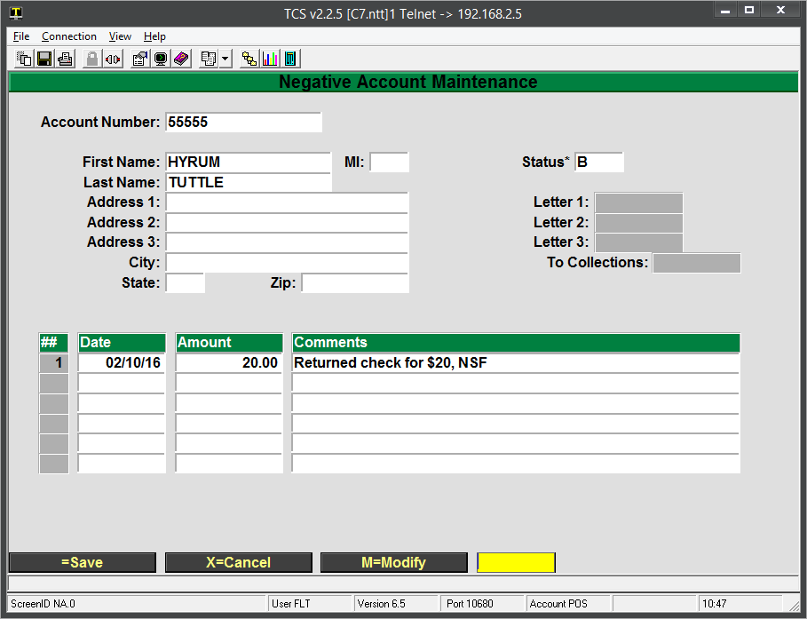

# Negative Accounts (Bad Checks)

<PageHeader />

Here are the steps that can be taken to setup a bad check, or Negative Account, in the system so further checks are blocked.

1. Set up the account in POS-22-21
    1. The account number can be anything you'd like. Student ID, Driver's license, bank acct, etc.
        - It's recommended to set a standard and stick to it. Reasons for this are explained in the final point of this document.
    2. Information can be filled out as needed. The key field that the system looks at is the Status field. If this is **_anything_** other than OK, the system will not accept the CK tender type for the transaction.
        - 
    3. The comments at the bottom are for informational purposes only.
2. When using the CK tender, your cashiers will see a prompt to enter the account number.
    1. If the account number entered by the cashier matches the Negative Account number (e.g. 55555 from this example) then they will not be able to use a check.
    2. If the number entered by the cashier doesn't match any Negative Accounts, then the transaction is processed.
        - This is why following a standard for the account number is so important. If the negative account was created using a student ID, but the customer driver’s license is entered, then there is no match and the transaction will go through.

<PageFooter />
