# Online Orders Resume Suspend and Modify

<PageHeader />

## Resuming Online and Mail Order Transactions

Prerequisite

- The employee resuming the transactions are setup as Cashiers.
- The PC or Register has been setup to run “Back office” or Web orders.

Once you have received your online orders you will need to resume the transactions on the system to fulfill and complete the purchases. \*_note that the card used to purchase the items is not changed until the resume transaction has been complete at the store. Online orders and the credit cards used for them are only verified valid and are not charged until the online order is completed in the store._

Your register must be open for the day in order to complete web transactions. Referrer to the general cash register training for Opening your register.

1. Select the Transaction type Resume, Tap or Click the touch button, keyboard key or simple type |RES to bring up a listing of all pending orders on the system.
2. Select the order you are completing from the list of suspended transactions displayed.

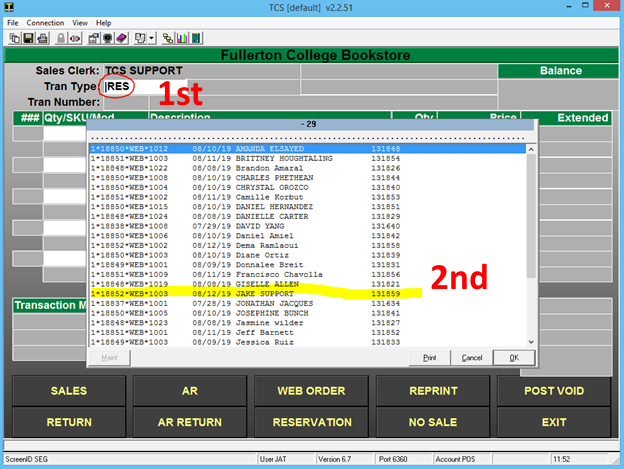

3\. Your order will be displayed on the screen with the items the customer purchased in their online order. Review the items and remove, add or adjust and verify the contents of the order. \*_note that freight will display on pickup orders as a $0.00 dollar amount._

_\* If you modify the Freight you must use the Frieght modify option. This will be setup when the webstore and registers for processing online orders were setup (MOF) \*\*_

_\*If you modify the any item in the webtransaction you must use modify buttons that were created during the setup procedures.(MOM)\*\*_

_\*(MOM) and (MOF) are specific modifiers for online orders. Don't you keyboard shortcuts for modifying web orders. example |LIM (line item modify) this will not work on a web transactions._ 

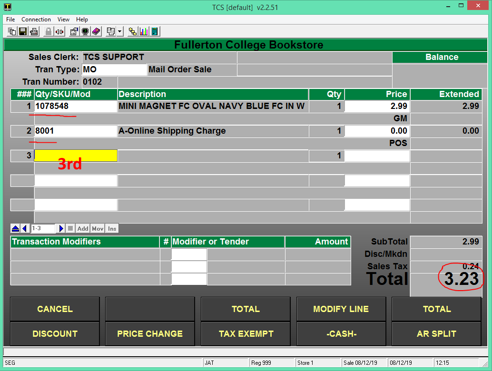

4\. Totaling the online order will auto populate the tender code and transaction amount. You don’t need to do any modifications to the tender code unless the customer is using a different payment method than the one they used online to make the purchase.

- Press enter through the tender field.

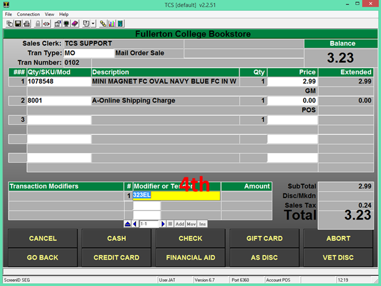

5\. When the transaction is completed you will be prompted to proceed to the Next Transaction or to Reprint the current transaction.

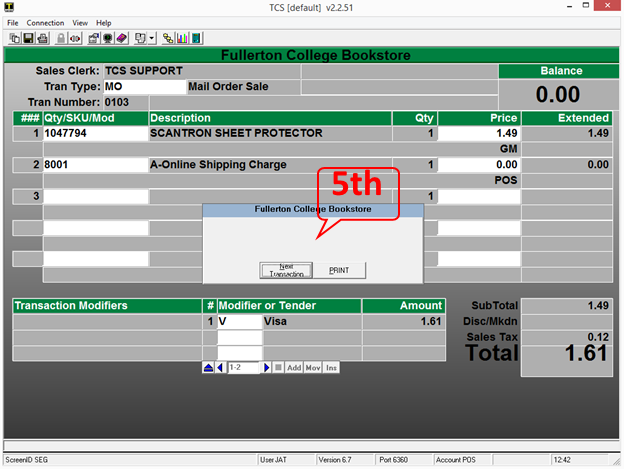

- At this stage in the order fulfillment an email will be sent to the customer notifying them that there order has been completed. _\*these email setting are setup during the initial setup of the webstore_

## Mail Order & Online Order with Returns and Transaction Match Tender

Prerequisite

Original Transaction number, date and register. This can be in any form but all of the material is required to complete the return process.

1. On your back office, web register or any machine that has been setup to process web transactions go into the Cash Register function and select MORT, select the mail order return button or key that is setup to perform a mail order transaction.

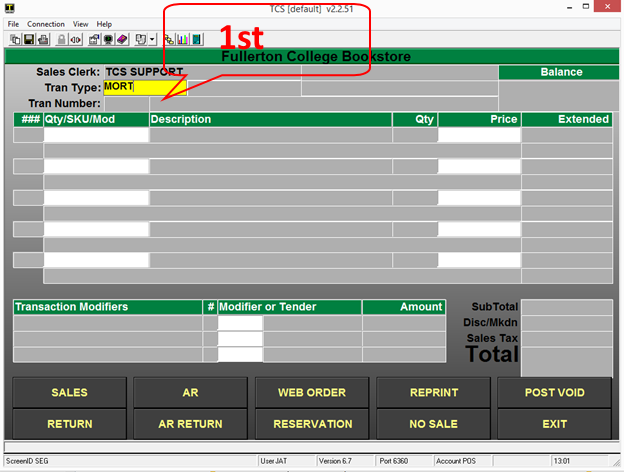

 

 

2\. Input the customer ID or preform a search using the ;user’s name or portion of name.

- You will be prompted for the customer name or ID that preformed the original transaction that you are wanting returning items against.

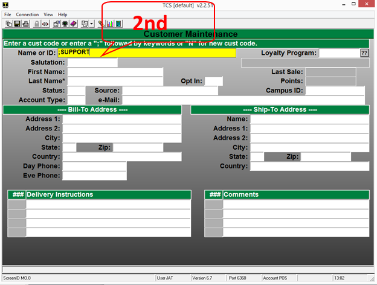

- If you searched using the ; keyword search, select the appropriate customer to proceed to return items.
- If you input the customer ID the search results should not display and the process should move you past the lookup and allow scanning items for the return.

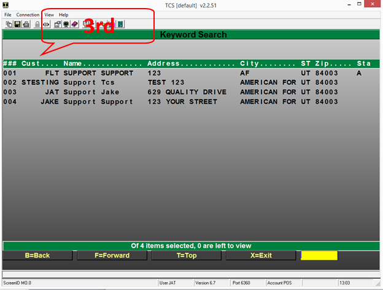

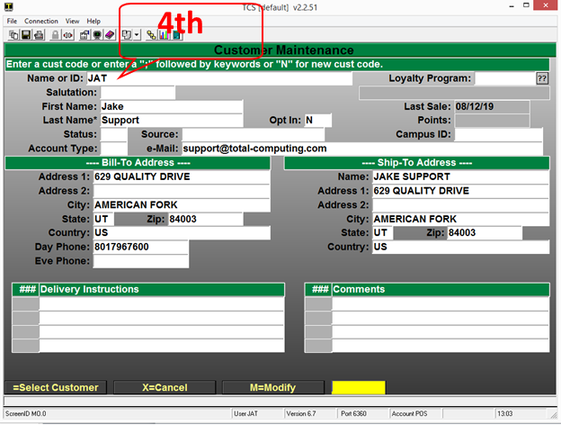

5\. Once you have selected or input the correct customer all you will need to do is scan or type in the items that were on the original order into the sku field.

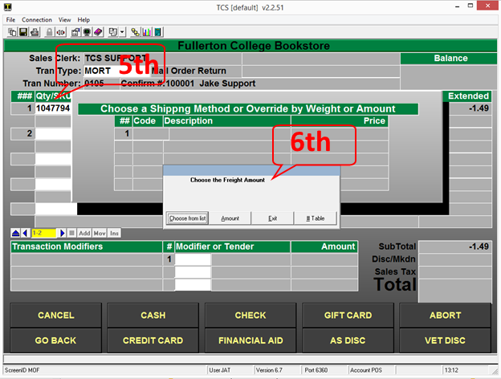

- Once you have scanned or entered the items that you wish to return on the order and select Total you will be prompted for any shipping charges that you wish you apply to the return.
- You can select a specific amount or select from a shipping table that you have setup or simple exit past this prompt.

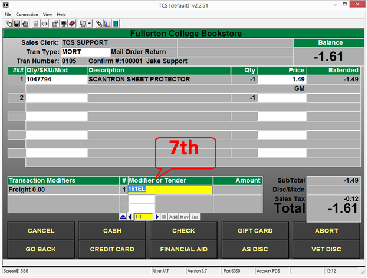

- Once you have scanned all of the items to be returned on the online order you will just need to Total the transaction and review the transaction total.
- The Tender and amount should auto populate based off of the original transaction.
- You will press “Enter” to proceed to the step

_\*note the system will not allow the tendered amount to be greater than the original purchase amount for the order._

_\*\*do not change the default tender code unless you are giving back cash or store credit. The tender determines what the cashier is prompted for._

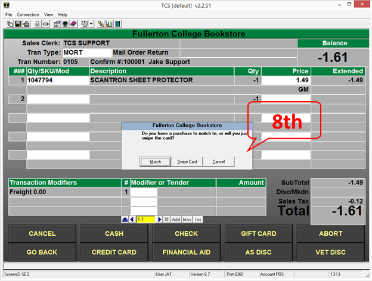

- After you have accepted the tender and amount you will be prompted on how you would like to accept the payment return method.
    1. If the customer is present and has the credit card that they used to purchase the items you can have them swipe into your card reader their card when prompted.
    2. If you choose to refund to the original card that was used for the transaction you would select the “Match” option. You can use the “Match” option even if the customer is present with the original purchase card and the customer will not need to do anything.

_\*note that not all web registers are equipt with a card terminal._

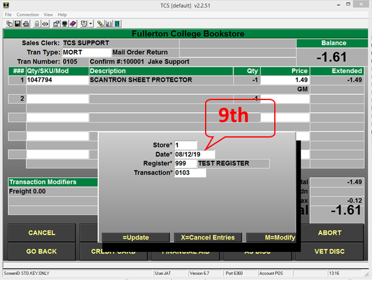

- Input the transaction information is the only way to match a transaction against the original transaction. All of the inputs must match exactly.
- It is important to note that even though you can have multiple Stations or Registers preforming web order usually all web registers utilize the same web register number.

 

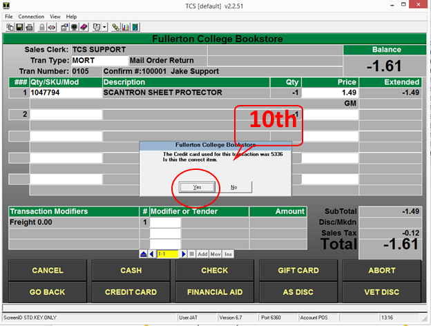

- If the system matches the original transaction you will be prompted to verify the last 4 digits of the original transaction.

_\*note you can find the last 4 from the email confirmations or by reprinting the original receipt. If you do not have access to that information you may run several sales reports or lookup the transaction under the Mail order Customer Maintenance._

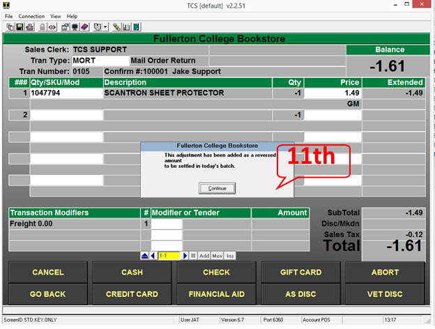

- If the transaction matches and the tender total does not exceed the original purchase amount you will be displayed a message that the adjustment to the customer’s card has been made and the funds will be set to return to their card.

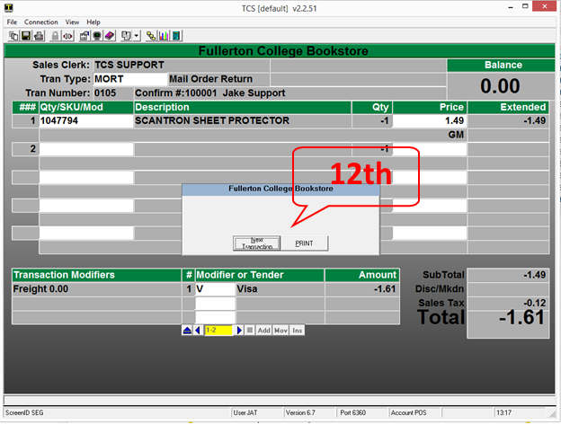

- The last prompt you will receive once the return has been completed is to move onto the next transaction.
- The system should print-off a return transactions receipt.

## Suspending & Resuming orders from your Web register

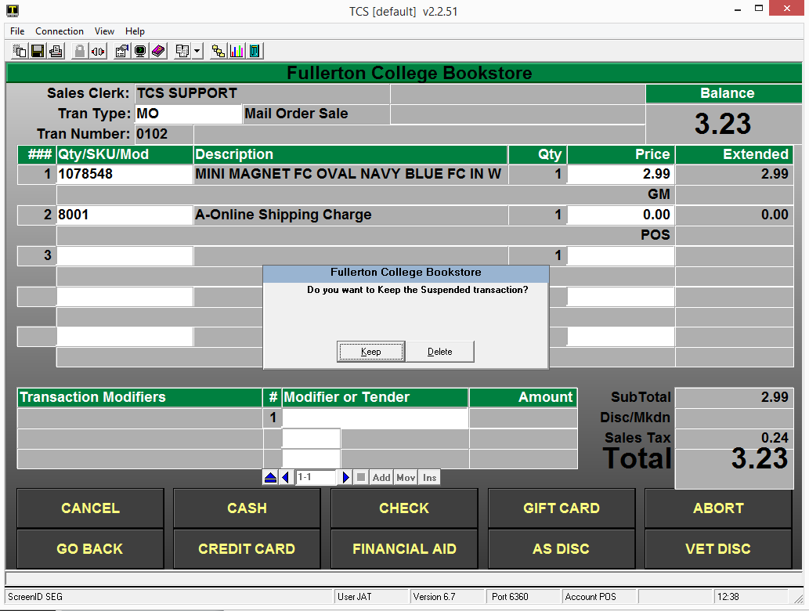

- Any time that you are in a weborder transactions you can EXIT or ABORT to suspend the transaction or delete the transaction.
- When you have selected a way to exit out of the web transaction you will be prompted to “Keep” or “Delete” the transaction. When you select the default option to “Keep” the transaction is restored to its original state so you can access the order at another time.
- You can also select the “Delete” option when exiting your transactions and all of the information will be removed from the system and you will no longer be able to process that order.

\*_note that if you modify the online web transaction that those modifications will need to be added back as the “Keep” option restores the transaction prior to any of the users changes._

## Declined Online Orders

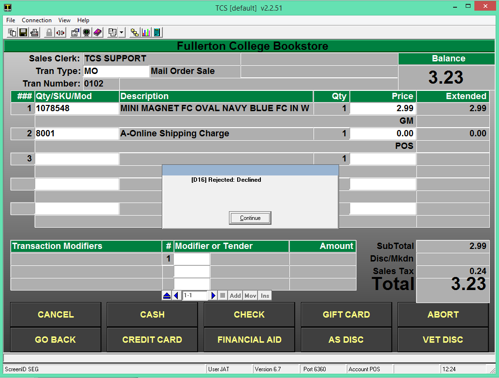

- When you receive a declined response from the transaction when you try to process a web online order you will need to reach out to the customer to inform them that their card has been declined.
- You can use the ABORT, EXIT or SUSPEND options to leave the transaction. Make sure that when prompted to “Keep” or “Delete” the transaction that you select the Keep option until the issue has been resolved.

_\*Please note that credit cards are not charged until the online order has been fulfilled at your web register._

<PageFooter />
