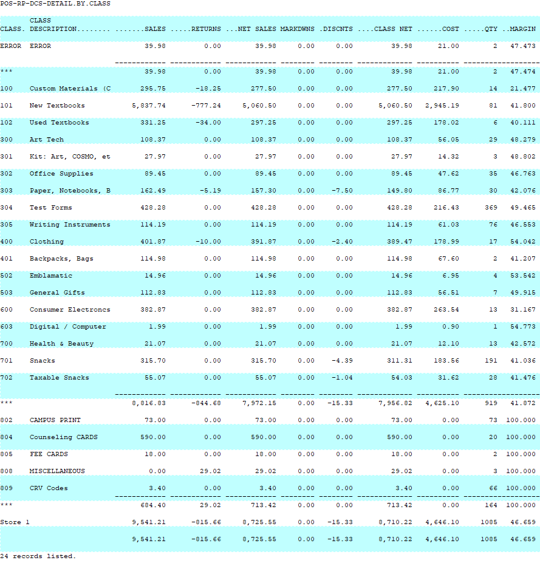
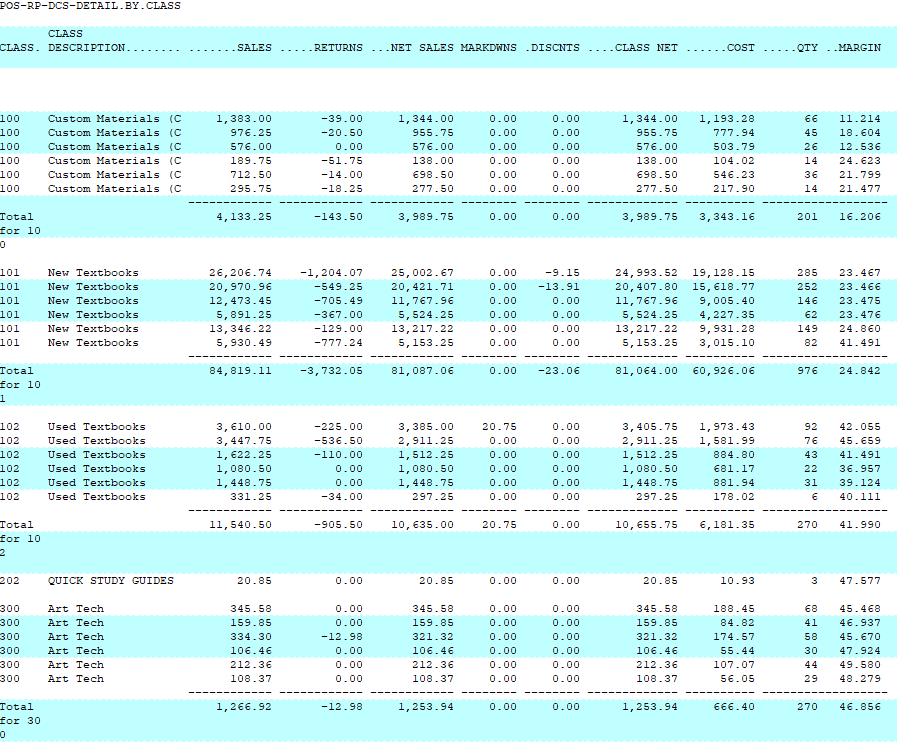

# Class Detail by Class by Date Report

<PageHeader />

Below is an overview of the Detail by Transaction Number report. General information on what fields are available, what they do and what data is presented in the report.

Path: POS-RP-1-3-2

Purpose: This report is used to display high level class dollar amounts per class.

Output: Class, Class Description, Sales, Returns, Net Sales, Markdowns, Discounts, Class Net, Cost, Quantity and Margin.

At first glance the data is very similar to the Class Detail by Date by Class report if you only run it for one date.

However, the format changes when you run it for multiple dates. The focus is on the class data, then by date. So class 100 is all grouped together across the date range, totaled for the date range, and then class 101 is reported for the date range, etc.

This example is for a six day span.

## Unique Field Options

There are no unique fields in this report.

Note: the most common fields are covered in the [Reports: Best Practices and Procedures](./../reports-best-practices-and-procedures/README.md) article. Only special usage scenarios or options are covered in this article.

<PageFooter />
