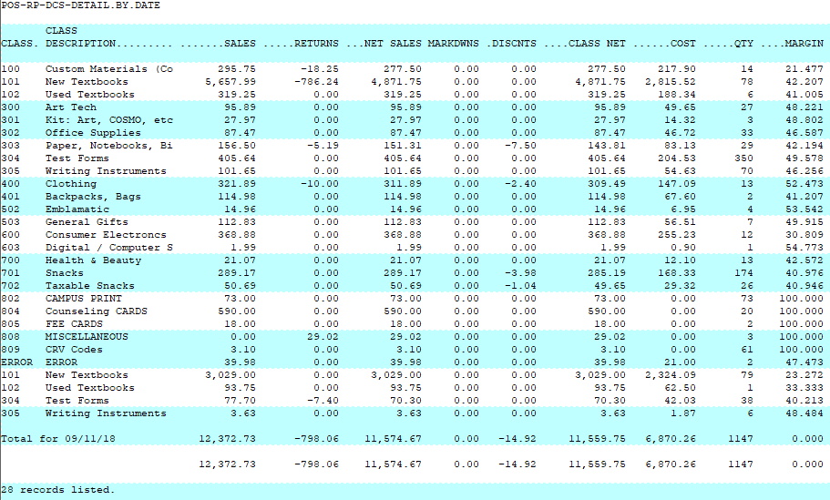
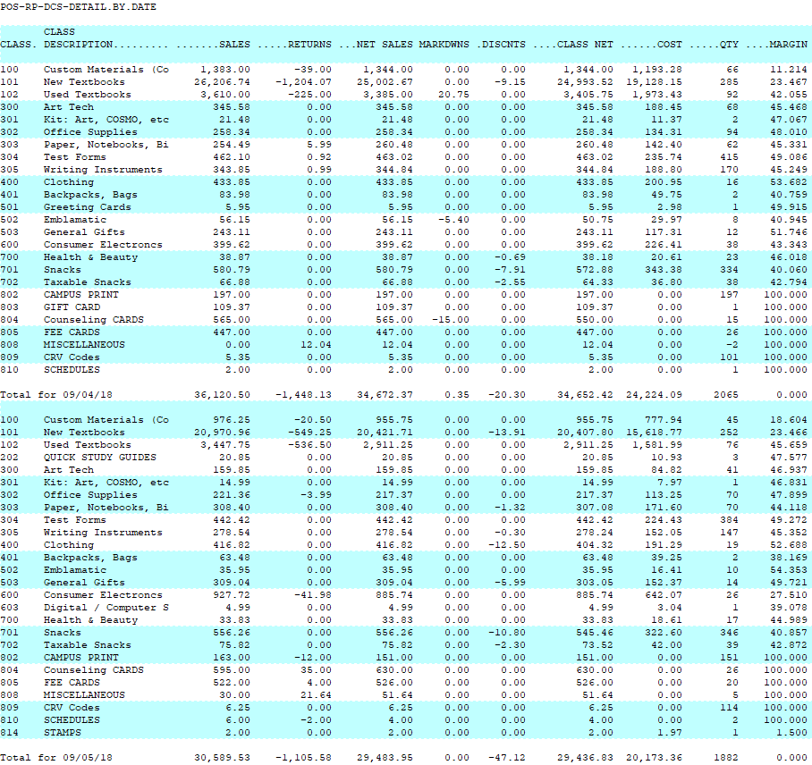

# Class Detail by Date by Class Report

<PageHeader />

Below is an overview of the Class Detail by Date by Class report. General information on what fields are available, what they do and what data is presented in the report.

Path: POS-RP-1-3-1

Purpose: This report is used to display high level information of class dollar amounts per day.

Output: Class, Class Description, Sales, Returns, Net Sales, Markdowns, Discounts, Class Net, Cost, Quantity and Margin.

What makes it unique from the other class reports is the formatting when it spans multiple days. The focus is on the date, then the class totals. So the report displays the first date with all class totals, then the next day with its class totals, etc.

The screenshot below shows data on two days.

#### Unique Field Options

There are no unique fields in this report.

Note: the most common fields are covered in the [Reports: Best Practices and Procedures](http://tcs-training-wp.azurewebsites.net/?post_type=dwkb&p=1227&preview=true) article. Only special usage scenarios or options are covered in this article.

<PageFooter />
