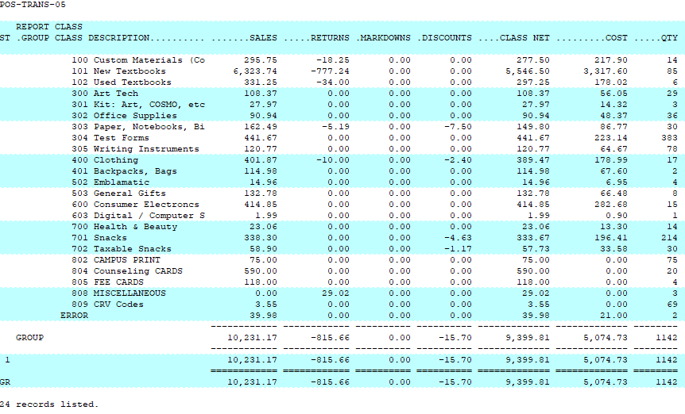
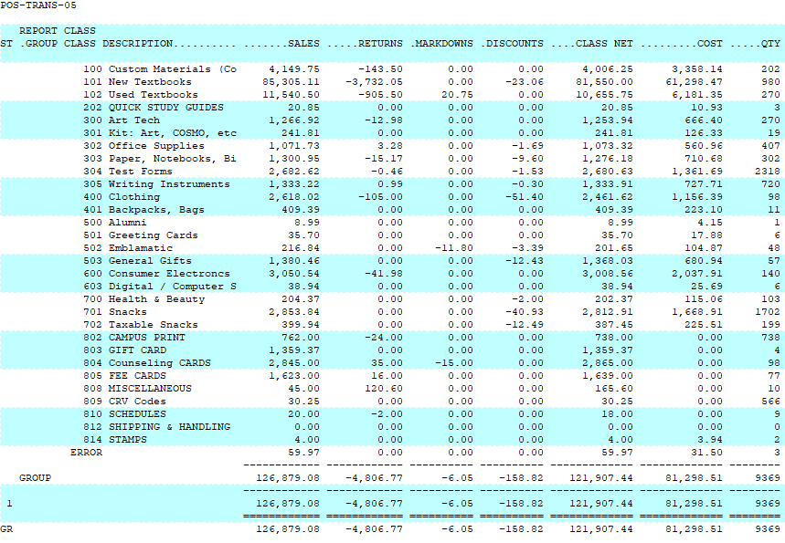

# Class Summary by Class Report

<PageHeader />

Below is an overview of the Class Detail by Date by Class report. General information on what fields are available, what they do and what data is presented in the report.

Path: POS-RP-1-3-3

Purpose: This report is used to display high level information of class dollar amounts per day.

Output: Store, Report Group (optional), Description, Sales, Returns, Markdowns, Discounts, Class Net, Cost Quantity.

Over a one day date range this report looks very similar to other class reports. Just like those reports though, the multiple days is what makes the report unique.

This screenshot shows a single day with the "Sort by Report Code" field set to a Y. The Y for this field triggers the optional Report Group column. If this field is a N then the column is removed.

In this example we have six days worth of data. The format of this report remains the same, the numbers simply include more days.

## Unique Field Options

Sort by Report Code: Allows you to override the numerical listing of class codes into their class report group. This is essentially an override of the default numerical sorting of class codes.

Creating a class Report Category is found in POS-22-3-5. Once a category has been created you can assign it to the classes belonging to that report category in POS-22-3-2.

Note: the most common fields are covered in the [Reports: Best Practices and Procedures](./../reports-best-practices-and-procedures/README.md) article. Only special usage scenarios or options are covered in this article.

<PageFooter />
