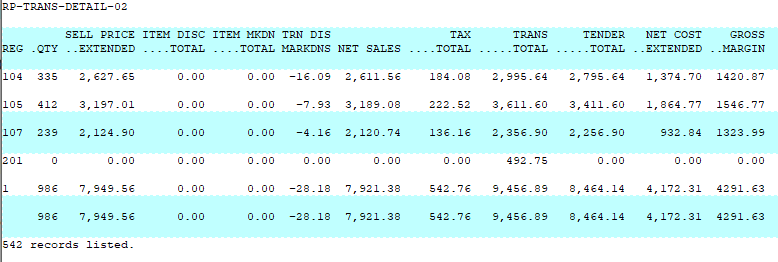

# Consolidated by Register Report

<PageHeader />

Below is an overview of the Consolidated by Register report. General information on what fields are available, what they do and what data is presented in the report.

Path: POS-RP-1-2

Purpose: This report is used to display a high level summary of the transactions done on each register. The total amount of money done, total markdowns, cost of goods sold, gross margin of goods sold, etc. for the date range specified.

Output: Register, Quantity, Sell Price Extended, Item Discount Total, Item Markdown Total, Transaction Discount Markdowns, Net Sales, Tax Total, Trans Total, Tender Total, Net Cost Extended and Gross Margin.

## Unique Field Options

A/R Invoice: Allows you to specify an AR Invoice number to view the other transaction details.

Note: the most common fields are covered in the [Reports: Best Practices and Procedures](../reports-best-practices-and-procedures/README.md) article. Only special usage scenarios or options are covered in this article.

<PageFooter />
