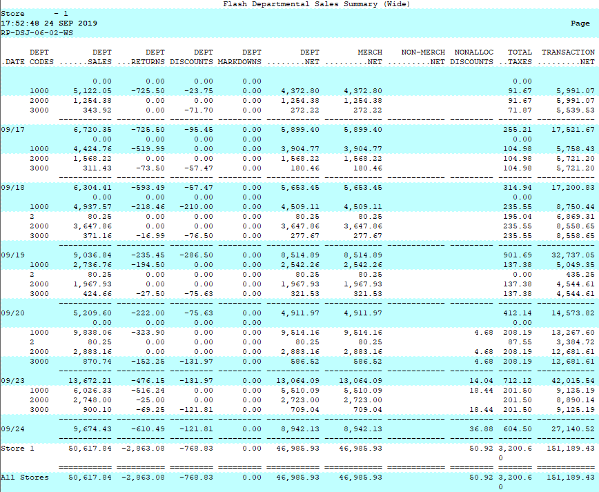
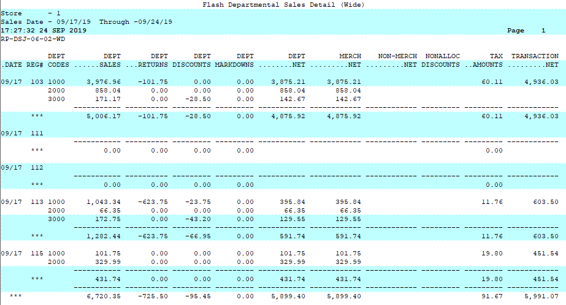

# Department Sales Report

<PageHeader />

Department Sales

Below is an overview of the Department Sales report.

Path: POS-RP-1-5-2

Purpose: Display the gross to net numbers by department.

Output: Date, Department Codes, Department Sales, Department Returns, Department Discounts, Department Markdowns, Department Net, Merchandise Net, Non-Merchandise Net, Non-allocated Discounts, Total Taxes, Transaction Net.

The summary output combines the sales information for the entire day. 

The Detailed version breaks the sales figures out by register. 

<PageFooter />

