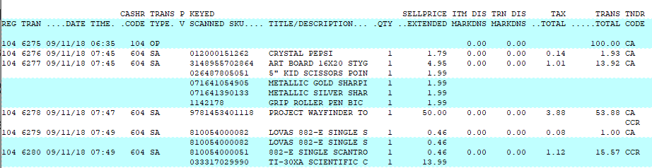

# Detail by Trans Number Report

<PageHeader />

Below is an overview of the Detail by Transaction Number report. General information on what fields are available, what they do and what data is presented in the report.

Path: POS-RP-1-1

Purpose: This report is used to display detailed information on every transaction that meets the selection criteria.

Output: Register, Transaction #, Date, Time, Cashier Code, Transaction Type, Post Void status, Scanned Items, Item Descriptions, Quantity, Sell Price Extended (qty \* price), Item Discounts, Transaction Discounts, Tax Total, Transaction Total and Tender Code.

#### Unique Field Options

A/R Invoice: Allows you to specify an AR Invoice number to view the other transaction details.

Note: the most common fields are covered in the [Reports: Best Practices and Procedures](./../reports-best-practices-and-procedures/README.md) article. Only special usage scenarios or options are covered in this article.

<PageFooter />
