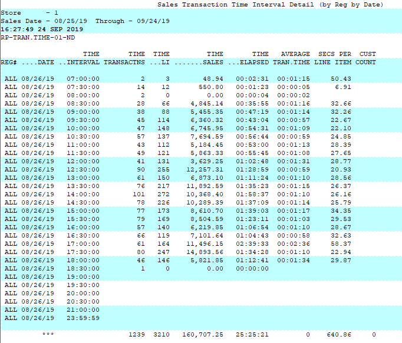

# Store Sales by Store Report

<PageHeader />

Below is an overview of the Store Sales by Store by Register by Date report which is virtually identical to the Store Sales by Store by Date by Interval.

Path: POS-RP-1-4-1 and POS-RP-1-4-2

Purpose: These reports are used to display the number of transactions, dollar amount and item count for a given time period. This can be in detail or summary format, with store and/or date sub totals.

Output: Register, Date, Time Interval (default 30 mins) Time Transactions (transactions in time period), Time LI (line items per time period) Time Sales (dollar amount sold in time period) Time Elapsed (time between sales) Average Tran.Time (average transaction time), Secs Per Line Item, Cust Count (edge case typically not used)

A Summary can be run to get the ending value for each day, but the true value is in the detailed version of the report.

<PageFooter />
