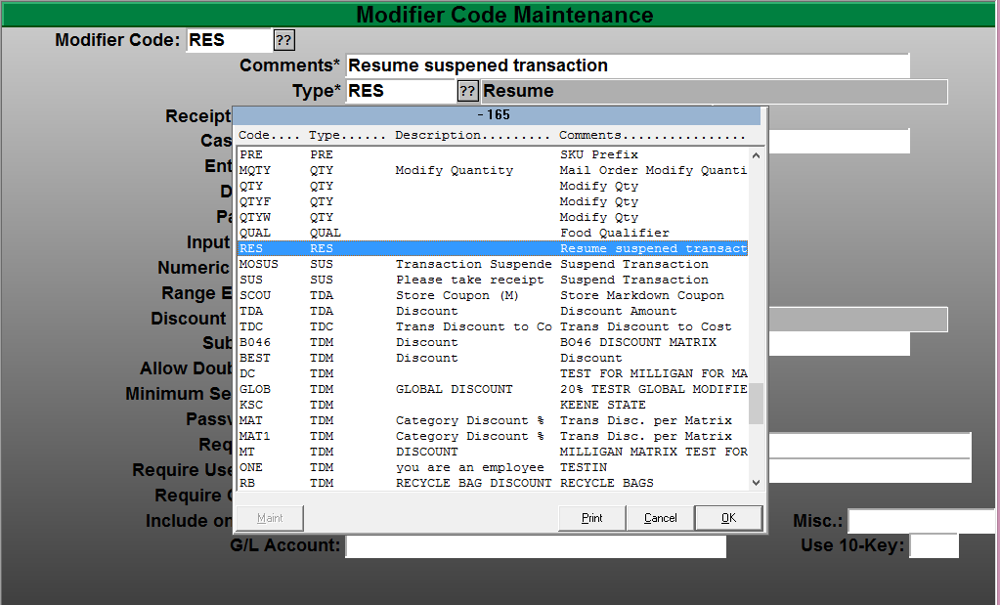
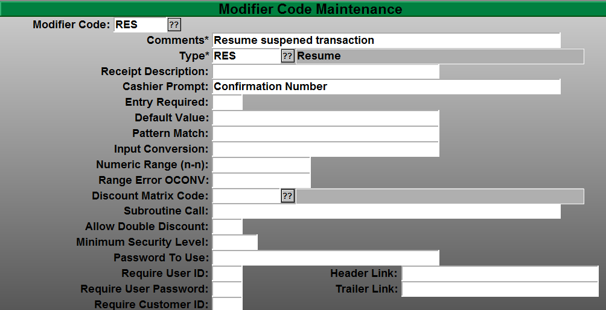
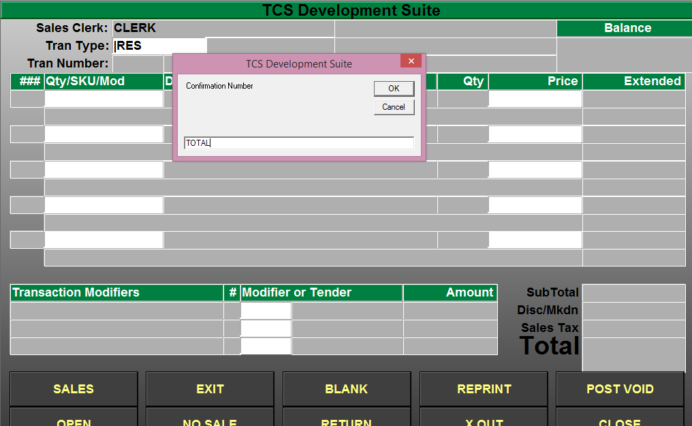
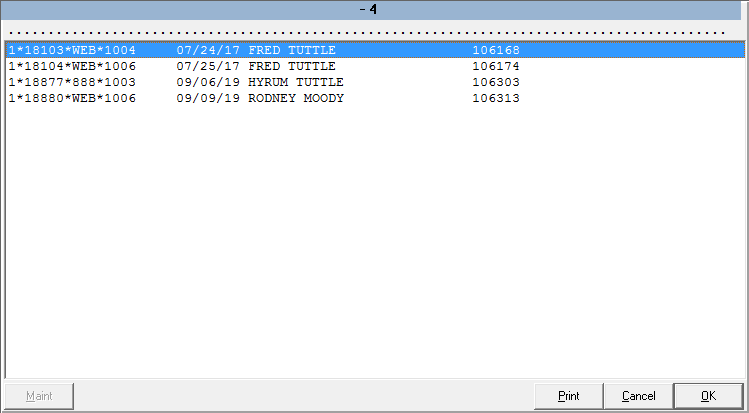

# Resume Order Search Setup

<PageHeader />

## Searching Suspended Orders

Purpose of this document is to setup a search box prompt when you are resuming a transaction, for the purpose of eCommerce or Mail Order transaction resuming. The search will allow you to lookup orders without browsing through all of you open orders. _\*if you wish to bypass this step you can press enter for the default option to scroll through all of you open or suspended orders._

This setup can replace scrolling through a long list of customer orders to find the desired order.

The search can be performed on suspended transactions on any one of the following items. Phone Number _format xxx-xxx-xxxx_ First or Last name Order confirmation number Email address

**prerequisite:** Mail Order Registers or Online Order Registers must be setup on the system you are resuming transactions on. Applies only to host based registers or back-office connections.

Navigate to Menu Path POS-2-2

- Select POS-2-2 Transaction Types

- Select your Modifier code for resuming a transaction. _The default is “RES” for Resume._

- The "Cashier Prompt:" only needs to have information in it. For example the “Confirmation Number” is the example above. Keep in mind that this is a free form field record. You only need to have something in the Cashier Prompt to turn on this feature.

### Resuming your orders

- Select the resume feature or transaction type that you have setup. You should notice that you now have a search window that appears.
- Input any portion of the web or suspended transaction.

Phone Number _format xxx-xxx-xxxx_ First or Last name Order confirmation number Email address

- In the above example TOTAL is in the customers email address total-computing.com. All customers that meet that criteria will display in the search results with the orders that they have open.
- Select the order that you wish to complete or view.

<PageFooter />
