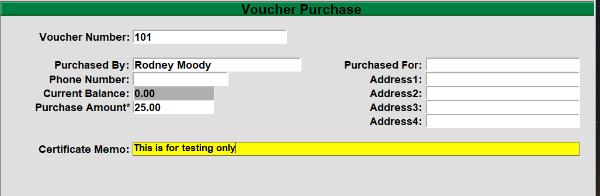

# Sell and Redeem Gift Cards"

<PageHeader />

## Selling a Gift Card

- Start a transaction as usual, normally this will be a SA transaction.
- Press the ‘Sell Gift Card’ button on the keyboard, usually in the middle on the top row.
- In the price field, enter in the selling price for the Gift Card and hit enter.
- Select the option to ‘Add’ if you are selling a new gift card.
- In the new window, scan or swipe the gift card in the “Voucher Number” field and then select ‘Add’, fill out as much of the rest of the information as you want to track and then hit enter to save.

- Complete the transaction as normal.

### Add money to Gift Card

To add money to a gift card you will follow the same process as selling the gift card, the difference will be when you scan the Gift Card it will not prompt you to Add, Copy or Delete, instead it will display the current card information. You can just enter through everything to add the amount that you entered on the previous screen.

## Redeeming a Gift Card

- Process transaction as normal.
- When finished select the ‘TOTAL’ option from either the keyboard or the touch screen.
- Select the Gift Card option from either the keyboard or the touch screen.
- When the pop-up window displays, scan, swipe, or enter the gift card number. The window will now display the remaining balance of the GC, hit the ‘Continue’ button or hit enter on the keyboard.

<PageFooter />
