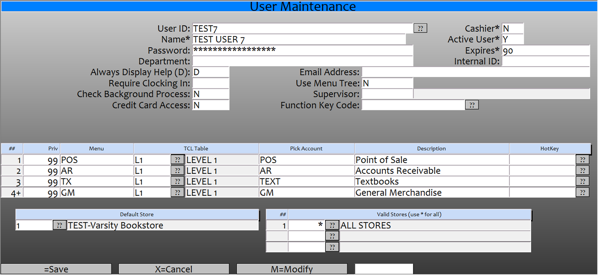
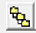
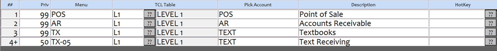
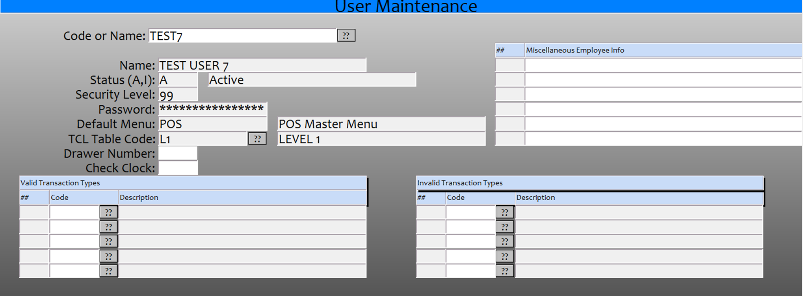

# User-Cashier Maintenance

<PageHeader />

User and Cashier maintenance has been modified. You can now create or edit a user id and the cashier set from both screens UU.5.1 and from POS.22.1, both screens allow you to perform the same functions and the cashier maintenance has been merged to the user maintenance screen. The new menu screens have the name User-Cashier Maint.

## Creating a User ID

When you enter a User ID, if the ID already exist then it will display the information. If it is a new ID then you will be prompted to with 3 options, ‘Add’, ‘Copy’, ‘Cancel’. If you Select ‘Add’ then you will need to enter all of the required information for the user. If you select ‘Copy’, then you will be prompted for a cashier code that the system will copy valid transaction and Invalid Transaction options from. ‘Cancel’ will cancel the input of the user maintenance.

- User Id: This is the id assigned to the user and what they will use when they logon to the register, if they are setup as a cashier then this will also be their Cashier ID.
- Name: The Name of the user.
- Password: Here you will enter the temporary password assigned to the user. When you enter a password, it will prompt for you to reenter the password to make sure there was not a typo in the first attempt. The user will then be prompted to change their password the first time they log on. When setting up or changing a password, the user/cashier should logon to a host computer first so that when they change their password the change will go down to all of the registers. Any password changes made on a Smartlane register will only be on that register and it will NOT be transferred back to the host or to any other register.

- Department: This is a free form field that you can enter the department that the user is assigned to.
- Always Display Help (D): Enter a ‘D’ to always display help or a ‘Y’ for Performance. (You should always use ‘D’).
- Require Clocking In: Enter a ‘Y’ only if you are using the Integris Time Clock feature, this should normally be blank or ‘N’.
- Check Background Process: Enter a ‘Y’ only if you want the system to check for background processes when the user logs on, this should normally be set the ‘N’ or blank.
- Credit Card Access:  Enter a ‘Y’ to allow this user to access credit card data. This should normally be left blank.
- Cashier*: Enter a ‘Y’ if this user will also be setup as a Cashier, if it is set to ‘Y’ then the bottom prompt will also have a CM=Cashier Maintenance option and when you save the record, the cashier maintenance window will display to complete the cashier setup.
- Active User*: This feature is still in development and is not used by the system. If you wish to prevent a user from logging in, then you can set the ‘Expires’ to 0 or delete the User ID.
- Expires*: If you have just reset the password then this will display ‘Reset90’ this indicates that the user will have to reset their password the next time they log on and that it will be good for 90 days. Once the password is reset then it will display 90. By PCI requirements we must set this to 90 or less, if you change it to less than 90 then the user will expire that many days after the day the password was last changed.
- Email Address: Enter the email address for the user.
- Use Menu Tree: If this is set to ‘Y’ then the user can use the GUI Menu Tree that you can use to navigate the module that you are currently in. 
- Supervisor: If you are using the Integris time clock then you can enter the supervisor id for time clock reporting.
- Function Key Code: Here you can set the function key setup to use for this user.

## Menu Options

You can set which menu options the user will have access to by adding or removing the options here and you will set what privilege level the user will have when they access the module.

- Priv: Enter the level that this user will have in associated account, for instance, if the user is set at 50 and a menu level is set at 75 then the user will not be able to access that option.
- Menu: The menu option that they will select
- TCL: Table Always set this to L1
- Pick Account: Enter the Pick account that the option is to access.
- Description: The description of the menu option

## Stores

Default Store: This is the default store that the user is assigned to.
Valid Stores: This is where you can enter any or all (*) of the stores that the user will have access to.

### Save/Cancel/Modify/Cashier Maintenance

Once you have created a User then you have the options below. If you have set the Cashier*: field to ‘Y’ then if you save this record and have not selected the Cashier Maint option, the Cashier maintenance window will display to allow you to edit the cahier information.

- =Save: Select this (or just hit the enter key) allows you to save the changes that you have made
- X=Cancel: Select this to discard any changes you have made
- M=Modify: Select this to start at the top and make any changes to the displayed record
- CM=Cashier: Select this to display the screen for the Cashier Maintenance.

## Cashier Maintenance

The first time you enter the screen you will be prompted to ‘Add’, ‘Copy’, ‘Cancel’. If you Select ‘Add’ then the information from the ‘user’ screen will be copied over and you can enter any of the additional information as needed. If you select ‘Copy’, then you will be prompted for a cashier code that the system will copy valid transaction and Invalid Transaction options from. ‘Cancel’ will cancel the input of the cashier maintenance.

Code, Name, Status, Security, Password, Default Menu, TCL Table are all locked fields and can not be modified on this screen, they are for display only.

- Drawer Number: If your cash registers have multiple drawers then you can enter the drawer that this user will be assigned to, otherwise leave blank.
- Check Clock:  If you are using the Integris time clock then enter a ‘Y’ if the user must always be clocked in before entering a cash register. You can also enter an ‘L’ to require clocking in but returns the employee back to the sign-in box. Normally this will be left blank.
- Valid Transaction Types: If you enter something in these fields then these will be the only transaction types the cashier can perform. Normally you only enter something in the Valid or Invalid not both.
- Invalid Transaction Types: If you enter something in these fields then the cashier will be able to perform all transaction types except the ones entered. Normally you only enter something in the Valid or Invalid not both.

<PageFooter />
