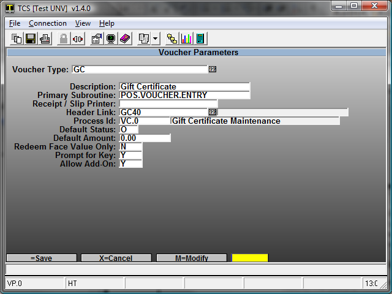
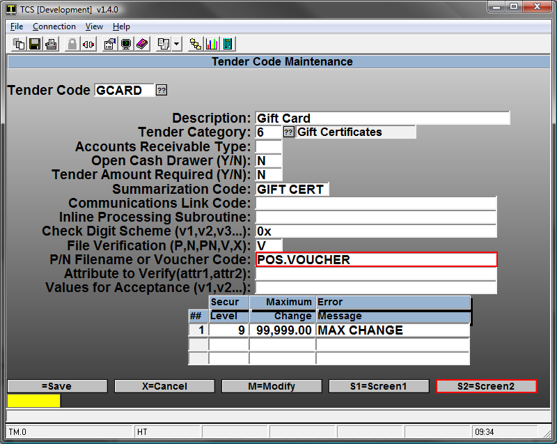
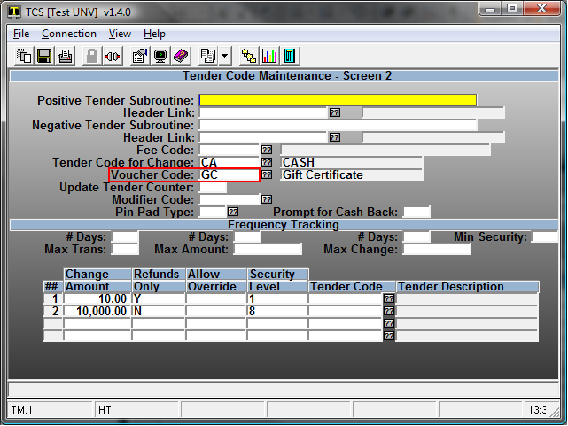
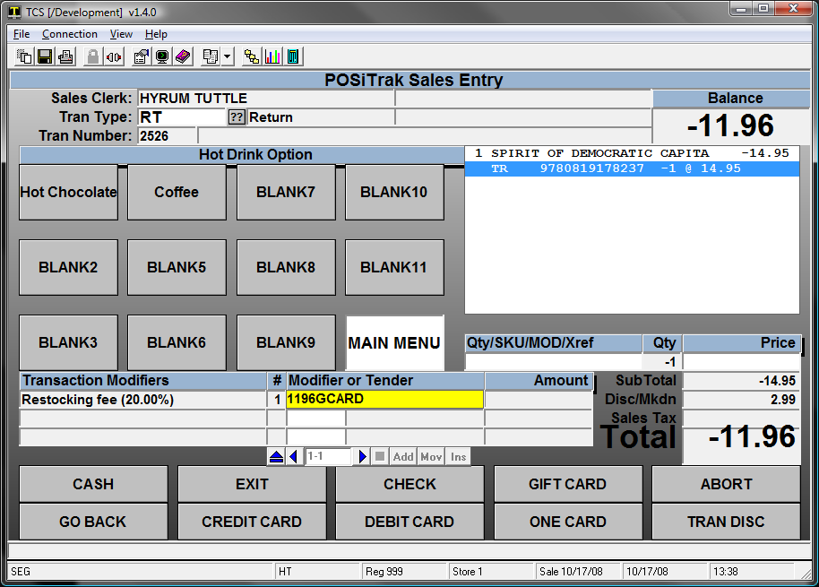
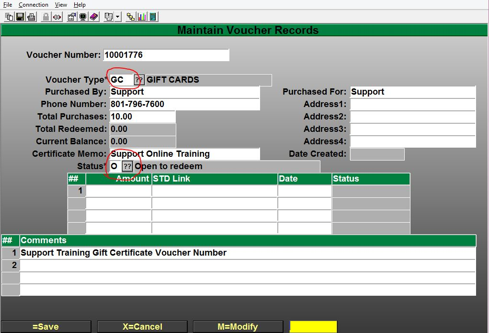
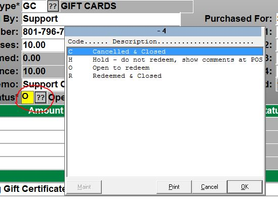

# POS Vouchers, Gift Certificate & Gift Card Setup, Issuing and Redemption

<PageHEader />

## Voucher Requirements

There are two things that must be present in order to process a voucher or gift card as well as one optional item.

- The actual voucher that tells the system what to do.
- Tender codes that are to be used at the cash register. This includes codes that issue a voucher, or codes that accept a voucher as payment.
- It is possible, but not necessary, to create a new receipt header or footer specific to vouchers. This enables you to place voucher terms and other information in the hands of the customer.

This guide will cover how to set up a voucher, create the tender codes and how to use them at the cash register.

## Creating the Voucher

Vouchers are created in Voucher Parameters, POS-22-25-21.

- Create a new Voucher Type for your voucher and give it a description. All vouchers should use POS.VOUCHER.ENTRY for their subroutine.
- You can specify which printer to print the voucher from in the Receipt/Slip Printer field.
- The header link tells the system which header to print on the voucher.
- The process ID should be either VC.0 or MERCH
- O should always be used for default status
- You may enter a Default Amount if you would like, most locations will not use this.
- Redeem Face Value Only requires the customer to either use the entire amount on the voucher or receive another voucher for the remaining balance.

### Setup Tender Codes

To process and use a voucher at the register, tender codes need to be created. This is done in POS-02-04.

- Create a new Tender code and Description to utilize vouchers at the cash register
- Tender Categories should already be setup on your system. Choose the correct category for this tender code.
- The remaining fields may be filled out according to your needs. POS.VOUCHER is to be used as the voucher code. Proceed to Screen 2 to set limitations on what cashiers may do with this tender code.

Screen 2 defines the limitations set on how much change a cashier can give to the customer.

**Voucher Code** is what defines if the tender code will issue a voucher, or accept one as payment.

- Placing the voucher code into this field tells the system to issue a voucher
- Leaving this field blank tells the system to accept the voucher as payment

**Change Amount** is the maximum amount of change allowed for that specified security level. If the cashier does not have the necessary security level a supervisor must approve the transaction.

Now that the voucher and tender code have been created they can be used at the cash register.

## Using a Voucher

**Issuing in-store credit**

This scenario is for a customer returning items for in-store credit.

- Open the transaction as a return
- Enter the item being returned
- Use the tender code created for issuing a gift card
- Follow the on screen prompts to finalize the transaction

### Manually Issuing a Voucher or Gift Certificate/Card

Menu Path: POS-22-25-1

Scan, Swipe or enter your Voucher number that you would like to create or modify.

- Select the type of Voucher Type that you have already setup and would like to use for the record.
    - You can maintain and modify the Status of the voucher.
    - Update Contact information.
    - View transactions that have used the Voucher.

<PageFooter />
