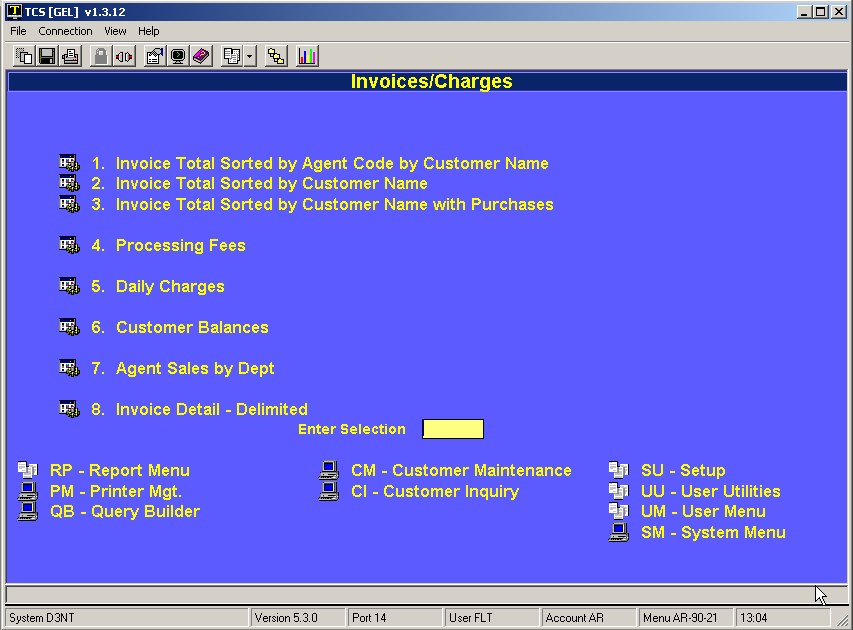
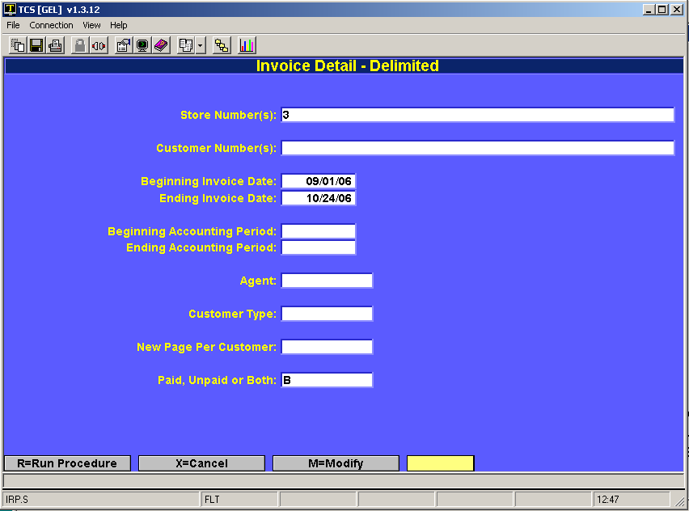
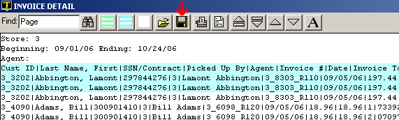
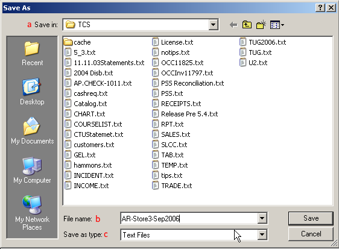
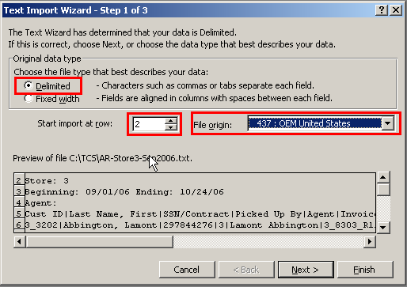
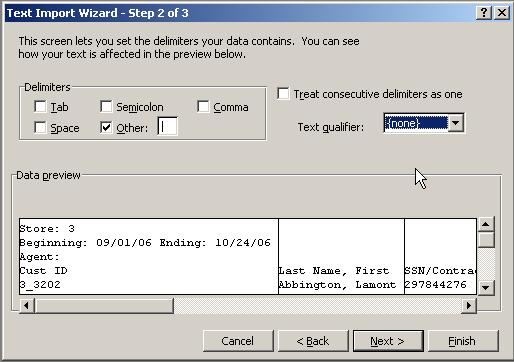
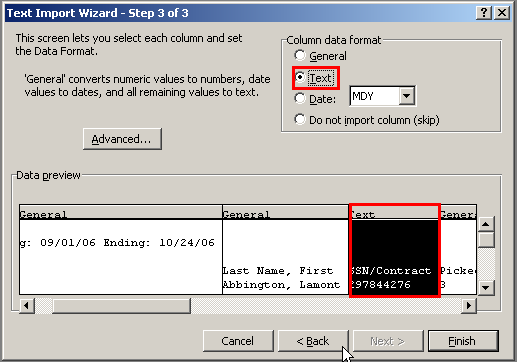
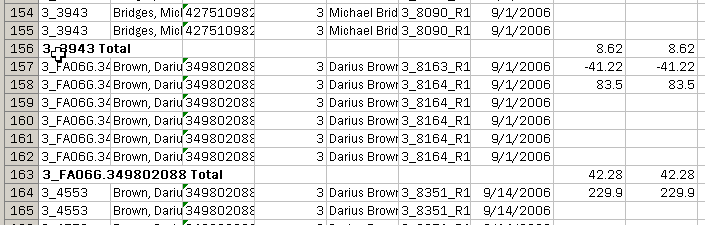

# Export AR Charges

<PageHeader />

This document describes how to use the specialized report for special formatting of invoice data to be “normalized” and exported into an Excel spreadsheet.

Step 1. Select AR-RP-02-08

Step 2. Enter the reporting criteria you want for the report.

Step 3. Click on the save Icon and save the report.

1. Save the report in any folder you wish.
2. Give it name that will be meaningful.
3. Save it as a Text File

 Step 4. Click “Save” Step 5. Open the item with Excel. The import Wizard will come up automatically. Make the following adjustments

 Click “Next”  Click “Next”

Highlight the column over the SSN/Contract and flag it as “Text”  Click “Finish”

With a little Excel magic you can now create sub totals and sort the report anyway that you like.

<PageFooter />
