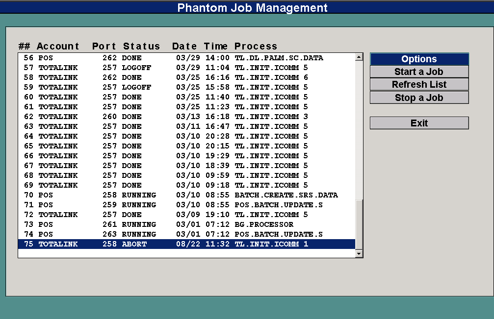

# Background Processing (Self Hosted)

<PageHeader />

## Overview

Background Processing allows you to run recurring reports as background processes to be run immediately or at scheduled times. This tool can be used to schedule your daily and weekly recurring reports to run after hours.

### **Background Processing Menu**

**(POS-UU-3)**

1\. **Job Parameters** - Each background process is called a job. Each job has certain parameters consisting of the job name, the times and days to run, etc. You will set all parameters necessary for each job using this menu option.

2\. **List Jobs** - Compiles a list of jobs that are setup to process. You may output this list to printer, terminal or file.

3\. **List Job History** - Compiles a history of jobs that have been processed, giving the dates and times that the job1 started.

21\. **Background Control** – Gives you the ability to stop or start processes. This is where you will start and stop the background processor.

Note - There is a flag that can be set to notify you if the background processor is on. The menu path is System Administration Menu and then option 1) User Maintenance. Set the flag in User Maintenance to 'Y' and when you log on, the program will pause for a seconds after you enter your password to display the status.

There are two parts to background processing. The first part is to start the background processor through background control. The second part is to set up and specify the job parameters.

**Managing the Background Process (BG-21)**

There should be a background process running in each account that has a job to run. You will have to start the processor in each account. This can be set up to start automatically if your system is rebooted.

This screen is where you control jobs.

**Start a Job** – This will start a new occurrence of BG.PROCESSOR. It can start any job on the list.

**Stop a Job -** This will stop the job you specify. In GUI mode you must highlight the job to stop. In non-GUI mode you are prompted for the line number to stop.

**Refresh List** – This will remove all jobs from the JOBS file that have a status other than RUNNING or ABORT. See the following screen.

**JOB SETUP**

You can setup a background report in one of two ways.

#### You can create your report through the Report Menu by choosing the report you wish to run then entering the report parameters and selecting <R>=Run Procedure followed by G= Background Processor in the Output Options menu then <S>=Schedule and entering a name for the process. This will then put you in the Job Parameters screen with the fields populated from your report parameters where you can change any parameters as needed.

2\. You can create your report manually by going directly to the Backgrounds menu and choosing Job Parameters and entering the information for your report.

#### **JOB PARAMETERS**

**(POS-BG-1)**

**Background ID**: Enter the id (alpha/numeric without spaces) to identify your background process. For example, if this was my nightly tender report then I might give it the id of TENDER.REPORT.

**Account**: Enter the account name the background will run in. All files used by the process must exist in the specified account.

**Sender Port**: This is the port that starts this process. If this process was made and started from another process, this port is automatically entered. The field serves no purpose at this time.

**Notify Sender**: Set this flag to 'Y' if you want to notify the sender every time that the process runs.

**Run Status**: Your options here are 'I' (Immediate), 'R' (Repeat), or 'X' (Cancel).

**I** \= Run immediately, once the process has ran once, this changes to a status of 'R' and repeats according to intervals.

**R** \= Repeat according to the time and day intervals that you set up. daily, weekly, monthly, hourly or any interval type of process.

**X** \= Cancel, and stop running.

**Start Date**: Enter the date to start this process. (Only valid with status 'R')

**Start Time**: Enter the start time for the process to start. (Only valid with status 'R')

**Day Intervals**: Enter the interval as '1' for daily, '7' for weekly, etc. If run status is 'I', and you only want this process to run once then leave this interval blank.

**Exclude Days**: Enter any days that you do not want this process to run. For example, if this were a daily sales report, and the store is not open on Sundays, then you would enter 'SUN' to exclude the report from running on Sundays. Enter each day one at a time.

**Time Interval**: Enter the time interval 24:00:00 for once a day, 1:00:00 for hourly, etc…

**Exclude Times**: Enter the time that you do not want this process to run. This works similar to excluding days. If you run this process hourly, then you may want to exclude the hours that you are closed.

**Group Code**: Some processes require running a program then reporting on the outcome. For example a batch closing, you close the batches and then run the batch detail or summary reports. Here you can enter some unique code that will group the batch closing process together with the batch summary reports.

**Sequence in Group**: If you have entered a group code, then you will want to designate which process will run first, second, etc. (i.e. Batch closing would be sequence of '1', report would be '2', etc.)

**Process Type**: Enter P for Proc or T for TCL.

**P** \= Proc (usually from the reports menu)

**T** \= TCL. A cataloged program or anything else you can run from TCL with standard Pick INPUT statements. This uses a Pick DATA statement.

**TD** = TCL. Same as T except the inputs would come from a standard TCS input. (This populates DATA.LIST and is processing by CHAR.INPUT.)

**I** = ISD processsor (entry screen). Requires release 5.3 or Patch 1237.

**Process ID**: Enter the process id for the process you are going to run. If this is a report, enter the report id. If this is a program, enter the program name.

**Output Tag**: Enter here where you want the output to go. The valid options are:

**T=** Terminal, 'T132' for 132 column output to the terminal (this is like entering 'TW' in the reports)

**P,a,b,c,d,e,f,g** = Printer

**a –** printer number

**b –** L=landscape, P=Portrait

**c –** number of copies

**d –** D=Direct, H=Hold (suspend printing)

**e –** lines per inch (6 or 8)

**f –** characters per inch

**g –** lines per page

It is easy to set the values for a-g; simply enter **P** in the field and the printer assignment box will pop up, enter the values you want and they will automatically populate this field.

**Inputs**: Enter any parameters here that you would as if you were running the process from a menu. This means you must know the order of the parameters.

Acceptable values include:

“” = blank

DATE-n or DATE+n = Today –n days, or today +n days.

Other data is accepted as entered. I.E. “\[sam\]”, 05.22.03, 001, etc.

<PageFooter />
