# Automatic Reports via Background Processor

<PageHeader />

## Introduction

The Background Process allows you to set up recurring processes that either process data or creates reports. For Hosted accounts these reports can only be emailed. Self-hosted accounts can have reports emailed or printed on a designated printer. The process can be set up to run just once or repeatedly on a prescribed schedule.

If the process has dates or other parameters to be entered these can be set up as part of the process.

## Job Parameters

In order to facilitate setting up a report you can select Run in Background from the Output Destination box. This will work with nearly all of your background processing needs.

Here is how this would work if you were to schedule POS report POS-RP-2-21 (Tender Register Summary).

1. Do everything that you would normally do to run the report but select Run in Background instead of the Terminal or a Printer.

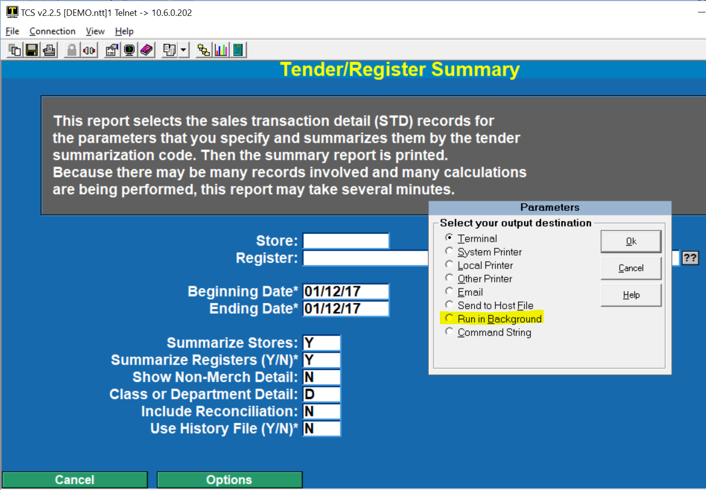

**After selecting Run in Background the following box will appear. Select “Schedule”.**

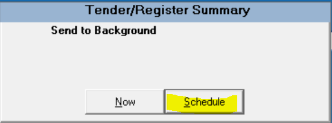

**After selecting Schedule you are then prompted for a name to call this process. Enter a brief code, do not enter spaces.**

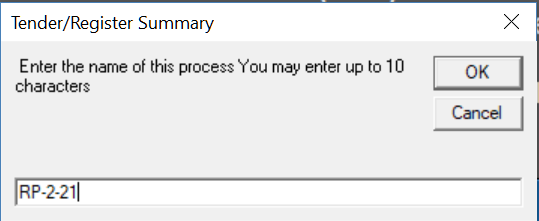

**When you have chosen a name/code to call this process the following screen appears. This is the Job record that will be used to run this process on the schedule you specify.**

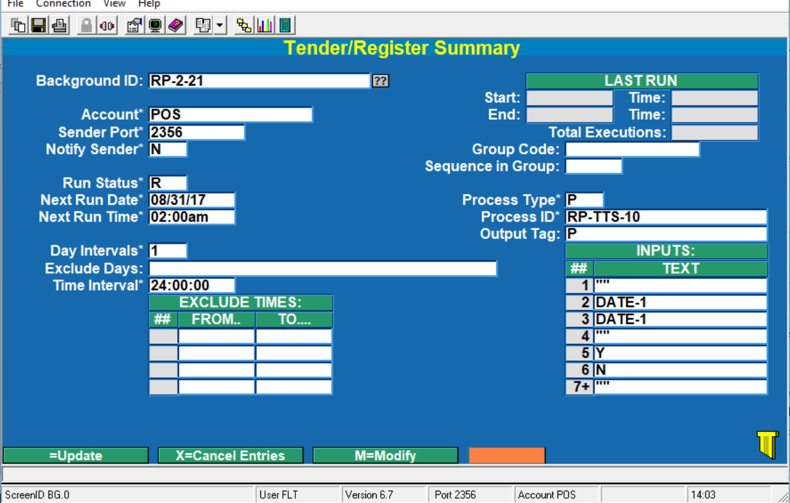

**This is the record that is created. Once you saved it you will be able to access through BG-01.**

### Field Definitions

- **Account** This is the Account that the process will run from. It is strictly informational.
- **Sender Port** Not used
- **Notify Sender** Not used
- **Run Status** R=run at scheduled time and intervals, I=run immediately (great for testing), and X=Stop from running. If this is set to “I” then it will switch to “R” once it has run.
- **Next Run Date** The next date this process is set to run.
- **Next Run Time** The next time this process is set to run.
- **Day Intervals** This is how frequently you want to run the process.
    - `1 = daily, 7 = weekly, 14 = every two weeks, etc.`
- **Exclude Days** Enter the days that you **do not** want this process to run. Options include SUN, MON, TUE, WED,THUR,FRI, and SAT.
- **Time Interval** This is how frequently in a given Day Interval you want this process to run. 1:00:00 is hourly, 24:00:00 is once per Day Interval.
- **Exclude Times** Time ranges that you do not want the process to run.
- **Group Code** This allows you to create groups so that processes run in the order you want.
- **Sequence in Group** Where in this group the process will run.
- **Process Type** There are three options based on the kind of process is going to run. Valid types include “T” for TCL/Command Line, “P” for Procsub (this is the majority of processes), and “TD” for TCL/Command Line with data being supplied by the INPUTS in this process.
- **Process ID** Each menu option on the system takes you to another Menu, a Data Entry Screen, or a Process. Always use a Process. Nearly all process have a set of inputs that is used to define parameters for that process.
- **Output Tag** This parameter is used to define printer and email options. It is discussed in detail below.
- **LAST RUN** This box has the last run date and starting time, and the date that the last run ended and the time that it ended. Most processes take a minute or two at the most.

**INPUTS:** This is a list of any values as they will be needed by the process. In this particular example we have “” (press enter) three separate times. And then the word DATE twice. Since you are probably familiar with this report this values would look familiar. Other values on the next screen include Y, N, D, N, etc.

When DATE is used there are three options:

DATE This is today’s date. Use this if the scheduled run date is for the current date.

DATE+n This is today’s date + n days.

DATE-n This is today’s date – n days.

It is recommended that you run a process a at lease an hour prior to midnight and some time after midnight.

## Output Tag

The Output Tag is used to indicate if the process is to be printed or emailed.

If Printed (Self-Hosted users only) enter a “P” in the field. If emailed enter “E” in the field.

### _Printer Output Tag_

**When selecting Printer the following appears.** \*_NOTE: Printer output is only available for self hosted systems. Customers running on the hosted environment will need to use the email output._

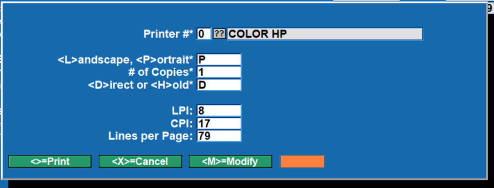

Select your printer options.

### _Email Output Tag_

**When selecting Email the following appears**. Enter the fields as they best match your requirements. If you have already entered the fields and just want to make some adjustments then after entering “E” your prior settings appear (as in this example).

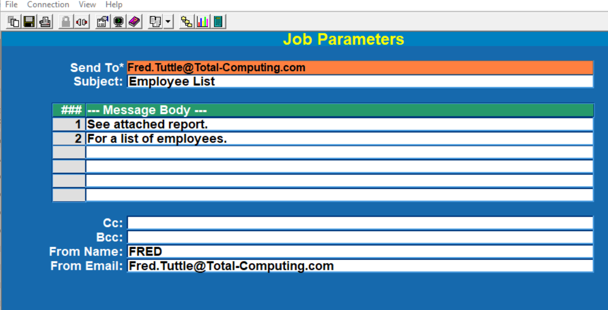

You can have multiple email address by separating them with a comma.

## Managing Backgrounds

The background process is managed by selecting option “BG” at the bottom (or common section) of the screen. This is available in all modules and can be ran by entering BG into the menu selection field even if you do not see a button on screen.

When you select BG the following menu is displayed.

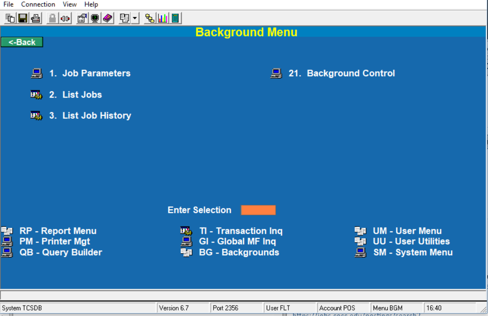

1. Job Parameters was discussed in the prior section.
2. List Jobs will give you a report of all of the jobs that have been setup on your database. You will notice on the following list that there are many different jobs that can be set up.

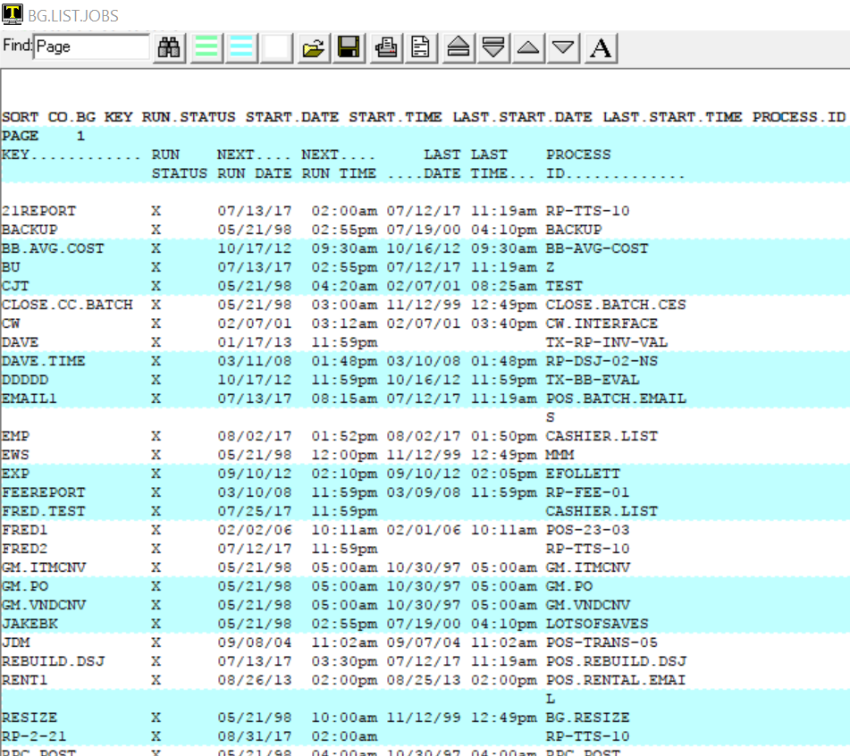

1. List Job History shows a list of the last 50 times that a job was processed.

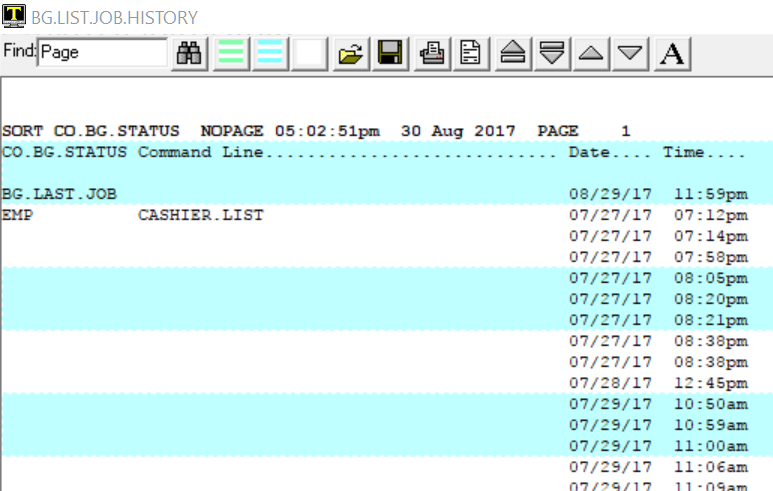

21\. Background Control is where you start and stop phantom jobs. The only job that you should stop is BG.PROCESSOR. All other phantoms are controled by their own process.

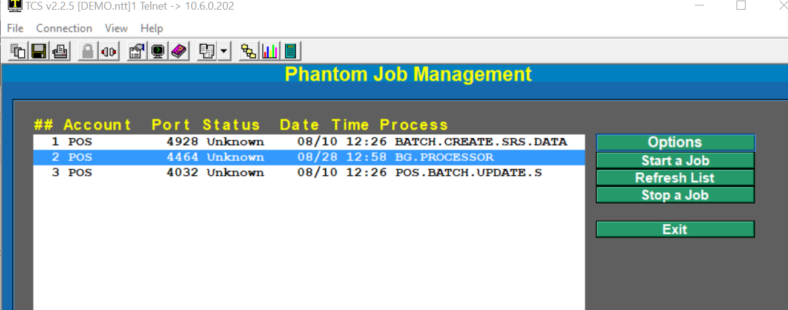

To Stop a Job click on the row that has BG.PROCESSSOR on it then click on Stop a Job.

To Start a Job simply click on Start a Job.

After you do either one of these you may experience a short pause. This is caused by the system monitoring the process to make certain that it was started or stopped.

## Email Notification

Self-Hosted users may choose to have reports print to a specific printer or sent via email. Hosted users are limited to reports that are emailed only.

When an email is sent it will have the Sequence/Iteration number of the report included in the body of the email. The email will look similar to this.

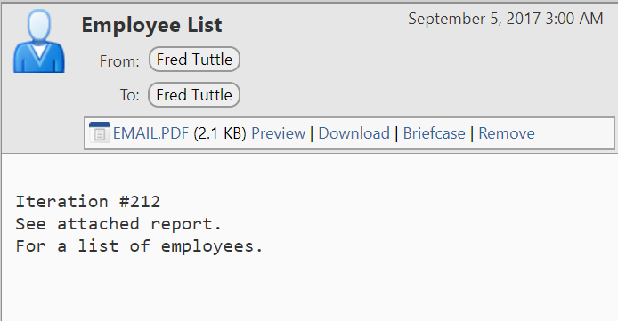

The EMAIL.PDF attachment is the report that was scheduled to run. This is the 212th iteration of this Employee List.

<PageFooter />
