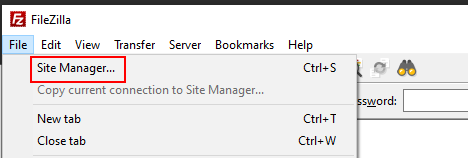
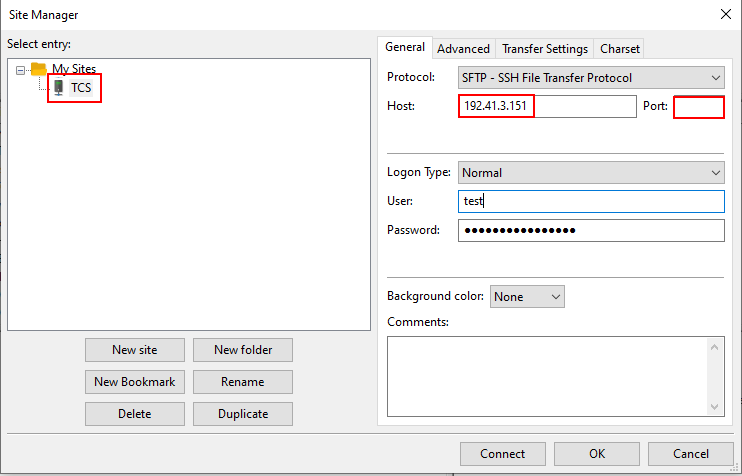
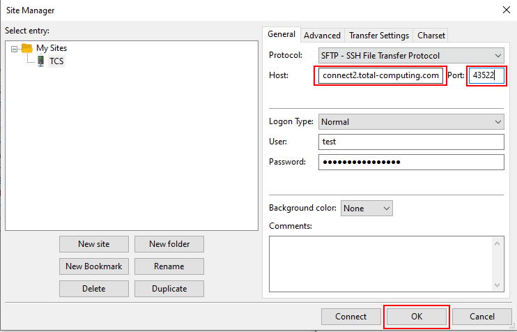
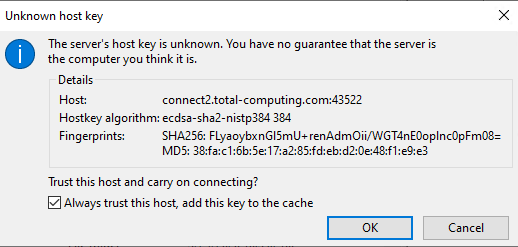
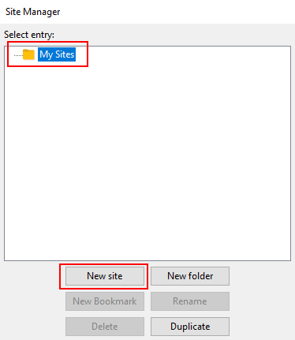
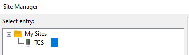
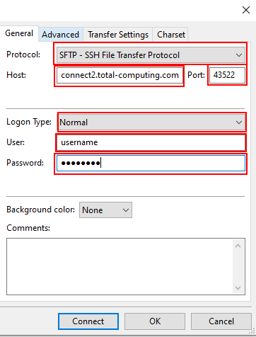
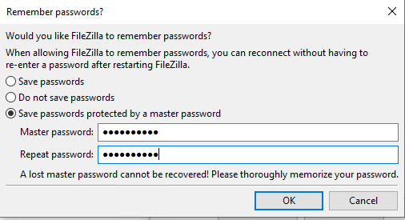
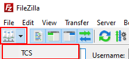

# File Transfer Changes and Setup

<PageHeader />

TCS customers can transfer files via Secure FTP (SFTP) which allows customers to upload course imports, Redshelf catalogs and various other files for import/export into the hosted system. A few changes are required in order to switch pre-existing connections to the new hosting server.

The old SFTP server will reach end of life on 05/09/2020. Below is the necessary information for the campus to update their automated systems, how to update any existing FileZilla connections and how to setup a connection in FileZilla for the first time.

## Connection Information

The new server can be accessed with the information below. Please note that any pre-existing credentials are still in effect.

1. Server: connect2.total-computing.com
    - If IP address is required: 192.41.10.22
    - Please note the server name is the preferred connection method.
2. Port: 43522
3. Protocol: sftp

### Updating Your Current Campus System

You will need to reach out to the person(s) in charge of the import/export process and have them update their system to use the above server and port number. _**T****hey should connect manually the very first time in order to accept the host** **thumbprint/key.**_ After the host key has been cached in their system they should be able to run the automated process as normal.

### Updating Your FileZilla Connection

The following steps cover how to update any existing FileZilla connections to connect to the new server.

1. Open FileZilla on your PC
2. Go to File > Site Manager
    - 
3. Select the existing connection (typically TCS) in the My Sites list
    - Here we can see the old connection information on the right
    - 
4. Update the Host and Port fields to have the new connection info. Other fields should already be correct but please verify them just in case.
    - Host: connect2.total-computing.com
    - Port: 43522
    - 
5. Click OK and start the connection as you normally would
6. The first time you connect to the new server you will be prompted to accept the server's host key. Check the _Always trust this host, add this key to the cache_ and click OK
    - 

### Creating A FileZilla Connection for The First Time

The steps below cover how to install FileZilla if you don't currently have it on your PC. Please note that you will need your credentials in order to complete the process. You can request your credentials by emailing support@total-computing.com.

1. Download FileZilla from [here](https://download.filezilla-project.org/client/FileZilla_3.48.0_win64_sponsored-setup.exe).
2. Run the installer and install with the default options.
    1. Click I Agree
    2. Typically select Anyone who uses this computer and click Next
    3. Leave the checkboxes checked, and if you would like a shortcut on your desktop, check Desktop Icon
    4. Click Next for the default Destination Folder
    5. Next in follow screen
    6. Leave Start FileZilla now checked and click Finish
        - Note that there were no prompts for any addon programs, browser toolbars, etc. as of 5/4/20. Always watch the prompts for any software you download to make sure another program hasn't been included.
3. Create the TCS connection and save it in the site manager
    1. FileZilla should already be open, if not, go to Start, type _filezilla_ and open the red _FileZilla App_
    2. Click OK for the welcome message
    3. Go to File and select Site Manager
        - 
    4. With My Sites selected, click on the New site button
        - 
    5. Name the new entry created (typically TCS) and press Enter
        - 
    6. Customize as follows
        1. Change the Protocol drop down from _FTP - File Transfer Protocol_ to _SFTP - SSH File Transfer Protocol_
        2. Enter _connect2.total-computing.com_ into the Host field
        3. Enter _43522_ into the Port field
        4. Logon Type should be set to _Normal_
        5. Enter your username and password from TCS
        6. 
        7. Click on OK to save your changes
        8. You will be prompted on whether or not FileZilla should remember the site password. It's recommended to use a master password.
            1. A master password will prompt your for _your_ password that you create.
            2. FileZilla will prompt you for your password every time you connect to the system. After you provide your master password it will use the stored site information to connect.
                - 
4. How to connect
    1. Click on the small Site Manager icon right beneath the File menu option and click on TCS
        - 
    2. The first time you connect to the new server you will be prompted to accept the server's host key. Check the _Always trust this host, add this key to the cache_ and click OK
        - 
    3. You should then be connected to the server with your PC files shown in the panel on the left, and the remote server files on the right.
5. How to upload files
    1. [This link](https://wiki.filezilla-project.org/Using#Navigating_on_the_server) will take you to their wiki article on navigating the server files, navigating the files on your PC and how to upload and download to/from the server. Please reach out to support if you have any questions after reading that article.

<PageFooter />
