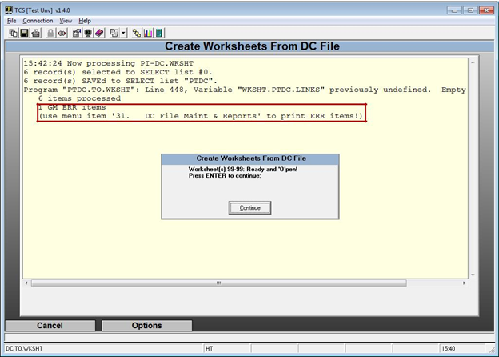

# Global Inventory Procedures

<PageHeader />

1. Preparation
    1. Check Equipment
    2. Prep Areas
    3. Clean MF
    4. Setup Inventory Parameters
2. Close Doors
3. Initialize Inventory
4. Edit Cycle
    1. Scan
    2. Upload
    3. Create Worksheets
    4. Check for Errors
    5. Make Corrections
    6. Commit Worksheets
    7. Report Differences & Valuation
    8. Audit
5. Open Doors
6. Start Receiving
7. Reconcile
8. Post Worksheets to MF
9. Adjustments after Posting

## Software Overview

Each inventoried module, GM, Text and Trade requires it’s own inventory initialization and worksheet(s). The main menu to perform all of the inventory steps is (module)-21-1.

The inventory steps include interlocks to prevent you from trying to take a step out of sequence.

- The steps in the _preparation_ phase are used to prepare the store for inventory counting.
- The steps in the _initialization_ phase are executed once to set everything up.
- The steps of the _edit cycle_ are started with one Edit/Enter/Commit Worksheets step, after that any step can be repeated in any order as necessary.
- The _posting_ phase only contains the posting step, the final step of the inventory process, normally done once.

## Preparation

This phase involves all the steps prior to performing the physical count.

### Check Equipment

It is very important to make sure that all of the equipment to be used in the inventory process is functioning properly.

- Be sure that all scanners can hold a charge and scan.
- Locate all of the connection cables and/or cradles to prevent last minute hold ups.

### Prep Areas

- The system uses numbered inventory count sheets for manually entering and tracking the physical counts. We recommended that each fixture or shelf section should have a separate location number and that the location numbers should be used as your sheet numbers. All areas of the store should have a sheet/location, including the warehouse, all storage areas, register areas and offices.
- It is recommended that each sheet/location should have up to approximately 50 different ISBN/SKU’S. (You don’t want too many items if there was a problem uploading)
- Arrange all inventories in the sales floor and back office areas so that they are orderly, easy to access, and allow easy foot traffic through the area.
- All inventory items on location that have been received into the system need to be scanned.
- Clearly mark all items that have not been received to prevent them from being counted. These items include returns to vendors and items not yet received.
    - It’s a good practice to receive all items prior to counting.

### Clean the Master File

Prior to inventory is a good time to clean up the Master File and purge old inventory items. There are tools located in TX-SU-1-27-5, TR-SU-1-22-5 and GM-SU-1-23-1 to help with cleaning the MF.

### Test Upload

Scan some items and upload them to the server to familiarize yourself with the process. This will give you some time to iron out any problems before you count. You will want to clear the DC file of any test uploads by going to (module)-21-1-31

## Setting up Inventory Parameters

Inventory parameters are set once and then left alone unless you are changing the way you are going to use worksheets. The main inventory control parameter, in **(Module)-UU-22**, sets how you enter your physical counts in the worksheets. You can use any of these methods:

**Your Upload Folder Path will be different than the one shown. If you need assistance please call support for assistance.**

1. Have the system create worksheets for all master file items for writing and keying in the counts.
2. Create worksheets from SKUs and counts recorded into a portable terminal and uploaded to the system (scanners).
3. Create worksheets by keying in each SKU and count from the keyboard.
4. Inventory Worksheets created from Tricoder Scanner.

The Physical Inventory menu screen options will vary depending upon the inventory method that you choose.

## 

# Initializing Inventory

Once the parameters have been set you can initialize your inventory. This will create a “Set ID” that consists of the store, inventory date, and location code you enter. This ID helps keep worksheets from the same module together and separate from other inventories.

Immediately afterwards, if not before inventory has been initialized, close the store to begin your inventory count.

## Edit Cycle

The edit cycle consists of counting inventory, uploading the counts into the system, creating worksheets, checking for and fixing any errors and committing the worksheets.

The following steps should be completed by this point:

- Finish Receiving
- Separate or mark all items not to be counted i.e. items not received into the system
- Clean the MF
- Close the doors 2
- Initialize inventory

### Scanning

When scanning your inventory there are a few guidelines to follow:

- Scan by sections (fixtures) top to bottom, left to right. If there are any errors, scanning in a uniform way will allow you to find the areas where these errors occurred.
- Upload data frequently. This will help in locating items with errors and keep worksheets to a manageable size.

o Refer to your scanner’s guide for the specific steps involved in uploading data.

### Uploading

Please refer to any scanner specific guides on how to upload scanned data to the system.

Depending on which inventory method you choose please proceed to the correct portion of the manual to continue.

1. Have the system create worksheets for all master file items for writing and keying in the counts.
2. Create worksheets from SKUs and counts recorded into a portable terminal and uploaded to the system (scanners).
3. Create worksheets by keying in each SKU and count from the keyboard.
4. Inventory Worksheets created from Tricoder Scanner.

## **Method A:** **Inventory Worksheets Created From the Master File**

Make sure the inventory has been Initialized prior to proceeding with these steps.

### Create Worksheets from MF Menu 21.1.2

This process will create worksheets for all items currently in your inventory, worksheets will be sorted according to the options selected here.

Enter ‘A’ for worksheets with all adopted ISBN’s for the specified term in academic dept, course, and section order – followed by worksheets containing any other ISBN’s that match the initialize limits.

Enter ‘B’ for worksheets containing all ISBN’s within the initialize limits, sorted by the ISBN’s first location code, author, and title.

At the sort prompt, enter ‘Y’ to begin a new worksheet each time the primary sort order value changes. Enter ‘N’ to fill each worksheet regardless of such changes. This only applies to worksheets that are automatically created. The sort order value in Text may be academic dept. (option A) or new or used location codes (option B). Trade and GM uses the value you select.

### Print All Worksheets Menu 21.1.3

Once you have created you worksheets you will need to print them. The default wksht set and selected term will display. You will need to enter the beginning sheet number and the ending sheet number that you wish to print. The first sheet number and the last sheet number will be filled in for you. Leave these as they are to print all of the worksheets or you may change them to print out selected sheets.

Using the printed sheets, count the inventory in your store, be sure to count all the items in all locations in a logical process to avoid missing items.

### Edit/Enter/Commit Worksheets Menu 21.1.4

When you have completed counting, the worksheet counts need to be entered in to the system.

Enter in the Sheet number; the system quantities will be entered as default. Modify these quantities as needed. You can save the sheet when you are finished making the changes. After you have spot checked the section/sheet you will need to commit the worksheet by entering the ‘C=Commit’ button, this will lock the worksheet from any future changes.

### Post Inventory to Master File 21.1.10

Post is the final step in the inventory process. The following steps should be completed before you post the worksheet sets to inventory:

- All items are scanned
- All scanned data should be uploaded and added to worksheets
- All worksheets need to be committed
- Reconcile

Once you are ready to post the worksheets go to (module)-21.1.8 and post the worksheet set. Each post is module specific so be sure to post in every module where inventory was initialized. After posting inventory the process is complete.

## Method B. Create worksheets from SKUs and counts recorded into a portable terminal and uploaded to the system (scanners).

Make sure the inventory has been Initialized prior to proceeding with these steps.

### Create Worksheets

When using scanners, data is uploaded into the Data Collection file (DC). The system takes the counts uploaded into the DC file and creates worksheets which allow you to view and/or edit the counts. It will also check for any errors and notify you of problems.

Module-21-1-2

### Check for Errors

After a worksheet has been created, you will see something similar to this screen. I included an invalid item so that you may recognize an error if one should appear.

Module-21-1-2 

### Make Corrections

If any errors occur, contact TCS for advice on how to handle the issue.

### Modify and Commit Worksheets

After a worksheet is created you can view and edit items on that worksheet by going to (module)-21.1.3) and selecting „M‟ to modify. When a worksheet is ready to be committed enter a „C‟ to commit the worksheet. **After a worksheet has been committed it is no longer possible to edit the worksheet.**

Module-21-1-3

### Report Differences & Valuation

The Difference & Valuation report located at (module) 21.1.6, lists any changes to the price and quantity.

Module-21-1-6

Once any issues in the Differences & Valuation report have been addressed you may:

- Open your doors
- Start Receiving as usual

### Post Inventory to Master File 21-1-8

Post is the final step in the inventory process. The following steps should be completed before you post the worksheet sets to inventory:

- All items are scanned
- All scanned data should be uploaded and added to worksheets
- All worksheets need to be committed
- Reconcile

Once you are ready to post the worksheets go to (module)-21.1.8 and post the worksheet set. Each post is module specific so be sure to post in every module where inventory was initialized. After posting inventory the process is complete.

## Method C: Create worksheets by keying in each SKU and count from the keyboard.

Make sure the inventory has been Initialized prior to proceeding with these steps.

This process is known as the Manual Entry Method. This method is best if you are using a mobile workstation such as a laptop or desktop computer on a mobile cart.

### Enter/Edit/Commit Worksheets 21-1-2

The Wksht Set is a combination of the store number and the date inventory was initialized, DO NOT change the numbers. The Sheet is the worksheet that you are working on, you can see all the open sheets with the ‘??’ or you can enter in a new sheet number or you can enter a ‘.’ to let the system assign the next sequential number. It is recommended that the sheet and shelf number be the same.

Each sheet should have only one section, even if that section or shelf location only has a single item.

Enter or Scan the first item and then enter the quantity for that item, Textbooks will have New and Used quantities while General Merchandise will only have the New quantity.

Once the quantity has been entered scan or enter in the ID of the next item, continue until all items in the section have been entered. Once that is done select ‘=Save’ or hit enter to save the worksheet. ‘X=Cancel’ will cancel any entries or changes that you made. ‘M=Modify’ will take you back to the items so that you can modify them. ‘C=Commit’ will lock the sheet so that no further changes can be made, Do Not commit the sheets until after they have been spot checked and verified.

### Print Non-Committed Worksheets 21-1-3

Enter in the beginning and ending sheets numbers and then select ‘R’ to run and print the report to see all of the sheets that have NOT been committed.

### Post Inventory to Master File 21-1-8

Post is the final step in the inventory process. The following steps should be completed before you post the worksheet sets to inventory:

- All items are scanned
- All scanned data should be uploaded and added to worksheets
- All worksheets need to be committed
- Reconcile

Once you are ready to post the worksheets go to (module)-21.1.8 and post the worksheet set. Each post is module specific so be sure to post in every module where inventory was initialized. After posting inventory the process is complete.

## Method D: Inventory Worksheets created from Tricoder Scanner.

After inventory has been initialized from option 1 (see page 7), you may begin to upload your inventory

### Tricoder Input Menu-21.1.2

If there are any errors in the upload you will get a message to let you know how many. Under the validation row an item with ‘Valid’ is a good item, and item with ‘Not found’ is an item that caused the error in the upload.

You may select the ‘M=Modify’ option to edit the SKU/ISBN number or enter ‘space’ to delete the record.

Once all of the errors have been corrected select ‘P=Post’ to save to the DC (Data Collection) file.

### Create Worksheets from DC Menu-21.1.3

Next choose Create Worksheets from DC (module-21-3). You can wait until all worksheets have been uploaded or you may create the worksheets after each upload. **_(We recommend creating the worksheets after each upload so that you can make sure everything is correct. You may also have someone start spot checking the worksheets if they have been created.)_**

Answer ‘N’ to both prompts.

You should get a message indicating the worksheets that were created and the number of items that were uploaded to the worksheets.

### Edit/Enter/Commit Worksheets Menu 21.1.4

Now you can go in to (menu-21-4) Edit/Enter/Commit Worksheets and edit or modify the worksheet as needed. Once all editing is completed you may commit the worksheet. Committing the worksheet will lock it and prevent any further editing. The ‘Status’ will remain ‘O’ open until it has been committed.

Repeat menu options 2 – 4 for each location until you have finished inventory for the store.

### Post Inventory to Master File 21-1-8

Post is the final step in the inventory process. The following steps should be completed before you post the worksheet sets to inventory:

- All items are scanned
- All scanned data should be uploaded and added to worksheets
- All worksheets need to be committed
- Reconcile

Once you are ready to post the worksheets go to (module)-21.1.8 and post the worksheet set. Each post is module specific so be sure to post in every module where inventory was initialized. After posting inventory the process is complete.

# Printing Reports

Once all of the locations have been uploaded and the worksheets have been created, you need to run each of the report options. Check the information for each report and look for discrepancies from your inventory that is not acceptable.

We strongly advise all users to run all report after entering your counts and before you run the process to post your inventory.

The following are examples of a few of the reports

### Print Non-Committed Worksheets

This report will print all of the worksheets that have not been committed.

### Master File Status Report

You may run a report checking the Master File inventory status. The report will list the SKUs/ISBNs and their worksheet IDs and status in separate Non-worksheet, Uncommitted, Unposted and Posted reports.

Enter in the beginning and ending SKU/ISBN to include on the report, leave blank for all.

Enter in the beginning and ending Classes to include on the report, leave bland for all.

Non-Worksheet SKUS – Enter ‘Y’ for a list of SKU/ISBNs not included in any worksheet.

Uncommitted SKUs – Enter ‘Y’ for a list of SKUs/ISBNs from ‘O’pen worksheets.

Committed/Unposted SKUs – Enter ‘Y’ to include SKUs that have been Consolidated, but haven’t yet been Posted.

Posted SKUs – Enter ‘Y’ to include the SKUs that have been Posted.

Enter an ‘A’ to sort by Author or ‘W’ to sort by Worksheet.

### Print Non-Consolidated Counts

### Consolidate & Print Valuation

Select the sheets to include, leave blank for all

Select your preferred sort order. ‘D’ for department, ‘C’ for class or ‘S’ for SKU.

Select if you wish ‘N’ew, ‘U’sed or ‘B’oth.

Enter a ‘Y’ to include counts that are zero.

### Consolidated Worksheet Detail

This report uses the data created when you ran the Consolidated Report. It includes the worksheets and the individual counts per worksheet.

If you want to limit the report to just those items that have adjustments enter a ‘Y’.

<PageFooter />
