# Touch Screen Menus and Buttons

<PageHeader />

This article will cover how to modify the touch screen buttons and layouts used in the transaction screen. It will also go over how to create new screens, how to assign those screens to specific registers, and how to find the various fees, modifiers, and other values that a button can have.

A couple points of interest before digging in:

1. You can view or re-assign the primary touch screen in use at a register by going to Main Menu-5-3-1 or POS-3-1 on the host for host based registers.
    1. Enter the register number you want to view
    2. Check the top right hand area for the Touch Screen Code field. The value of that field is the primary screen for that register. Note that the field could be truncated. Clicking in the field and highlighting it typically displays the entire value.
    3. Assigning a screen to that field makes that assigned screen the primary screen.
2. Changes to screens should _always_ be done on the host
3. Changes made to a screen will affect _every_ register assigned to use that screen
4. Any updates made to any touch screen will not reflect on a register until:
    1. That register is up to date with the host communication in POS-6-2
    2. The cashier leaves the transaction screen to the main menu, then chooses 1. Cash Register to go back into the transaction screen.
5. Secondary menus are button layouts that cashiers can navigate to. Only the Fixed buttons of a secondary menu are ever displayed.

### Transaction Screen Overview

It's important to first understand the areas of the transaction screen and how they relate to the screen maintenance in POS-3-22. So first, here is a typical touch screen layout:

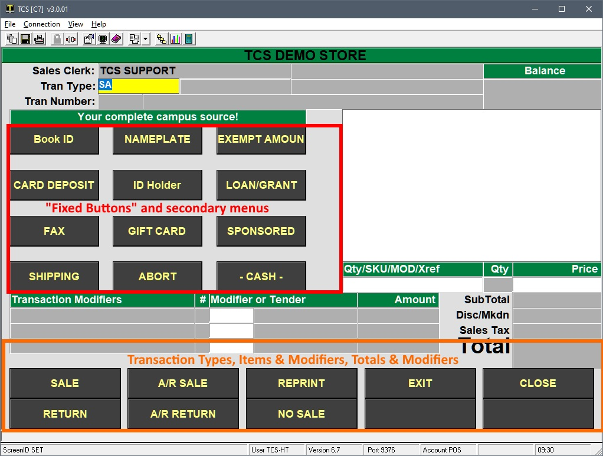

#### Changing the Bottom Screen Buttons

Below is the MAIN touch screen layout found in POS-3-22, Touch Screen Codes. This first view are the three tables that control the bottom section of the transaction screen. The F=Fixed Buttons button is what controls the fixed buttons and menu area highlighted in red in the example above.

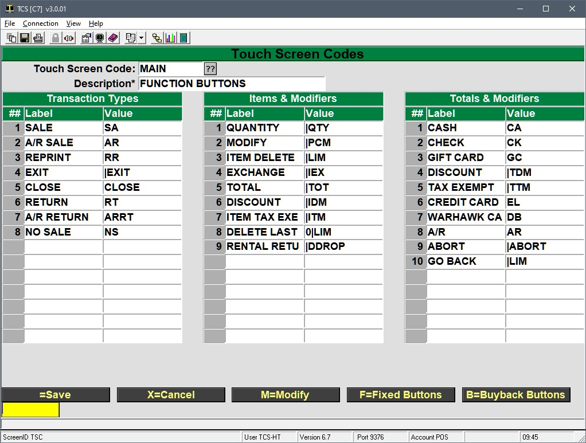

What makes the bottom buttons unique is that they will change depending on what part of the transaction the user is in. Starting with the Transaction Type, moving to ringing up items and using item level modifiers, then on to tender and transaction modifiers after the transaction has been Totaled.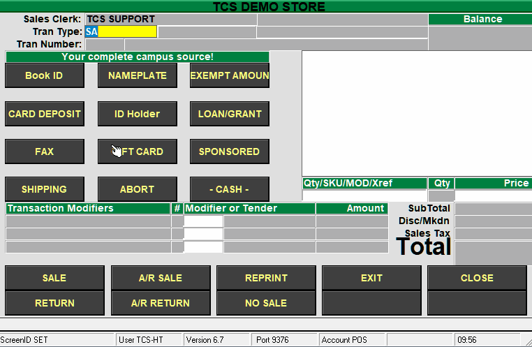

The "Transaction Types" table is what displays on the bottom of the screen when the cashier is in the Tran Type field.

As soon as they start a transaction, the bottom buttons will change and display the buttons mapped in the "Items & Modifiers" table.

Finally, when the cashier Totals the transaction, the buttons change to the buttons mapped in the "Totals & Modifiers" table.

Changing these buttons is straight forward, but there are some restrictions on the buttons along the bottom of the screen.

1. Only the wording on the button and what it does can be changed.
2. There is a fixed number of buttons
3. The layout cannot be changed
    - Buttons can be "moved" by swapping the label and value between different positions in the list
4. Buttons have to display in the appropriate part of the transaction.
    - e.g. Having a button that discounts the transaction in the "Items & Modifiers" table will never work. A transaction has be totaled (a transaction amount calculated) before the transaction amount can be discounted.
5. The buttons on the bottom of the screen do not change as you navigate to other secondary menus in the Fixed buttons area.
6. The bottom buttons will only display the buttons specified in the primary screen layout.

Instructions on adding or changing a button are below. The steps used in this example are for adding a Post Void transaction type.

1. Navigate the cursor to the existing button to be changed, or empty spot where a button will be added.
    1. Add a line in the Transaction Types table by navigating to the line beneath NO SALE
2. Specify the Label of the button.
    1. This is the text that will appear on the button. So POST VOID
3. Specify the Value of the button
    1. This is what the button does. Buttons can be a:
        1. Transaction Type, which can be found in POS-2-5
        2. A fee, found in POS-22-23
        3. A modifier, found in POS-2-2
        4. An item, enter the SKU of any GM or TX item
        5. A tender code, found in POS-2-4
    2. The Post Void transaction type is PV, so that is what is entered
        1. 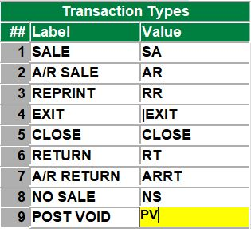
4. Save your changes
5. Now every register that is configured to use the MAIN touch screen code will have the new POST VOID button if they are up to date on their host updates.
    - **Cashiers will need exit the transaction screen (|EXIT or use an up arrow in the tran type field) and go back to 1. Cash Register from the menu before that change is applied.**

 

### Fixed Buttons

The fixed buttons in the main area of the screen allow for greater flexibility compared to the buttons at the bottom of the screen. While the buttons do not automatically change with the flow of the transaction, it is possible to navigate to secondary menus many levels deep, giving manual control to the cashier.

The transaction screen is mapped out in a grid, referenced by it's columns and rows, and the buttons are drawn using points on the grid. If you press ALT + G you can see the grid as that the buttons are anchored to. Press ALT + G again to toggle the view off. Note that the column starts at 0, not 1.

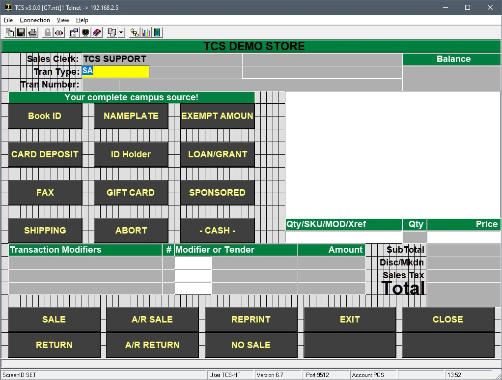

Referencing the above image, the F=Fixed Buttons screen in POS-3-22 now makes a lot more sense.

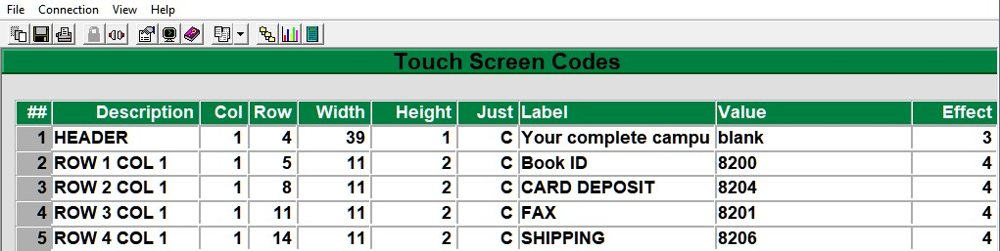

The description column is simply a reference to the element on the screen. The Col, Row, Width, Height and Just columns control the dimensions of the element. The label is what displays on the "button" and the effect controls whether or not you can click on the element, if it's indented, raised, etc.

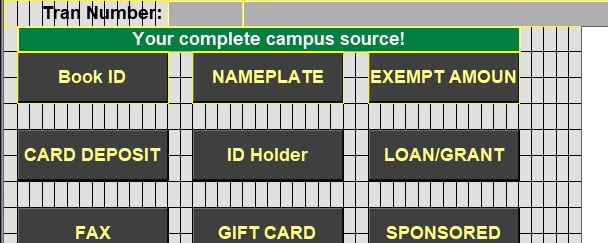

Referencing the grid view, we can see that the HEADER element is our banner/message at the top of the buttons. It starts at column 1 (furthest left is column position 0), runs 39 positions, has a height of 1 and the label is centered. The Value field can't be empty so the word "blank" is used and the Effect 3 makes the element non-interactive.

All of the buttons are then mapped out in the grid with their dimensions, labels and values. There are seven different button effects that can be used, with effects 3 and 7 being non-interactive. How each effect appears _by default_ is shown below. Actual color, border, font, etc. is controlled by the GUI properties, Entities tab. The button number is the effect assigned to that button.

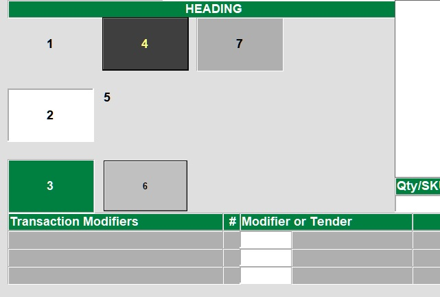

To change a Fixed button:

1. Bring up the screen in POS-3-22 and select F=Fixed Buttons
2. Navigate to the Label column and change the wording to match what the button will do.
    - The label is the wording that shows on the button. The text does not wrap.
3. Specify the Value of the button
    1. This is what the button does. Buttons can be a:
        1. Transaction Type, which can be found in POS-2-5
        2. A fee, found in POS-22-23
        3. A modifier, found in POS-2-2
            - Modifiers are entered as PIPE followed by the modifier code. e.g. |IEX to use the Item Exchange modifier.
            - The pipe | character is necessary because the system needs a way to differentiate between a text based item search and actual modifier codes. If IEX were entered as the value the system would search for items that have iex as any part of their description.
        4. An item, enter the SKU of any GM or TX item
        5. A tender code, found in POS-2-4
    2. There are some pretty advanced functions that can be used for the button Value that are covered at the very bottom of this article.
4. Repeat for any additional buttons and save your way out.

### Default Menus

It is NOT recommended to re-arrange an existing menu by moving, shrinking or stretching elements. It is _MUCH_ easier and safer to create a new menu by copying from an existing layout with the correct amount of buttons and then customize them as needed. TCS has a number of "default" layouts shown below that can be used to source new layouts from.

Note that these layouts are all named their heading number. e.g. 2X3 is the layout code for the first image with "2X3 HEADING" in the screen header. Contact TCS support if you don't have these layouts and would like them on your system.

It's recommended to reserve one button on secondary menus to reset the screen back to the main menu.

<table style="border-collapse: collapse; width: 100%;"><tbody><tr><td style="width: 50%;">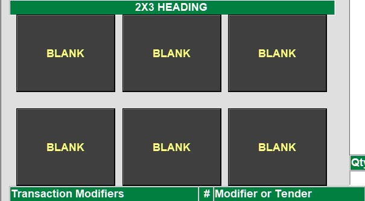</td><td style="width: 50%;">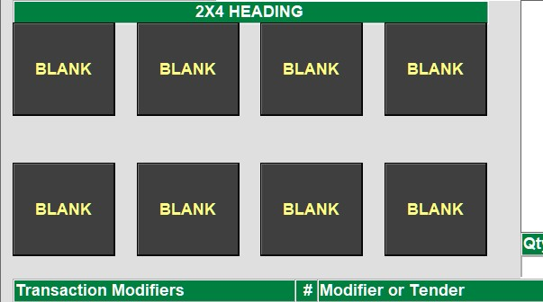</td></tr><tr><td style="width: 50%;">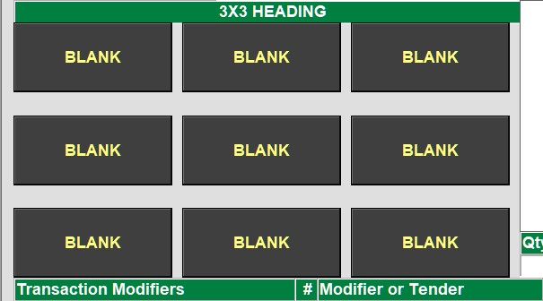</td><td style="width: 50%;">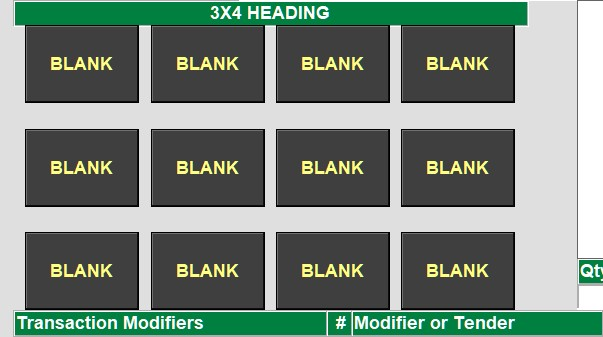</td></tr><tr><td style="width: 50%;">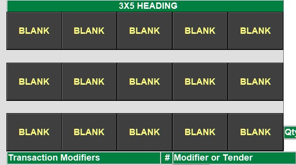</td><td style="width: 50%;">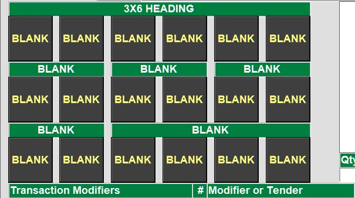</td></tr><tr><td style="width: 50%;">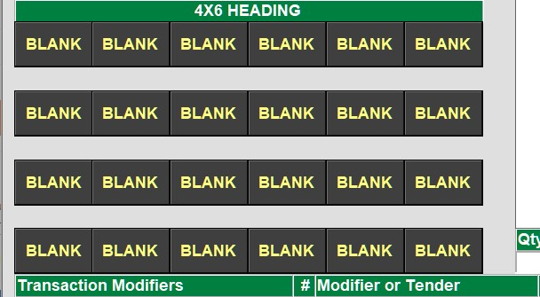</td><td style="width: 50%;">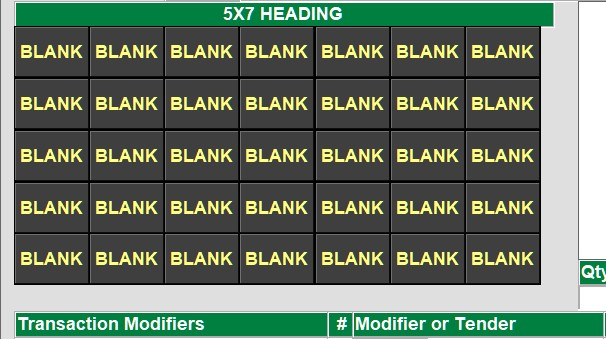</td></tr></tbody></table>

### Customizing a Menu

This example will cover how to create/customize a new menu and then link the TEST menu to the newly created menu. It's recommended to temporarily assign any newly created screens to a host based register in POS-3-1 and then test the changes made as that register. The register will be set to ultimately use TEST as it's primary touch

1. Navigate to POS-3-22 and enter a new code for the new screen
    - This example is going to go over drinks, so DRINKS will be used
2. Select the COPY option and then enter the layout you want to copy from
    - This example will copy from the 3X4 layout so 3X4 is entered.
    - Don't bother changing any of the three tables of the first screen unless it is going to be assigned as the primary screen for a register.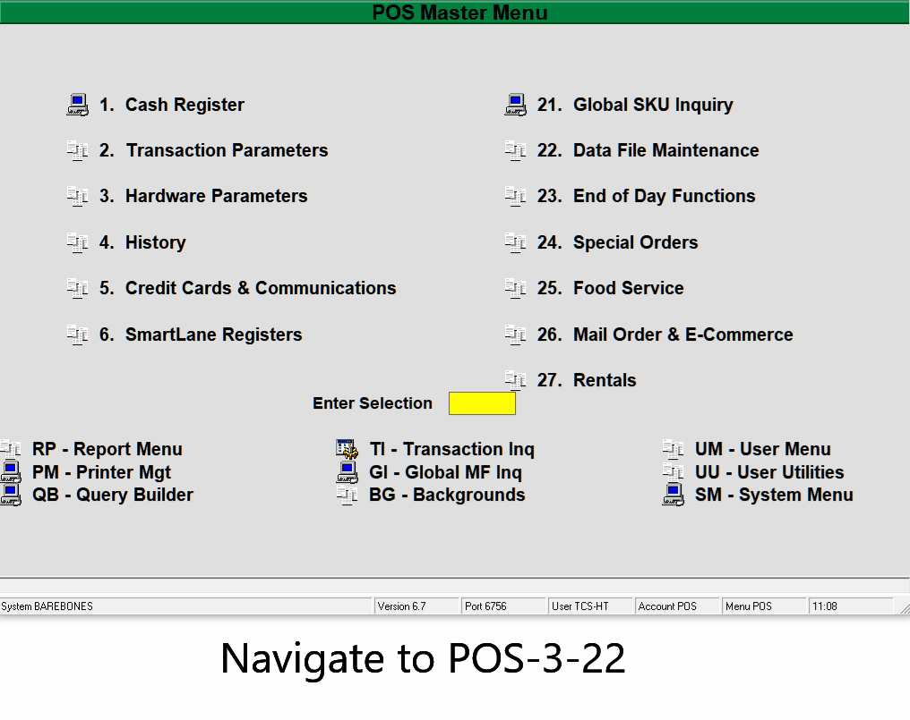
3. Go to the F=Fixed Buttons and start customizing the menu as needed.
    - The goal is to have a split header (Cold Drinks and Hot Drinks) and to add a button that will return the cashier from this Drinks menu back to the primary menu.
    - The width of the Cold Drinks is shortened to 18 and the label changed.
    - A new line is inserted for the second header
    - The Hot Drinks entity is added, it starts at column 22, stays on the same row 4 and gets a matching width of 18.
    - A MAIN MENU button is added with a value of TEST|MENU
        - TEST will be the primary menu for the back office register
        - The |MENU is a modifier that tells the system go back to the MENU listed in front of the | character.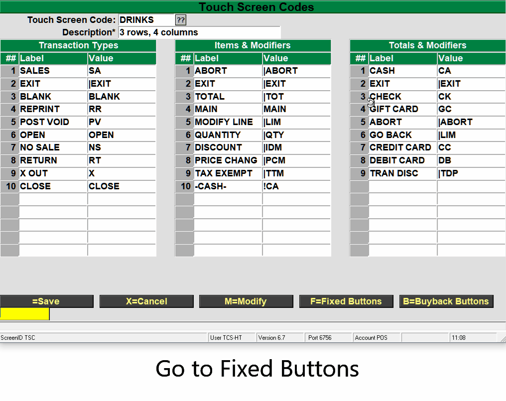
4. Test the screen once it has been created by assigning the new screen in the Register Parameters
    1. Go to POS-3-1 and enter the back office register number the connection uses
    2. Go to the Touch Screen Code field and change it to match the new code (DRINKS)
    3. Save the changes to the register parameters and go to POS-1 for Cash Register
    4. Verify that the changes are correct.
        - 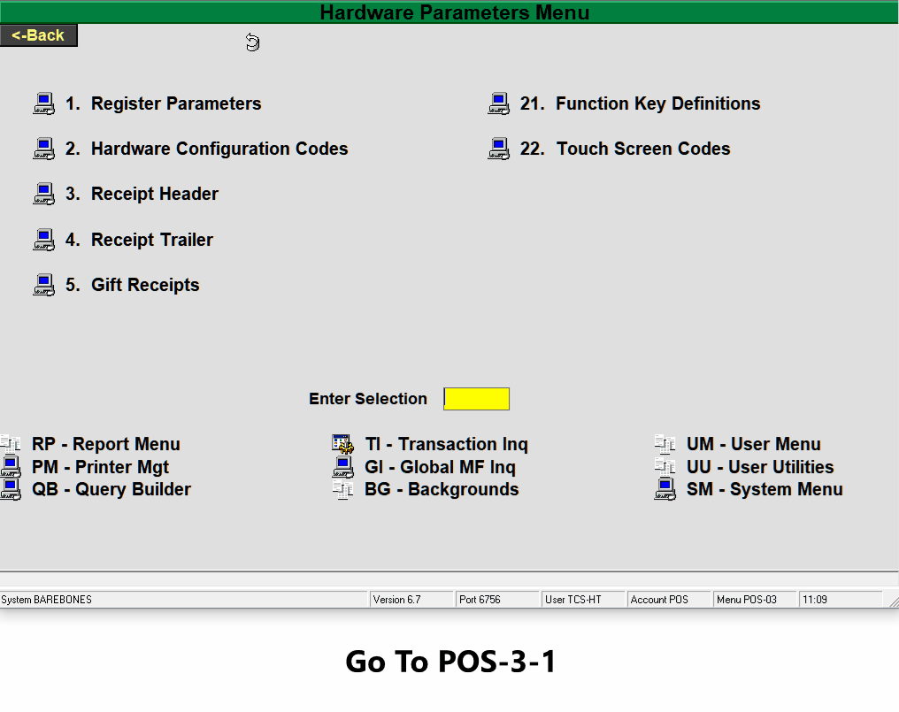
    5. Make any necessary changes to the layout in POS-3-22
        1. Add the actual drink items to the buttons
            1. Label each button for the item it will ring up
            2. Set the SKU/Fee/etc. for each button
5. Add a button to the primary (TEST) screen that goes to the new screen (DRINKS)
    1. POS-3-22, TEST screen code
    2. F for Fixed Buttons
    3. Label a button with the new screen code (DRINKS)
    4. The Value will be CODE|MENU (DRINKS|MENU)
    5.  Save your way out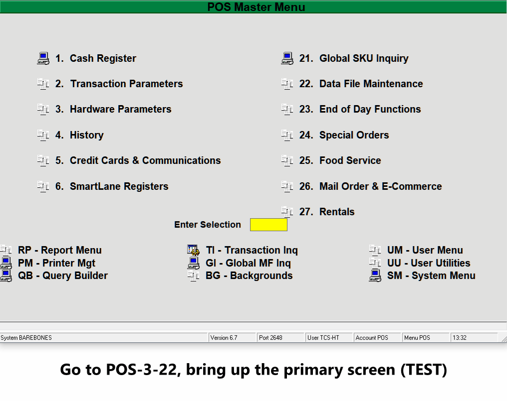
6. Change the primary screen for the register back to the real primary screen (TEST)
    1. POS-3-1
    2. Enter the register number
    3. Change the Touch Screen Code field to TEST
    4. Save the changes
7. Verify that everything has come together in the transaction screen
    1. PSO-1 for Cash Register
    2. Test the buttons

### Advanced Values

What a button does can go MUCH further than a single item, transaction type or modifier. Below is a list of different ways a button's value can be set to accomplish more advanced actions.

1. Values can be "fed" to a modifier to cut down on the amount of prompts a cashier has to respond to.
    1. If the standard discount percentage is 10%, a 10 can be fed to the |DIP (discount item percentage) modifier to automatically discount 10%
    2. The button value would be 10|DIP
2. A : can be used to combine a modifier with an item. Think of it as a "and now" action
    1. Say 5 of an item are always rung up together. A button can be created with 5|QTY:100256
    2. Specify the quantity of 5, and now apply that to item 100256
3. A workflow can be created that leads the cashier through a series of steps
    1. Poor example, but say a combo meal is being sold. The goal is to guide the cashier through 1) selecting the burger 2) selecting any condiments 3) selecting any sides 4) selecting their drink
        1. The burger button is pressed. The button has a value of 100256:CONDIMENTS|MENU
            - The burger is rung up and the cashier is taken to a menu full of condiments
        2. The cashier selects a mayo button, a ketchup button and then clicks on a Next button with a value of SIDES|MENU
        3. Repeat the process through the various menus
4. A |MENU button can reset to whatever the primary touch screen is
    1. RESET|MENU
    2. This can be combined with an item and the : to always reset back to the main menu after ringing up an item.
        1. 100154:RESET|MENU will ring up item 100154 and take the cashier back to whatever the main menu was.

\*\* _NEED TO DOCUMENT |QUAL THIS IS DIFFERENT  FROM MEMO. QUAL WILL STACK ITEMS TOGETHER._

<PAgeFooter />
