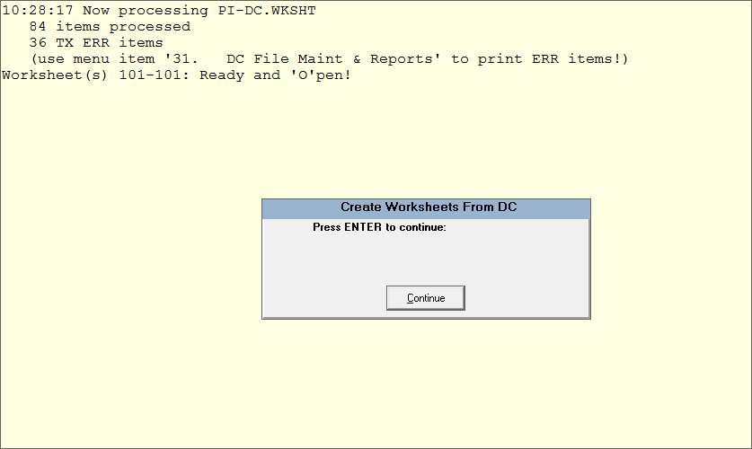

# Inventory Procedures - Tricoder

<PageHeader />

1. Preparation
    1. Check Equipment
    2. Prep Areas
    3. Clean MF
    4. Setup Inventory Parameters
2. Close Doors
3. Initialize Inventory
4. Edit Cycle
    1. Scan
    2. Upload
    3. Create Worksheets
    4. Check for Errors
    5. Make Corrections
    6. Commit Worksheets
    7. Report Differences & Valuation
    8. Audit
5. Open Doors
6. Start Receiving
7. Reconcile
8. Post Worksheets to MF
9. Adjustments after Posting

### Software Overview

Each inventoried module, GM, Text and Trade requires it‟s own inventory initialization and worksheet(s). The main menu to perform all of the inventory steps is (module)-21-1.

The inventory steps include interlocks to prevent you from trying to take a step out of sequence.

- The steps in the _preparation_ phase are used to prepare the store for inventory counting.
- The steps in the _initialization_ phase are executed once to set everything up.
- The steps of the _edit cycle_ are started with one Edit/Enter/Commit Worksheets step, after that any step can be repeated in any order as necessary.
- The _posting_ phase only contains the posting step, the final step of the inventory process, normally done once.

### Preparation

This phase involves all the steps prior to performing the physical count.

### Check Equipment

It is very important to make sure that all of the equipment to be used in the inventory process is functioning properly.

- Be sure that all scanners can hold a charge and scan.
- Locate all of the connection cables and/or cradles to prevent last minute hold ups.

### Prep Areas

- The system uses numbered inventory count sheets for manually entering and tracking the physical counts. We recommended that each fixture or shelf section should have a separate location number and that the location numbers should be used as your sheet numbers. All areas of the store should have a location, including the warehouse, all storage areas, register areas and offices.
- It is recommended that each sheet/location should have up to approximately 50 different ISBN/SKU’S. (You don’t want too many items if there was a problem uploading)
- Arrange all inventories in the sales floor and back office areas so that they are orderly, easy to access, and allow easy foot traffic through the area.
- All inventoried items on location that have been received into the system need to be scanned.
- Clearly mark all items that have not been received to prevent them from being counted. These items include returns to vendors and items not yet received.
    - It’s a good practice to receive all items prior to counting.

### Clean the Master File

Prior to inventory is a good time to clean up the Master File and purge old inventory items. There are tools located in TX-SU-1-27-5, TR-SU-1-22-5 and GM-SU-1-5-1 to help with cleaning the MF.

### Test Upload

Scan some items and upload them to the server to familiarize yourself with the process. This will give you some time to iron out any problems before you count. You will want to clear the DC file of any test uploads by going to (module)-21-1-31

### Setting up Inventory Parameters

Inventory parameters are set once and then left alone unless you are changing the way you are going to use worksheets. The main inventory control parameter, in **(Module)-UU-22**, sets how you enter your physical counts in the worksheets. You can use any of these methods:

**Your Upload Folder Path will be different than the one shown. If you need assistance please call support for assistance.**

1. Have the system create worksheets for all master file items for writing and keying in the counts.
2. Create worksheets from SKUs and counts recorded into a portable terminal and uploaded to the system (scanners).
3. Create worksheets by keying in each SKU and count from the keyboard.
4. Inventory Worksheets created from Tricoder Scanner.
5. Sheet# is Location should typically be Y

The Physical Inventory menu screen options will vary depending upon the inventory method that you choose.

### Initializing Inventory

Once the parameters have been set you can initialize your inventory. This will create a “Set ID” that consists of the store, inventory date, and location code you enter. This ID helps keep worksheets from the same module together and separate from other inventories.

Immediately afterwards, if not before inventory has been initialized, close the store to begin your inventory count.

### Edit Cycle

The edit cycle consists of counting inventory, uploading the counts into the system, creating worksheets, checking for and fixing any errors and committing the worksheets.

The following steps should be completed by this point:

- Finish Receiving
- Separate or mark all items not to be counted i.e. items not received into the system
- Clean the MF
- Close the doors
- Initialize inventory

### Scanning

When scanning your inventory there are a few guidelines to follow:

- Scan by sections (fixtures) top to bottom, left to right. If there are any errors, scanning in a uniform way will allow you to find the areas where these errors occurred.
- Upload data frequently. This will help in locating items with errors and keep worksheets to a manageable size.

1. Select option 1 from the main screen for Data Collection
2. Select option 1 for Sample Program
    1. It will prompt to scan an item, scan an item's barcode
    2. It will prompt for quantity, enter the quantity
        1. Step through until your location is complete
    3. Once a location is complete go to the PC to upload and being the upload process

### Upload and Create Inventory Worksheets from Tricoder Scanner.

After inventory has been initialized from option 1 (see page 7), you may begin to upload your inventory

1. Go to MODULE-21-1-2 to bring up the Tricoder Input screen
2. Select the Store, Module, Employee (optional) and Location
    1. Location will become the sheet number if the Sheet# is Location is flagged as a Y in uu-22. This is the standard option.
    2. Do not re-use the same location number as it will overwrite the previous sheet.
3. Press Enter after the location field and wait, the screen will be unresponsive until the upload is complete.
4. On the TriCoder main menu select the Data Upload option and answer Yes/Press the F1 key.
5. Once it finishes upload press Enter on your keyboard in the Tricoder Input screen. It should display something similar to the screenshot below.
6. On the Tricode it will display End of Transmit, Del File \[Y/N\]. Respond with Yes and confirm.
    1. If the file isn't deleted off of the TriCoder then the old data will be uploaded again on the next upload.

If there are any errors in the upload you will get a message to let you know how many. Under the validation row an item with ‘Valid’ is a good item, and item with ‘Not found’ is an item that caused the error in the upload. Not Found means that the SKU scanned was not found in the system. Verify from another host connection that the MF record exists when you enter the scanned SKU. Sometimes the TriCoder may not be configured to scan the correct check digits and will need to be configured to do so.

You may select the ‘M=Modify’ option to edit the SKU/ISBN number or enter ‘space’ to delete the record or manually correct the SKU.

Once all of the errors have been corrected use the V=Validate option to re-check that the SKU is valid. Once SKUs are valid select ‘P=Post’ to save to the DC (Data Collection) file.

Next choose Create Worksheets from DC (module-21-3). You can wait until all worksheets have been uploaded or you may create the worksheets after each upload. **_(We recommend creating the worksheets after each upload so that you can make sure everything is correct. You may also have someone start spot checking the worksheets if they have been created.)_**

Answer ‘N’ to both prompts.

You should get a message indicating the worksheets that were created and the number of items that were uploaded to the worksheets.

Now you can go in to (menu-21-4) Edit/Enter/Commit Worksheets and edit or modify the worksheet as needed. Once all editing is completed you may commit the worksheet. Committing the worksheet will lock it and prevent any further editing. The ‘Status’ will remain ‘O’ open until it has been committed.

Repeat menu options 2 – 4 for each location until you have finished inventory for the store.

Once all of the locations have been uploaded and the worksheets have been created, you need to run each of the report options 5 – 8. Check the information for each report and look for discrepancies from your inventory that are not acceptable.

Once all of the reports have been checked and you are satisfied that the information is correct, then you will need to Post Inventory to Master File (module-21-9).

<PageFooter />