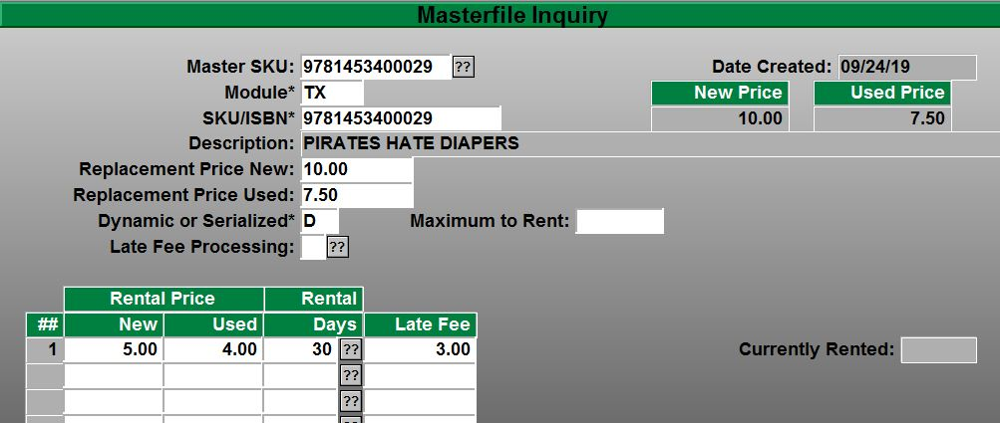

# Tech Updates

<PageHeader />

## Tech Update 12-30-2019

#### Rush Preparation

Close all previous Terms ([TX-SU-1-2-2](http://tcs-training-wp.azurewebsites.net/dwkb/textbook-training/#Closing_a_Term))  
Update your Buying Guides ([TX-24-21](http://tcs-training-wp.azurewebsites.net/dwkb/wholesale-guide-update/#Overview))  
Sync your Registers (SL-2) (POS-6-2) [_Video_](https://www.youtube.com/embed/fiDJG9LgVaA)  
Verify your Rental Periods ([POS-27-21](http://tcs-training-wp.azurewebsites.net/dwkb/rental-setup-and-training/#Setting_up_rentals_POS-27-21))  
GM End of Period Processing ([GM-23](http://tcs-training-wp.azurewebsites.net/dwkb/month-end-closing/#End_of_Period_Processing))

#### Webstore Featured Catalog

Setup your catalog to be "Featured" during checkout. ([POS-26-2 7.a](http://tcs-training-wp.azurewebsites.net/dwkb/adding-gm-items-to-the-web/#Creating_Catalogs))

#### Textbook Discounts

Textbook discount exclusion ([TX-MF](http://tcs-training-wp.azurewebsites.net/dwkb/textbook-training/#Masterfile))

## Tech Reminder 11-26-2019

**Smartsuite** Detailed Documentation and links in the information below. _\*note you much be a registered user to view documentation. If you are not a registered user please register using the top-right login options on this page._ 

#### Closing a Term

- Make sure that [close](http://tcs-training-wp.azurewebsites.net/dwkb/textbook-training/#Closing_a_Term) any open terms that are no longer in use. This has the potential to of applying inventory needs to the wrong term for the purpose of ordering, wantlisting and reporting.

#### Rentals and Buyback

- Setting up your estimated rental returns. Auto Calculate Rental Inventory - [TX.2.30.1](http://tcs-training-wp.azurewebsites.net/dwkb/rental-setup-and-training/#Auto_Calculate_Rental_Inventory) Rental Inventory Entry (Make sure you run the Auto Calculate process first and then the manual process for the exceptions) - [TX.2.30.2](http://tcs-training-wp.azurewebsites.net/dwkb/rental-setup-and-training/#Rental_Inventory_Entry)

#### Buyback preparation

- Make sure you clear out any previous custom parameters for your [buyback](http://tcs-training-wp.azurewebsites.net/dwkb/buyback-setup/#Clear_Buyback_Fields).
    - Buyback Limits
        - Wholesale
        - Retail
    - Book specific flags
    - Special Price
        - Wholesale
        - Retail
    - Purchases
        - Wholesale
        - Retail
    - Limit Flags

#### Buying Guide Update.

- It is so important that you have loaded and are running the latest buying guide. Instructions on loading the latest buying guide can be found [here](http://tcs-training-wp.azurewebsites.net/dwkb/wholesale-guide-update/).

#### Updating your Textbook Inventory Average Cost.

- When you have completed your buyback make sure that your average cost is [recalculated](http://tcs-training-wp.azurewebsites.net/dwkb/buyback-setup/#FINALIZING_YOUR_BUYBACK).

# Tech Update 10-07-2019

## Fixes

#### **Text Books**

You have the ability to lookup ebooks from the Master File by any of the following _\*this update also applies to the Point of Sale lookup/search_

- Digital ISBN
- Print ISBN
- ebook SKU
- Traditional ISBN
- Addressed the synonym problem when the Digital and Print ISBN are identical when your ebooks are imported

## Enhancements

#### **General Merchandise**

- Added a new column to GM-RP-3-1 Purchase Order Summary to include the Cost Total in the report for each PO

#### **Totalink / Credit Cards**

TCS is releasing into Beta the latest version of our credit card Totalink software.

The new version of Totalink includes.

- Enhanced communication with new Payment Gateways and Card Readers
- Ability to share card reading devices between POS stations and/or Workstations.
- Eliminates many PCI requirements

_\*Look for the production release dates before the end of year_

#### Windows 10 Upgrade

We've created an article that covers how to determine the version of Windows running on a register, if that register is a valid Windows 10 upgrade candidate and what the upgrade process will entail. You can access that article through [this link](http://tcs-training-wp.azurewebsites.net/dwkb/upgrading-to-windows-10/).

# Tech Update 10-23-2019

## Fixes

- POS; Resolved the issue with ebook transactions when you aborted a transaction where a partial payment/split tender or a decline of a credit card would generate Activation Code from Redshelf. This fix allows for a clean Exit/Abort of the transaction undoing the Activation Code that was generated by a partial approval.
    - This issue stems from the architecture of the ebook interface and how Activation Codes are generated and when they are created. TCS verifies and gets the Activation Code Prior to Tender select, this can cause a problem when partial payments, declined cards and split tenders are used when the Cashier or Customer decides to Abort or Exit the transaction.
- POS; Resolved the issue of POS Fees being place in the GM source file when the transaction was generated from the webstore. This resolves issues in reports that use the POS Fees Type. _POS-RP-1-22&23 Details and Summary_
- GM; Removed the canceled PO's from the Open PO List. _GM-RP-3-1&2_

## Enhancements

- POS; Class Comparison Report now automatically includes transactions that have been moved to history. This allows traversing current and historical files without being prompted. _POS-RP-1-3-21 Report Menu Path_
- GM; Added the prompt to allow you to select which store in the Open Orders Report. _GM-RP-3-1_
- POS; Kitchen Printer, This allows for Dinning/Food Services/Cafeteria users print to printers located anywhere in the facility in addition to the Cash Register Receipt. These Receipts can be duplicate receipts or they can be configured to contain any transaction information for employees. Updated Documentation found [here](http://tcs-training-wp.azurewebsites.net/?post_type=dwkb&p=1496&preview=true) \*_note in the current setup the sku must reside in the POS account for location printing._ 

## Buyback Preparation

There are several things that you can do ahead of time to help setup a smooth buying experience. Make sure that you go over all of the preparation and test before your first day of Buyback.

- Update the Wholesale Guides you are planning on using this season. \*_Details for loading and setting up guides can be found in the Main Text Training Document [here](http://tcs-training-wp.azurewebsites.net/dwkb/textbook-training/#Wholesale_Buying_Guide)_.
- Clearing out previous buyback “Flags” _\*note that buyback isbn specific flags stay in place until they are removed. \*Detailed_ _Documentation found [here](http://tcs-training-wp.azurewebsites.net/dwkb/buyback-process/)_

- Verify your Buyback Season Codes and dates. _\*Detailed Documentation found [here](http://tcs-training-wp.azurewebsites.net/dwkb/buyback-process/)_
- Verify your default Wholesaler and any additional alternate Wholesaler has been setup. _\*Detailed Documentation found [here](http://tcs-training-wp.azurewebsites.net/dwkb/buyback-process/)_
- Close all of your open terms that you are through with _\*Detailed Documentation found [here](http://tcs-training-wp.azurewebsites.net/dwkb/textbook-training/#Closing_a_Term)_
- Verify your calendar dates for Buyback _\*Detailed [here](http://tcs-training-wp.azurewebsites.net/dwkb/textbook-training/#Buyback_Seasons)_

 

# Tech Update 10-10-2019

## Enhancements

- **POSConnect Datatel Financial Aid Checkout** If you are a POSConnect Retail Customer contact TCS Support on setting up your real-time Financial Aid Online Checkout
- **Adopting GM Items and Fees into your Courses.** You now have the ability to add unlimited GM items and Fee codes to your online Course Adoptions. You can control the GM items and Fees through your regular adoption process. See the updated training documentation for details on setting up and using this new feature [_here_](http://tcs-training-wp.azurewebsites.net/dwkb/1460-2/)

- **You can add multiple images to your online inventory**. [_Instructions_](http://tcs-training-wp.azurewebsites.net/dwkb/adding-gm-items-to-the-web/#dualimagegm)

- **Coupons, Promo Codes, Vouchers, Gift Certificates and Cards** Refined our checkout shopping cart process for using multiple types of Promo Codes and Vouchers. Allowing users more control to setup what Classes of Inventory, Specific items and Transaction level controls. [_Instructions and Documentation_](http://tcs-training-wp.azurewebsites.net/?post_type=dwkb&p=1475&preview=true)_._

 

# Tech Updates 09-25-2019

Redshelf Returns and Voids are now working correctly within Redshelf.

## Enhancements

### Printing Pickslips

- In POS.26.13 (Print Pickslips) the ‘Status’ has been modified to have a ??or// button/key. A new option of O,E has been added. This new option will print any un-printed orders regardless as to whether or not it has an ebook only title.

### Ecommerce Resume Search Enhancement Web Orders.

- Web orders are now easier to resume via a new search function. Starting a web order will display a prompt that will bring up orders based on the order number, customer name, email or phone number (xxx-xxx-xxxx). The old scroll list can still be accessed by just pressing Enter at the text field.

Instructions for setting up and enabling Web Order Search are be found [here](http://tcs-training-wp.azurewebsites.net/?post_type=dwkb&p=1431&preview=true).

### Rental Inquiry screen

- Customers have stated concerns about the locking of records when looking at the MF for Rental Record information. We added the ability to look at Rental information through the “Master File Inquiry (MI)” Menu instead of accessing rental information through the “Master File (MF)”. The new option in the MI screen is “RE=Rental”

### Sales History

- We have added the ability to view the Sales History from the MF screen with SH=Sales History button, made changes to the default Sales History in the Master File to use the users default store. You will still have the ability to browse between your store locations if you have permissions.

<PageFooter />
