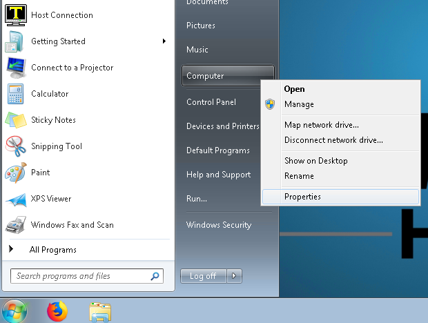
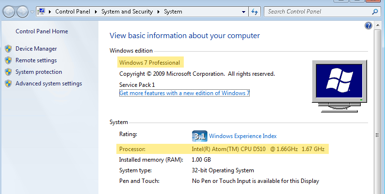

# Upgrading to Windows 10

<PageHeader />

This article covers how to determine what version of Windows is running on a register, if that register is a valid Windows 10 upgrade candidate and what the upgrade process will entail.

We have seen some units with the D2550 processor upgrade to Windows 10 even though they are flagged as incompatible by Touch Dynamic. Upgrading those units may work, but it is risky.

This is a work in progress and information will be updated as it becomes available.

### Determine the Windows Version and CPU Model

1. 1. Click on Start
    2. Right click on Computer and select Properties
        - 
    3. This will bring up the System window with the needed information
        - 
        - In the top section we can see that the machine is running Windows 7 Professional and needs to be upgraded.
            - If this shows as Windows 8 or Windows 10 then Windows does not require updating.
        - In the second section we can see that the Processor is an Intel Atom D510 CPU
    4. The CPU model can be compared against the following table to determine if it’s a valid candidate for Windows 10.
        - <table width="230"><tbody><tr><td width="166">Celeron 1.0-1.5</td><td bgcolor="red" width="64">N/A</td></tr><tr><td width="166">Celeron M1.86/C2D 1.66</td><td bgcolor="red">N/A</td></tr><tr><td width="166">Atom N270 1.6</td><td bgcolor="red">N/A</td></tr><tr><td width="166">Atom D525 1.8</td><td bgcolor="red">N/A</td></tr><tr><td width="166">Atom D2550 1.86</td><td bgcolor="red">N/A</td></tr><tr><td width="166">Celeron J1900 2.0</td><td bgcolor="green">OK</td></tr><tr><td width="166">Ivybridge 1037u 1.8 and i3-3217u 1.8</td><td bgcolor="green">OK</td></tr><tr><td width="166">SandyBridge G540, G850, i3-2120, i5-2400, i7-2600</td><td bgcolor="green">OK</td></tr><tr><td width="166">Haswell G1820, G3440, i3-4330, i5-4570S, i7-4770S</td><td bgcolor="green">OK</td></tr><tr><td width="166">Skylake 3955U, i3-6100u, i5-6300u</td><td bgcolor="green">OK</td></tr><tr><td width="166">Celeron J3455 2.3</td><td bgcolor="green">OK</td></tr><tr><td width="166">Kaby LakeG3930TE, i3-101TE, i5-7500T, i7-7700T</td><td bgcolor="green">OK</td></tr><tr><td width="166">BayTrail Atom Z3745 1.86</td><td bgcolor="red">N/A</td></tr><tr><td width="166">Cherry Trail Atom X7-Z8750 2.56</td><td bgcolor="green">OK</td></tr></tbody></table>
            

1. 1. - Since the D510 is not listed with a green OK (it’s too old to even show on the list) it is **_NOT_** a valid candidate for Windows 10 and will ultimately need to be replaced.
        - If the CPU was a valid option then one of the upgrade paths below would be the next step.

### Upgrading to Windows 10

There are two different options that IT can follow to upgrade to Windows 10. Either an “over the top” upgrade or a fresh install. There are certain steps that should be followed before either option is performed. Our support group is happy to answer any questions or assist your IT in going through these steps the first time.

1. 1. - Backup the following directories to a thumb drive. Create a directory for each register’s files. E.g. reg 101, reg 102, etc. with the contents _from that register._
            1. C:\\TCS
            2. C:\\TCSDB
                1. If this directory doesn’t exist then backup C:\\IBM\\UV
            3. C:\\TCS Host or C:\\TCS
            4. C:\\Program Files (x86)\\Vantiv\\triPOS Service\\tripos.cfg
                1. This will only appear on registers where Chip and Pin (EMV) credit card devices are used.

The register can then be upgraded to Windows 10 through the upgrade or fresh install options. After it has been completed TCS will need remote access via ShowMyPC to reinstall the software, restore the data from the backup and setup the peripherals.

The ShowMyPC session will need to be started while a local administrative account is logged in. Machines where the upgrade option was used will still have their original user which should be fine. Fresh installs will require a new user to be created. This user can be temporary as TCS will need to setup a specific user with local administrative rights.

The time spent by TCS setting everything back up is billable and typically takes around 1 - 1.5 hours to complete on a fresh install and as few as 30 minutes on an over the top upgrade.

<PageFooter />
