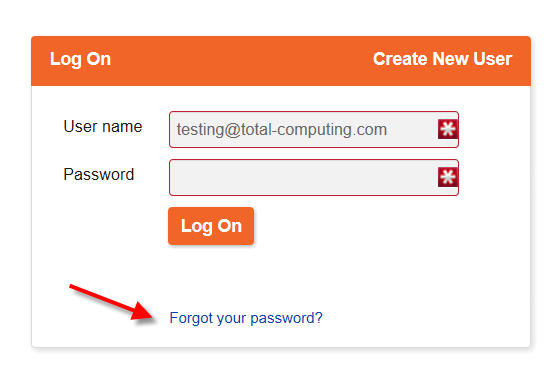
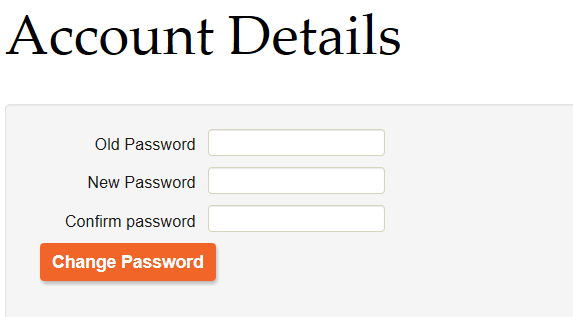
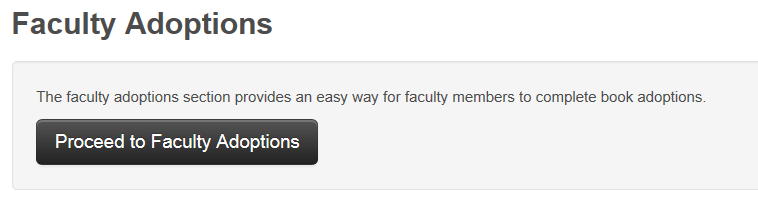
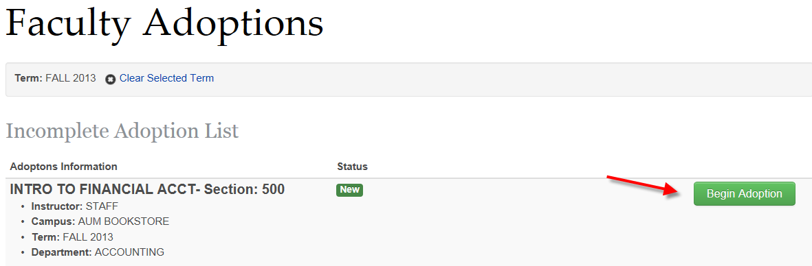
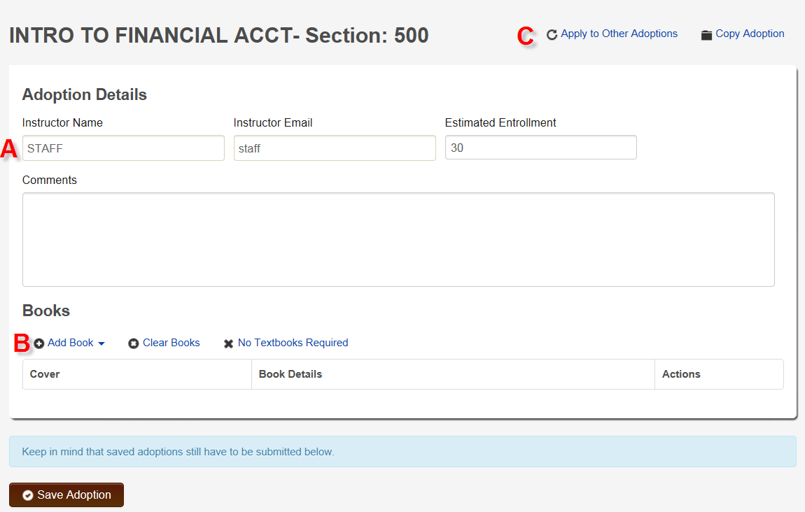
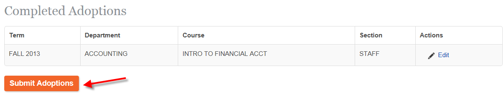
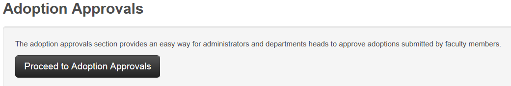
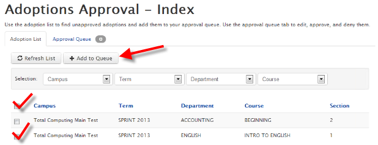
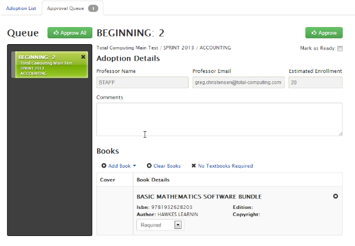

# Advanced Faculty Adoptions - Web Side

<PageHeader />

## Overview

_Faculty or department personnel will log in to the bookstore’s online faculty adoption website and submit their course requests or adoptions. These requests will be reviewed by the Department approvers and/or the Bookstore where the adoptions will be accepted and/or denied. Once the adoptions are accepted the TCS Textbook adoption system will be updated with the requests automatically. If they are denied the faculty will have the opportunity to modify the adoption and resubmit them for department/bookstore approval._

## Faculty and Department Sign In

Each faculty and department member will need to sign into the campus WebStore system in order to enter the faculty adoptions. The account should be setup using the email address of the faculty/department personnel. The first time signing into the WebStore system the staff will need to choose the ‘forgot my password’ (Screen 1) option so a new password can be generated and emailed to the staff.

 (Screen 1)

Once the new password is received via email continue to log into the WebStore system with the new password. The password can be changed by clicking on the ‘Account Details’ button (Screen 2) and by entering the old and new password information (Screen 3). Save the changes at the bottom of the page. This password will be used as long as the account is setup in the system (multiple terms).

(Screen 2)
 (Screen 3)

## Inputting Faculty Adoptions

Each faculty/department will be responsible for inputting their course requests/adoptions into the system. Signing into the WebStore system the personnel will be presented with three (3) options: Account Details, Order History or Faculty. Click on the Faculty button and then ‘Proceed to Faculty Adoptions’ to submit adoptions (Screen 4).

 (Screen 4)

Select the desired term to submit the adoptions. Then a list of adoptions will display. The ‘Status’ column will display the current status of the adoption. The ‘New’ status adoptions will be at the top of the page, click on the ‘Begin Adoption’ (Screen 5) to continue with the adoption process.

 (Screen 5)

The preliminary information about the adoption will be displayed on the screen for the faculty/department to update and review. (Screen 6)

 (Screen 6)

**Section A** (Screen 6) will display the instructor name, email and estimated enrollment. The faculty/department will need to review and update this information if needed.

**Section B** (Screen 6) will give the options for attaching titles to the course adoption. The ‘Add Book’ has a drop down feature with search criteria for choosing the correct title to adopt to the section:

1. Search by Adoption History – This feature allows the staff member to search previous adoptions to find the title they would like to adopt for the current term.
2. Search by ISBN – Input the ISBN of the title.
3. Search by Author – Input the author of the desired title.
4. Search by Title – Input one or more words in the title.
5. My Previous Adoptions – This would allow the staff to search historical adoptions they have submitted in the past for this department/course/section. Making it easier to use the same title used for previous semesters.

**Section C** (Screen 6) will give the staff the ability to apply the same titles that were added to the current section to other sections by using the ‘Apply to Other Adoptions’ link. They can also use the ‘Copy Adoption’ link to copy all of the Adoption details and title adoptions on the section and easily paste them to another section.

Once the adoption detail and title adoptions have been made, ‘SAVE’ the adoption by pressing the ‘Save Adoption’ button on the bottom of the screen. This will save and exit the currently selected adoption and return the staff to the Adoption listing.

## Completing the Adoption

The system is designed to allow the staff to modify many adoptions and then submit all the adoptions at one time. Once the staff has modified all adoptions and added the titles necessary, they must complete the adoption by scrolling to the bottom of the adoption listing and ‘Submitting the Adoption’ (Screen 7). If the adoptions are not submitted by clicking on the ‘Submit Adoption’ button all changes will be lost.

 (Screen 7)

# Approving Faculty Adoptions (if necessary)

_If the system is setup to require department “approvers” then proceed to the next steps._

Once the department approvers have logged into the online adoption system, they need to click on the faculty button and then ‘Proceed to Adoption Approvals’ (Screen 8).

 (Screen 8)

The department approver will be presented with a page containing all adoptions waiting on approval. They can filter the listing by Campus, Term, Department or Course. If they would like to only approve one or all pending adoptions, the check boxes to the side of the screen can to be used. Once they have made their selection of the adoptions (by check marking the desired adoption) to be viewed, updated and approved they must add these to their “Queue” for processing (Screen 9).

 Screen 9

To view, update and approve the adoption the department approver must review the “queued” adoptions and decide if the current adoption information is correct. Double check the following fields:

1. Adoption Details – Ensure the Professor Name, Email and Estimated enrollment are all correct. Make changes where necessary.
2. Books – Ensure the correct title is adopted to the section, and that the title is Required, Optional or Not Wanted.

 Once all information has been reviewed and/or updated, the department approver can either ‘Mark as Ready’ to continue with more approvals, or click on the button to save and exit out of the adoption queue.

 (Screen 10)

Continue with the adoption approval process until all items in the queue have been updated and approved. Watch for any email notifications where other adoptions have been submitted for approval and continue the process.

<PageFooter />
