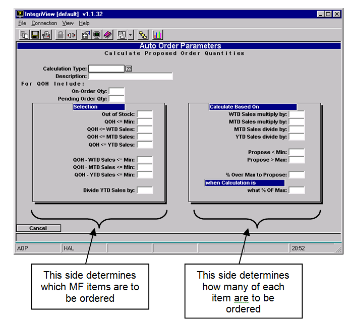
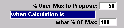
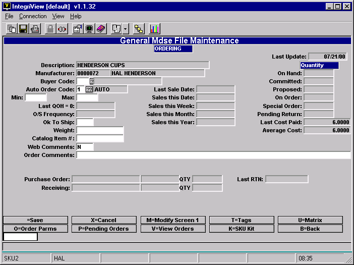
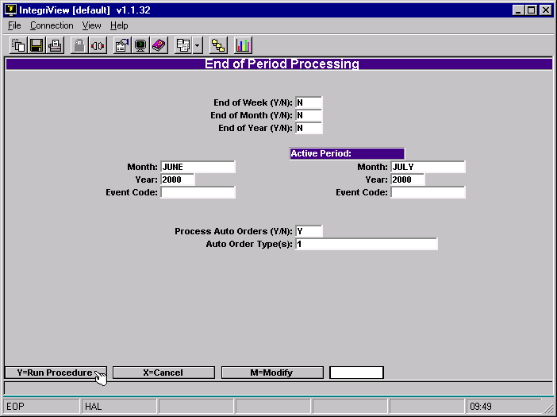

# Auto Orders

<PageHeader />

Auto Orders automatically analyzes your need to order new items and creates pending orders when you do End of Period processing. This document first explains how to setup Auto Orders, and then how to run Auto Orders.

## Setup

There are two steps for the setup of Auto Orders. First you must create Auto Order codes. Make a new code for each different calculation type you would want for an item. Secondly you must enter the Auto Order codes into items in the masterfile. We will explain these two steps in detail.

### Create Auto Order Codes

Go to Auto Order Parameters. (GM-SU-2-1)

You will be in this screen: 

- Type a “.” to add a new calculation type.
- Type a name for this calculation type in the Description field.

Note that the Screen is split into two sections, Selection and Calculate Based On. The Selection side will determine which items need to be ordered. The Calculate Based On side will determine how many of each item to order.

Here is a description of what each field does:

**On-Order Qty** The quantity on hand determines whether you want to select an item to order. Enter a “Y” in this field to add the quantity on order to the quantity on hand in this calculation. Otherwise enter an “N”. This means that if there were 15 on hand and an order for 10, the auto order process would count 25. This will not change the masterfile quantities.

**Pending Order Qty** Similar to the previous field, enter a “Y” in this field to add the pending order quantity to the quantity on hand. Otherwise enter an “N”. If you say “Y” to both On-Order Qty and Pending Order Qty, then it will add both of the quantities to the quantity on hand in the selection process. This will not change the masterfile quantities.

**Out of Stock** Enter a “Y” to choose masterfile items that have a quantity on hand of zero. (Or any items that show a negative quantity on hand.)

**QOH <= Min** Enter a “Y” to choose items that have a quantity on hand less than or equal to the mininimum for this item. This minimum is set in Masterfile Maintenance on the Ordering screen in the Min field.

**QOH <= WTD Sales** Enter a “Y” to choose items that have a quantity on hand less than or equal to the week to date sales for this item.

**QOH <= MTD Sales** Enter a “Y” to choose items that have a quantity on hand less than or equal to the month to date sales for this item.

**QOH <= YTD Sales** Enter a “Y” to choose items that have a quantity on hand less than or equal to the year to date sales for this item. If you enter a number to divide the YTD sales by in the _Divide YTD Sales by_ field, then it will use the result in the QOH comparison.

**QOH - WTD Sales <= Min** Enter a “Y” to choose items whose quantity on hand minus the week to date sales are less than or equal to the minimum the store would like to have on hand (set in the Min field in the masterfile.)

**QOH - MTD Sales <= Min** This is just like the _QOH - WTD Sales <= Min_ field, except it uses the month to date sales in the comparison.

**QOH - YTD Sales <= Min** This is like the _QOH - WTD Sales <= Min_ field, except it uses the year to date sales in the comparision. It will use the YTD sales divided by a number you choose, if you put that number in the _Divide YTD Sales by_ field.

**Divide YTD Sales by** If you want the YTD calculations divided by a number, then enter the number here. It will only do this for the _QOH <= YTD_ and the _QOH - YTD Sales <= Min_ fields. It has no effect with the _YTD Sales divide by_ field.

**WTD Sales multiply by** Enter a number in here and it will be multiplied by the week to date sales. The quantity on hand will be subtracted from this number, and the result will be the quantity to order. Note however that it will not order more than the maximum for the item unless you put a “Y” in the _Propose > Max_ field.

**MTD Sales multiply by** Enter a number in here and it will be multiplied by the month to date sales. Otherwise it is handled the same as in the _WTD Sales multiply by_ field.

**MTD Sales divide by** Enter a number here for the month to date sales to be divided by. Otherwise it is handled the same as the _WTD Sales multiply by_ field.

**YTD Sales divide by** Enter a number here for the year to date sales to be divided by. Otherwise it is handled the same as the _WTD Sales multiply by_ field.

**Propose < Min** Enter a “Y” here if you will allow the number of items purchased to be less than the minimum set in the masterfile. Otherwise it assumes “N”.

**Propose > Max** Enter a “Y” here if you will allow the number of items purchased to be greater than the maximum set in the masterfile. Otherwise it assumes “N”.

**% Over Max to Propose when Calculation is what % OF Max** These fields work together. _% Over Max to Propose_ will order a specified percentage over the Max only when the calculation already is a specified percentage of the Max. For example if I put in “50” and “100” like so:

If my Max was 100 for an item, then whenever the proposed quantity reached 100 it would add an extra 50 to that for a total of 150.

You can add as many auto order codes as you would like.

### Add Code to Item in Masterfile

Now you must add the auto order code into the masterfile for any items that you want automatically ordered. Go into Masterfile Maintenance, type in the SKU and then type “O” to go to the ordering screen. You will be in this screen.

Type the code into the Auto Order Code field

## Running Auto Orders

This process will create pending orders for each item that has an ordering need, determined by the auto order code that it contains.

 

Choose End of Period Processing, menu option 23 from the main GM menu.

Only enter a “Y” into the first three fields if it is the end of the specified period. Otherwise enter an “N”.

Enter the month and the year of the closing period in the first column, if you answered “Y” to End of Month field or to the End of Year field. Otherwise it does not matter what you enter into these fields.

Enter the month and Year of the Active Period (meaning the current month and year) into the second column.

Enter a “Y” in the Process Auto Orders field.

Enter the auto order code that you want to process in the Auto Order Type(s) field. Leave it blank to process all auto order types.

<PageFooter />
