# Buyback Process

<PageHeader />

## Buyback Flag Maintenance (TX-5-2-1)

To set up buyback information for a book in your database, follow these steps.

1. From the **Smart Text** main menu, enter “5” to get to the Buyback Processing Menu, “2” for Buyback Maintenance and then “1” for Buyback Flag Maintenance screen **(TX-5-2-1)**.
   - 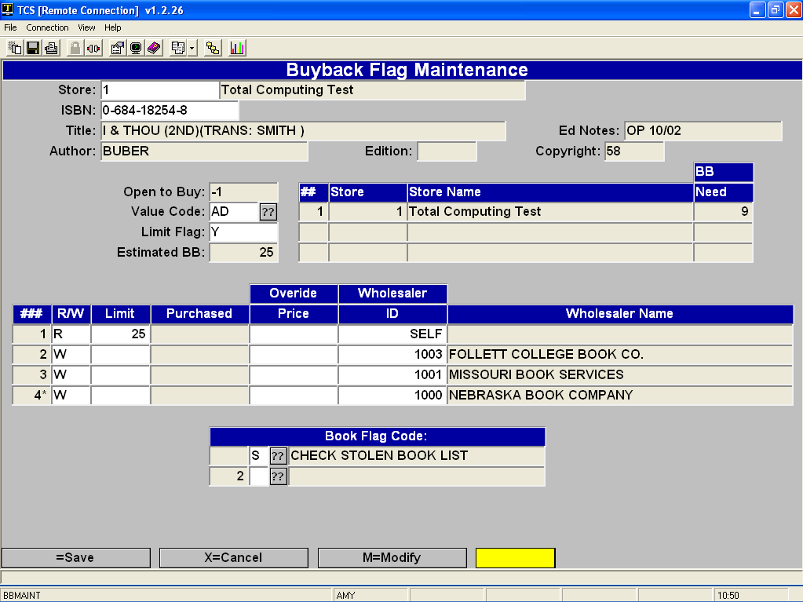
2. In the `Store` field, enter the store number for which you wish to set up buyback. This will also automatically populate the `Store, Store Name, and BB Need` fields in the upper right side of the screen.
3. In the `ISBN` field, enter the book for which you wish to set up buyback.
4. The `Title, Author, Ed Notes, Edition, and Copyright` fields will automatically populate with the information from the master file for the ISBN that you entered.
5. The `Open to Buy` field will automatically populate with the open to buy quantity for this ISBN.
6. In the `Value Code` field, enter the buyback value code for the book. For a list of codes, enter “??”. For more information on value codes, see the section Setting Up Buyback Value Codes in the **Smart Text** Setup Guide.
7. In the `Limit Flag` field, enter the buyback limit flag for the book. Enter “U” to buy unlimited copies of the book, `X` to exclude the book from buyback, “G” for guaranteed buyback, or “Y” for a limit.
8. The `Estimated BB` field will automatically populate with the total estimated buyback amount taken from all adoptions entered in terms attached to the current buyback season.
9. In the `R/W` field, enter “R” for retail or enter “W” for wholesale.
10. In the `Limit` field, enter the total quantity of copies (your limit) you will buy back at this value.
11. The `Purchased` field will automatically populate with the quantity of books purchased at buyback at this value.
12. In the `Overide Price` field, enter the price you would like to purchase this title for. If you enter a price in this field, it will override the calculated price that is based on the set buyback parameters. For more information on buyback parameters, see the section Buyback Parameters in the **Smart Text** Setup Guide.
13. In the `Wholesaler ID` field, enter the vendor number of the wholesaler you would like to purchase textbooks for at buyback. The `Wholesaler Name` field will automatically populate with the name of the wholesaler entered.
14. In the `Book Flag Code` field, enter any book flag codes that you would like to set up for this title. For more information on book flag codes, see the section Textbook Flags in the **Smart Text** Setup Guide.
15. Press \[ENTER\] to save the changes, `X` to cancel, or `M` to Modify.

## Wholesale from Buyback (TX-4-2-2)

If you buy back books to sell to wholesalers, you can use the functions in the Wholesale from Buyback menu to ship them to the wholesaler. This section covers these functions.

## Creating a Suggested Shipping List (TX-4-2-2-1)

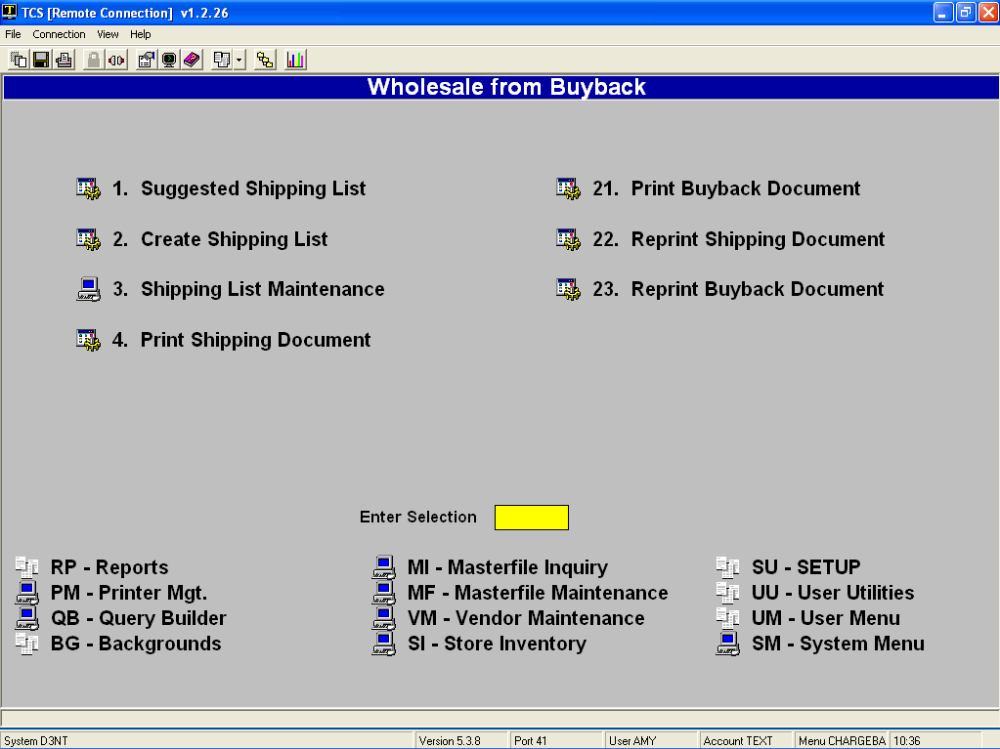

To create a suggested list of buyback items that should be sent to a wholesaler, follow these steps.

1. From the **Smart Text** Main Menu, select the `Returns` option followed by the `Sales to Wholesalers` option, the `Wholesale from Buyback` option, and the `Suggested Shipping List` option to get to the Print Shipping Lists screen **(TX-4-2-2-1)**.
   - 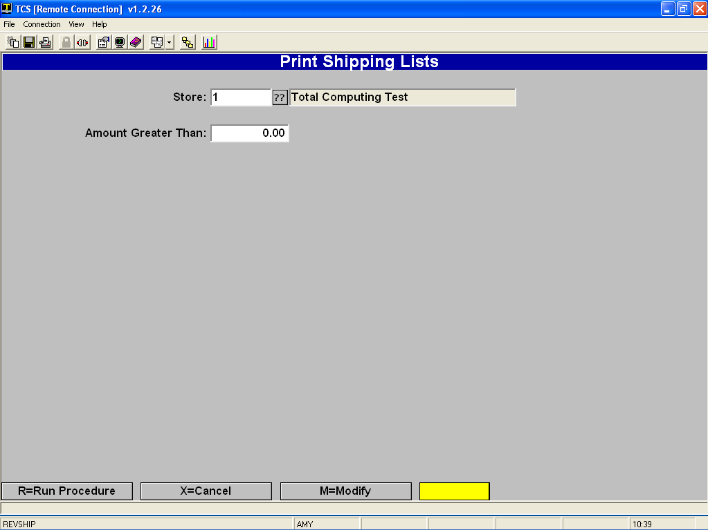
2. The `Store` field is automatically filled in with the default for the user. For a list of stores, enter `??`.
3. In the `Amount Greater Than` field, enter the minimum wholesale that you want to include. Books with a value less than this will not be included.
4. Enter `R` to run the process, `X` to Cancel, or `M` to Modify.
5. On the next page is a sample suggested shipping list.

## Creating a Shipping List (TX-4-2-2-2)

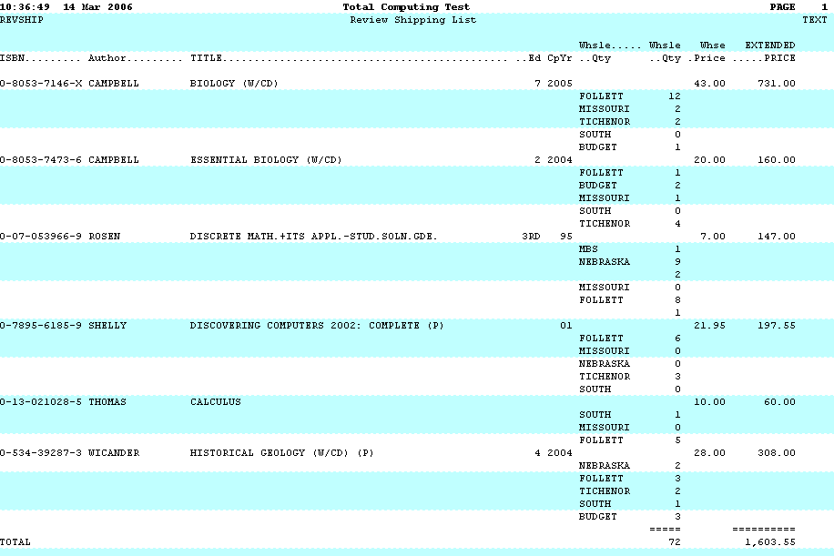

To create a shipping list by wholesaler, follow these steps.

1. From the **Smart Text** Main Menu, select the `Returns` option followed by the `Sales to Wholesalers` option, the `Wholesale from Buyback` option, and the `Create Shipping List` option to get to the Create Shipping Lists screen **(TX-4-2-2-2)**.
   - 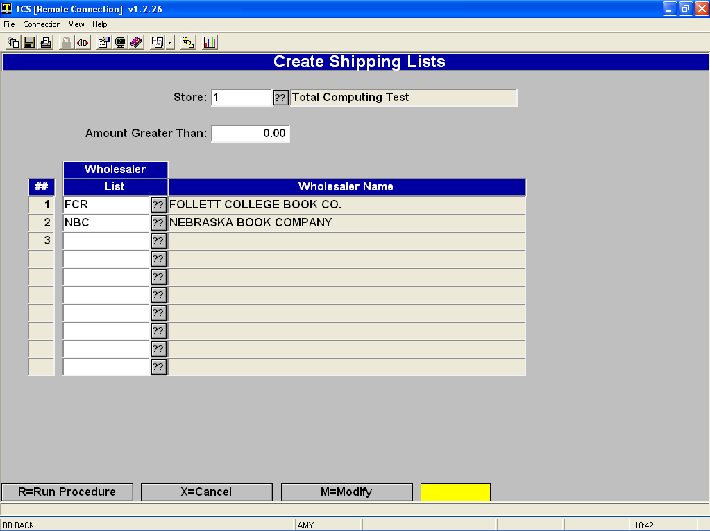
2. The `Store` field is automatically filled in with the default for the user. For a list of stores, enter `??`.
3. In the `Amount Greater Than` field, enter the minimum wholesale that you want to include. Books with a value less than this will not be included.
4. In the `Wholesaler List` field, enter the wholesaler(s) you desire to ship books to.
5. Enter “R” to run the process, `X` to Cancel, or `M` to Modify.
6. If you choose to run the process, you will get the following screen. Click “Continue” to exit.

## Shipping List Maintenance (TX-4-2-2-3)

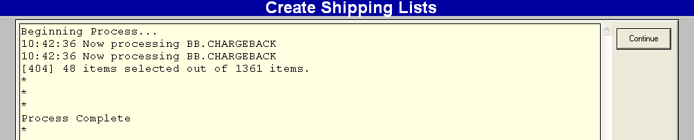

To make changes to a wholesaler shipping list, follow these steps.

1. From the **Smart Text** Main Menu, select the `Returns` option followed by the `Sales to Wholesalers` option, the `Wholesale from Buyback` option and the `Shipping List Maintenance` option to get to the Shipping List Maintenance screen **(TX-4-2-2-3)**.
   - 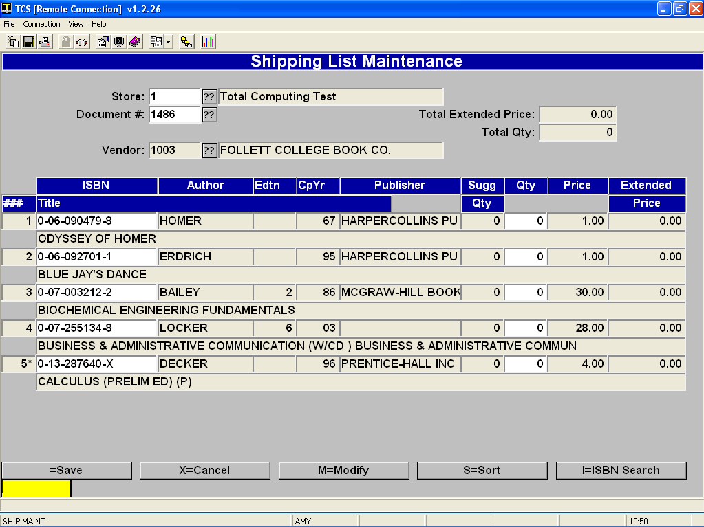
2. The `Store` field is automatically filled in with the default for the user. a list of stores, enter `??`.
3. In the `Document` field, enter the document number you’d like to modify. If you are creating a new document, enter “.”. For a list of documents, enter “??”.
4. In the `ISBN` field, enter the ISBN of the book you’re returning. If you’re not sure of the ISBN, you can search for the book by entering “\[AUTHOR\]/”, “\[TITLE\]” or “\[AUTHOR\]/\[TITLE\]”.
5. In the `Qty` field, enter the quantity of books you’d like to sell to the wholesaler.
6. From the command line, enter “S” to sort by author or title, or enter “I” to search by ISBN.
7. Press \[ENTER\] to save the shipping list, `X` to Cancel, or `M` to Modify.

### Printing a Shipping Document (TX-4-2-2-4)

To print a shipping document for the books you are selling to a wholesaler, follow these steps.

1. From the **Smart Text** Main Menu, select the `Returns` option followed by the `Sales to Wholesalers` option, the `Wholesale from Buyback` option, and the `Print Shipping Document` option to get to the Chargebacks Not Credited screen **(TX-4-2-2-4)**.

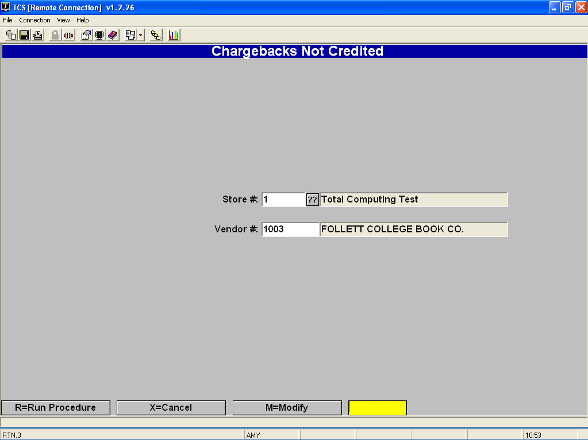

1. The `Store` field is automatically filled in with the default for the user. For a list of stores, enter `??`.
2. In the `Vendor` field, enter the wholesaler to which you are returning books.
3. Enter `R` to run the process, `X` to Cancel, or `M` to Modify.

## Printing a Buyback Document (TX-4-2-2-21)

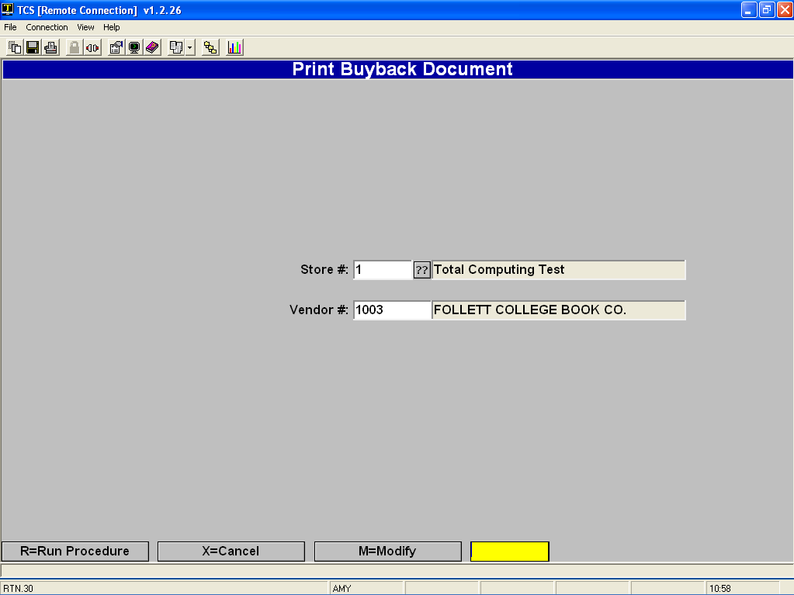

## Reprinting a Shipping Document (TX-4-2-2-22)

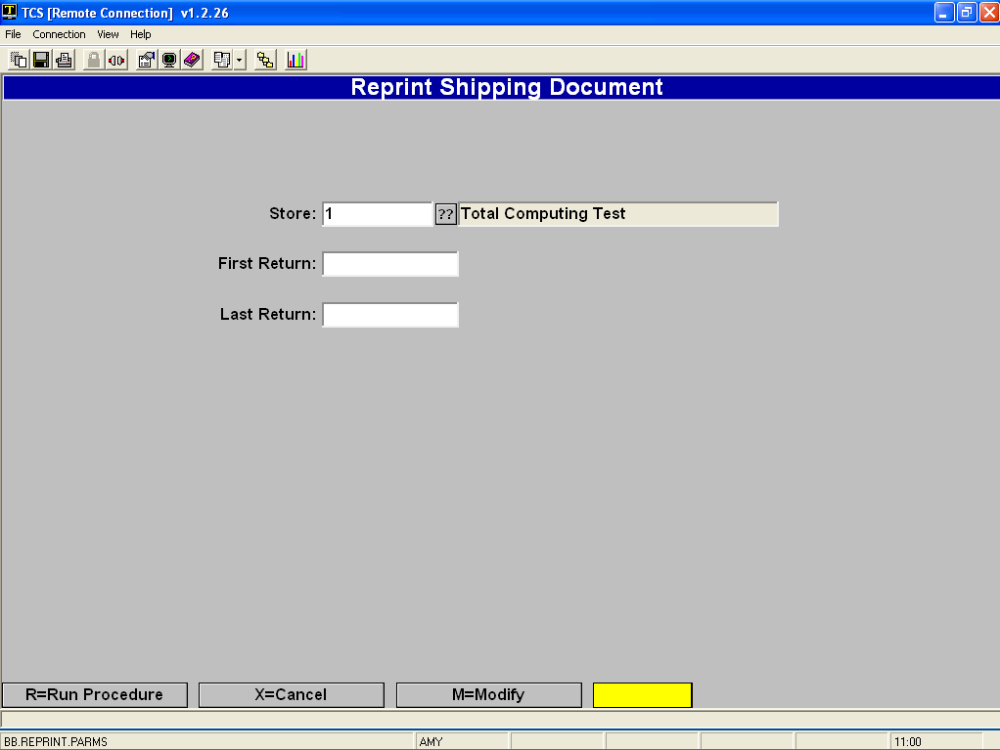

## Reprinting a Buyback Document (TX-4-2-2-23)

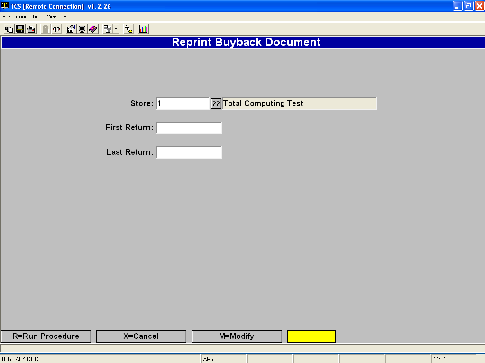

## Printing a Non-Returnable Stock Worklist (TX-4-2-3)

To print a list of items you have on hand that cannot be sold to wholesalers, follow these steps.

1. From the **Smart Text** Main Menu, select the `Returns` option, followed by the `Sales to Wholesalers` option and the `Non-Returnable Stock Worklist` option to get to the Non-Returnable Stock Worklist screen **(TX-4-2-3)**.
   - 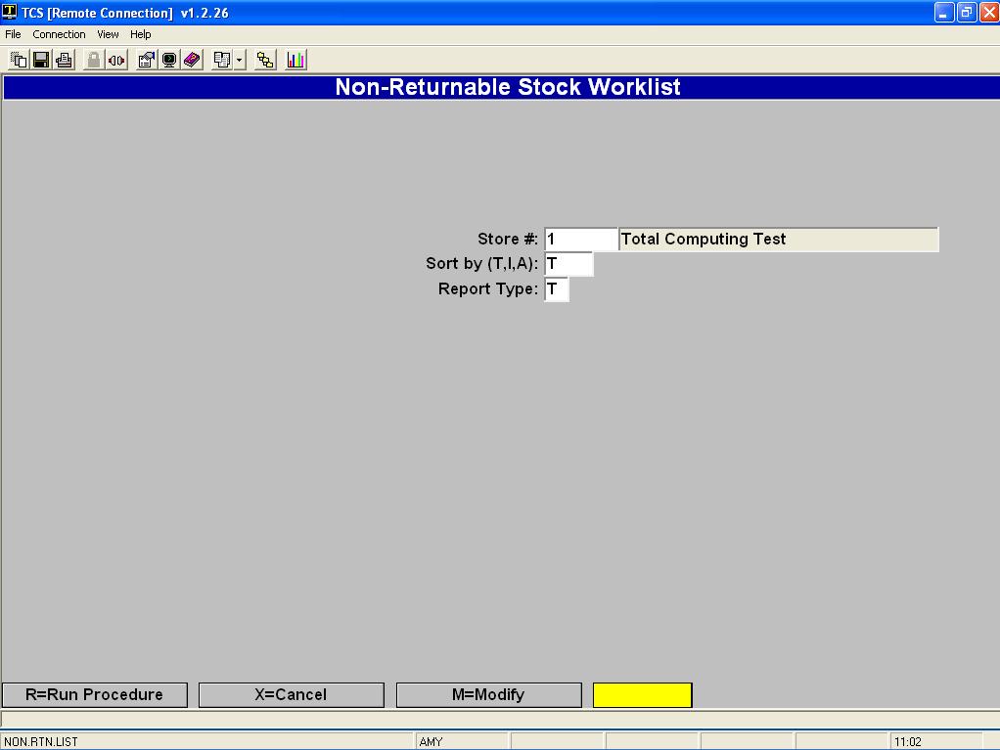
2. In the `Store` field, enter the store number for which you wish to print the report. For a list of stores, enter “??”.
3. In the `Sort by (T,I,A)` field, enter “T” to sort by title, “I” to sort by ISBN, or “A” to sort by author.
4. In the `Report Type` field, enter “W” for a wholesale report, “Z” for a zero value report, or “T” for a total report.
5. Enter “R” to print the report, `X` to Cancel, or `M` to Modify.
6. On the next page is a sample non-returnable stock worklist.

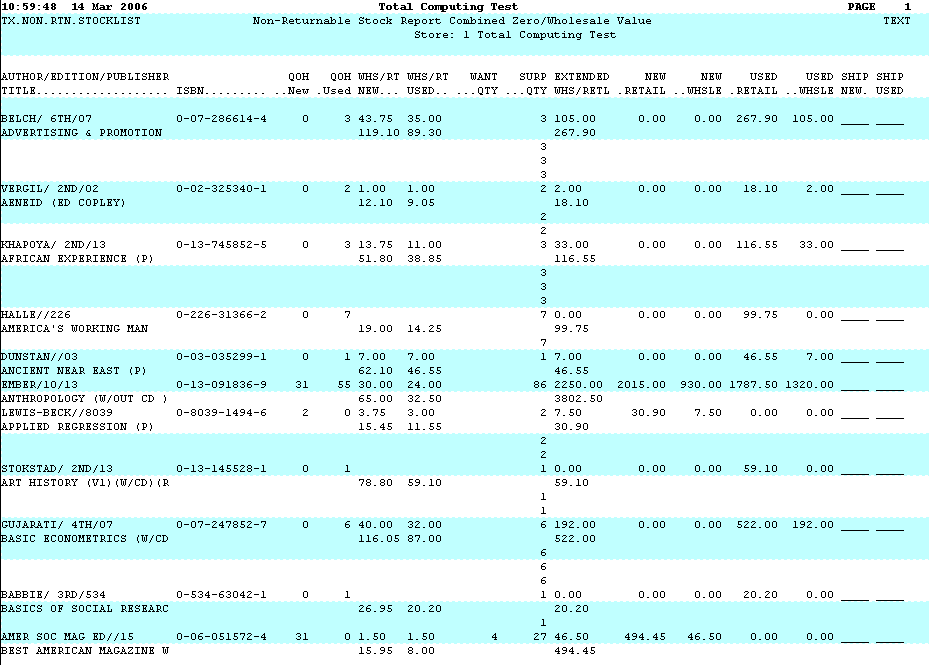

## Buyback Process (TX-5)

The **Smart Text** system contains extensive functions dealing with the buyback of textbooks. These functions are covered in this section.

## Setting Up Buyback Parameters (TX-5-1)

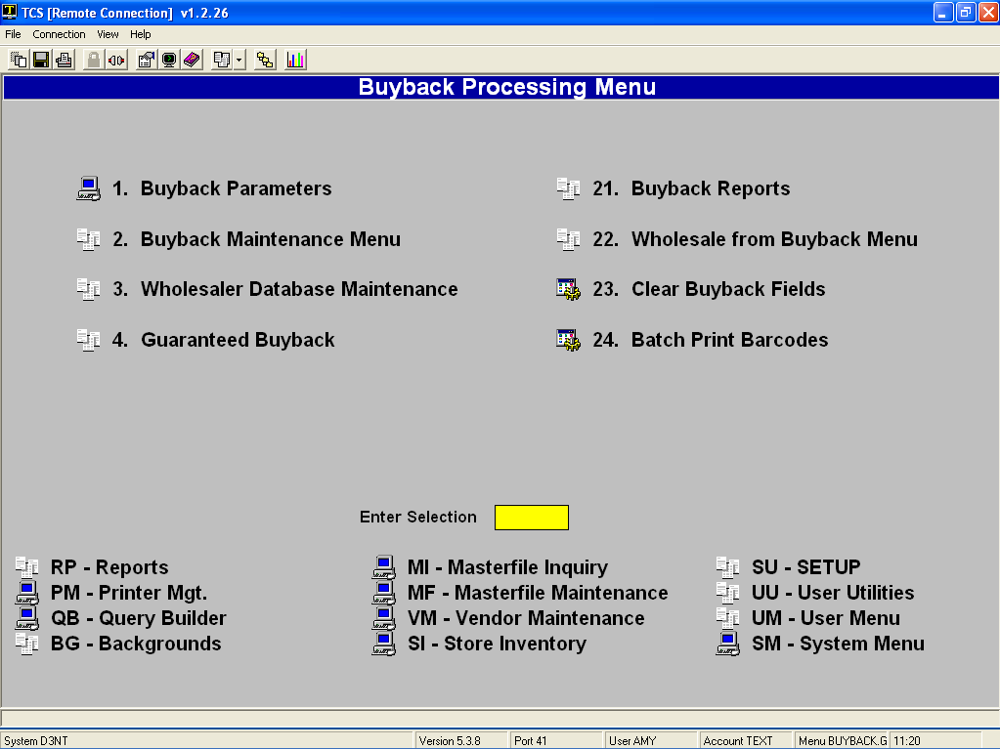

Before textbooks can be bought back, you must set up the buyback parameters. To do so, follow these steps.

1. From any menu in the **Smart Text** system, enter “SU” to get to the `Textbook Setup` menu. Select the `Parameters` option followed by the `Buyback Parameters` option to get to the Buyback Parameters screen **(TX-5-1)**.
   - 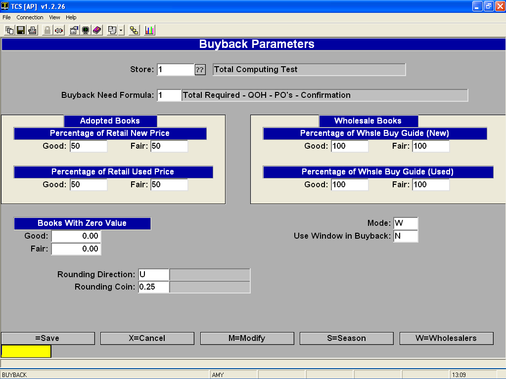
2. In the `Store` field, enter the store number for which you wish to set up buyback parameters. You can see a list of stores by entering “??”.
3. In the `Buyback Need Formula` field, enter the buyback need formula you wish to use. For information on need formulas, see the section Buyback Need Formula Maintenance contained in this document.
4. Under the `Percentage of Retail New Price` heading, in the `Good` field, enter the percentage of the retail price that you would like to pay for books that were bought new and brought back in good condition. In the `Fair` field, enter the percentage of the retail price that you would like to pay for books that were bought new and brought back in fair condition.
5. Under the `Percentage of Retail Used Price` heading, in the `Good` field, enter the percentage of the retail price that you would like to pay for books that were bought used and brought back in good condition. In the `Fair` field, enter the percentage of the retail price that you would like to pay for books that were bought used and brought back in fair condition.
6. Under the `Percentage of Whsle Buy Guide (New)` heading, in the `Good` field, enter the percentage of the wholesale price that you would like to pay for books that were bought new and brought back in good condition. In the `Fair` field, enter the percentage of the wholesale price that you would like to pay for books that were bought used and brought back in fair condition.
7. Under the `Percentage of Whsle Buy Guide (Used)` heading, in the `Good` field, enter the percentage of the wholesale price that you would like to pay for books that were bought used and brought back in good condition. In the `Fair` field, enter the percentage of the wholesale price that you would like to pay for books that were bought used and brought back in fair condition.
8. Under the `Books with Zero Value` heading, in the `Good` field, enter the amount that you would like to pay for books in good condition with zero value. In the `Fair` field, enter the amount that you would like to pay for books in fair condition with zero value.
9.  In the `Rounding Direction` field, enter the direction that you would like to round the buyback prices. Enter “U” for up, “D” for down, or “N” for nearest.
10. In the `Rounding Coin` field, enter the coin that you would like to use in rounding the buyback prices. You can enter “05”, “10”, “25”, “50”, or “100”.
11. In the `Mode` field, enter “G” for a general buy mode or “W” for a wholesale buy mode.
12.  In the `Use Window in Buyback` field, enter a “Y” if you would like to display new and used condition prices or if you would like the ability to override the price at buyback. Otherwise, enter an “N”.
13. In the `Default Condition` field, enter “G” to set good as the default condition, or “F” to set fair as the default condition.
    - 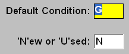
14. In the `‘N’ew or ‘U’sed` field, enter “N” to set new as default, “U” to set used as default. If you select “N” buyback will be calculated as ½ of retail new. If you select “U”, buyback will be calculated as ½ of retail used.
15. Enter “`S`” or click on “`Season`” to get to the buyback season maintenance screen. It is covered in the section Buyback Season Maintenance contained in this document.
16. Enter “`W`” or click on “`Wholesalers`” to get to the Buyback Wholesaler Setup screen.
    - 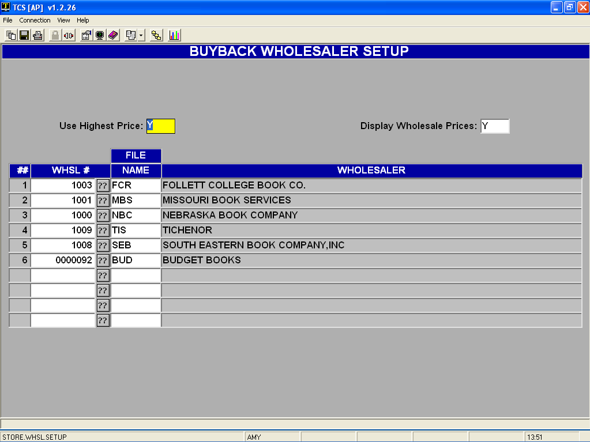
17. In the `Use Highest Price` field, enter “Y” if you want to the system to bring in the wholesaler with the highest price. Leave blank or “N” to use wholesaler in order as listed below in the screen. If a “Y” is entered into the system and there are two or more wholesalers with the same highest price, the wholesaler listed first will be chosen. If the system reaches the buyback limit for the wholesaler with the highest price, it will then move the the next highest priced wholesaler.
18. In the `Display Wholesale Prices` field, enter “Y” if you want the system to display wholesalers and their prices and let you choose which one. Enter “N” if you want the system to select the wholesaler.
19. In the `WHSL #` field, enter in the vendor number associated with your first wholesaler. In the `File Name` field, enter in the file name for the wholesale buying guide. Only a valid file name can be entered. The `Wholesaler` field will automatically populate with the name associated with the wholesale buying guide file name. Continue with all wholesale guides that you will be loading.
20. Press \[ENTER\] to save the changes, `X` to Cancel, or `M` to Modify.

## Buyback Maintenance Menu (TX-5-2)

The Buyback Maintenance menu contains functions dealing with buyback parameters for individual items.

### Buyback Flag Maint (TX-5-2-1)

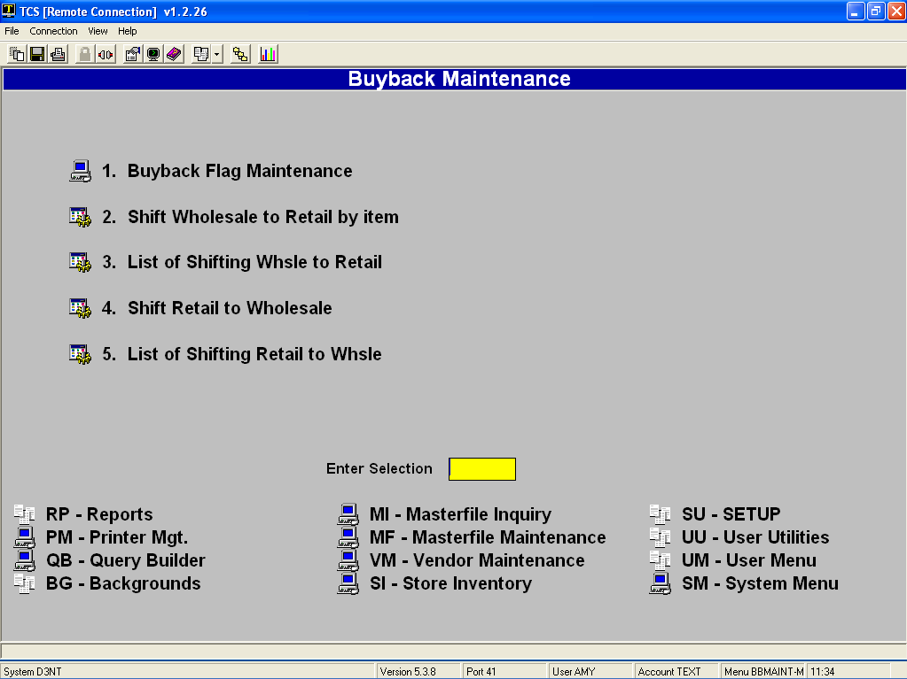

To set up buyback information for a book in your database, follow these steps.

1. From the Textbook Maintenance screen command line, enter “B” to get to the Buyback Flag Maintenance screen **(TX-5-2-1)**.
   - 
2. In the `Store` field, enter the store number for which you wish to set up buyback. This will also automatically populate the `Store, Store Name, and BB Need` fields in the upper right side of the screen.
3. In the `ISBN` field, enter the book for which you wish to set up buyback.
4. The `Title, Author, Ed Notes, Edition, and Copyright` fields will automatically populate with the information from the master file for the ISBN that you entered.
5. The `Open to Buy` field will automatically populate with the open to buy quantity for this ISBN.
6. In the `Value Code` field, enter the buyback value code for the book. For a list of codes, enter “??”. For more information on value codes, see the section Setting Up Buyback Value Codes in the **Smart Text** Setup Guide.
7. In the `Limit Flag` field, enter the buyback limit flag for the book. Enter “U” to buy unlimited copies of the book, `X` to exclude the book from buyback, “G” for guaranteed buyback, or “Y” for a limit.
8. The `Estimated BB` field will automatically populate with the total estimated buyback amount taken from all adoptions entered in terms attached to the current buyback season.
9. In the `R/W` field, enter “R” for retail or enter “W” for wholesale.
10. In the `Limit` field, enter the total quantity of copies (your limit) you will buy back at this value.
11. The `Bought` field will automatically populate with the quantity of books purchased at buyback at this value.
12. In the `Price` field, enter the price you would like to purchase this title for. If you enter a price in this field, it will override the calculated price that is based on the set buyback parameters. For more information on buyback parameters, see the section Buyback Parameters in the **Smart Text** Setup Guide.
13. In the `Wholesaler` field, enter the vendor number of the wholesaler you would like to purchase textbooks for at buyback. The `Wholesaler Name` field will automatically populate with the name of the wholesaler entered.
14. In the `Book Flag Code` field, enter any book flag codes that you would like to set up for this title. For more information on book flag codes, see the section Textbook Flags in the **Smart Text** Setup Guide.
15. Press \[ENTER\] to save the changes, `X` to cancel, or `M` to Modify.

### Shifting Wholesale Buyback to Retail (TX-5-2-2)

If you buy back books at wholesale price, and later decide that you wish to sell them in your store rather than to wholesalers, you can shift the books to retail buyback. To do so, follow these steps.

1. From the **Smart Text** Main Menu, select the `Buyback` option followed by the `Buyback Maintenance Menu` option and the `Shift Wholesale to Retail by Item` option to get to the Shift Wholesale to Retail by Item screen **(TX-5-2-2)**.
   - 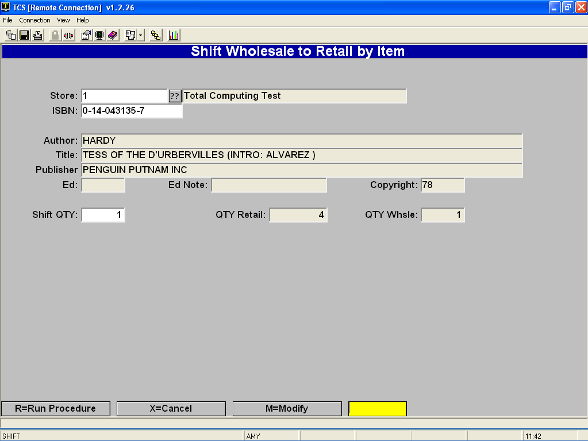
2. The `Store` field is automatically filled in with the default for the user. For a list of stores, enter `??`.
3. In the `ISBN` field, enter the ISBN for the book you want to shift. If you aren’t sure of the ISBN, you can search for the book by entering “\[TITLE\]”, “\[AUTHOR\]\\”, or “\[AUTHOR\]\\\[TITLE\]”.
4. After you have entered the ISBN, the information fields about the book are filled in. The `QTY Retail` field contains the number of books that have been bought back for retail, and the `QTY Whsle` field contains the number of books that have been bought back for wholesale.
5. In the `Shift QTY` field, enter the number of books you want to shift from wholesale to retail. This quantity must be less than or equal to the value in the `QTY Whsle` field.
6. Enter “R” to shift the books from wholesale to retail, `X` to Cancel, or `M` to Modify.

### Printing a List of Wholesale to Retail Shifted Buybacks (TX-5-2-3)

To print a list of items that have been shifted from wholesale to retail buyback, follow these steps.

1. From the **Smart Text** Main Menu, select the `Buyback` option followed by the `Buyback Maintenance Menu` option and the `List of Shifting Whsle to Retail` option to get to the List of Shifting Wholesale to Retail screen **(TX-5-2-3)**.
   - 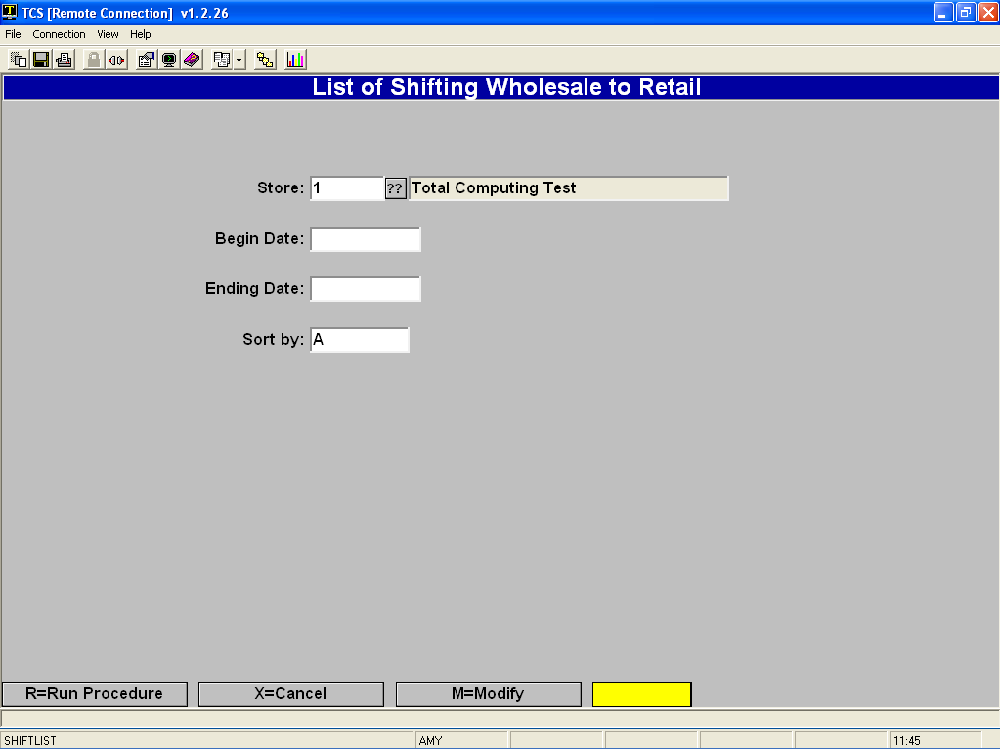
2. The `Store` field is automatically filled in with the default for the user. For a list of stores, enter `??`.
3. In the `Begin Date` field, enter the beginning of the date range, or leave the field blank.
4. In the `Ending Date` field, enter the ending of the date range, or leave the field blank.
5. In the `Sort By` field, enter the method by which you want to sort the list. Enter “A” for Author, “T” for Title, “P” for publisher, or “I” for ISBN.
6. Enter “R” to print the list, `X` to Cancel, or `M` to Modify.
7. On the next page is a sample report.

### Shifting Retail Buyback to Wholesale (TX-5-2-4)
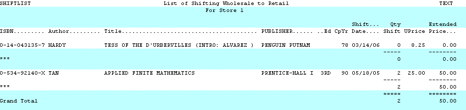

If you buy back books at retail price, and later decide that you wish to sell them to wholesalers, you can shift the books to wholesale buyback. To do so, follow these steps.

1. From the **Smart Text** Main Menu, select the `Buyback` option followed by the `Buyback Maintenance Menu` option and the `Shift Retail to Wholesale` option to get to the Shift Retail to Wholesale screen **(TX-5-2-4)**.
   - 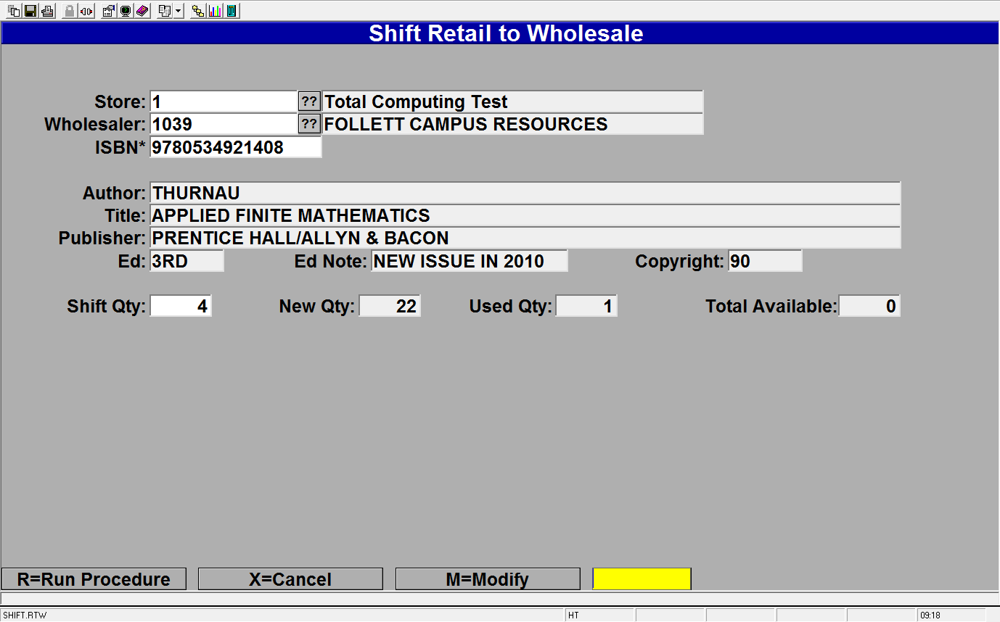
2. The `Store` field is automatically filled in with the default for the user. For a list of stores, enter `??`.
3. In the `ISBN` field, enter the ISBN for the book you want to shift. If you aren’t sure of the ISBN, you can search for the book by entering “\[TITLE\]”, “\[AUTHOR\]\\”, or “\[AUTHOR\]\\\[TITLE\]”.
4. After you have entered the ISBN, the information fields about the book are filled in. The `QTY Retail` field contains the number of books that have been bought back for retail, and the `QTY Whsle` field contains the number of books that have been bought back for wholesale.
5. In the `Shift QTY` field, enter the number of books you want to shift from retail to wholesale. This quantity must be less than or equal to the value in the `QTY Retail` field.
6. Enter “R” to shift the books from retail to wholesale, `X` to Cancel, or `M` to Modify.

### Printing a List of Retail to Wholesale Shifted Buybacks (TX-5-2-5)

To print a list of items that have been shifted from retail to wholesale buyback, follow these steps.

1. From the **Smart Text** Main Menu, select the `Buyback` option followed by the `Buyback Maintenance Menu` option and the `List of Shifting Retail to Wholesale` option to get to the List of Shifting Retail to Wholesale screen **(TX-5-2-5)**.
   - 
2. The `Store` field is automatically filled in with the default for the user. For a list of stores, enter `??`.
3. In the `Begin Date` field, enter the beginning of the date range, or leave the field blank.
4. n the `Ending Date` field, enter the ending of the date range, or leave the field blank.
5. In the `Sort By` field, enter the method by which you want to sort the list. Enter “A” for Author, “T” for Title, “P” for publisher, or “I” for ISBN.
6. Enter “R” to print the list, `X` to Cancel, or `M` to Modify.

## Wholesaler Database Maintenance Menu (TX-5-3)
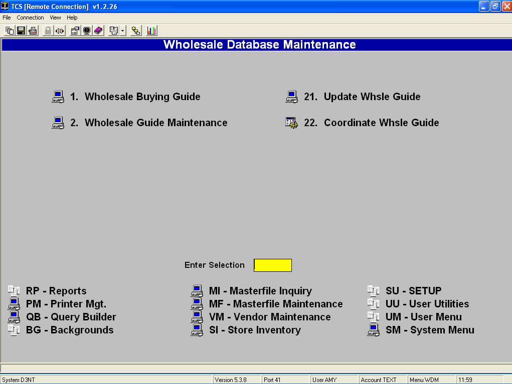 

The Wholesaler Database Maintenance Menu **(TX-5-3)** contains functions dealing with your wholesale buying guide(s). This section covers these functions.

### Search the Wholesale Buying Guide (TX-5-3-1)

To find information about a book by searching in the wholesale buying guide, follow these steps. This will search the default guide that is set up for your store as listed in the general store parameters.

1. From the **Smart Text** Main Menu, select the `Buyback` option followed by the `Wholesaler Database Maintenance` option and the `Wholesale Buying Guide` option to get to the Wholesale Buying Guide screen **(TX-5-3-1)**.
   - 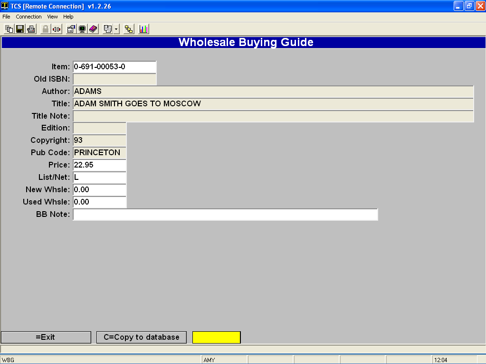
2. In the `Item` field, enter the ISBN of the book you’re searching for. If you don’t know the ISBN, you can find it by entering “\[TITLE\]”, “\[AUTHOR\]\\”, or “\[AUTHOR\]\\\[TITLE\]”.
3. After you have entered the ISBN, information about the item will display. If you wish to copy the item to your local database, enter “C”. You will be taken to the Master File Maintenance screen (see Master File Maintenance in this document.) If you do not wish to copy the item to your local database, press \[ENTER\] to exit the record.

### Changing Wholesale Prices (TX-5-3-2)

If you wish to change the wholesale price listed in the wholesale buying guide for an item, follow these steps.

1.  From the **Smart Text** Main Menu, select the `Buyback` option followed by the `Wholesaler Database Maintenance` option and the `Wholesale Guide Maintenance` option to get to the Wholesale Guide Maintenance screen **(TX-5-3-2)**.
   - 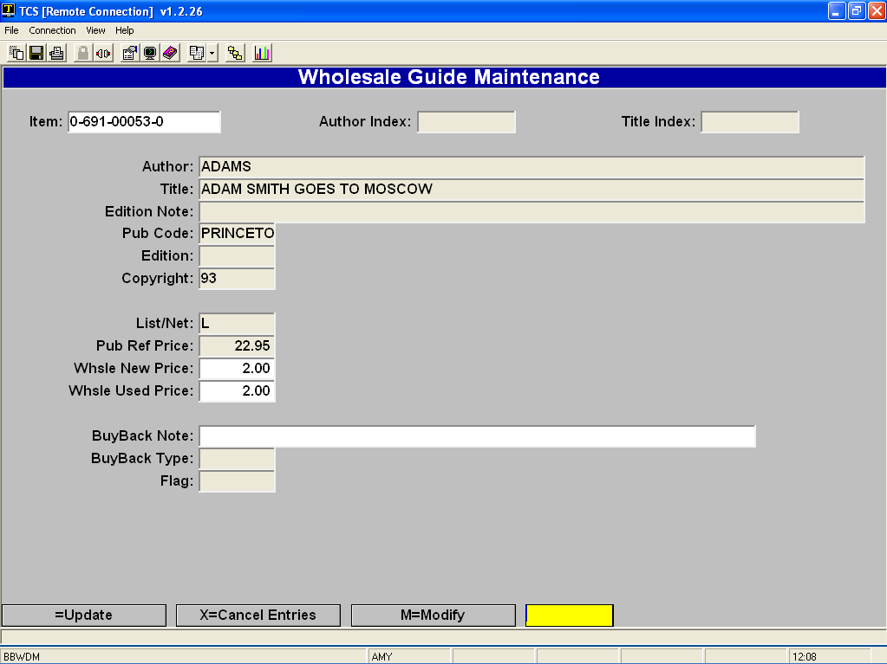
2. In the `Item` field, enter the ISBN of the book you’re searching for. If you don’t know the ISBN, you can find it by entering “\[TITLE\]”, “\[AUTHOR\]\\”, or “\[AUTHOR\]\\\[TITLE\]”.
3. After you have entered the ISBN, information about the item displays. Enter `M` to get to the `Whsle New Price` field.
4. In the `Whsle New Price` field, enter the wholesale price for new books.
5. In the `Whsle Used Price` field, enter the wholesale price for used books.
6. In the `Buyback Note` field, enter any information that you would like to see when you enter this item at buyback.
7. Press \[ENTER\] to update the prices for the item, or `X` to cancel.

### Updating the Wholesale Guide (TX-5-3-21)

If you wish to install a new wholesale guide on your system, follow these steps. If you would like assistance in loading your wholesale guides, please contact Total Computing Solutions.

1. From the **Smart Text** Main Menu, select the `Buyback` option followed by the `Wholesaler Database Maintenance` menu and the `Update Whsle Guide` option to get to the Wholesale Buying Guide Update screen **(TX-5-3-21)**.
   - 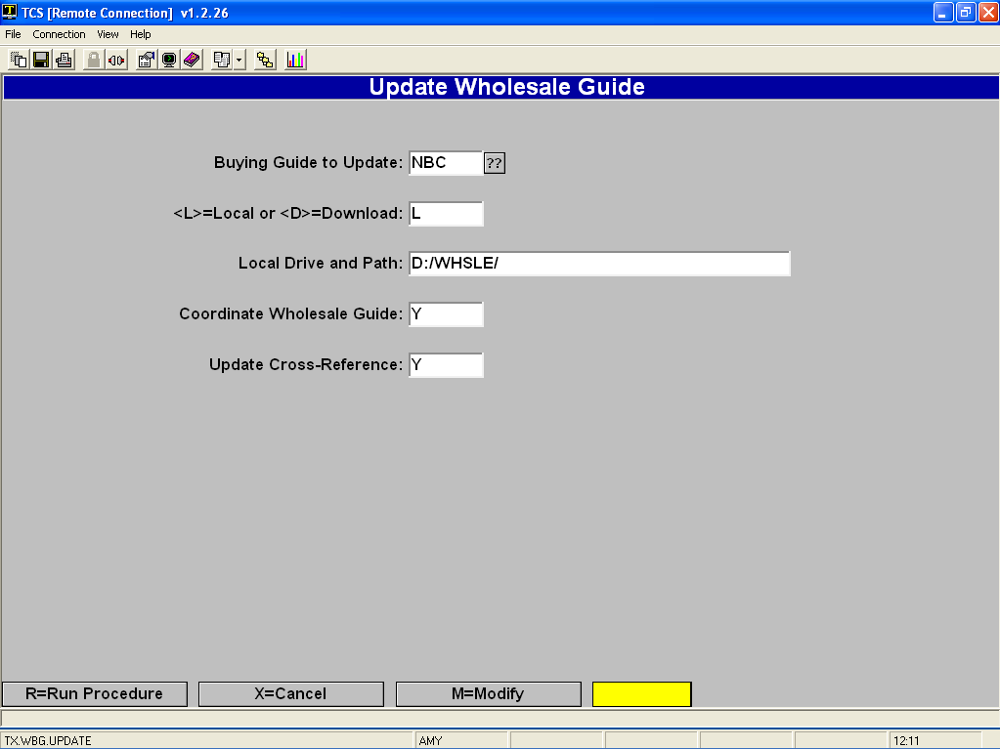
2. In the `Buying Guide to Update` field, the buying guide you would like to update. For a list of buying guides, enter “??”.
3. In the `<L>=Local or <D>=Download` field, enter “L” to update the buying guide from a local file, or “D” to download the new buying guide from the internet.
4. In the `Local Drive and Path` field, enter the drive letter and path where the wholesale buying guide can be found, for example “D:/WHSLE/” if the wholesale buying guide is located on the D drive in the WHSLE directory. Using the forward slash is important; a backslash will not work.
5. In the `Coordinate Wholesale Guide` field, enter a “Y” if you want to automatically coordinate the wholesale guide. For more information on coordinating the wholesale guide, see section Coordinating the Wholesale Guide in this document. If you don’t wish to coordinate at this time, enter “N”.
6. In the `Update Cross-Reference` field, enter “Y” if you want to rebuild your Title cross-reference and your Author cross-reference. For more information on rebuilding cross-reference see Rebuilding the Title Cross-Reference and Rebuilding the Author Cross-Reference in the **Smart Text** Setup Guide. If you don’t wish to rebuild at this time, enter “N”.
7. Enter “R” to update the wholesale buying guide, `X` to Cancel, or `M` to Modify.

### Coordinating the Wholesale Guide (TX-5-3-22)

If you wish to update your master file with information from a new wholesale guide, you should coordinate the wholesale guide by following these steps.

1. From the **Smart Text** Main Menu, select the `Buyback` option followed by the `Wholesaler Database Maintenance` option and the `Coordinate Whsle Guide` option to get to the Coordinate Wholesale Guide screen **(TX-5-3-22)**.
   - 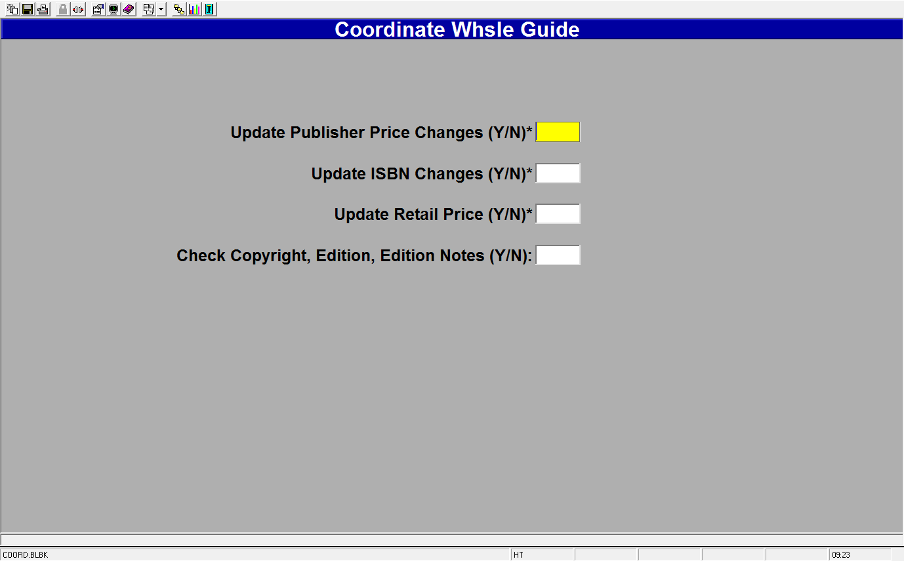
2. In the `Update Publisher Price Changes` option, enter “Y” if you want to change the publisher prices in your master file to match the new wholesale buying guide. Otherwise, enter “N”.
3. In the `Update ISBN Changes` option, enter “Y” if you want to change the ISBNs in your master file to match the new wholesale buying guide. Otherwise, enter “N”.
4. In the `Update Retail Price` option, enter “Y” if you want to change the retail prices in your master file to match the new wholesale buying guide. Otherwise, enter “N”.
5. In the `Check Copyright, Edition, Edition Notes` option, enter “Y” if you want to change the copyright, edition, edition notes in your master file to match the new wholesale buying guide. Otherwise, enter “N”.
6. Enter “R” to coordinate the guide, `X` to Cancel, or `M` to Modify.

## Guaranteed Buyback Menu (TX-5-4)

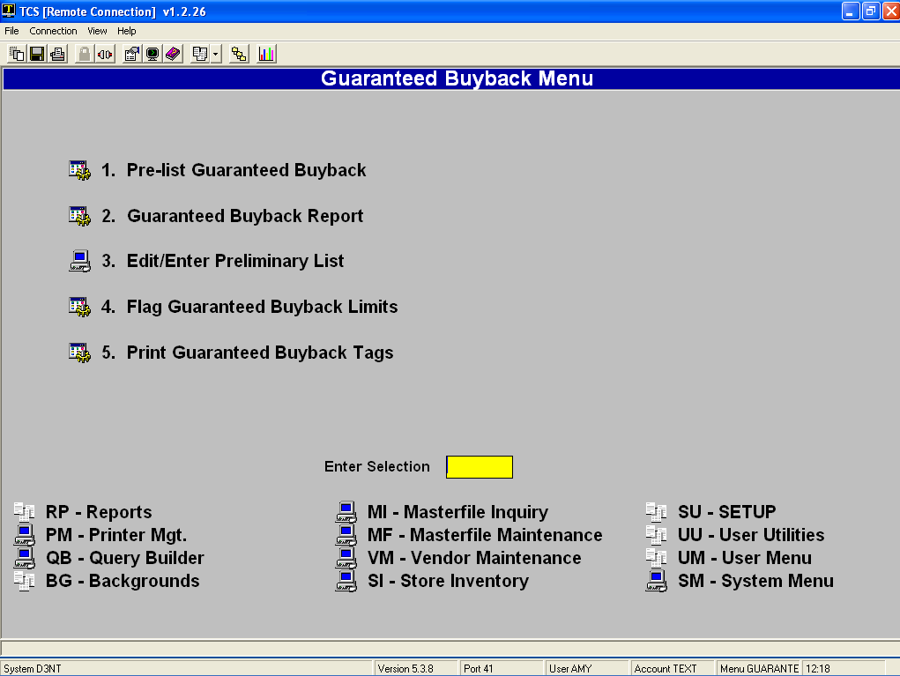 

If your store uses guaranteed buyback, you will need to use the functions in the Guaranteed Buyback Menu **(TX-5-4)**. These functions are covered in this section.Pre-List Guaranteed Buyback (TX-5-4-1)

To generate a list of the books for which you will be offering guaranteed buyback, follow these steps.

1. From the **Smart Text** Main Menu, select the `Buyback` option followed by the `Guaranteed Buyback` option and the `Pre-list Guaranteed Buyback` option to get to the Create Guaranteed Buyback Preliminary List screen **(TX-5-4-1)**.
   - 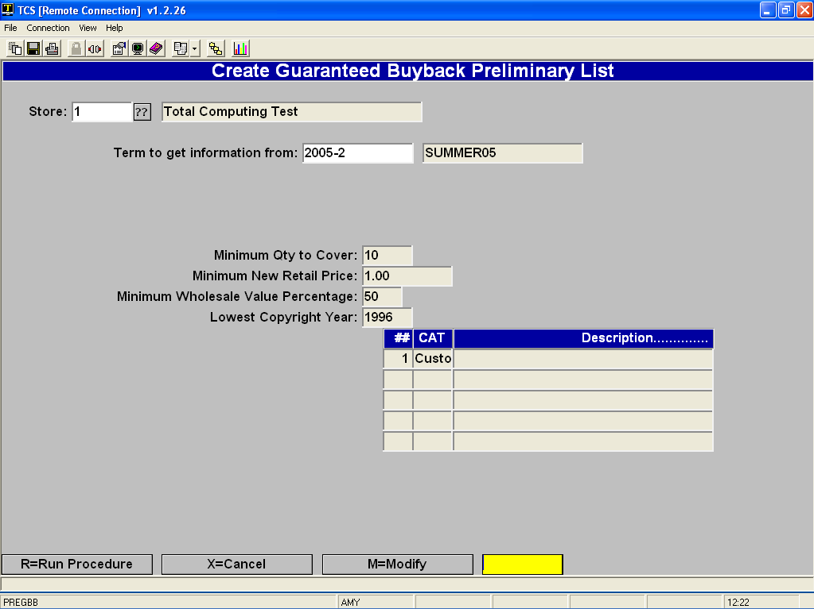
2. The `Store` field is automatically filled in with the default for the user. For a list of stores, enter `??`.
3. In the `Term To Get Information From` field, enter the term for which you want to generate a list.
4. Enter “R” to create the list, `X` to Cancel, or `M` to Modify.

### Guaranteed Buyback Report (TX-5-4-2)

To print a report of the books that you have bought back through guaranteed buyback, follow these steps.

1. From the **Smart Text** Main Menu, select the `Buyback` option followed by the `Guaranteed Buyback` option and the `Guaranteed Buyback Report` option to get to the Guaranteed Buyback Report screen **(TX-5-4-2)**.
   - 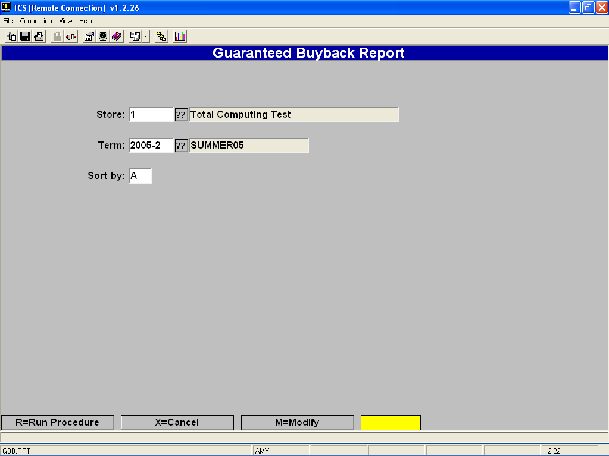
2. The `Store` field is automatically filled in with the default for the user. For a list of stores, enter `??`.
3. The `Term` field is automatically filled in with the default for the store. For a list of terms, enter “??”.
4. In the `Sort By` field, enter “A” to sort by Author, “T” to sort by Title, “I” to sort by ISBN, or “P” to sort by publisher.
5. Enter “R” to run the report, `X` to Cancel, or `M` to Modify.
6. Below is a sample report.
   - 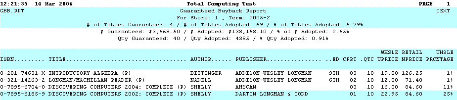 

### Editing the Preliminary Guaranteed Buyback List (TX-5-4-3)

The **Smart Text** system allows you to manually create a list of books that will be included in the guaranteed buyback program or edit the list that has been created by the system. To do so, follow these steps.

1. From the **Smart Text** Main Menu, select the `Buyback` option followed by the `Guaranteed Buyback` option and the `Edit/Enter Preliminary List` option to get to the Enter Preliminary Guaranteed Buyback List screen **(TX-5-4-3)**.
   - 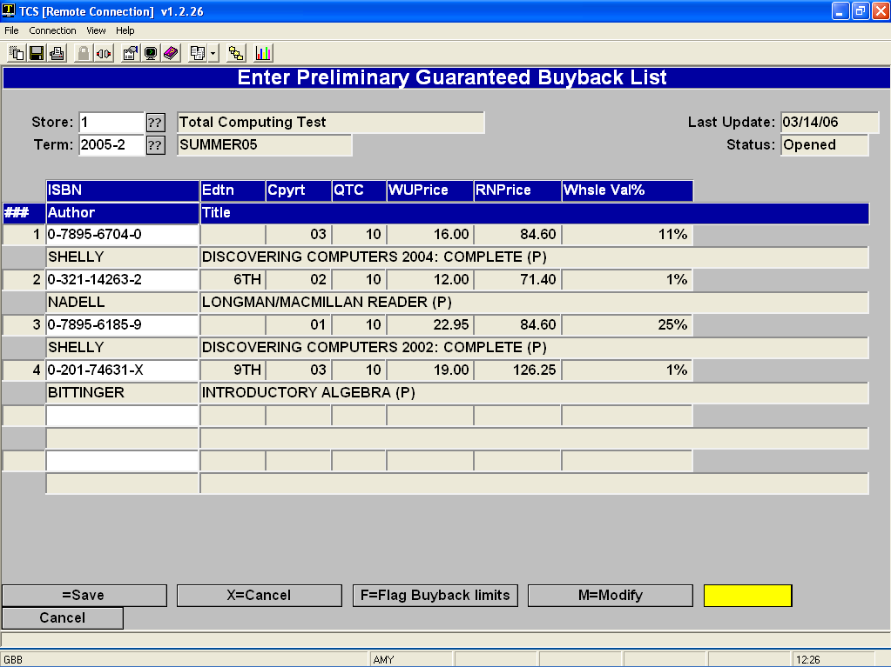 
2. The `Store` field is automatically filled in with the default for the user. For a list of stores, enter `??`.
3. In the `Term` field, enter the term for which you want to edit the preliminary list. For a list of terms, enter “??”.
4. In the `ISBN` fields, enter the ISBNs for the books you want to include. If you aren’t sure of the ISBNs, you can search for them by entering “\[TITLE\]”, “\[AUTHOR\]\\”, or “\[AUTHOR\]\\\[TITLE\]”. To remove a book from the list, enter a single space in the field containing that book’s ISBN.
5. Press \[ENTER\] to save the list, `X` to Cancel, or `M` to Modify.

### Flag Guaranteed Buyback Parameters (TX-5-4-4)

To change the buyback limit flag to “G” for the books that are on your guaranteed buyback list, follow these steps.

1.  From the **Smart Text** Main Menu, select the `Buyback` option followed by the `Guaranteed Buyback` option and the `Flag Guaranteed Buyback Parameters` option to get to the Flag Guaranteed Buyback Limits screen **(TX-5-4-4)**.
   - 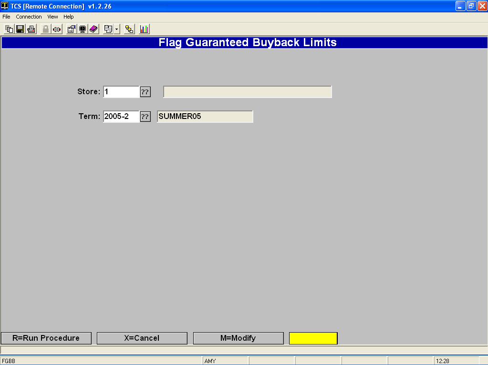 
2. In the `Store` field, enter the store for which you want to set the flags. For a list of stores, enter “??”.
3. In the `Term` field, enter the term for which you want to set the flags. For a list of terms, enter “??”.
4. Enter “R” to set the flags, `X` to Cancel, or `M` to Modify.

### Printing Guaranteed Buyback Tags (TX-5-4-5)

To print tags for the guaranteed buyback items, follow these steps.

1.  From the **Smart Text** Main Menu, select the `Buyback` option followed by the `Guaranteed Buyback` option and the `Print Guaranteed Buyback Tags` option to get to the Print Guaranteed Buyback Tags screen **(TX-5-4-5)**.
   - 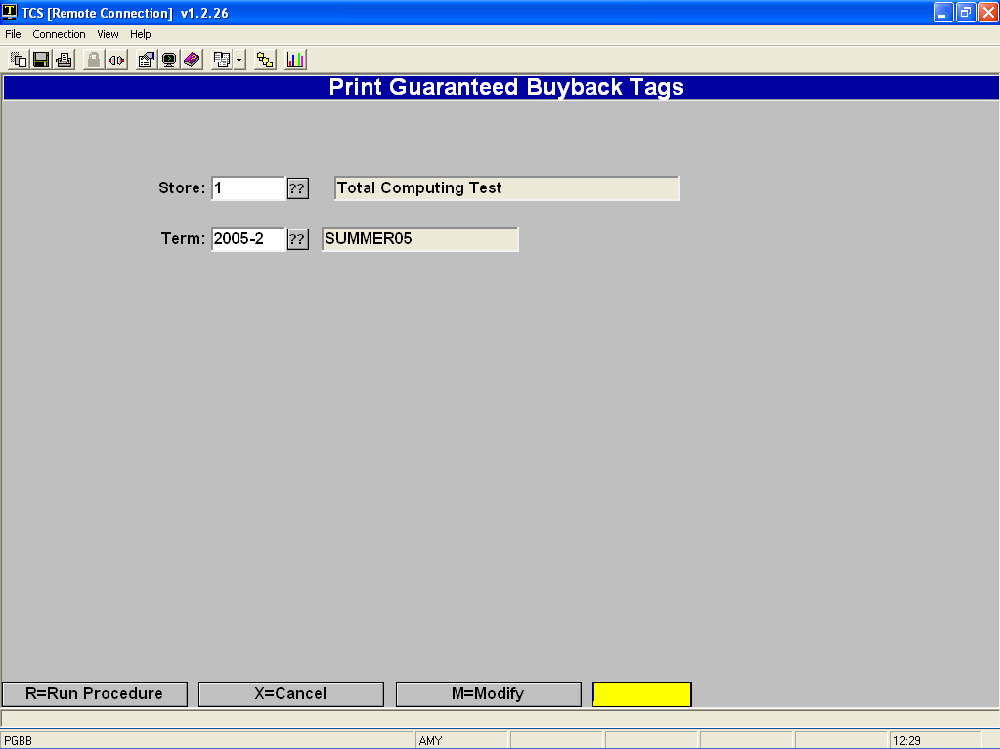 
2. In the `Store` field, enter the store for which you want to set the flags. For a list of stores, enter “??”.
3. In the `Term` field, enter the term for which you want to set the flags. For a list of terms, enter “??”.
4. Enter “R” to print the tags, `X` to Cancel, or `M` to Modify.

## Buyback Reports (TX-5-21)

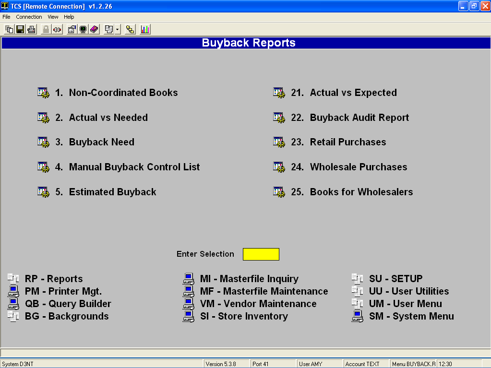

The Buyback Reports Menu **(TX-5-21)** contains reports that list information about buybacks. This section covers these reports.Non-Coordinated Books Report (TX-5-21-1)

The Non-Coordinated Books Report displays books in the master file that have not been coordinated to the current wholesale buying guide.

1. From the **Smart Text** Main Menu, select the `Buyback` option followed by the `Buyback Reports` option and the `Non-Coordinated Books` option to get to the Non-Coordinated Books screen **(TX-5-21-1)**.
   - 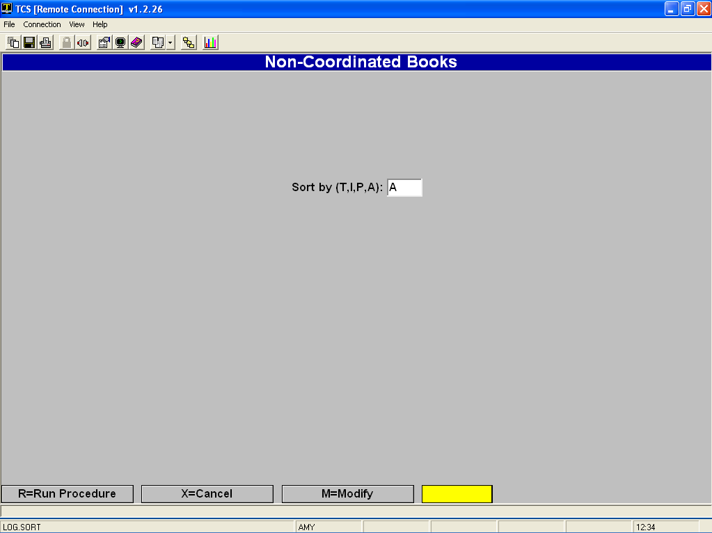
2. In the `Sort By` field, enter “T” to sort by Title, “I” to sort by ISBN, “P” to sort by publisher, or “A” to sort by author.
3. Enter “R” to run the report, `X` to Cancel, or `M` to Modify.
4. Below is a sample report.

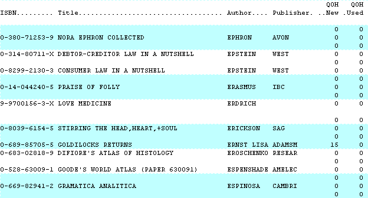

### Actual vs. Needed Buyback Report (TX-5-21-2)

The Actual vs. Needed report displays information about the number of books you need to buy back compared to the number of books you have purchased.

1. From the **Smart Text** Main Menu, select the `Buyback` option followed by the `Buyback Reports` option and the `Actual vs. Needed` option to get to the Actual vs. Need screen **(TX-5-21-2)**.
   -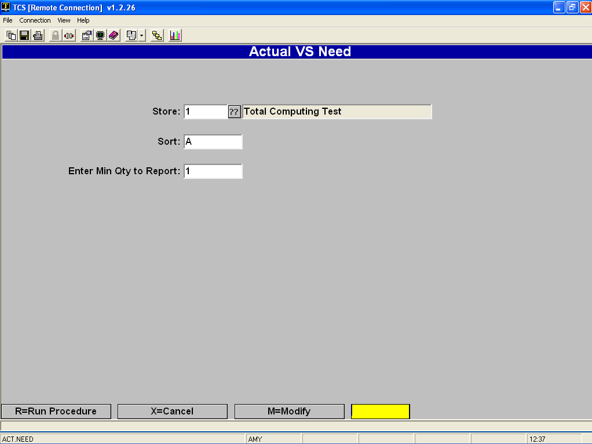
2. The `Store` field is automatically filled in with the default for the user. For a list of stores, enter `??`.
3. In the `Sort` field, enter “A” to sort by author, “T” to sort by title, “I” to sort by ISBN, or “P” to sort by publisher.
4. In the `Enter Min Qty to Report` field, enter the minimum quantity needed for books that should be on the report.
5. Enter “R” to print the report, `X` to Cancel, or `M` to Modify.
6. Below is a sample report.
   - 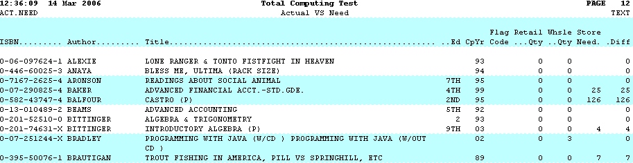 

### Buyback Need Report (TX-5-21-3)

The Buyback Need report displays information about the books you need to buyback.

1. From the **Smart Text** Main Menu, select the `Buyback` option followed by the `Buyback Reports` option and the `Buyback Need` option to get to the Buyback Need screen **(TX-5-21-3)**.
   - 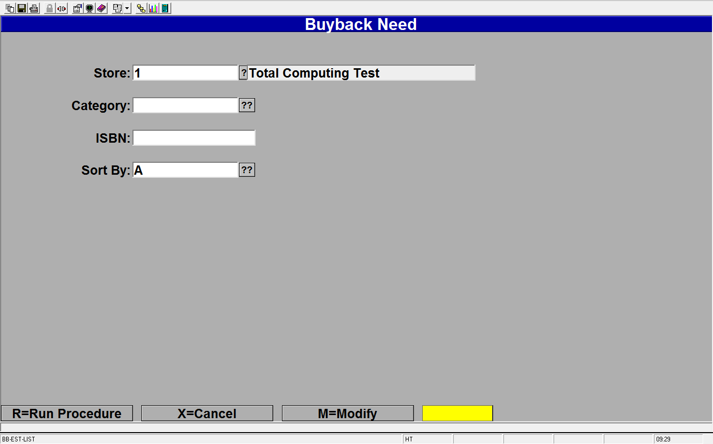
2. The `Store` field is automatically filled in with the default for the user. For a list of stores, enter `??`.
3. In the `Category` field, enter a category to narrow the results buy, or leave the field blank.
4. In the `ISBN` field, enter an ISBN you would like buyback information about, or leave the field blank.
5. In the `Sort By` field, enter “A” to sort by author, “T” to sort by title, “I” to sort by ISBN, or “P” to sort by publisher.
6. Enter “R” to print the report, `X` to Cancel, or `M` to Modify.
7. Below is a sample report.

### Manual Buyback Control List (TX-5-21-4)

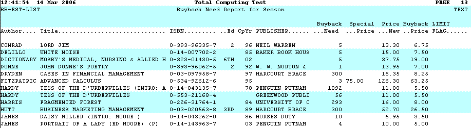

To print a report that contains information on manual buybacks, follow these steps.

1. From the **Smart Text** Main Menu, select the `Buyback` option followed by the `Buyback Reports` option and the `Manual Buyback Control List` option to get to the Manual Buyback Control List screen **(TX-5-21-4)**.
   - 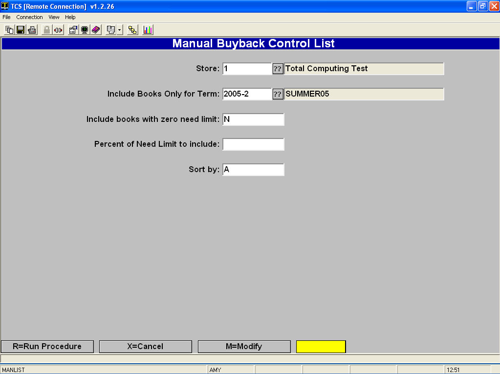
2. The `Store` field is automatically filled in with the default for the user. For a list of stores, enter `??`.
3. In the `Include Books Only for Term` field, enter the term for which you want to print the list. For a list of terms, enter “??”.
4. In the `Include Books With Zero Need Limit` field, enter “Y” if you wish to include books with a zero need limit. Otherwise, enter “N”.
5. In the `Percent of Need Limit to Include` field, enter the percentage of the need limit that you want to be able to buy back manually.
6. In the Sort By field, enter “A” to sort the list by author, or “T” to sort by title.
7. Enter “R” to print the list, `X` to Cancel, or `M` to Modify.

### Estimated Buyback List (TX-5-21-5)

To print a list of the estimated buyback values you have entered, follow these steps.

1. From the **Smart Text** Main Menu, select the `Buyback` option, followed by the `Buyback Repor``ts` option and the `Estimated Buyback List` option to get to the Estimated Buyback List screen **(TX-5-21-5)**.
   - 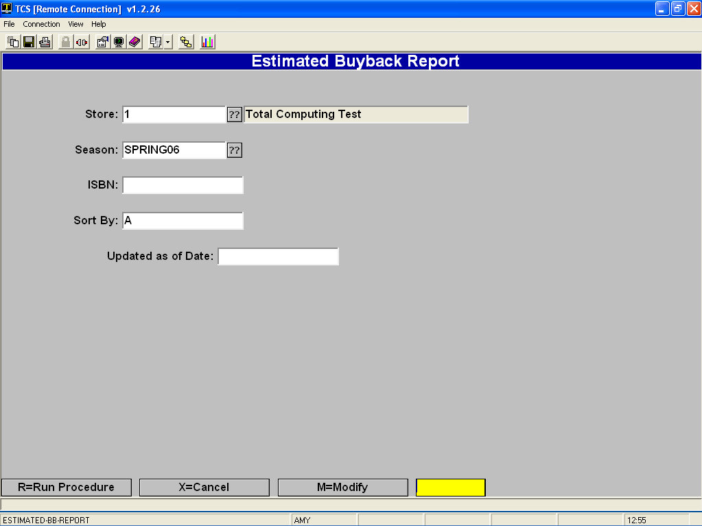
2. The `Store` field is automatically filled in with the default for the user. For a list of stores, enter `??`.
3. In the `Season` field, enter the buyback season for which you wish to report. For a list of seasons, enter “??”.
4. In the `ISBN` field, enter the ISBN for the book you want to select. If you aren't sure of the ISBN, you can search for it by entering "\[AUTHOR\]/", "\[TITLE\]", or "\[AUTHOR\]/\[TITLE.\]" Leave the ISBN field blank if you want to include all titles.
5. In the `Sort By` field, enter “A” to sort the report by author, “T” to sort by title, “I” to sort by ISBN, or “P” to sort by publisher.
6. In the `Updated as of Date` field, enter the date for which you want to see changes since. You can leave the field blank to include all dates.
7. Enter “R” to print the report, `X` to Cancel, or `M` to Modify.
8. Below is a sample report.
   - 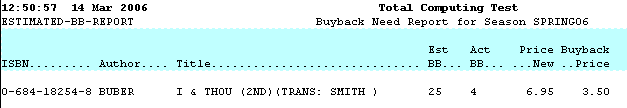

### Actual vs. Expected Report (TX-5-21-21)

The Actual vs. Expected Buyback Report prints information about the actual number of books you have bought back compared to the number of books you expected to buy.

1. From the **Smart Text** Main Menu, select the `Buyback` option followed by the `Buyback Reports` option and the `Actual vs. Expected` option to get to the Actual vs. Expected screen **(TX-5-21-21)**.
   - 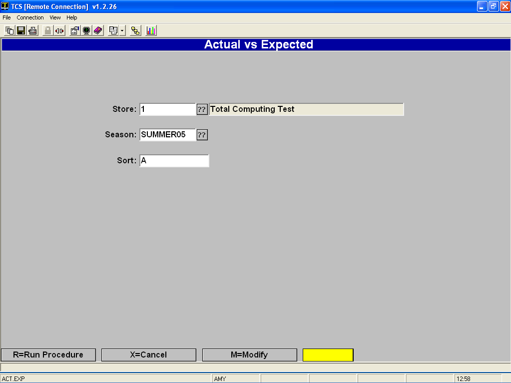 
2. In the `Season` field, enter the buyback season for which you want to print the report. For a list of seasons, enter “??”.
3. In the `Sort` field, enter “A” to sort by author, “T” to sort by title, “I” to sort by ISBN, or “P” to sort by publisher.
4. Enter “R” to print the report, `X` to Cancel, or `M` to Modify.
5. Below is a sample report.
   - 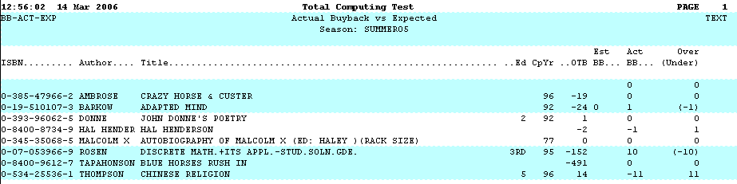

### Buyback Audit Report (TX-5-21-22)

To print a report to assist in auditing your buyback purchases, follow these steps.

1. From the **Smart Text** Main Menu, select the `Buyback` option followed by the `Buyback Reports` option and the `Buyback Audit Report` option to get to the Audit Report Parameters screen **(TX-5-21-22)**.
   - 
2. In the `Store` field, enter the store number for which you wish to print the report. For a list of stores, enter “??”.
3. In the `Start Date` field, enter the earliest date you wish to include. If you don’t wish to limit the report by date, leave this field blank.
4. In the `End Date` field, enter the latest date you wish to include. If you don’t wish to limit by date, leave this field blank.
5. In the `Start Tran` field, enter the first transaction number you wish to include. If you don’t wish to limit by transaction number, leave this field blank.
6. In the `End Tran` field, enter the last transaction number you wish to include. If you don’t wish to limit by transaction number, leave this field blank.
7. In the `Buyer Code` field, enter the buyer code for which you wish to print the report. If you don’t wish to limit by buyer, leave this field blank.
8. In the `Student ID` field, enter the student ID for which you wish to print the report. If you don’t wish to limit by student, leave this field blank.
9. In the fields under the `Sort Criteria` heading, enter a number between 1 and 5, with one being the most important sort criteria.
10. Enter “R” to run the report, `X` to Cancel, or `M` to Modify.
11. Below is a sample report.

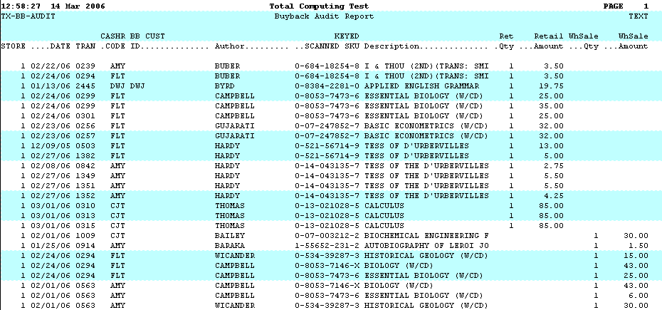

### Retail Purchases Report (TX-5-21-23)

The Retail Purchases report displays information on books that you have bought back at retail buyback price.

1.  From the **Smart Text** Main Menu, select the `Buyback` option followed by the `Buyback Reports` option and the `Retail Purchases` option to get to the Buyback Report Parameters screen **(TX-5-21-23)**.
   - 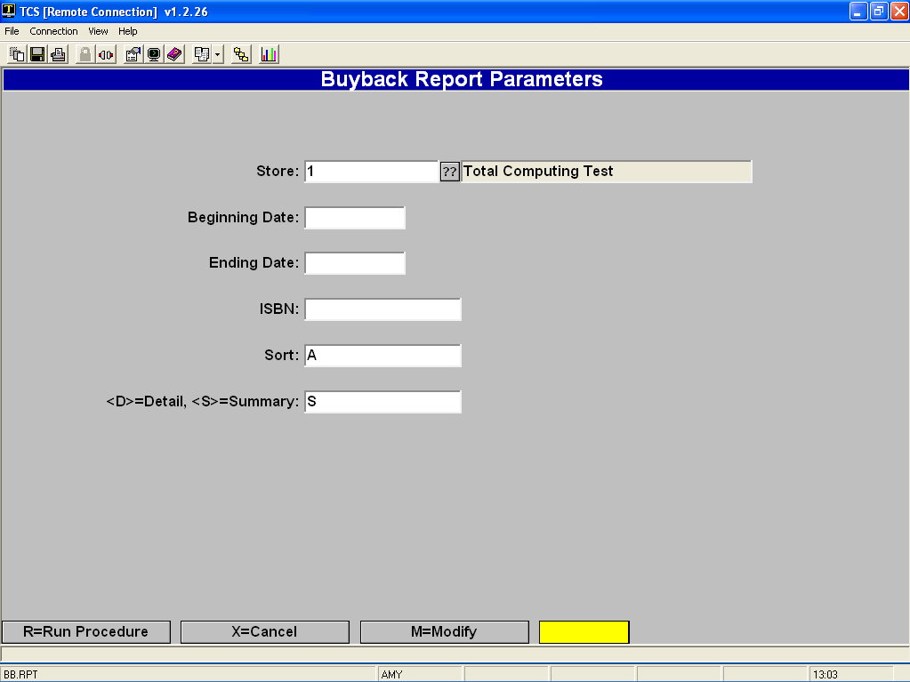
2. The `Store` field is automatically filled in with the default for the user. For a list of stores, enter `??`.
3. In the `Beginning Date` field, enter the earliest buyback date you wish to include on the report. If you don’t want to limit the report by date, leave this field blank.
4. In the `Ending Date` field, enter the latest buyback date you wish to include on the report. If you don’t want to limit the report by date, leave this field blank.
5. In the `ISBN` field, enter the ISBN for the book you want to select. If you aren't sure of the ISBN, you can search for it by entering "\[AUTHOR\]/", "\[TITLE\]", or "\[AUTHOR\]/\[TITLE\]". You can leave this field blank to include all titles.
6. In the `Sort` field, enter “P” to sort the report by publisher, “I” to sort it by ISBN, “T” to sort it by title, or “A” to sort it by author.
7. In the `<D>=Detail, <S>=Summary` field, enter “D” for a detailed report, or “S” for a summary report.
8. Enter “R” to print the report, `X` to Cancel, or `M` to Modify.
9. Below is a sample summary report.

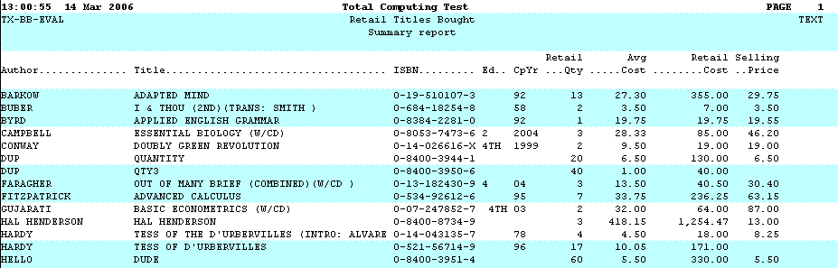

1. Below is a sample detail report.

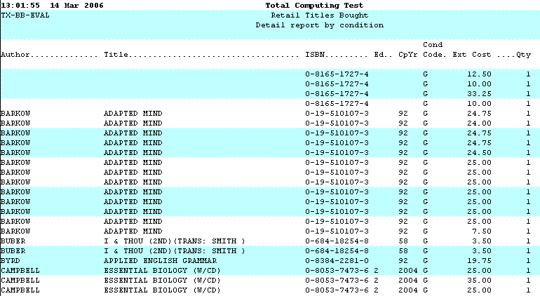

### Wholesale Purchases Report (TX-5-21-24)

The Wholesale Purchases report displays information on books that you have bought back at retail buyback price.

1. From the **Smart Text** Main Menu, select the `Buyback` option followed by the `Buyback Reports` option and the `Wholesale Purchases` option to get to the Buyback Report Parameters screen **(TX-5-21-24)**.
   - 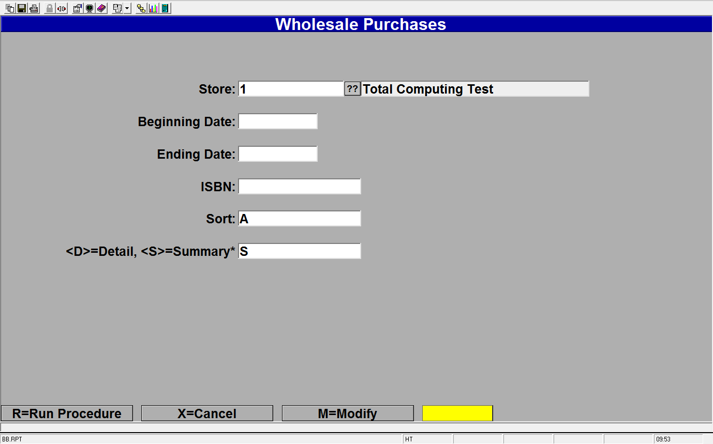
2. The `Store` field is automatically filled in with the default for the user. For a list of stores, enter `??`.
3. In the `Beginning Date` field, enter the earliest buyback date you wish to include on the report. If you don’t want to limit the report by date, leave this field blank.
4. In the `Ending Date` field, enter the latest buyback date you wish to include on the report. If you don’t want to limit the report by date, leave this field blank.
5. In the `ISBN` field, enter the ISBN for the book you want to select. If you aren't sure of the ISBN, you can search for it by entering "\[AUTHOR\]/", "\[TITLE\]", or "\[AUTHOR\]/\[TITLE\]". You can leave this field blank to include all titles.
6. In the `Sort` field, enter “P” to sort the report by publisher, “I” to sort it by ISBN, “T” to sort it by title, or “A” to sort it by author.
7. In the `<D>=Detail, <S>=Summary` field, enter “D” for a detailed report, or “S” for a summary report.
8. Enter “R” to print the report, `X` to Cancel, or `M` to Modify.
9. Below is a sample summary report.
   - 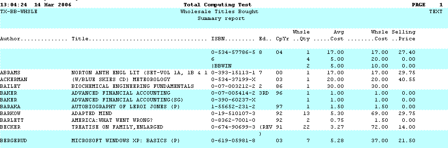
10. Below is a sample detail report.
    - 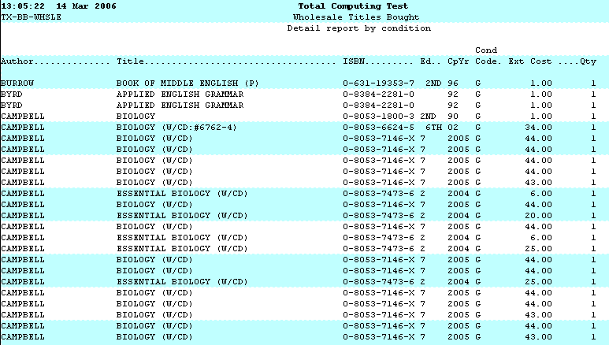

### Books for Wholesalers Report (TX-5-21-25)

To print a list of books you have bought for each wholesaler, follow these steps.

1. From the **Smart Text** Main Menu, select the `Buyback` option followed by the `Buyback Reports` option and the `Books for Wholesalers` option to get to the Buyback Report Parameters screen **(TX-5-21-25)**.
   - 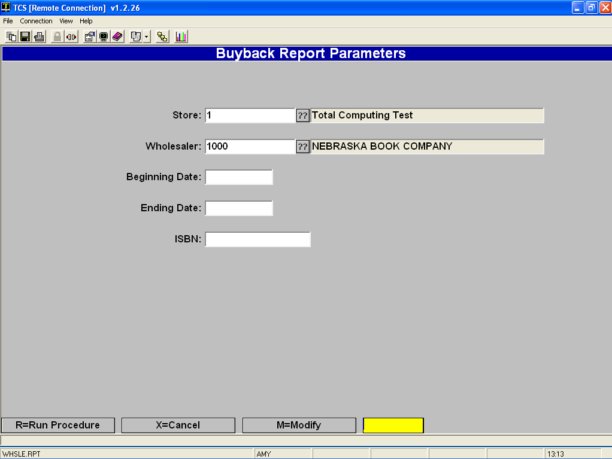
2. The `Store` field is automatically filled in with the default for the user. For a list of stores, enter `??`.
3. In the `Wholesaler` field, enter the wholesaler for which you want to run the report. For a list of wholesalers, enter “??”.
4. In the `Sort By` field enter (A)uthor, (T)itle, (I)SBN, (P)ublisher, or leave blank
5. In the `Beginning Date` field, enter the earliest buyback date you wish to include on the report. If you don’t want to limit the report by date, leave this field blank.
6. In the `Ending Date` field, enter the latest buyback date you wish to include on the report. If you don’t want to limit the report by date, leave this field blank.
7. In the `ISBN` field, enter the ISBN for the book you want to select. If you aren't sure of the ISBN, you can search for it by entering "\[AUTHOR\]/", "\[TITLE\]", or "\[AUTHOR\]/\[TITLE\]". You can leave this field blank to include all titles.
8. Enter “R” to print the report, `X` to Cancel, or `M` to Modify.

On the next page is a sample report.

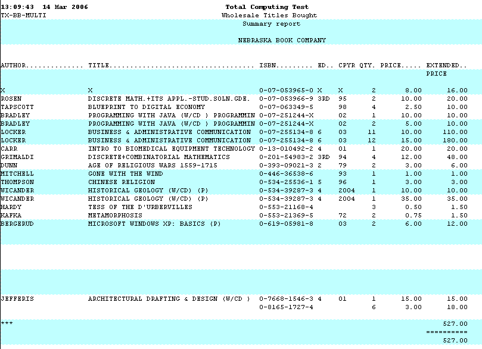

## Wholesale from Buyback (TX-5-22)

If you buy back books to sell to wholesalers, you can use the functions in the Wholesale from Buyback menu to ship them to the wholesaler. This information has been previously covered in this manual. See section (TX-4-2-2).

### Clearing Buyback Fields (TX-5-23)

To clear the buyback flags for all books in your system, follow these steps.

1. From the **Smart Text** Main Menu, select the `Buyback` option followed by the `Clear Buyback Fields` option to get to the Clear Fields screen **(TX-5-23)**.
   - 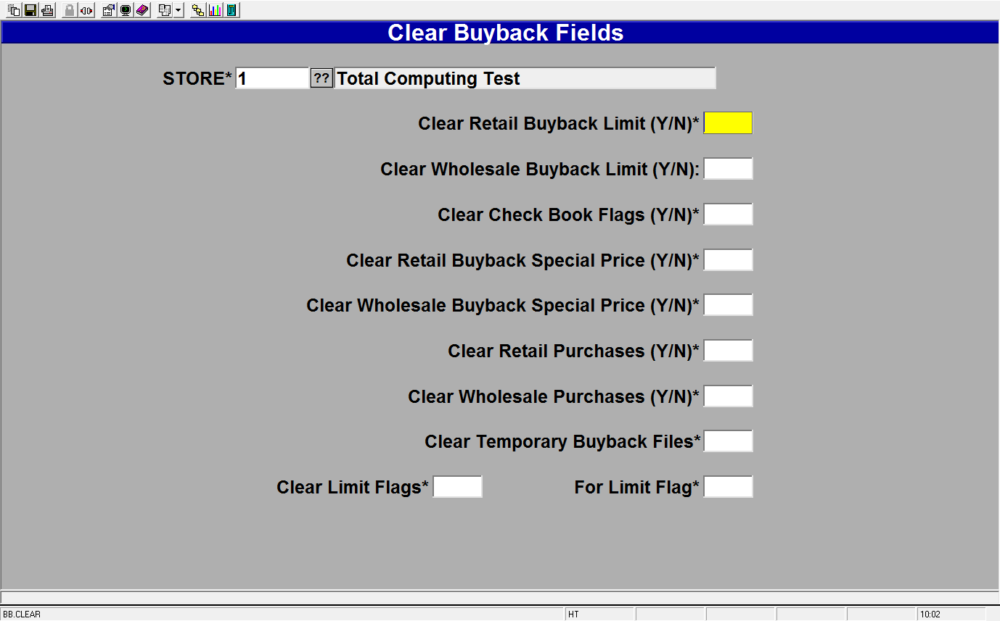  
2. In the `Clear Retail Buyback Limit` field, enter “Y” to clear the buyback limit field for all books. Enter “N” to leave the buyback limits.
3. In the `Clear Wholesale Buyback Limit` field, enter a “Y” to clear the wholesale limit for all books. Enter a “N” to leave the wholesale limits.
4. In the `Clear Check Book Flags` field, enter “Y” if you want to clear any check book flags. Otherwise, enter “N”.
5. In the `Clear Retail Buyback Special Price` field, enter “Y” if you want to remove any special buyback prices you have set. Otherwise, enter “N”.
6. In the `Clear Wholesale Buyback Special Price` field, enter “Y” if you want to remove any special wholesale buyback prices you have set. Otherwise, enter “N”.
7. In the `Clear Retail Purchases` field, enter “Y” if you want to clear the number of wholesale purchases you’ve made. Otherwise, enter “N”.
8. In the `Clear Wholesale Purchases` field, enter “Y” if you want to clear the number of wholesale purchases you’ve made. Otherwise, enter “N”.
9. In the `Clear Temporary Buyback Files` field, enter “Y” if you want to clear temporary files. Otherwise, enter “N”.
10. In the `Clear Limit Flag` field, enter “Y” if you want to clear buyback limits. Otherwise, enter “N”.
11. In the `For Limit Flag` field, enter “U”, `X`, “G”, “Y”, or “ALL” to clear the applicable flags.
12. Enter “R” to run the process, `X` to Cancel, or `M` to Modify.

## Batch Print Barcodes (TX-5-24)

If you wish to print barcode tags for all books that you bought back at retail price, follow these steps.

1. From the **Smart Text** Main Menu, select the `Buyback` option followed by the `Batch Print Barcodes` option to get to the Bath Print Barcodes screen **(TX-5-24)**.
   - 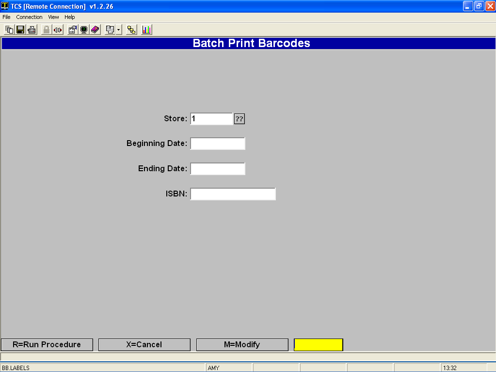
2. The `Store` field is automatically filled in with the default for the user. For a list of stores, enter `??`.
3. In the `Beginning Date` field, enter the earliest buyback date you wish to print tags for. If you don’t want to limit by date, leave this field blank.
4. In the `Ending Date` field, enter the latest buyback date you wish to print tags for. If you don’t want to limit by date, leave this field blank.
5. In the `ISBN` field, enter the ISBN for the book you want to select. If you aren't sure of the ISBN, you can search for it by entering "\[AUTHOR\]/", "\[TITLE\]", or "\[AUTHOR\]/\[TITLE\]". You can leave this field blank to include all titles.
6. Enter “R” to print barcode tags, `X` to Cancel, or `M` to Modify.+
7. If you choose to print tags, you will get the following screen.

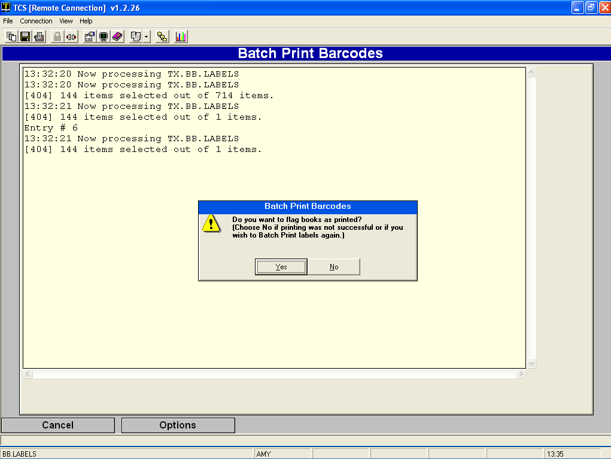

<PageFooter />
