# Buyback Setup

<PageHeader />

This tutorial is designed to walk you through a normal buyback setup process.

## Setup

The TCS SmartText buyback system is designed to use the Open To Buy (OTB) as a default quantity when making buying decisions. With this in mind, you will need to have your future term created with a BuyBack season assigned. This is maintained in TX-SU-1-2-1 (Term Maintenance), TX-SU-1-1 (Buyback Season Maintenance) and TX-SU-1-3 (Buyback Calendar Maintenance.

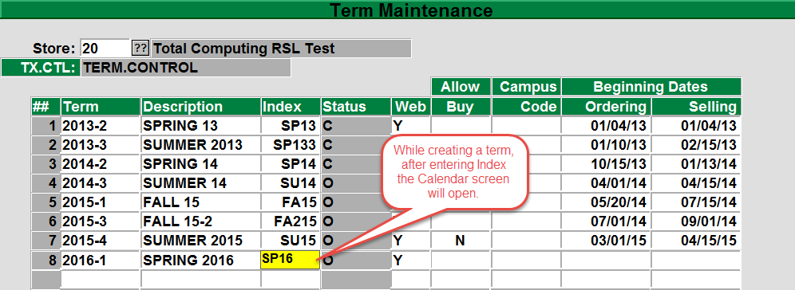_TX-SU-1_\-2-1

You may create and maintain your Term in Term Maintenance, if you are creating your term then after you enter the Index the system will open the Calendar Maintenance window as seen below.

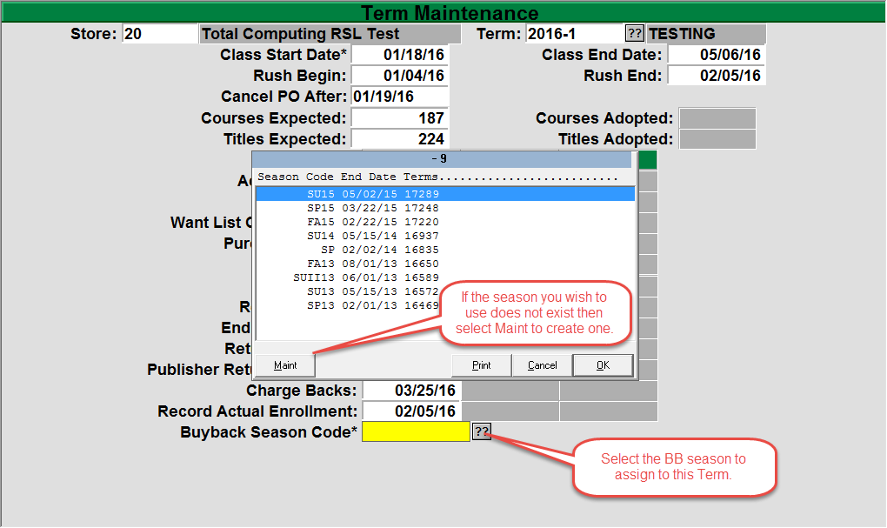

Enter the Term to edit or maintain. The Class Start Date and the Buyback Season Code are the only 2 fields that are required but it is very helpful to enter the other fields as they can help you plan out your semester. In the Buyback Season Code, select the BB season that you wish to attach to this term. The BB season is the season that you will use to purchase the books for the Term that you are doing the maintenance on.

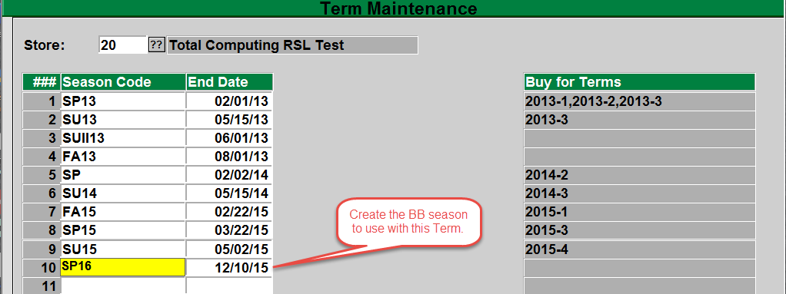

If you need to create a BB season, select the Maint in the BB season display window. You may name the season anything you wish, a couple of examples for this term would be either SP16 (since this is being purchased for Spring 2016) or FA15 (since this BB is conducted at the end of Fall 2015). Whatever naming convention you use is your choice. In this example books bought back between 05/03/15 and 12/10/15 are for Season Code SP16. When running buyback reports it is wise to use this date range.

For more information on creating or maintaining your terms please see the [Textbook Training guide.](../textbook-training/README.md)

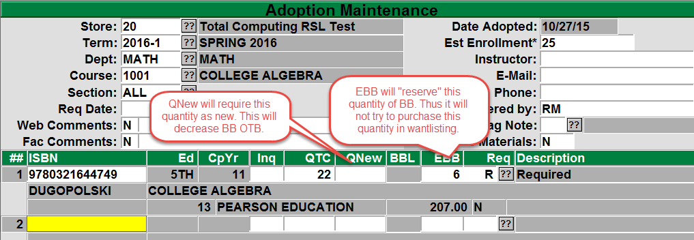

As stated before, the buyback process on the system is designed to purchase books that have an Open To Buy (OTB), the OTB is created by the system need for a title such as entering an adoption. Once a title is entered in to an adoption a need is created. The need is then decreased by quantity on hand and purchases.

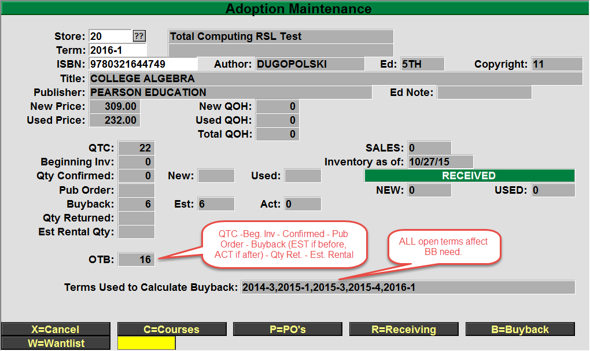

You may view a title’s OTB, for a Term, from the bottom of the Adoptions window by selecting the O=OTB button or from TX-2-31 Open to Buy. Please note that ALL open terms will affect a title’s BB quantity so you will have to view all of the open terms to see the quantity for each term. If you have multiple open future terms then in BB Flag Maintenance (TX-5-2-1) the quantity will reflect all of the OPEN terms, not just the immediate upcoming term. For this reason, it is important to close any past terms to prevent their OTB quantities from affecting your buyback.

You may close a term by going to TX-SU-1-2-2 (Close a Term).

Select the Store and the Term that you wish to close and then select the R=RUN PROCEDURE option from the bottom.

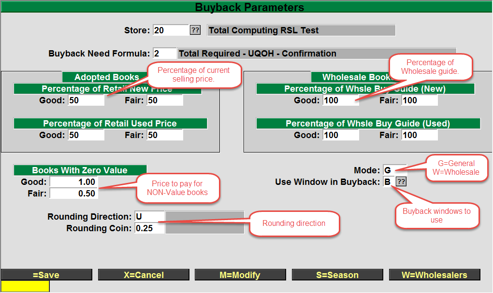

Now you will also need to set up the Buyback Parameters, this can be accessed from TX-5-1 or TX-SU-2-6, usually this is set up and only occasionally will you need to make adjustments.

1. First you will need to select the Buyback Need Formula to use, the normal options are “1 = Total Required – QOH – PO’s – Confirmations” and the other is “2 = Total Required – UQOH – Confirmations”. The difference being any NEW quantity on hand or on order can be purchased in BB and the new will be returned.
2. Next you need to enter in the percentage of the selling price that you will pay for the books. There are 2 conditions, GOOD and FAIR, available for each type of book, NEW and USED. Additionally you can set the percentage of the wholesale value that you wish to pay. In the example above, we used 50% of the current New and Used selling price along with 100% of the wholesale price.
3. Enter in a dollar value that you are willing to pay for books that have NO value. Usually this is either left blank or has the value of 0.00, but some people will offer something as a good will token or a recycle value.
4. 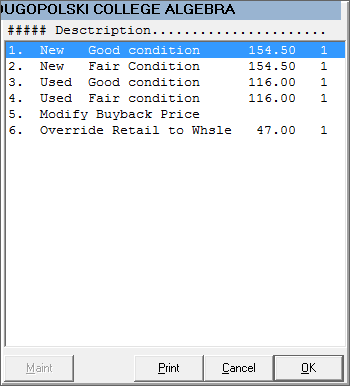 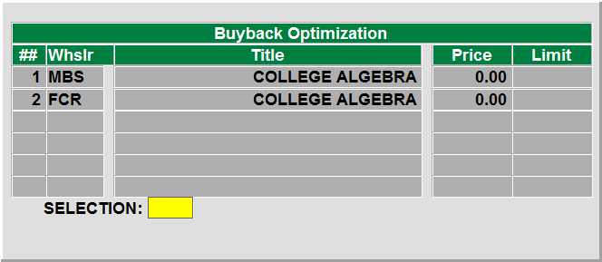 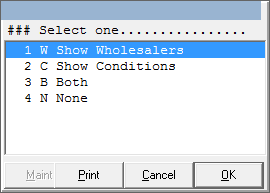 Enter in the Mode of the buyback, this is either “G” for a General buyback or “W” for Wholesale only buyback.
5. Choose which window you wish to see at the BuyBack transaction. You have 4 options, “W”, “C”, “B”, “N”.
    1. “W” will show you only the Wholesale Buyback Optimizatrion window. This window will display if the title scanned has no retail value and will prompt you to choose which wholesaler you wish to sell the title to. If your buyback only has one wholesale guide or wholesaler loaded then this option is usually NOT selected.
    2. 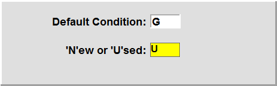 “C” will show you only the condition codes. After the title is scanned or looked up you will select from “New-Good”, “New-Fair”, “Used-Good”, and “Used-Fair”.
    3. “B” will show you both windows when they are needed.
    4. “N” will not show either window but you will set the default condition of “G” or “F” and the default book type “N” or “U”.
6. From the bottom of the Buyback Parameters window you will also set the Wholesalers that are valid for this buyback season. Select the Wholesalers option at the bottom and then in the new window, enter in the WHSL # or lookup the wholesaler by entering part of their name. Then in the File Name field enter in the name of the GUIDE that you wish to use for the wholesaler. Normally the Wholesaler # and the File name will match (they will both be for the same company such as MBS), but you may also wish to purchase for an independent wholesaler and they will honor one of the major wholesaler’s guide. In this case you would enter in the independent’s WHSL # and then enter in the major wholesalers guide name. The available GUIDES to choose from are “MBS”, “NBC”, “FCR”, “TBC”, “TIS”, “SELF”.

The next thing to look at is the Buyback Flag Maintenance (TX-5-2-1)

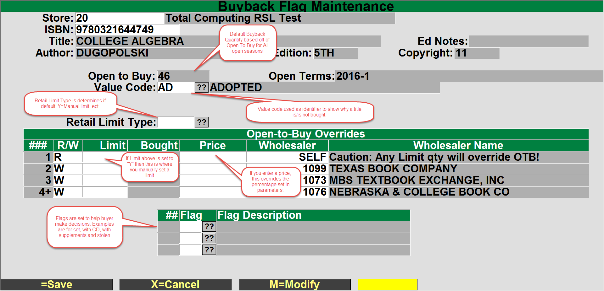

1. The open to buy value is calculated from all OPEN terms, the open terms are displayed to the right of the Open to Buy field. It is important to close any old terms to prevent the OTB for those terms from affecting the BB.
2. The Value Code will be blank if the title is not adopted, the code of AD is used if the title is adopted. You can select the `??` to select any other Buyback Value Code to modify them from Buyback Value Code maintenance (SU-3-1).unt
3. The Retail Limit Type is used to change the buyback from using the default OTB. The options here are:
    1. `Y` will use a manual limit, the limit will be set in the line below. The line with the R is the line where you will set the manual limit.
    2. “X” will Exclude the title from the retail buyback.
    3. “U” will be unlimited buyback amount.
    4. “G” is used if you have a guaranteed buyback program.
4. Limit is where you will enter the manual limit if you set the Retail Limit Flag to `Y`. You can also set a specific buyback price in the Price field. This price will be used regardless of the retail condition selected at buyback.
5. The Flag is used to set notices to alert the buyer about special conditions for this title, a title can have multiple flags assigned to it. You can enter the flag to use or select the `??` or `//` and selct the flag, you may also select the Maint option and create/modify the flag. 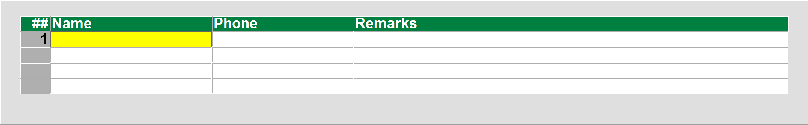 One flag is special, the “S” stolen book flag will also allow you to enter a Name, Phone, Remarks. This is where you will enter the information to let the buyer know what to look for to identify the actual book that has been reported as stolen.

### Set Estimated As Limit

If you wish to use the estimated Buyback (EBB) quantity that was entered while adopting titles, you may use the Set Estimated As Limit option (TX-5-4). 

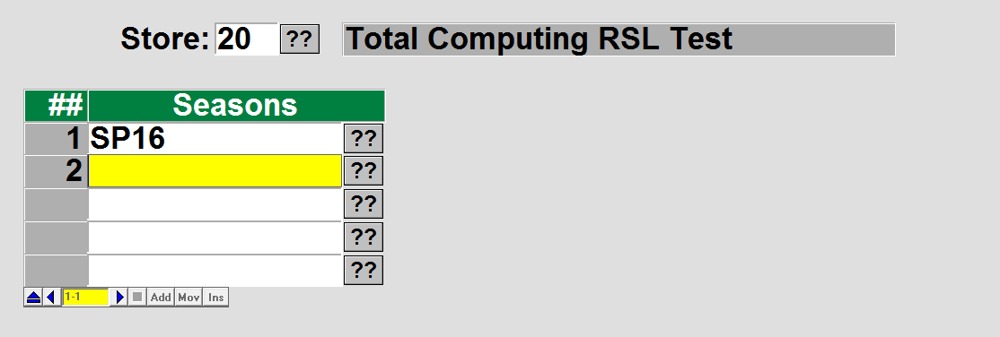

Select the seasons that you wish to use select the EBB quantities from. You can select multiple seasons and the EBB quantity from each season will be added together and entered in to the Limit field in the Buyback Flag Maintenance (TX-5-2-1).

### Clear Buyback Fields

If you should need to reset all of the buyback fields or clear and reset a few of the fields you can use the Clear Buyback Fields program (TX-5-23), this program should also be used when buyback is over to clear the buyback and get it ready for the next buyback season.

Before you start your buyback you should run some reports to make sure that the quantities are correct and to validate the titles that the system has a BB open to buy.

- Buyback Need (TX-RP-4-3) gives you a list of all the titles that show a need in buyback. This is the same quantity that displays when you view a title in Buyback Flag Maintenance (TX-5-2-1).
- Manual Buyback Control List (TX-RP-4-4) shows you the titles that you made a manual adjustment to the quantity to purchase and/or made an adjustment to the price to pay in Buyback Flag Maintenance.
- Estimated Buyback (TX-RP-4-5) lists the titles that have an estimated buyback entered. The Est. BB quantity is entered in title adoptions (TX-1-1) and does not directly affect buyback.

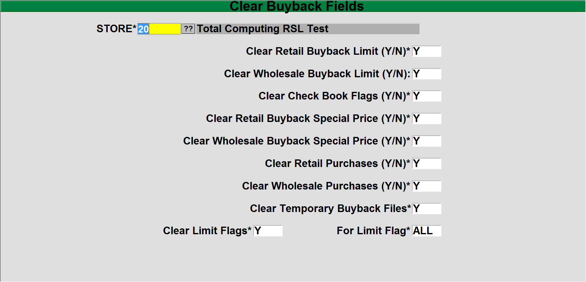

In each of the fields enter in a `Y` to clear the field or “N” to leave the field unchanged.

## BUYBACK AT THE REGISTER

The actual buyback is conducted from a HOSTED register. This is to allow real time quantity decision making by the system. If buyback was conducted at a SmartLane register, there is the possibility that the smartlane could lose connection and end up buying titles that have already had their quantities met by another register.

If the main transaction to be performed on the register is BB then you may wish to set the default transaction type to BB, this is done from POS-3-1 (Register Parameters).

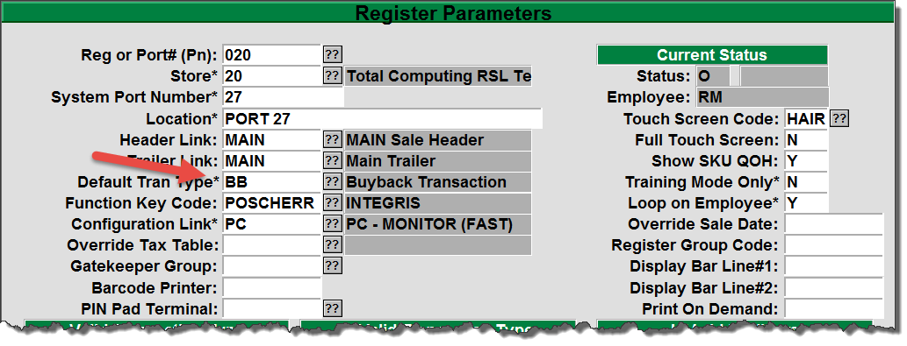

At the transaction type enter BB, or if that is set as the default, just hit the enter key.

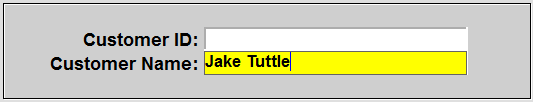

You may get prompted for Customer Name and Customer ID, this is set in the Transaction Types maintenance (POS-2-5) as seen below. Enter in the Customer ID and/or the Customer Name hit enter and a list of possible matches will display.

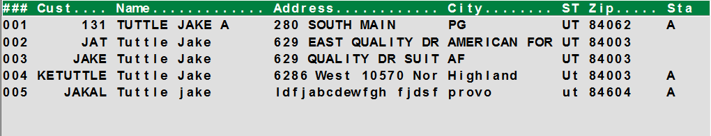

Select the line number for the customer that is at the register.

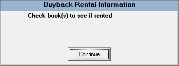

It is a good idea to prompt for customer information because the prompt will also check the customer records for any rentals out for this customer and display them on the screen. This will allow you to make a decision and let the customer know if any of the titles they are returning should be returned through rental return and NOT through Buyback.

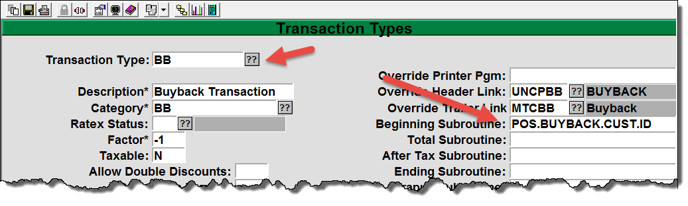

In the Transaction Type field enter or lookup BB and press Enter, in the Beginning Subroutine, if there is a program similar to shown above then it will prompt for customer information. There are many different subroutines that can be sued so please call support at 800-800-8227 opt. 2 to get help in selecting and entering a subroutine for you. If the field is blank then NO customer prompt will display and the BB transaction will go directly to the ISBN Scan field.

In the ISBN field, scan the barcode or enter the Author/Title look up.

<table><tbody><tr><td></td><td>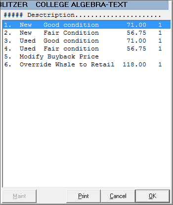</td><td>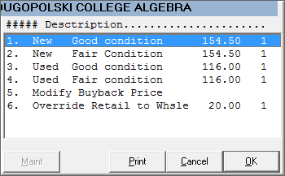</td></tr></tbody></table>

If in the Buyback parameters you had set the “Use Window in Buyback” to one to the options of “W”, “C”, “B” then you will get the window showing you the options to select the condition of the title for the Retail/Wholesale.

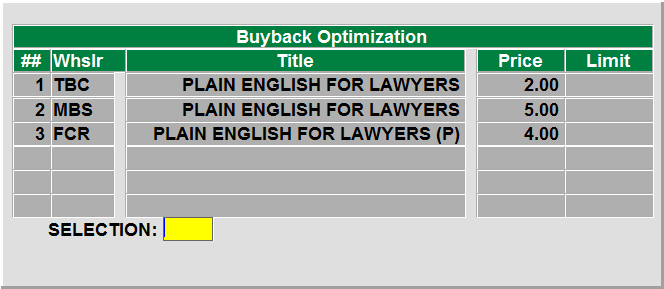

If the title is wholesale and you have selected to use multiple wholesalers then the wholesaler’s window will display to allow you to choose which wholesaler to sell the title to.

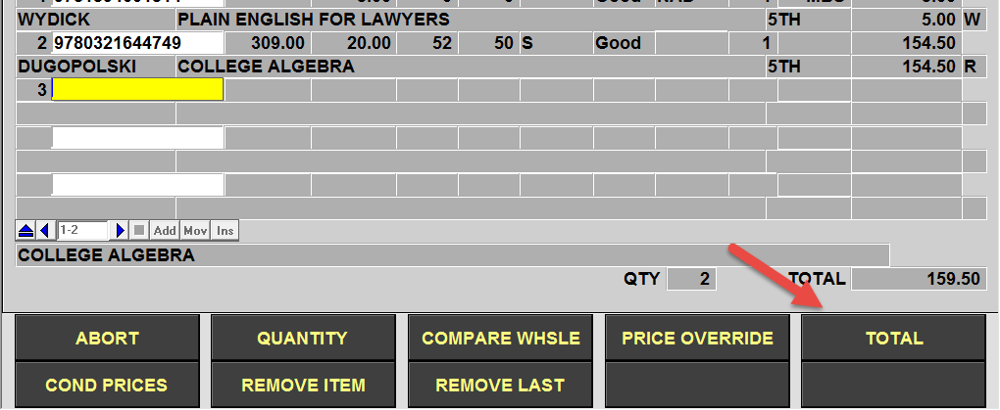 

At the bottom of the screen, there are multiple options that can be customized for you needs. You can select options to convert a Retail to Wholesale, Wholesale to Retail, or just modify a price. Once you have completed scanning and entering the titles for this BB transaction, select the “Total” from you keyboard or from the screen.

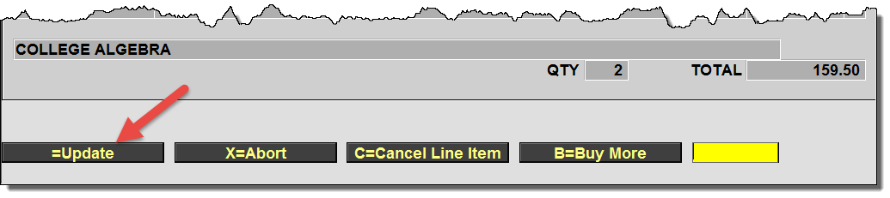

After selecting total you can then select the =Update or hit enter to complete the transaction. You can also enter C to cancel a line item or select “B” to go back and add more titles to the transaction.

There are times when you need to shift title purchased Retail to Wholesale and Wholesale to Retail. There are some process that allow you to easily perform these processes and report on what was shifted. (TX-R-2-2 & 4)

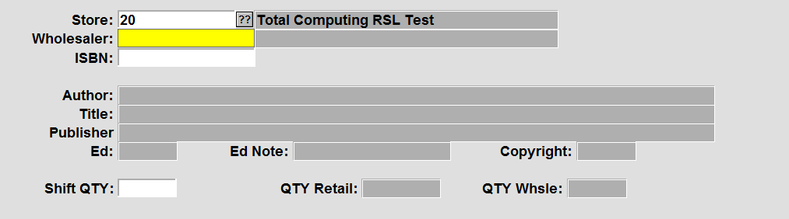

The screen is identical for both processes, enter the Store #, Wholesaler to transfer to/from, the ISBN of the title and the Shift QTY.

For the reports (TX-4-2-3 & 5), enter the Store #, Beginning/Ending dates and your sort method (A)uthor, (T)itle, (P)ublisher, (I)SBN.

There are many reports that you can run with many options. Some of the reports are from the POS reports menu POS-RP-21 will give you many reports that you can run with filters such as Store, Register, Date, Time, Buyer, and customer ID. If you enter in a particular buyer code then you can report on just that buyer. It is recommended that each buyer has their own logon/cashier code to use. This will help with reporting as well as audit process so you can tell which buyer did any individual transaction.

- Dollars Spent Report (POS-RP-21-1) will show detail or summary for amounts spent by transaction and by retail and wholesale.
- Buyback Audit Report (POS-RP-21-2) (TX-RP-4-22) will give you detail of quantity of each title for Retail and Wholesale, total retail and total wholesale and give you multiple sort and totaling options.
- Buyback Detail Report (POS-RP-21-3) will show each transaction and what was bought on each transaction. Again you can sort by multiple options and get Totals by the first sort option selected.
- Actual vs Needed (TX-RP-4-2) sorts by author and shows the quantity that was purchased compared to what your buyback need is for the title and show you the difference. This will help show titles that you still need to place orders for.
- Actual vs Expected (TX-RP-4-21) will report on the retail titles and show the actual buyback quantities compared to what was expected.
- Buyback Retail Purchases (TX-RP-4-23) You can select detail or summary. Detail lists each of the retail titles purchased, condition purchased, Ext. Cost and Qty. Summary gives each title with total dollars and quantity.
- Wholesale Purchases (TX-RP-4-24) gives you a similar report to the retail but only show the wholesale titles.
- Books for Wholesalers (TX-RP-4-25) will give you a report of the wholesale titles sorted by the Wholesaler that the title was purchased for or you may select to report on only a specific wholesaler.

## WHOLESALE FROM BUYBACK

These process are optional because since wholesale buyback titles are never added to you inventory, you do not have to run anything to remove them from inventory. As such these process are solely for the purpose of having paper work to show the titles and quantities that where purchased for the wholesaler(s), some of the wholesalers may require that you provide a packing slip and then you will need to run the process.

Suggested Shipping List (TX-4-22-1) creates a suggested list. You have the option when running the report to only include titles with a wholesaler price greater than the amount entered if you leave the field blank then all titles will be included.

Create Shipping List (TX-4-22-2) is the process that actually create the wholesale invoice. Again you can enter a dollar amount so that only titles with a wholesale price greater that that will be included. Next you can enter a list of wholesalers to create a wholesale invoice for. If you leave this blank then it will create a wholesale invoice for each wholesaler that you purchased titles for at the Buyback process.

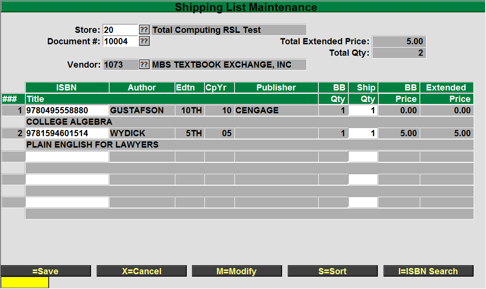

Shipping List Maintenance (TX-4-22-3) allows you to Add/Edit/Enter a title on the shipping list. When you ran the Create Shipping List process, the end of the process would have reported the shipping lists that were created. Here, enter the Store # and Document # or select the ?? to choose one. The will list the titles purchased for that wholesaler and the quantities that were purchase.

You can select M=Modify or click in a the Title field and space one time then enter will delete a title, change the quantity or enter in an ISBN or Author/Title lookup and then the quantity to add a title

You can select the S=Sort to resort the list by Author or Title and if you need to search for a title enter the I=ISBN Search and then enter the ISBN to search for.

## FINALIZING YOUR BUYBACK

Once you have completed your buyback you need to run a couple of processes to finalize your buyback.

First you should run the Update MF Average Cost (TX-5-2-21). This process will update the titles Average Used Cost with the amount purchased in buyback. Since this is average cost the formula is simple, it takes the current extended value for a title, adds the total moneys spent in buyback for the title and then divides the total by the total quantity on hand.

New Avg Cost = (Previous ext. used cost + total spent in BB) / (Previous UQOH + total purchased in BB)

The other process you should run is Clear Buyback Fields (TX-5-23). We discussed this process previously.

<PageFooter />
