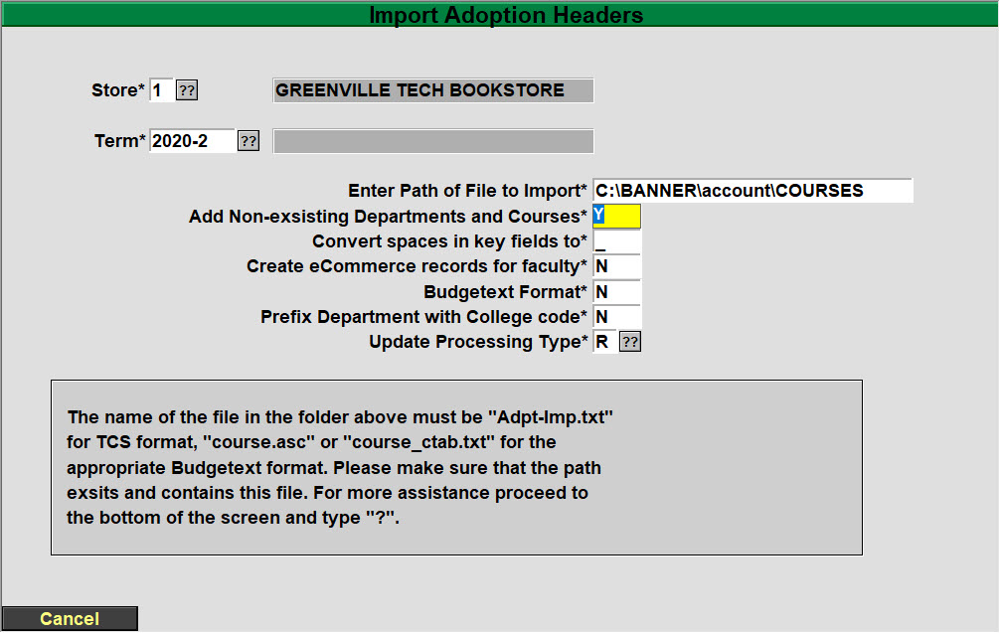

# Import Adoption Headers – (TX 1.23.1)

<PAgeHeader />

You must have a file from your administration to proceed with this import. If not, please proceed to the next section. For more information on this import process, please contact the TCS Service Center.

**Enter the Adoption term you will be importing**. – The term will already have to exist in Term Maintenance (TX.SU.1.2.1).

**Enter the path of file to import** \* – The name of the file must be “Adpt-Imp.txt” or “course.asc” for the Budgetext format. Please ensure that the path exists and the file is named correctly for the import to be successful.

**Add Non-existing Departments and Courses** \* – Enter a ‘Y’ if you wish the program to automatically add Departments and Courses that are not currently on file, but are contained within the import file. If you enter ‘N’, then the program will warn you each time it finds a Department or Course that is not on file and will not add the adoption record.

Convert spaces in key fields to: Spaces are not allowed in the key fields of a store, term, department, course and/or section number. If your import file contains spaces enter the character you would like it converted to. If you leave it blank the spaces will be stripped out. Asterisks (\*) are not allowed.

**Create eCommerce records for faculty**\* – Enter a ‘Y’ so the system will automatically create the eCommerce records (Pref Customer record) so faculty can log into the faculty adoptions.

**Budgetext Format\*** - Enter 'N' if the file name is "Adpt-Imp.txt", enter a 'Y' if the file name is "course.asc" or "course.ctab.txt"

**Prefix Course with College Code\*** - Normally you will enter an 'N', if your school has multiple college codes and you need them to distinguish which college the course is associated with then enter a 'Y'.

**Update Processing Type**\* – Options are ‘R’ Report only, ‘I’ Import only and ‘B’ Import and Report

Once you are satisfied with your entries you MUST choose ‘R’ Run Procedure. If you need assistance with this process please contact the TCS Service Center.

\*\*\* Important \*\*\*

If you are doing multiple imports throughout the term, after the first import, choose ‘R’ report ONLY to see any changes that need to be MANUALLY input in the adoption system.

<PageFooter />
