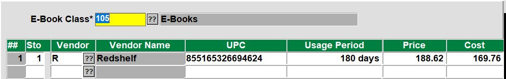

# Manually Add or Remove Ebook

<PageHeader />

It is possible to manually add or remove an ebook, but there are some points of information you'll need from Redshelf in order to add it. Once you have that information you can update your ISBN MF record to have the ebook data.

Removing an ebook is as simple as going to the ISBN MF record, E for Ebook, then replace the Store field value with an empty space and press enter. This removes that line of data, repeat for any additional lines and then save your way out. If you only want to remove specific prices, navigate to the line with that price and remove that line.

1. Information you need from Redshelf:
    1. The internal Redshelf UPC/SKU for that title
        - Each title at Redshelf has a unique SKU for the duration and price point of a specific title. (similar to a GM matrix item with different sizes at different price points)
        - If a title is available for 60,90,120,180 days and a lifetime purchase, then there would be five different SKUs for that title
    2. The usage period and price for each SKU
2. Adding that information to the print ISBN screen
    1. First, make sure that you know your class code for Ebooks
        1. This can be found in TX-SU-1-6-22. Click on the ?? button for the Class Number field and find the class that has ebooks in the description.
    2. Go to TX-MF and bring up the ISBN for the title you want to add the ebook options to
    3. Enter E or select the E - Ebook button
    4. Enter your ebook class code
    5. Enter 1 for the Store (store) field
    6. R for Vendor
    7. Enter the UPC/SKU number that Redshelf gives you
    8. Enter the usage period for that UPC/SKU
    9. Enter the Price
    10. Enter the Cost
        1. Repeat steps 2.4 - 2.9 for each UPC/SKU that Redshelf provided for that ISBN
        2. It should look something like this when you're done.
            1. 
3. Save your way out of the record and you're done.

<PageFooter />
