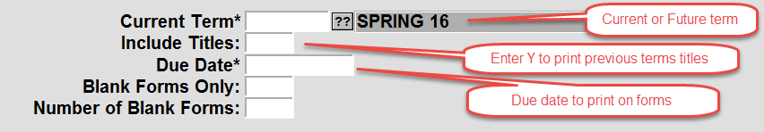

# Print Adoption Forms

<PageHeader />

Before you begin, make sure that you Adoption Form Parameters has been created, as shown below, and the comments section has the wording you would like to print on each adoption.

TX-SU-2-1

You must also make sure that the “Future” term has been created in Term Maintenance.

TX-SU-1-2-1

To print the adoption forms

1. Log to TX-RP-1-23
2. Enter the Store and “Historical Term” to select previous titles from. You may also enter Beg/End Dept., Course and Section to limit to.
   - 
3. Enter in the “Current” or Future term to print the adoptions for.
   - 
4. When the screen with Process Complete displays, select the Continue button in the upper right.
5. From the bottom of the menu screen, select PM-Printer Mgt. option
   - 
6. A list of the current print jobs will display. Click on the job that you wish to print and then select the “Print a Job” button on the right. You will then have the normal selections to choose from.

<PageFooter />
