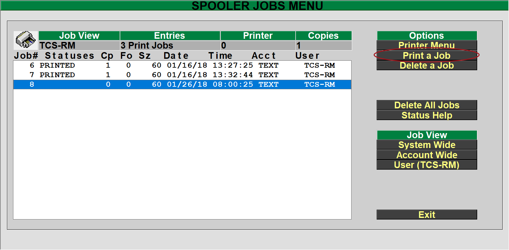

# Printing Adoption Forms

<PageHeader />

This makes the assumption that the new term has already been created. Please reference the [Textbook Training](../textbook-training/README.md) page for instructions on how to open a term.

1. Log to TX.RP.1.23 Print Adoption Forms
   - 
2. Fill out the options for your needs
    1. Store
    2. Term\* - this is the previous term to reference titles from.
    3. Beg Dept: and End Dept: - To limit the adoptions to just the departments entered.
    4. Course: - If a single department was entered then you can specify a course.
    5. Section: - If a course was entered then you can also specify a section.
    6. Current Term: - Enter the current or upcoming term for the adoptions
    7. Include Titles: - Blank or Y will print adopted titles or enter N to not include titles.
    8. Due Date\* - Required field, this is the date the form should be returned from the instructor.
    9. Blank Forms Only: - Enter 'Y' if you want to print forms with no department, course,section or specific title information. The supposition is that the instructor will fill in all such information.
    10. Number of Blank Forms: - Enter the number of blank forms you want to print. You don't have to enter anything if you did not answer 'Y' to the previous field.
    11. Select the R=Run Procedure to create the report
3. From the main screen, select the PM – Printer Mgt. option
   - 
   - 
4. Select the print job with the correct date/time from the list and then select the “Print Job” from the right. You can also select “System Wide” or “Account Wide” under the “Job View” section, to view additional print jobs either just within the current account (Text) or the system wide will view print jobs form other accounts (GM, POS, etc.).
   - 
5. The normal print dialog box will display to allow you to select Terminal, Local Printer, Email, etc.

<PageFooter />
