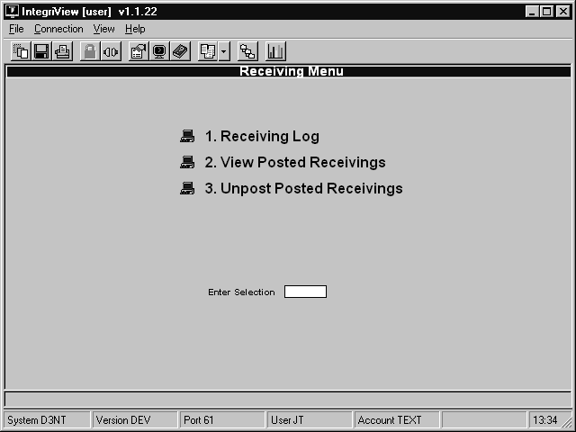
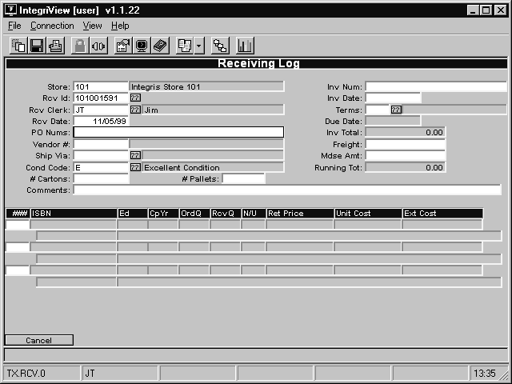
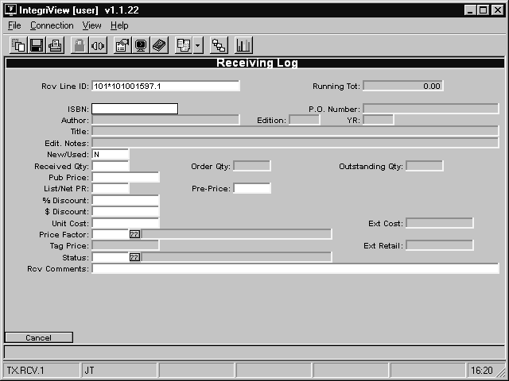

# Receiving Process

<PageHeader />

The functions in the receiving menu are used to enter and modify receiving logs for shipments you receive from vendors. This section covers the use of these functions.

## Entering a Receiving Log

To enter a receiving log, follow these steps.

1. From the CourseTrak Main Menu, select the **Receiving Option** followed by the **Receiving Log** option to get to the Select Receiving Order screen _(TX-3-1)_. Enter a “.” in the **Rcv Log #** field to create a new receiving log and get to the Receiving Log screen. Enter `A` when prompted.
   - 
2. Today’s date is automatically entered into the **Rcv Date** field.
3. In the **PO Nums** field, enter the purchase order number that this receiving deals with.
4. If you entered a valid PO, the **Vendor #** field and the **Ship Via** field will be filled in automatically. If not, enter the vendor and a shipping code in these fields.
5. In the **Cond Code** field, enter the condition that the books are in or leave it blank. For a list of codes, enter “??”.
6. In the **Inv Num** field, enter the invoice number from the publisher. If you don’t have an invoice, put a phony invoice number like “REPLACE” to replace later.
7. In the **Inv Date** field, enter the date on the invoice. (This also can be changed later.)
8. In the **Terms** field, enter the payment terms. For a list of terms, enter “??”.
9. In the **Freight** field, enter the amount charged for shipment of the books.
10. In the **Mdse Amt** field, enter the total merchandise amount displayed on the invoice.
11. In the **Comments** field, enter any brief comments you have on the shipment or leave it blank.
12. Enter `A` to sort by author, “T” to sort by title, “I” to sort by ISBN, or “P” to sort by PO line number. The books on the PO will be displayed.
13. If it says “Receive by.. <E>=Exception, <M>=Manual” then chose “M”.
14. Type “1’ and hit enter to receive the first book. (“2” to receive the second book, “3” to receive the third, etc.) To add a book to the receiving log that is not on the PO, enter `A`.
    - 
15. The **ISBN** field has the ISBN of the book you are receiving.
16. In the **New/Used** field, it tells you whether the book is New or Used.
17. In the **Received Qty** field, enter the quantity of this book that you received.
18. In the **Pub Price** field, just hit <enter> unless you want to change the Reference Price on the Masterfile.
19. In the **List/Net PR** field, enter 'L' for list pricing or `N` for net pricing. If you do not know what to enter, then look at the **Price Factor** field near the bottom. If it says 'L' there, then enter 'L'. If it says `N` then enter `N`.
20. Leave the **% Discount** field blank. It will fill in later.
21. Leave the **$ Discount** field blank. It will also fill in later.
22. In the **Unit Cost** field put the cost of the book, per book.
23. Leave the **Price Factor** field as is.
24. Leave the **Status** field blank.
25. In the **Rcv Comments** field, enter any brief comments on this book or leave it blank.
26. Repeat steps 14 – 25 for each book.
27. Enter “P” to post the receiving log to the master file, “S” to save the receiving log without posting it.
    - “P” will post the quantities – _no changes_ _are allowed_ after this is done except for the Invoice Number and the Invoice Date.
    - “S” will save the receiving log, but not post the quantities. It will allow you to make changes later, as well as Post later.
28. If you made a mistake other than the Invoice Number or the Invoice Date, then you must Unpost the Receiving Log _(TX-3-3_) and receive it again.

<PageFooter />
