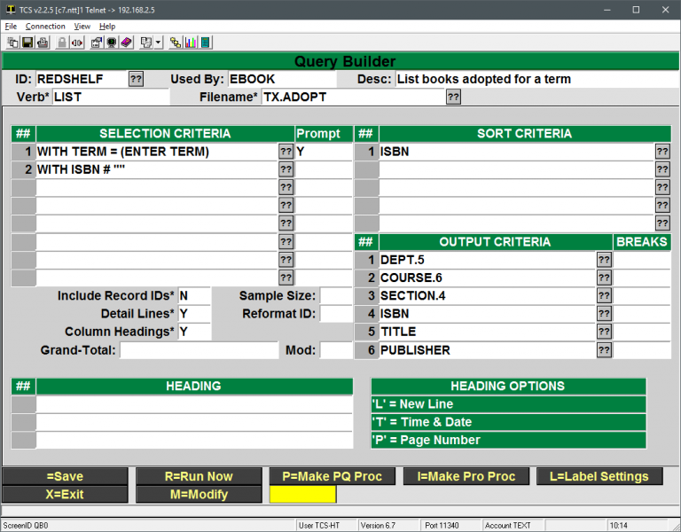
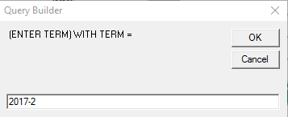
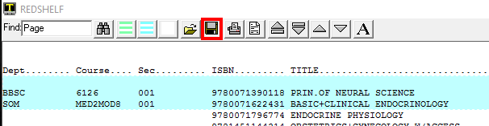
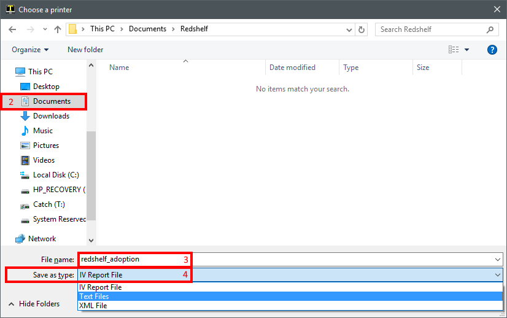
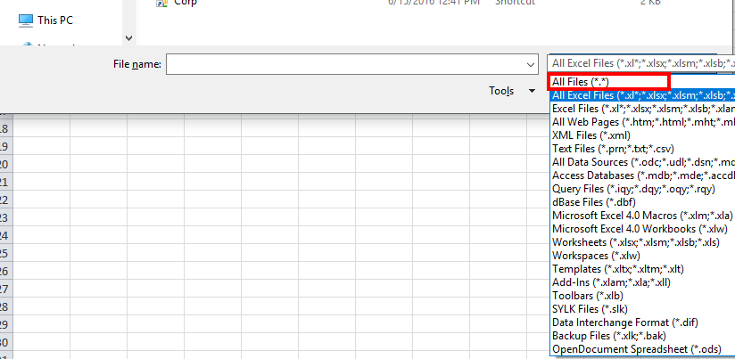
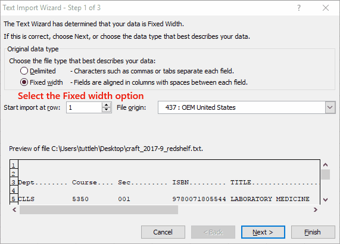

# Redshelf Adoption Export

<PageHeader />

This is an overview on how to export your adoption list to Redshelf. This is done each semester after adoptions have been entered so that Redshelf can provide a list of available ebooks.

1. First, we need to run a Query Builder report to generate the file we’re going to send to Redshelf.
    1. Log to the TEXT module
    2. Type QB at the menu
    3. Enter REDSHELF in the ID field
        - You will see this Query Builder screen
        - 
    4. Select the R=Run Now option
    5. Enter you store number at the Store prompt (certain locations only)
    6. Enter your term code at the prompt
    7. 
    8. Select the Terminal option for the destination
2. Now we need to save the report as a text file and send that file to Redshelf
    1. Click on the Save icon at the top of the Terminal Window
    2. Select where you want to save the file.
        - This can be anywhere on your computer. Typical locations will be Documents or Desktop
    3. Name the file
        - Keep it simple and preferably without spaces. E.g. redshelf, redshelf2017-2, adoption\_list, etc.
    4. Change the “Save as type” to “Text Files”
    5. Click on the Save button
3. Next the file needs to be sent to Redshelf. If your Redshelf rep requests an Excel or CSV file, follow the steps below in the Importing Into Excel section.
    1. Open your email application, typically Outlook or through a web site
    2. Create a new message addressed to your Redshelf contact
    3. Attach the file to the email
        - This can vary depending on your email client. There may be an Insert > Attach File option, an Attach File button or you can typically navigate to where you saved the file in Windows and drag it into the email message.

## Importing Into Excel

Sometimes a Redshelf rep will request that the file be sent to them as an Excel document or a CSV document. The steps below cover how to do that. This assumes that the steps above have been performed and you have a copy of the report on your computer as a .txt file.

1. Open Excel
2. Go to File > Open
    - Or press and hold the Ctrl key and then press O bring up the Open dialogue.
3. Browse to where you saved the file in step 2.2 above
4. Change the All Excel Files drop down box to All Files
    - 
5. Select the .txt file saved in step 2.2 above
6. In the Text Import Wizard (step 1 of 3) Select the Fixed width option
    - 
7. In step 2 of 3, click and drag the arrows/lines to the edge of the text. These mark the columns to be used in the spreadsheet.
8. In step 3 of 3, click on each column and asign the Text data format in the top left
    - You can select the first column, move the slider all the way to the right, press and hold SHIFT and click on the last column. With all columns selected click on the Text data format option on the top left.
    - Click Finish
9. Now all of the data should be in the Excel document. The ISBN numbers **_should not_** look like a notation number (9.78129E+12) they should display as full ISBNs.
10. Save the document
    1. Go to File > Save As.
    2. Browse to where you would like to save the document
    3. Enter a name in the File name field
    4. Click on the Save as type: drop down and select the option with "CSV (MS-DOS)"
    5. Click on Save
11. Send the new csv file to your Redshelf representative.
12. Note that if you open the document in Excel after closing the ISBN fields will be truncated with 9.78129E+12. Select the for the ISBNs, right click and select Format Cells, change the format to Number and change the decimal count to 0.

<PageFooter />
