# Rental Setup and Training

<PageHeader />

## Rental Steps

The following steps must be followed before setting up rentals for the first time. There are various videos available on the videos page that cover these steps with direct links to pertinent videos in each section below.

1. Setup the textbook rental department POS-22-3-1
2. Setup the Textbook Class POS-22-3-2
3. Setup Fee Codes POS-22-23
    1. It is recommended to have a different fee code for each type of fee.
        1. Late fee code to use when an item is returned late
        2. Fee code used when an item is rented
        3. Fee code used when an item is charged out un-returned or sold

## Setting up rentals: POS-27-21

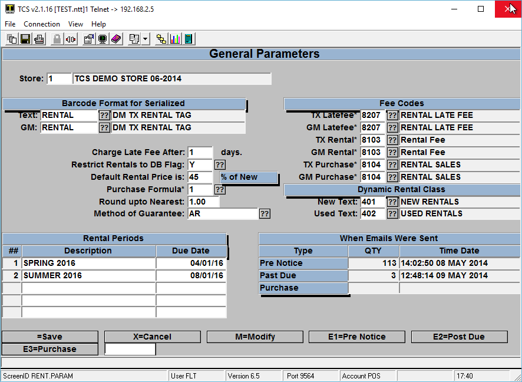

**This is the main parameter screen for setting up your rental program. A video going over these steps can be found [here.](https://youtu.be/dgqAA54V84A)**

1. Enter your store number.
2. Enter the Barcode Format you will be using to print serial number barcodes (for serialized Text rentals only).
3. Enter the Barcode Format you will be using to print serial number barcodes (for serialized GM rentals only).
4. Set the number of days to wait before late fee is charged
5. Typically, the restrict rentals to DB Flag is set to “Y” – Some stores choose to manage textbook rentals independently from the textbook database, so the option exists to set it to “N”
6. Enter the default calculation for rental price – This is used if there is no rental price set for an item.
7. Select the appropriate formula to use to calculate the purchase price when an item is purchased instead of returned.
8. Set your rounding calculation.
9. Select whether you want your guarantee method to be CC (credit card) , AR (Accounts Receivable), CC/AR to use both methods, NONE if no method of Guarantee is used, or NONE/CC/AR will prompt the cashier to ask for the method to use.
10. Enter the TX and GM Late Fee codes to use.
11. Enter the RENTAL Fee Codes to be used for TX items and GM items.
12. Enter the Fee Codes to use for Rental Purchases
13. Setup general due dates to be used on rentals.
14. These can be overridden when setting up individual rental items.
    - These lines are referred to as P# (P1 for line one, P2 for line two, etc.) when specifying a due date. If I want all TX rentals due by the date specified in line one, I would enter P1 as the due date when setting up an item.
    - If certain items are to be rented for a different period of time (e.g. line 2 or P2) then that can be entered into the Rental Days field in the rental item master maintenance (POS-27-1)

### Email Notifications

The Email notifications section displays the last time the notice was sent out and how many emails were sent.

To create/edit the notice select one of the E1/E2/E3 options from the bottom prompt, a screen similar to below will be displayed dependent on the option chosen.

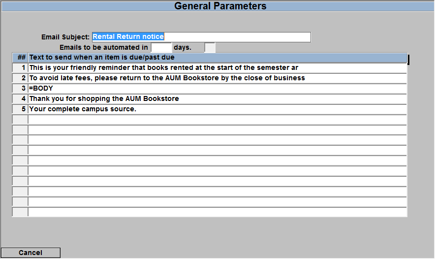

Enter what you would like the email subject line to be in the Email Subject, next enter what you would like the Body of the email message to be. Once completed, on a new line enter =BODY then on a new line enter in what you would like your signature closing to be.

Repeat this for each of the 3 types of notifications.

## Setting the Rental Condition Codes: POS-27-22

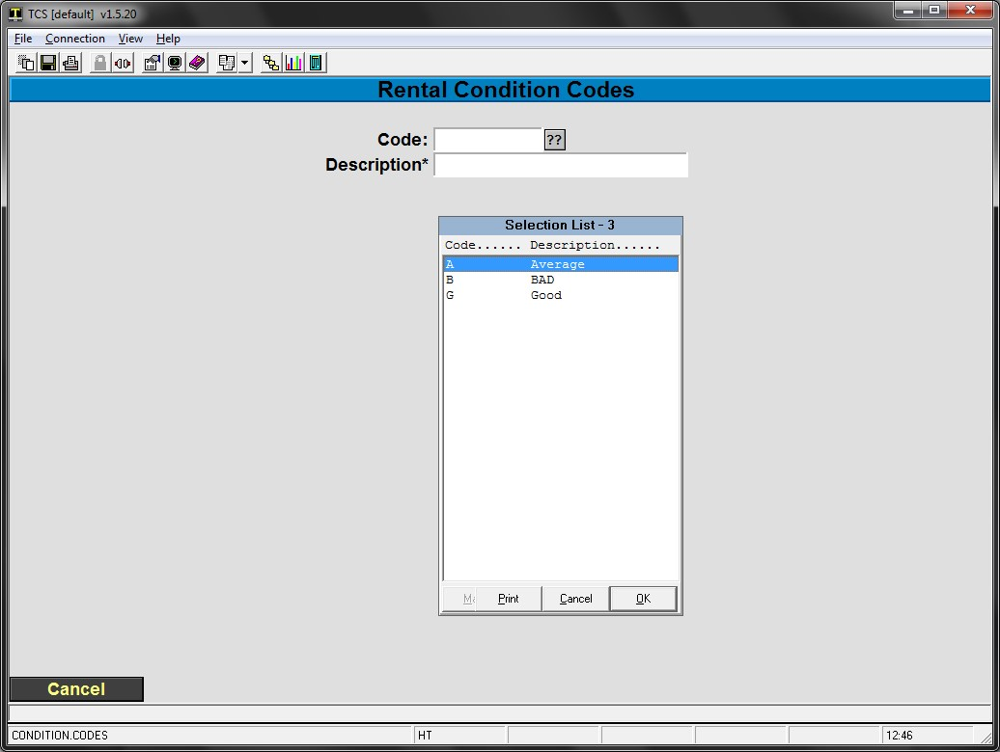

This screen is where you set up the “Condition Codes” for rental items. Typically, most stores will only use 2 Rental Condition Codes, Good and Fair.

1. Setup the Rental Condition codes used to describe the condition of the rental item when it is returned.
2. You can use the existing codes, or create your own code and description for the rental items. For example: Code: G Description: Item is in Good Condition

## Creating a Rental item: TX-MF

There are two different methods to renting textbooks, Dynamic and Serialized. Dynamic has the least amount of overhead and maintenance while Serialized has the greater amount of control. Dynamic rentals fulfill the needs of the vast majority of our users and is the recommended method to use. Serialized is available to meet a few special use cases that we have needed to provide a solution for.

Dynamic rentals allow a bookstore to flag an ISBN as a rental item and rent that item without any further effort. A student rents the book, and when it comes time to return the book they simply need to have that same title available to return.

Serialized controls the rental exchange at the item level. An ISBN is flagged as a rental item and unique serial numbers are generated for that ISBN. Barcode labels with that serial number are then attached to a book which then makes that book a unique item. When it is time to return the rental that _specific_ physical copy of the book must be returned.

The drawback is that a serial number must be generated for each copy of the book, printed, and applied. Each serial number needs to be inventoried as well. If you wish to rent more of that book then you must generate more serial numbers and affix the labels to each individual book. In contrast, dynamic allows for any number of copies to be rented without any addition overhead beyond flagging the book as a rental.

There are more points of interest on Dynamic vs Serialized rentals that aren't covered above. Any customer considering the use of serialized rentals should contact TCS support to go over the topic further.

### Dynamic rentals

A video covering these steps can be found [here](https://youtu.be/UvDT3925_JQ)

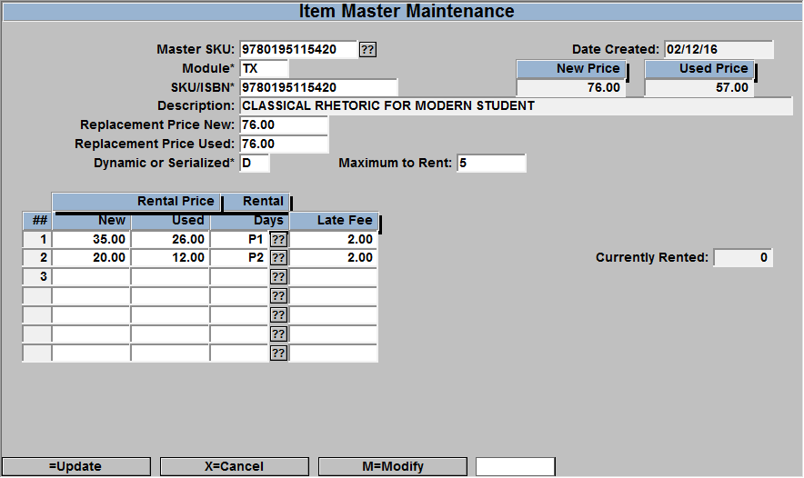

The best way to create a dynamic rental is through the TX-MF menu. It's possible to create one in POS-27-1 but it is much more common to create a dynamic rental from the MF record.

1. Go to TX-MF and enter the ISBN that you would like to rent.
2. Select the R for rental option at the bottom of the screen
    1. The system will then populatethe Mast SKU, Module and SKU/ISBN fields
    2. These fields are not automatically generated if creating the rental in POS-27-1
3. Enter the New and Used replacement price, this is the price used in the replacement calculation if the title is not returned.
    1. This defaults to the full price of the item
4. Enter a “D” for Dynamic rentals in the Dynamic or Serialized field
5. Maximum to Rent: this is used to limit the quantity of titles for rental
6. Enter the New and Used prices for the rental
    1. The system will automatically generate the prices based off of the percentage set in the Rental General Parameters in POS-27-21
    2. Different prices can be set for a different number of rental days or rental periods
7. Select the number of days to rent the item at this price point.
    1. Typically either P1 or P2. Selecting the ?? button will allow you to select which rental period from the Rental General Parameters in POS-27-21. These will appear as P1, P2, etc. based on the line position of that price in the Rental Period table.
        1. Enter your store number at the store prompt and then select the appropriate rental period
    2. You can also enter P1, P2 etc. to reference the dates entered in the table located in POS-27-21 or you can enter the number of days you wish to rent the item.
8. Enter the late fee. This fee will be applied daily and when the book is returned, the POS module will calculate this fee against the number of days past due.
    - You may enter as many entries with differing amounts as you would like. i.e. a P1 period entry which costs $20 and a $1.50 late fee, then a 30 day rental which costs $30 with a $2 late fee, etc.
9. Save the new record.

### Serialized Rentals

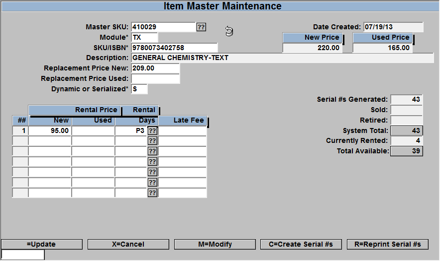

1. Enter a ‘.’ for a new record. The system will generate a 6 digit number which is the master SKU for the rental item. (The ISBN will get used if you have selected the ‘Rental’ option while in the TX MF screen. This will be discussed later in the manual). If a 6-digit number is not generated then contact TCS support.
2. Enter the module in which the item resides, GM or TX.
3. Lookup/Enter the ISBN or SKU of the item you would like to rent.
4. Enter the New and Used replacement price, this is the price used in the replacement calculation if the title is not returned.
5. Enter an “S” for Serialized rentals.
6. Enter the number of days the rental is good for. You can also enter P1, P2 etc. to reference the dates entered in the table located in POS-27-21 or you can enter the number of days you wish to rent the item.
7. Enter the late fee. This is applied daily, when returning the book the POS module will calculate this fee against the number of days past due.
    - You may enter as many entries with differing amounts as you would like. i.e. a P1 period entry which costs $20 and a $1.50 late fee, then a 30 day rental which costs $30 with a $2 late fee.
8. Choose C to Create serial #’s.
   - 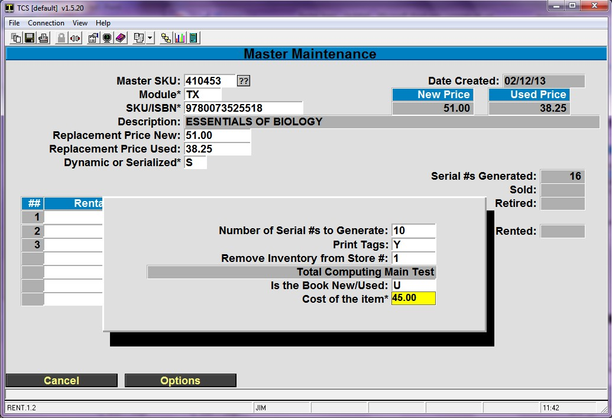
    1. Enter the number of serial numbers to be generated. If you are going to rent 10 of this textbook, enter 10. Each serial number is unique followed by a check digit. The total number of digits will be 12.
    2. Print tags, Y/N. If Y is entered, then tags will be printed in the format specified in POS-27-21.
    3. If you don’t want to print the serial numbers here you can also print them on the Rental Detail Screen (POS-27-2).
    4. Choose which store to remove the quantity from. The QOH for this store will be reduced by the number of serial numbers generated. Later when creating want lists you will enter how many of the rental items you expect to have on hand for rush.
    5. Enter the New/Used status of the books. This is so we know whether to reduce your new QOH or your used QOH. When you hit enter it will bring up the cost of the book. If you want to enter a new cost you can always change the cost. The cost shown here is used in calculating your rental profits or rental revenue. Be sure the cost is correct.

When you select and view a master SKU which you previously created, the right of the screen shows the statistics related to this particular rental item, including how many serial numbers have been generated for this master SKU and the number of items sold, rented, retired, and the items currently available.

## Serial Number Maintenance: POS-27-2

This screen is for viewing information on a specific rental item, referenced by serial number.

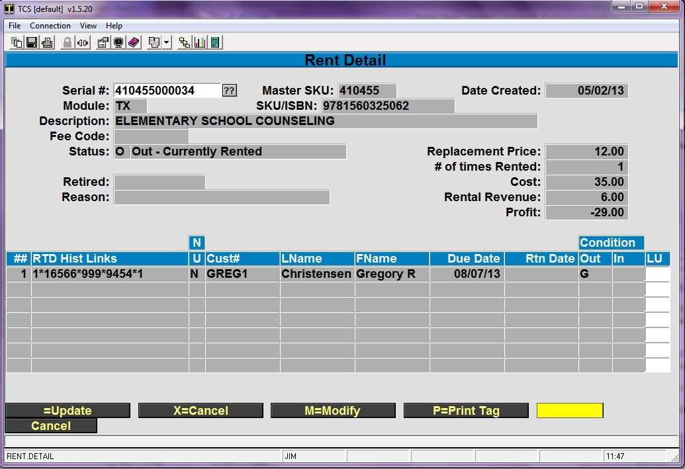

1. All the serial numbers generated in POS-27-1 can be seen here.
2. You can enter “//” or “??” to select a particular serial number.
3. The screen displays all the details on this serial number like author, title, status, rental revenue, details of the customer who rented the item, rented date and due date etc.
4. You can also view customer details who rented this item from this screen.
5. Enter M and it will take you to the LU (LookUp) field on the far right.
6. Enter Y in the LU field to view the details of a transaction with a specific customer. Once done press enter a couple of times and it will take you back to the Rent Detail screen.
7. If you want to print new tags for this specific rental item, enter ‘P’.
8. You can also view the Status of the item on this screen. The Status can be “ I - IN, O – OUT, S- Sold, R-Rented’
9. The status changes automatically when you Rent, Sell, Return or Retire an item.

## Creating a rental from the Textbook Module

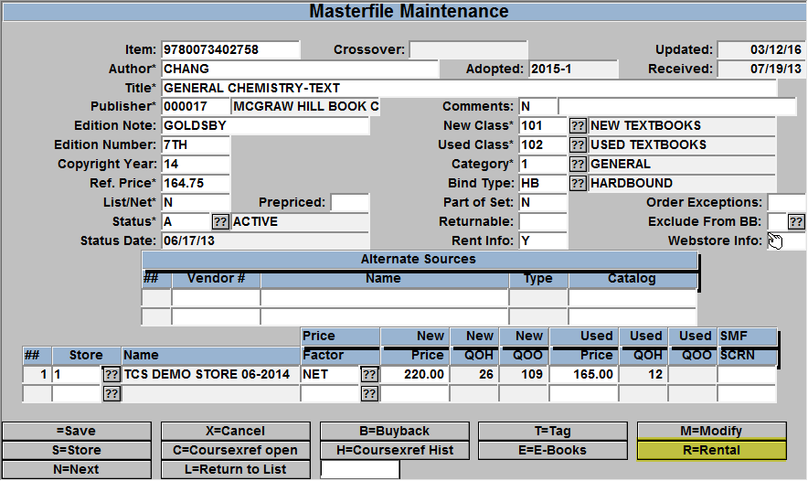

Look up a title as usual, select the R=Rental from the list of prompts and the system will jump you to the Rental Item Master screen and have most of the information entered for you.

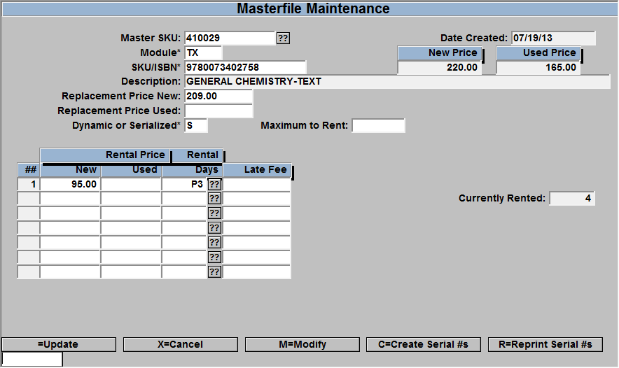

## Expected Rental Returns

These screens are used to set the expected rental return quantity. This needs to be set AFTER the items are rented or after rush, probably just before you start the Wantlist process for the upcoming semester.

### Auto Calculate Rental Inventory

From menu TX-2-30-1, here you will mass update all the ISBN’s expected rentals with a percentage of the rented quantity as the expected rental return quantity.

Enter Store#, Term to update, Beginning/Ending rental Due Date, and then the Percentage of the rental quantity to set as expected return.

<table class=" aligncenter" style="width: 571px; height: 99px;"><tbody><tr><td style="width: 637px;"><em>This process will update the rental inventory quantity on the want list. It will include rentals that have not been returned and are due during the date range entered. Any manually entered quantities will be overwritten</em>.</td></tr></tbody></table>

### Rental Inventory Entry

From menu TX-2-30-2, here you can update the expected rental return quantity for any single item. This is useful when you mass update titles with a percentage, but you have a title that does not fit that percentage amount. If you manually enter a quantity and then run the auto calculate process, the manually entered quantity will be replaced so you should enter these quantities after running the auto calculate process.

Enter the Store#, Term to update, ISBN and then enter in the Estimated Qty.

### Rental Inventory Logic explained

##### Serial

1. Removes QOH when the serial numbers are created.
2. When item is rented QOH is not affected.
3. When dropped off QOH is not affected.

##### Dynamic

1. When item is rented QOH is decreased.
2. When items is dropped off QOH is increased.

##### OTB (Serial)

1\. You MUST enter the number of units you expect to have dropped off.  This only has to be done once, but may be more frequently.

##### OTB (Dynamic)

1\. You MUST enter the number of units you expect to have dropped off.  This must be repeated whenever beginning inventory is recalculated and probably before publisher orders are submitted.

## Renting an item from the register

### Dynamic Register Process

A video covering these steps can be found [here](https://youtu.be/SHaikJwQCkk)

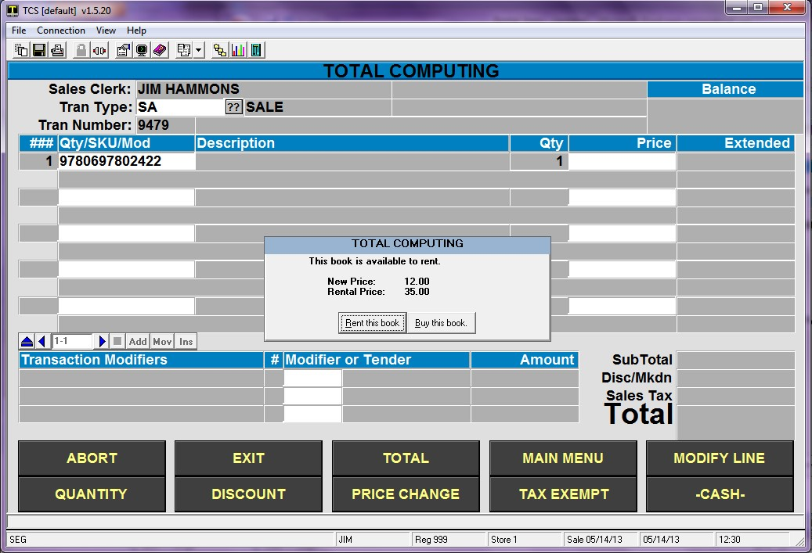

1. Scan the item.
2. The system will bring up a small window showing the rental price and purchase price, and ask whether the customer wants to rent or buy the item
3. The first time you select a rental, the customer information screen will appear. If it is a new customer, you can enter an N to create a new customer record. If it is an existing customer, enter the name or account number and select the appropriate customer.
4. Enter all the required fields in the customer information screen. Once you are done, hit enter and it will bring you the card or account details screen.
5. Enter the appropriate information for the payment guarantee method you have chosen.
6. At this point, you can complete the transaction, or continue to enter additional items for this sale.
    1. You will only see the customer screen once per transaction.
7. Once you are done, total the transaction and enter the tender type.
8. Once the tender is processed you are done with the transaction.
9. If you want to cancel the transaction select the ‘EXIT’ or “ABORT” key.
10. Rental transactions may be Postvoided or returned if necessary. Do not do a return for a drop off.
11. Dynamic also sees the pricing and period window that is displayed on the next screen capture.

### Serialized

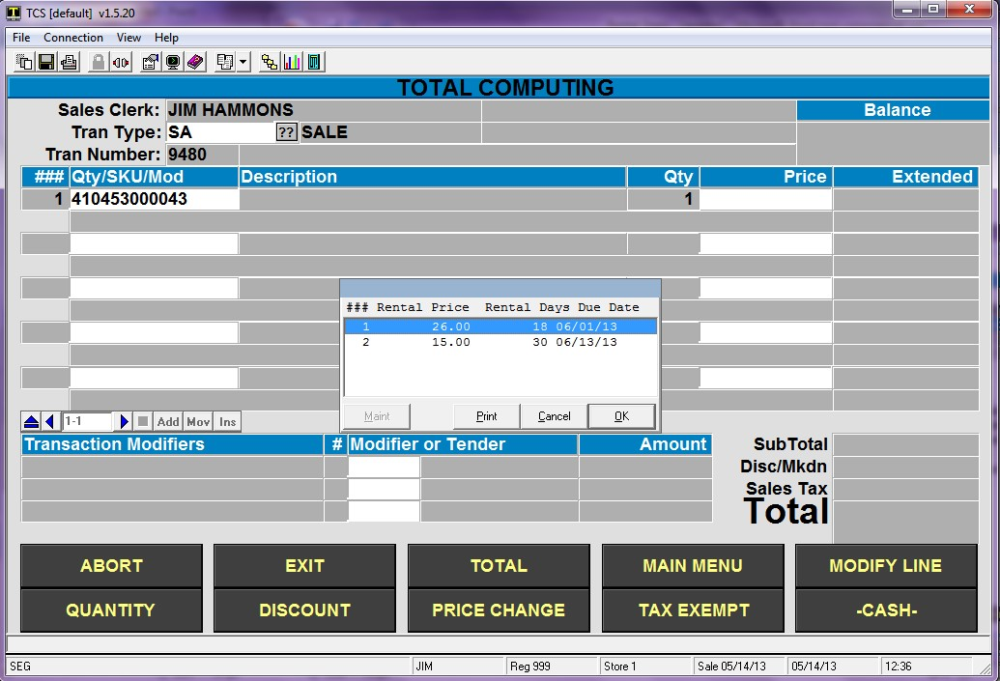

1. Scan the serial number and press enter.
2. The register will bring up a small window with rental price, rental days and due date which you created before in POS-27-1 (setting up rentals)
3. Select the option for number of days you wish to rent the item and press “OK”. This option only appears if the item has multiple rental periods.
4. Now you get the customer information screen. If it is a new customer, you can enter an N to create a new customer record. If it is an existing customer, enter the name or account number and select the appropriate customer.
5. Enter all the required fields in the customer information screen. Once you are done, hit enter and it will bring you the card or account details screen.
6. Enter the appropriate information for the payment guarantee method you have chosen.
7. At this point, you can complete the transaction, or continue to enter additional items for this sale.
    1. You will only see the customer screen once per transaction.
8. Once you are done, total the transaction and enter the tender type.
9. Once the tender is processed you are done with the transaction.
10. If you want to cancel the transaction select the ‘EXIT’ or “ABORT” key.
11. Rental transactions may be Postvoided or returned if necessary. Do not do a return for a drop off.
12. Serialized do not see the “This book is available to rent” message shown on the prior screen. (With
    1. Dynamic the ISBN barcode is scanned, with Serialized the serial number barcode is scanned.)

## Dropping Off a Rental Item

### Dynamic Rental Drop off at the Register

1. Press your DropOff key or type |DDROP and press enter. It will take you to the Dynamic Rental Drop off screen. (If a key is not on your keyboard, contact support to help set one up)
2. Enter the customer name or account number and select the correct customer.
3. Scan the SKU of the item. If the SKU matches the SKU displayed on the drop off screen it will then display a list of the condition codes available for returning the book.
4. Chose the appropriate code and press enter.
5. The system will prompt for another SKU to return. Press Enter or “OK” if no more items are being returned.
6. Select “P” to post the return and the system will take you back to the transaction screen.
7. If the item is past due then the number of days past due and the late fee are automatically calculated and displayed on the transaction screen.
8. You can complete the transaction for any late fees or you can make adjustments, ring up additional items, etc. before tendering.
9. Once the drop off transaction is complete, the item is automatically returned to inventory.

### Serialized Rental Drop off at the Register:

1. Start a regular Sale transaction (this is not a Return unless you are turning all amounts paid for the rental)
2. Press the DropOff key/button or type |DROP and press enter. It will take you to the Serialized Rental Drop off screen. (If a key is not on your keyboard, contact support to help set one up)
3. Scan the serial number.
4. Scan the SKU of the item if the bar code is visible. Otherwise manually enter the SKU. If the SKU matches the SKU assigned to the serial number entered it displays the message as SKU matched. Then enter the return date.
5. Enter the condition code of the book.
6. Hit enter a couple of times and it will take you back to the transaction screen.
7. If the item is past due then the number of days past due and the late fee are automatically calculated and displayed in the transaction screen.
8. You can then add any additional books, adjust late fees as necessary as well as ring up additional items, etc. all in the same transaction.
9. Tender out the transaction to complete the drop off
10. Once the drop off transaction is complete, the Status for the item on the POS-27-2 (Rent Detail) screen is changed to ‘I’ and the return date and return condition of the book is also displayed.
11. You can do multiple drop offs in the same transaction as well as sell other merchandise.

## Returning a Rental Item

In some instances, a customer may wish to return a rented item within your grace period. This process will work like other returns, and allow you to reverse any charges or refund any cash payments.

### Returning a Dynamic Rental Item

1. Select the appropriate return transaction at the register.
2. Scan the SKU or ISBN of the item – then confirm that the item was rented.
3. Select the appropriate customer for the return – the system will return you to the register screen
4. Complete the return transaction as normal.

### Returning a Serialized Rental Item

1. Select the appropriate return transaction at the register
2. Scan the Serial Number of the item – it will process like any other return transaction.

## Charge a Non-Returned Rental (Dynamic)

This process is done when the item is rented but not returned. This process will charge the customer’s guarantee method with any late fees plus the replacement price. (If a key is not on your keyboard, contact support to help set one up)

1. Start a regular sale transaction.
2. Press your Purchase key or enter |PURCH and press enter.
    1. Some customers may have this as |PURCHASE
3. Enter the customer account number or search by their name by typing a ; and then their first, last or entire name
4. Enter the ISBN of the book to be purchased.
    1. If the customer has additional dynamic rentals that need to be purchased then those ISBN numbers can be entered at this time.
    2. After all ISBN items have been entered press enter and then a ‘P’ to post the items on the register screen.
5. The register will show the customer information and any late fees.
6. Make sure the amount is correct.
7. Press the Total key.
8. If the customer is not present then enter COF (Card On File) as the tender and press enter.
9. You will now see the customer details, make sure it is the right customer before proceeding.
10. Press enter and it will automatically process the credit card or the customer account with the amount shown.
11. After the transaction is completed the status will be updated to ‘P’ (Purchased) in the rent detail screen.
12. If the customer is present and has decided to purchase the book then proceed with normal tender operations.

## Charge a Non-Returned Rental (Serial)

1. Start a Sale transaction
2. Press your Purchase key or enter |PURCH and press enter.
    1. Some customers may have this as |PURCHASE
3. Enter the serial number for serialized rentals
4. The register will show the customer information and any late fees.
5. Make sure the amount is correct.
6. Press the Total key.
7. If the customer is not present then enter COF (Card On File) as the tender and press enter.
8. You will now see the customer details, make sure it is the right customer before proceeding.
9. Press enter and it will automatically process the credit card or the customer account with the amount shown.
10. After the transaction is completed the status will be updated to ‘P’ (Purchased) in the rent detail screen.
11. If the customer is present and has decided to purchase the book then proceed with normal tender operations.

## Converting Sale item to a Serialized Rental Item (RSI)

1. Press your Convert Item key or type |RSI and press enter it will take you to the Master Maintenance Screen.
2. Enter ‘.’ to generate a new Rental SKU.
3. Scan the SKU/ISBN of the sale item.
4. If the item exists in another Master SKU the system will indicate what Master SKU(s).
5. If the item is part of a Dynamic Master SKU then you will not be able to create a new SKU.
6. If there is no master, continue creating the new master SKU for this item as described above.
7. Create a single serial number.
8. Note the number that was created.
9. You can now enter that number on the POS screen and rent the item.

## Converting Serialized Rental Item(s) to Sale Item(s): POS-27-5

1. Enter the master SKU for the rental item.
2. Enter the range of serial numbers you wish to convert.
3. Enter N for new books or U for used books.
4. Enter the appropriate store number.
5. Pick the appropriate option to complete the process.
6. The number of items removed from inventory will be displayed.
7. Press enter to exit the process.

**Note:** This can be done at the register for an individual item using the following procedure if necessary, although it is not recommended

1. Scan the serial number of the rental item.
2. Enter the customer and guarantee information as illustrated above. This information will not be used when the rental item is converted to a sale item, but must be entered to return to the register screen.
3. Enter |SRI
4. This will bring a window with NEW, USED and Replacement Price of the item.
5. Select the price.
6. The rental transaction will be reversed and the appropriate ISBN entered on the screen.
7. Now you will be able to sell the item.
8. After the transaction is completed the status of this item will be ‘S’ (Sold) in your Rent Detail Screen.

### Setting Email Subject and Body: POS-27-21 A video covering these and other back office steps can be found [here](https://youtu.be/FDYpbAfwmtM).

1. You will find three options for setting up emails on the rental parameters screen

E1-Pre Notice (Emails Due), E2- Past Due (Emails past due), E3- Purchase (Email that Guarantee

Method was Charged)

1. Choose option E1 for sending emails for rental items coming due.
2. Enter the Subject which you wanted to appear on the Email.

For example Email Subject : TCS Rental Return Notice

1. Enter the text you want to send in the Email.
2. Once you are done with the text enter the command =BODY in a new line.
3. You can also have text after the Body which appears at the end of your Email.

For Example: Thanks for your business with TCS.

1. When you have finished with the email, press enter on a blank line to finish and return to the Parameters screen. Press enter to save your changes.
2. TCS rental Software will automatically attach the Rental Serial number, Item title, Author, Cost, due date, Replacement price, and late fee charge when sending the emails.

**The procedure is the same for the other options E2 and E3.**

## Sending Emails: POS-27-23

1. As discussed before, the emails can be sent to customers with items coming due, with items past due and where their guarantee method has been charged.
2. Select 1 to send emails for items coming due.
3. Enter the store number, date and run the process
4. The emails are automatically sent to the customers whose items are due by the date.
5. The same procedure is followed for emails past due and emails charged card.

## Reports: POS-27-25

For all the reports enter the store number, date if required and run the report.

1. Report for the rental items which are due by a specific date POS-27-25-1
2. Reports for rental Items which are past due by a specific date POS-27-25-2
3. Reports for rental items whose Guarantee Method is charged POS-27-25-3
4. Reports for the Master List of rental items POS-27-25-4
5. Reports for Daily Rentals POS-27-25-5
6. Reports for Daily Returns POS-27-25-6
7. Reports for rental items which are currently in store or whose Status is ‘I’ POS-27-25-21
8. Report for rental items which are sold for Serialized Rentals POS-27-25-22
9. Report for rental items which are sold for Dynamic Rentals POS-27-25-23
10. Report for rental items which are retired. POS-27-25-24
11. Report for rental inventory POS-27-25-25
12. Report for Daily Dropoffs POS-27-25-26
13. Report for Daily Rentals and Returns POS-27-25-27

## Setting up Item Retirement: POS-27-4

1. When you think the item is no longer rentable or is in a very bad condition then you need to use the Item Retirement screen.
2. Enter the serial number of the item to be retired.
3. Enter the retirement date. You can use ‘0’ for today’s date.
4. Enter the retirement reason.
5. Save the screen and once you are done then it will automatically change the Status of this item as ‘R’ which means the item is retired and you cannot rent the item.
6. This is helpful in keeping track of your rentable quantity.

<PAgeFooter />
