# Returns Process

<PageHeader />

After you have sold books for your term, you can return extra books and books that were shipped incorrectly to the vendors, if the vendors allow this. This section covers the functions used in this process.

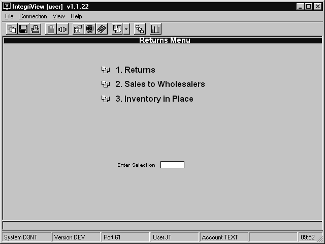

## The Returns Menu

The Returns Menu contains functions dealing with the return of books to vendors. This section covers these functions.

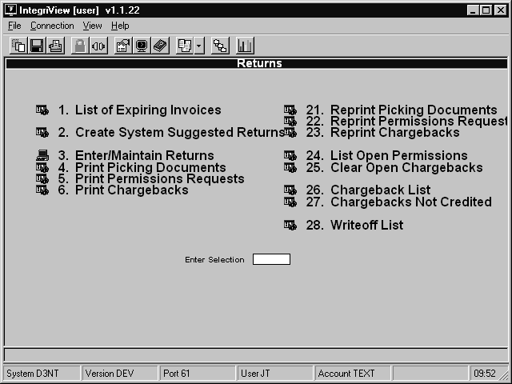

### Printing a List of Expiring Invoices

To print a list of invoices that will be expiring shortly, follow these steps.

1. From the CourseTrak Main Menu, select the **Returns** option followed by the **Returns** option and the **List of Expiring Invoices** option to get to the Return Sort Parameters screen _(TX-04-01-01)_.
   - 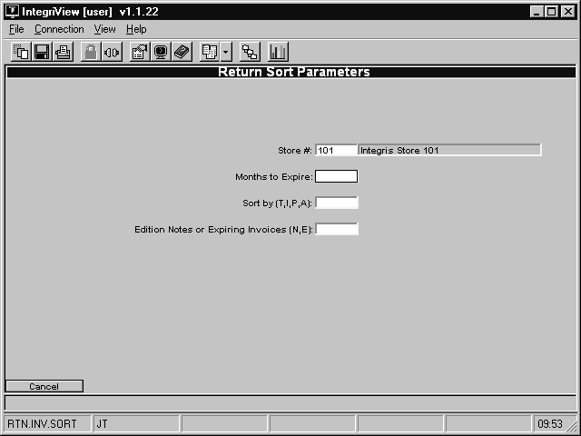
2. The **Store** field is automatically filled with the default store for the user. To change it, enter “<” followed by the store number. For a list of stores, enter “??” in the store field.
3. In the **Months to Expire** field. Enter the greatest number of months before an invoice expires that you want to include on this report.
4. In the **Sort by** field, enter “T” to sort by title, “A” to sort by author, “I” to sort by ISBN, or “P” to sort by PO line number.
5. In the **Edition Notes or Expiring Invoices** field, enter “N” to select by edition notes, or “E” to select by expiring invoices.
6. Enter “Y” to run the report or “X” to cancel.

### Creating System Suggested Returns

To create system suggested chargebacks, follow these steps. If you wish to delete one or more chargebacks, you can do so from the Chargeback Maintenance screen.

Note that system suggested returns exclude any quantity to cover _for all open_ terms from being added to a return. If you purchased 10 of a title from the vendor and have a quantity to cover of 10, the suggested return will not include that title. If you have a QTC of 8 then the suggested return will only suggest 2.

If you want to override this behavior you may do so in TX-SU-2-5 (Return Parameters). If you place a Y in the "Suggest Returns Ignore QTC" field then the system will ignore any current/future need for a title and suggest a quantity up to the total amount you have purchased from that vendor.

1. From the CourseTrak Main Menu, select the **Returns** option followed by the **Returns** option, the **Create System Suggested Returns** option _(TX-03-01-02)_.
   - 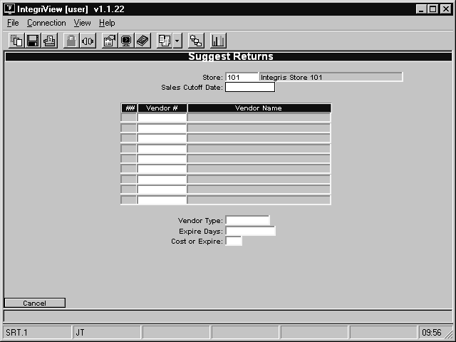
2. The **Store** field is automatically filled in with the default for the user. To change it, enter "<" followed by the new store number. For a list of stores, enter "??" in the **Store** field.
3. In the **Sales Cutoff Date** field, enter the last date of sales that you want to take into account when calculating the number of books to return. If you don’t want to limit the returns created by date, leave this field blank.
4. In the **Vendor #** fields, enter the vendors for which you want to create suggested returns. If you wish to create returns for all vendors, leave these fields blank.
5. In the **Vendor Type** field, enter the vendor type for which you want to create suggested returns. If you do not wish to limit by vendor type, leave this field blank.
6. In the **Expire Days** field, enter the maximum number of days before an invoice expires for the invoice to be included in the suggested returns.
7. In the **Cost or Expire** field, enter “C” to select invoices based on cost or “E” to select invoices based on expiration date.
8. Enter “Y” to create suggested returns.

### Creating a Manual Chargeback

To enter a chargeback into the system manually, follow these steps.

1. From the CourseTrak Main Menu, select the **Returns** option followed by the **Returns** option and the **Enter/Maintain Returns** option to get to the Return Maintenance screen _(TX-04-01-03)_.
   - 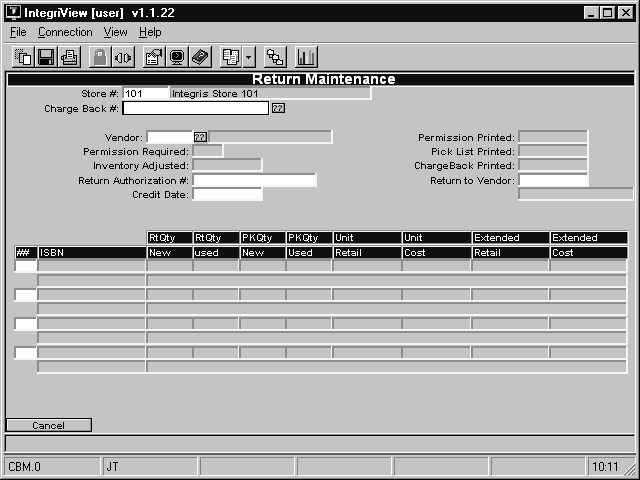
2. The **Store** field is automatically filled in with the default for the user. To change it, enter "<" followed by the new store number.
3. In the **Charge Back #** field, enter the chargeback you want to modify or enter “.” to create a new chargeback.
4. In the **Vendor** field, enter the vendor for which you are entering a return.
5. In the **Return Authorization** field, enter the return authorization number given to you by the vendor, if it applies.
6. In the **Return to Vendor** field, enter the alternate vendor to which the books should be returned.
7. Enter “A” to add a new book to the return.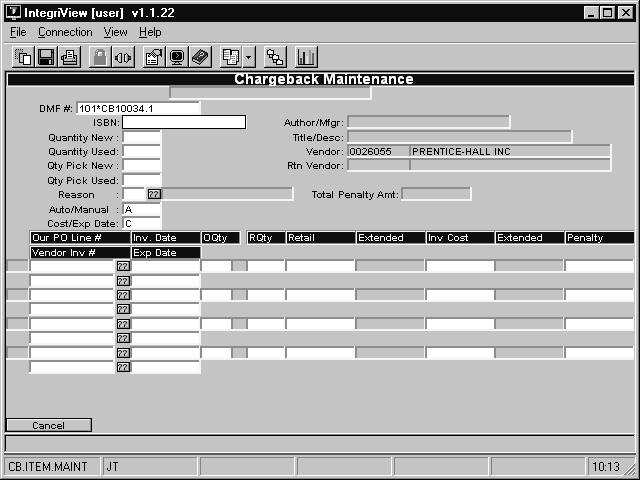
8. In the **ISBN** field, enter the ISBN for the book you want to select. If you aren't sure of the ISBN, you can search for it by entering "\[AUTHOR\]/", "\[TITLE\]", or "\[AUTHOR\]/\[TITLE\]".
9. In the **Quantity New** field, enter the new quantity that you want to return.
10. In the **Quantity Used** field, enter the used quantity that you want to return.
11. In the **Qty Pick New** field, enter the new quantity that you want to return.
12. In the **Qty Pick Used** field, enter the used quantity that you want to return.
13. In the **Reason** field, enter the reason code for this return. For a list, enter “??”. For more information, see section Return Reason Codes in the CourseTrak Setup Guide.
14. In the **Auto/Manual** field, enter “A” to automatically select invoice numbers or “M” to manually select them.
15. In the **Cost/Exp Date** field, enter “C” to select invoices by cost or “E” to select them by expiration date.
16. In the **Our PO Line #** field, enter the purchase order and line number for the item.
17. In the **Vendor Inv #** field, enter the vendor’s invoice number for the item.
18. In the **RQty** field, enter the quantity you wish to return.
19. In the **Inv Cost** field, enter the cost of the item you are returning.
20. In the **Penalty** field, enter the vendor penalty charge for returning books.
21. Press \[ENTER\] to save changes to the book or enter “X” to cancel.
22. Press \[ENTER\] to save changes to the chargeback or enter “X” to cancel.

### Printing a Picking Document

To print a picking document for your returns, follow these steps.

1. From the CourseTrak Main Menu, select the **Returns** option followed by the **Returns** option and the **Print Picking Documents** option to get to the Print Shipping Document screen _(TX-04-01-04)_.
   - 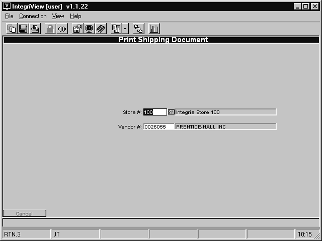
2. The **Store** field is automatically filled in with the default for the user. To change it, enter "<" followed by the new store number. For a list of stores, enter "??" in the **Store** field.
3. In the **Vendor** field, enter the vendor for which you want to print the picking document. Leave this field blank for all vendors.
4. Enter “Y” to run the process or “X” to cancel.

### Printing Return Requests

To print requests for your returns, follow these steps.

1. From the CourseTrak Main Menu, select the **Returns** option followed by the **Returns** option and the **Print Permissions Requests** option to get to the Print Shipping Document screen _(TX-04-01-05)_.
   - 
2. The **Store** field is automatically filled in with the default for the user. To change it, enter "<" followed by the new store number. For a list of stores, enter "??" in the **Store** field.
3. In the **Vendor** field, enter the vendor for which you want to print the requests. Leave this field blank for all vendors.
4. Enter “Y” to run the process or “X” to cancel.

### Printing Chargebacks

To print your returns, follow these steps.

1. From the CourseTrak Main Menu, select the **Returns** option followed by the **Returns** option and the **Print Chargebacks** option to get to the Print Shipping Document screen _(TX-04-01-06)_.
   - 
2. The **Store** field is automatically filled in with the default for the user. To change it, enter "<" followed by the new store number. For a list of stores, enter "??" in the **Store** field.
3. In the **Vendor** field, enter the vendor for which you want to print the chargebacks. Leave this field blank for all vendors.
4. Enter “Y” to run the process or “X” to cancel.

### Reprinting Picking Documents

To reprint your picking documents, follow these steps.

1. From the CourseTrak Main Menu, select the **Returns** option followed by the **Returns** option and the **Reprint Picking Documents** option to get to the Reprint Document screen _(TX-04-01-21)_.
   - 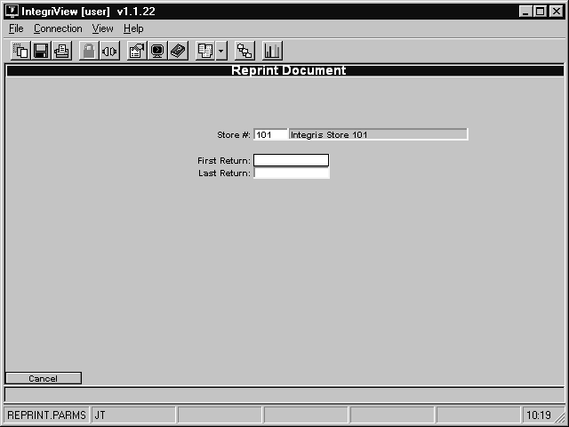
2. The **Store** field is automatically filled in with the default for the user. To change it, enter "<" followed by the new store number. For a list of stores, enter "??" in the **Store** field.
3. In the **First Return** field, enter the first return you want to print. For all returns, leave this blank.
4. In the **Last Return** field. Enter the last return you want to print. For all returns, leave this blank.
5. Enter “Y” to print or “X” to cancel.

### Reprinting Permissions Requests

To reprint your permissions requests, follow these steps.

1. From the CourseTrak Main Menu, select the **Returns** option followed by the **Returns** option and the **Reprint Permssions Requests** option to get to the Reprint Document screen _(TX-04-01-22)_.
   - 
2. The **Store** field is automatically filled in with the default for the user. To change it, enter "<" followed by the new store number. For a list of stores, enter "??" in the **Store** field.
3. In the **First Return** field, enter the first return you want to print. For all returns, leave this blank.
4. In the **Last Return** field. Enter the last return you want to print. For all returns, leave this blank.

5. Enter “Y” to print or “X” to cancel.

### Reprinting Chargebacks

To reprint your chargebacks, follow these steps.

1. From the CourseTrak Main Menu, select the **Returns** option followed by the **Returns** option and the **Reprint Chargebacks** option to get to the Reprint Document screen _(TX-04-01-23)_.
   - 
2. The **Store** field is automatically filled in with the default for the user. To change it, enter "<" followed by the new store number. For a list of stores, enter "??" in the **Store** field.
3. In the **First Return** field, enter the first return you want to print. For all returns, leave this blank.
4. In the **Last Return** field. Enter the last return you want to print. For all returns, leave this blank.
5. Enter “Y” to print or “X” to cancel.

### Listing Open Permissions

To print a list of open return permissions, follow these steps.

1. From the CourseTrak Main Menu, select the **Returns** option followed by the **Returns** option and the **List Open Permissions** option _(TX-04-01-24)_.
   - 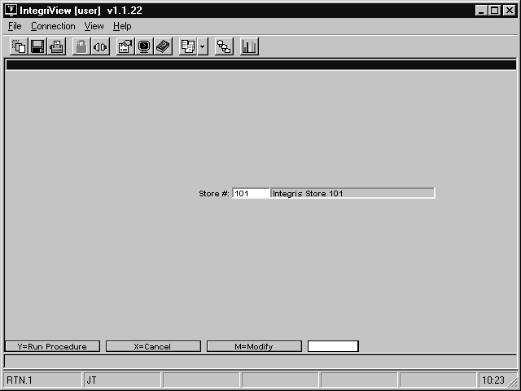
2. The **Store** field is automatically filled with the default store. To change it, enter “M” followed by the store number.
3. Enter “Y” to print the report or “X” to cancel.

### Clearing Open Chargebacks

To delete chargebacks that have not yet been printed, follow these steps.

1. From the CourseTrak Main Menu, select the **Returns** option followed by the **Returns** option and the **Clear Open Chargebacks** option to get to the Clear Open Chargebacks screen _(TX-04-01-25)_.
   - 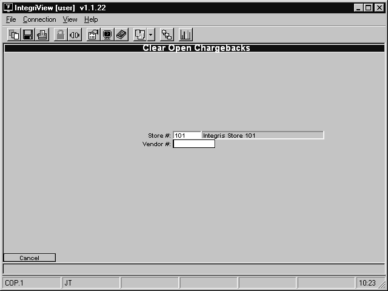
2. The **Store** field is automatically filled in with the default for the user. To change it, enter "<" followed by the new store number. For a list of stores, enter "??" in the **Store** field.
3. In the **Vendor** field, enter the vendor for which you want to delete chargebacks. For all vendors, leave this field blank.
4. Enter “Y” to run the process or “X” to cancel.

### Printing a List of Chargebacks

To print a list of chargebacks, follow these steps.

1. From the CourseTrak Main Menu, select the **Returns** option followed by the **Returns** option and the **Chargeback List** option to get to the Chargeback Listing Report screen _(TX-04-01-26)_.
   - 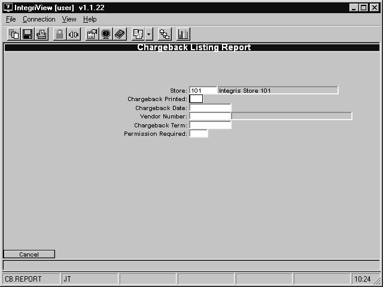
2. The **Store** field is automatically filled in with the default for the user. To change it, enter "<" followed by the new store number. For a list of stores, enter "??" in the **Store** field.
3. In the **Chargeback Printed** field, enter “Y” if you want to include only chargebacks that have been printed. Otherwise, enter “N”.
4. In the **Chargeback Date** field, enter the earliest date that you want to include. If you don’t wish to limit by date, leave this field blank.
5. In the **Vendor Number** field, enter the vendor that you want to include. If you don’t wish to limit by vendor, leave this field blank.
6. In the **Chargeback Term** field, enter the term that you want to include. If you don’t wish to limit by term, leave this field blank.
7. In the **Permission Required** field, enter “Y” if you want to print only chargebacks that require permission. Otherwise, enter “N”.
8. Enter "Y" to run the process, or "X" to cancel.

### Writeoff List

To print a writeoff list, follow these steps.

1. From the CourseTrak Main Menu, select the **Returns** option followed by the **Returns** option and the **Writeoff List** option to get to the Return Sort Parameters screen _(TX-04-01-27)_.
   - 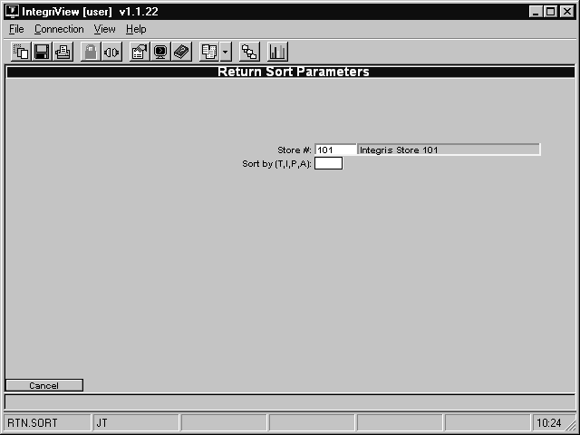
2. The **Store** field is automatically filled in with the default for the user. To change it, enter "<" followed by the new store number. For a list of stores, enter "??" in the **Store** field.
3. In the **Sort by** field, enter “A” to sort by author, “T” to sort by title, “I” to sort by ISBN or “P” to sort by PO line number.
4. Enter "Y" to run the process, or "X" to cancel.

<PageFooter />
