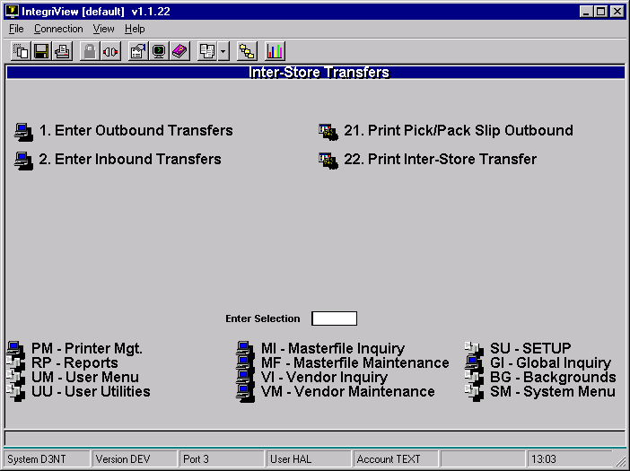
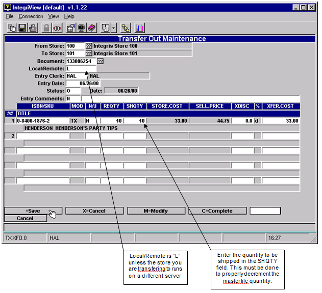
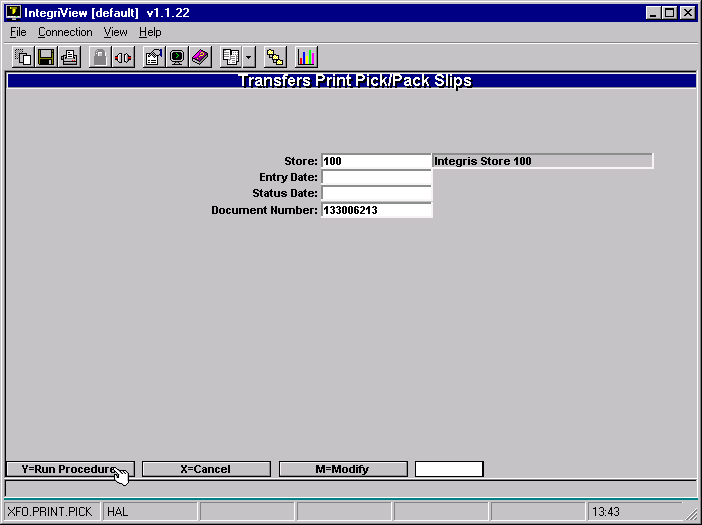
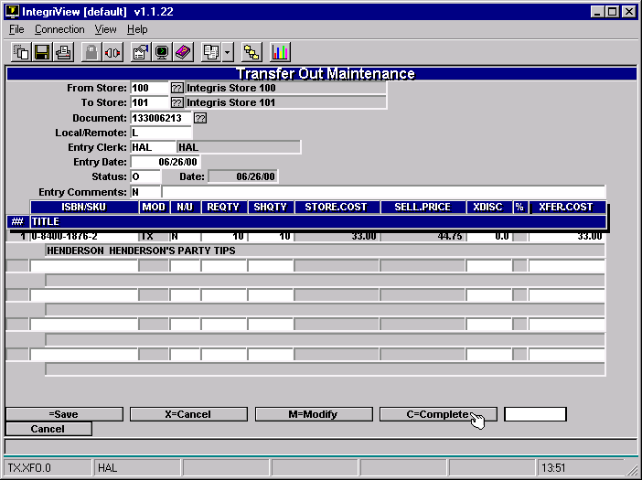
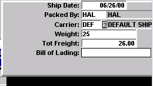
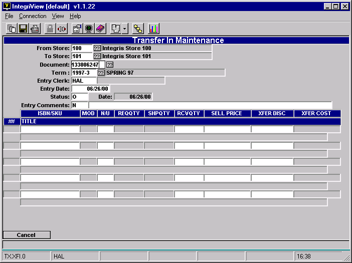
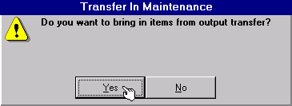
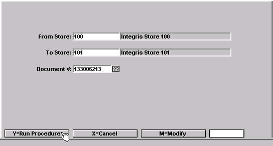
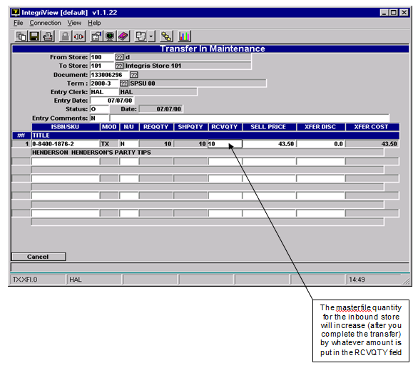
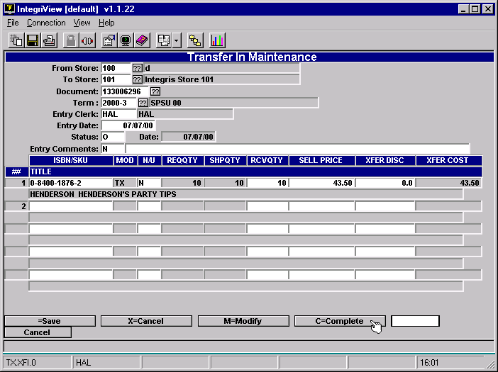

# Store Transfers

<PageHeader />

Go to the Transfers Menu.

- TX-22 for Text
- GM-24 for GM

Both an Outbound Transfer and an Inbound Transfer must be done.

**Outbound Transfers** are created by the store sending items to another store. This decrements the inventory of the sending store (This does not increment inventory of receiving store.)

**Inbound Transfers** are created by the store receiving items from another store. This increments the inventory of the receiving store. (This does not decrement inventory of sending store.)

Transfers proceed as follows:

The sending store follows the steps for **Outbound Transfers**:

1. Create New Outbound Transfer
2. Print Pick/Pack Slip
3. Pull Textbooks to be Shipped
4. Complete Outbound Transfer

The store receiving the items follows the steps for **Inbound Transfers**:

1. Create New Inbound Transfer
2. Pull In Transfer Record
3. Complete the Transfer

This document is split into sections for Outbound Transfers and Inbound Transfers.

## Outbound Transfers

These steps are explained in detail:

### Create Transfer

Choose menu option 1

Enter store number you are transferring to

- Enter “.” in the Document field
- **Enter “L” in the Local/Remote field**
- Fill out the rest of the fields appropriately, entering each ISBN/SKU to be transferred in the ISBN/SKU field. Use the help messages to assist you.
- Enter the quantity to be shipped in the SHQTY field
- Now write down the document number (found in the Document field) and save the document

#### Print Pick/Pack Slip

In the Transfers menu choose Print Pick/Pack Slip Outbound, menu option 21

- Leave Entry Date and Status Date fields blank
- Enter the document number (that you wrote down) in the Document Number field
- Hit “Y” to run report and choose a printer in Output Options

This will allow you to look over the list of textbooks that you entered into the transfer document. You can go back into Outbound Transfers and make modifications to the transfer if necessary.

Pull Items to be Shipped

Simply pull the items on the Pick/Pack Slip from the shelf and prepare them to be shipped.

#### Complete Outbound Transfer

Go back into Outbound Transfers, menu option 1 in the Transfers menu.

- Enter the receiving store’s number in the To Store field
- Enter the document number in the Document field
- Hit “C” to complete the Transfer

This window appears:

Fill in the information as needed.

At this point the inventory will be decremented from the masterfile of the outbound store. Send the pack slip (step 3) with the inventory. When the other store receives the inventory, it must follow the steps for an inbound transfer.

## Inbound Transfers

These steps are explained in detail:

### Create New Inbound Transfer

Choose menu option 2 from the Transfers menu.

- Enter Store numbers
- Enter “.” in the Document field
- Enter the rest of the fields appropriately

Pull in Transfer Record After hitting Enter in the Entry Comments you will be asked:

 Choose Yes

Now this window will come up:

- Enter the document number on the packing slip that came with the inventory (created by the outbound transfer)
- Hit “Y”

The ISBNs will come in automatically.

Enter the quantity you received for each item in the RCVQTY field

#### Complete the Transfer

You can hit “>” and then hit Enter to advance to the options at the bottom.

- Hit “C” to complete

The Inbound Transfer is now finished and the inventory is updated.

<PageFooter />
