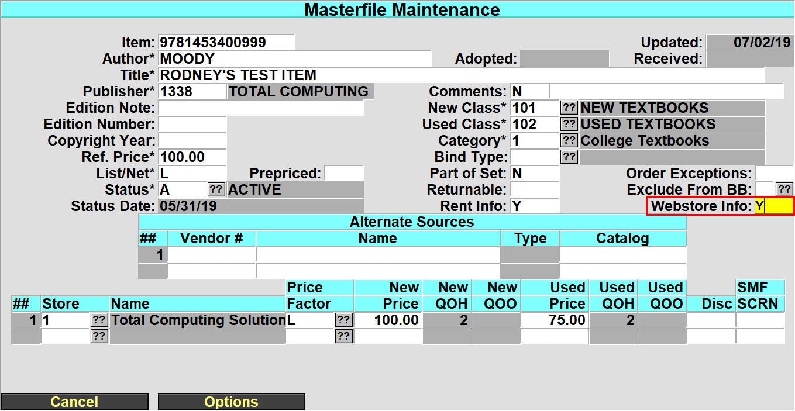
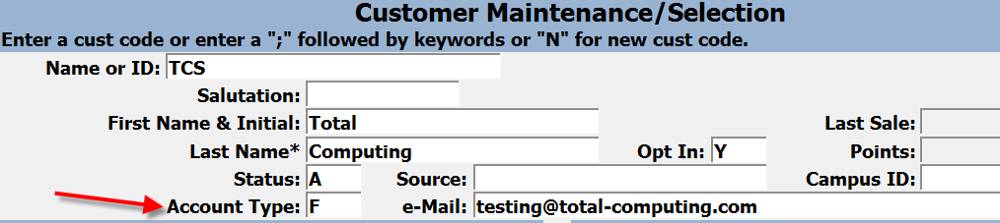
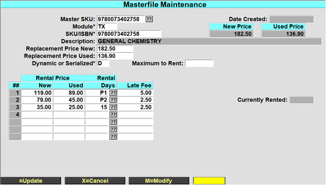

# Textbook Training"

<PageHeader />

An old version of the guide is available [here](https://training.total-computing.com/wp-content/uploads/coursetrak.pdf) with some information that is missing from this guide.

## Creating Terms

1. Make sure there is an Active Buyback Season. (Season codes are necessary for setting up a calendar and the calendar must be filled out when setting up a term.)
    1. Go to Season Maintenance. (TX-SU-1-1).
        1. You should be in the screen shown.

- If there is not an active buyback season, enter a new one. (If the End Date is after today’s date, then it is still active.)
    1. Choose ‘M’ to Modify
    2. Navigate to the next empty Season Code field
    3. Enter the code for the new/next buyback season
        - Check the section on Buyback Seasons for more information on this screen.
        - Whether or not you buyback textbooks from the students, there must always be an active buyback season for the ordering process to work properly. Also note, in the field entitled: _Buying Terms_, you can put multiple terms on a particular season, but never put a particular term on more than one season.

### Open a New Term

1. Go to Term Maintenance, menu path: SU-1-2-1.You should see the screen shown.
    - If this is the first term you are entering, it will ask ‘Item not on file, Do you wish to add or copy?’ Choose ‘Add’.
      - 
2. Add a new term to this list
    1. Choose ‘M’ to Modify
    2. Navigate to the first empty Term field and enter the Term code you would like to use.
        1. Term names must be in the format of 4 numbers ‘-’ 1-2 numbers. Example 2017-4 or 2017-04.
    3. The Status will automatically come up with ‘O’ for open.
    4. The next field that you enter is description of the term such as FALL17.
    5. The next field is the INDEX field. It is a short cut when entering a term, rather than entering 2017-1 you could just enter the index such as F17.
    6. After you enter the INDEX field, you will be brought to a new screen: **Calendar Maintenance.**
        1. Enter a date in each field according to when you think each activity will begin.
        2. Note that the only required fields are Class Start Date and Buyback Season Code. The rest of the fields are optional and are covered in greater detail in the [Calendar Maintenance](#post-243-_1t3h5sf) section.
        3. Be sure and enter the active Buyback Season Code (Obtained from Step 1 at the top of this document.)
            - Note that only the Class Start Date and Buyback Season Code fields are required. All other fields are optional and can be filled out later.
            - 
    7. After you fill out the Calendar Maintenance, you need to answer ‘Y’ or ‘N’ if you want to **display** this term on the web.
    8. Then next field is the ‘Allow Buy’, enter a ‘Y’ to allow **purchasing** on the web.
    9. Enter a ‘Campus Code’ to allow multiple campus selections on the web.
    10. Finally enter the beginning dates that ‘Ordering’ and ‘Selling’ will start.

Now save the changes in Term Maintenance and you are finished setting up a new term.

### Closing a Term

Closing a Term is a one step process. It is recommended that you do this shortly after rush. Note that you may still sell on a closed term.

- Select the Close Term Menu. (TX-SU-1-2-2).
    1. You should be in this screen.
    2. Make sure Store is correct.
    3. Type in the Term you wish to close or select the ‘??’ selection button and select the term you wish to close.
    4. Enter ‘R’ to run the process or select the ‘R=Run Procedure’ button. The rest is taken care by the system.

## Buyback Seasons

### Creating Buyback Seasons

A buyback season is defined by its ending date. The day after the ending date serves as the beginning date for the next buyback season. There must always be an active Buyback Season. When a Buyback season expires, it automatically goes to the next one on the list that has not expired yet.

Go into Season Maintenance (TX-SU-1-1).

Assign a code to identify the buyback season and enter the season’s end date.

1. The ‘Buy for Terms’ is maintained in the ‘Calendar Maintenance’ when you entered the ‘Buyback Season Code’.

Note: If you do not do buyback at your store then you only need to put in the Buyback Season once. Just put the _End Date_ far into the future several years, so that it will not expire.

### Close Buyback

At the season end, it automatically switches to the next Buyback Season. It also switches from estimated buyback to the actual buyback for ordering calculations.

## Academic Calendar

The Academic Calendar (TX-SU-1-3) is used to help you plan and keep track of store processes throughout the semester. Although you are required to enter the Class Start Date and the Buyback Season Code, the rest of the information is optional, and is entered for your reference only.

The FIRST and LAST columns fill in automatically

1. Class Start Date: Enter the date that classes start.
2. Class End Date: Enter the date that classes end.
3. Rush begin: Enter the date that rush begins
4. Rush End: Enter the date that rush ends.
5. Cancel PO date: Enter the date to cancel PO’s after for the term. When creating PO’s it will put this date automatically in the screen so you don’t have to enter it.
6. Courses Expected: Enter the number of courses expected to adopt for the term
7. Courses Adopted: This field will be incremented as courses are adopted. This is a display only field
8. Titles Expected: Enter the number of Titles expected to adopt for the term.
9. Titles Adopted: This field will be incremented as titles are adopted. This is a display only field.
10. The rest of this screen except for the buyback season is for scheduling purposes only. You enter the date that each task is supposed to be started. The system will put in the first date as each task is done and the last date that it was done. You then can go back and see if things were started on time.
11. Buyback Season Code: This is where you enter the buyback season code for the term. A ‘??’ will bring up all the season codes that have been entered. This is a required field and needs to be filled out.

## Academic Departments

In order to enter adoptions you need to enter the academic departments for your college.

1. Go to Department Maintenance (TX-SU-1-6-2).
2. For each department enter in a department code, for example ‘MATH’.
3. Enter in a description of the department, for example ‘Mathematics and Statistics’.
4. The rest of the information is optional.

## Academic Courses

In order to enter adoptions you need to enter the academic courses for you college.

1. Go to Course Maintenance (TX-SU-1-6-3) make sure the store is correct.
2. Enter the department code, for the department the course is under.
3. In the Course field enter the Course number.
4. Enter in a description of the course, for example ‘College Algebra’.

## Wholesale Buying Guide

### FCR

#### Wholesale Guide Functions

Before conducting buyback or beginning adoption entry, the Wholesale Guide must be updated or loaded onto the store system.

#### Wholesale Guide Update

The Wholesale Guide Update will occur depending on the wholesaler’s update intervals (when the wholesaler issues a revised database). This function can be processed to load the entire Wholesale Guide or just post changes from the previous update.

#### Update Process for FCR Guide ONLY

The Wholesale Guide Update process will usually follow this sequence of events:

1. On the FCS RS6000 host system, in the ADMIN account, there is a function to Convert Wholesale Guide. This must be run when the initial Wholesale Guide file is loaded onto the host system in UNIX. This program will convert the Wholesale Guide file from the Fixed Length field format to a PICK file. This file is in the UNIX directory ‘/fcs/comm/bluebook/’ and is named ‘rbbk.int’. There is also list of ISBN’s in ‘risxr’ in the same directory. It is important that these files are in this directory, or make changes to the program.
2. Once the Wholesale Guide file is converted into PICK format in the ADMIN account, it resides in a file called FCR.BLUE.BOOK. This file is in the identical format as the TX.FCR.BOOK on the local TEXT accounts.
3. Each store will then run a process in Text Maintenance to Update the Wholesale Guide file. This process will open a connection to the host system and download the FCR.BLUE.BOOK file and run a program to overlay or update the current TX.FCR.BOOK file. On a complete update, this file will take about 45 minutes to download.
4. Once the TX.FCR.BOOK file is updated, the connection to the host is closed and the coordination process takes place. On a complete update, this process may take about 1 hour to do a complete coordination.

As the Wholesale Guide on the system expires there will appear a box in the Buyback menu showing the valid date range for the current Wholesale Guide. It is highly recommended that the Wholesale Guide is updated promptly once the old one expires, as this gives accurate prices and publisher information, as well as any ISBN changes.

To update the Wholesale Guide from the host you must go to menu option TX-24-21 (Text maintenance-Update Wholesale Guide). This will pull the Wholesale Guide data from the host system down into the local Wholesale Guide file.

#### Wholesale Guide Coordination

Once the new Wholesale Guide is on the system, the coordination process can be done automatically or manually. The Coordination process will update the store’s local Master File database with the Wholesale Guide information. The following may be optionally updated at the time the coordination takes place:

**Update Publisher Reference Price Changes (Y/N):** Default will be yes.

**Update Publisher Changes (Y/N):** Default will be no.

**Update ISBN Changes (Y/N):** Default will be yes.

**Update Retail Prices (Y/N):** Default will be no. If yes, current retail prices will be updated based on the latest publisher reference prices and the default retail pricing factor.

Once the Wholesale Guide Coordination process is done, there are some Coordination reports that may be printed. These are accessed in the Reports Menu-Coordination Reports.

 

#### Reports

##### Price Changes

This report gives a list of items that have a publisher’s reference change from the local database. This also lists any retail price changes as well as current quantities on hand.

##### Publisher Changes

If there were any publisher changes made during the coordination process, this report will give a listing of the affected items.

##### New Edition Notices

This shows a listing of items that have new edition notices.

##### Unmatched Titles List

This report will give a listing of titles in the local master file database that do not exist in the Wholesale Guide file. This may be useful in updating the database by getting rid of unnecessary titles.

##### Titles Matched by ISBN Only

This title will give a listing of titles in the Wholesale Guide that were not updated into the local master file because there was a discrepancy between local titles/authors and the Wholesale Guide titles/authors.

##### ISBN Changes

If there were any changes made to ISBNs in the Wholesale Guide database, these will be listed.

### NBC

#### Wholesale Guide Functions

Before conducting buyback or beginning adoption entry, the Wholesale Guide must be updated or loaded onto the store system.

#### Wholesale Guide Update

The Wholesale Guide Update will occur depending on the wholesaler’s update intervals (when the wholesaler issues a revised database). This function can be processed to load the entire Wholesale Guide or just post changes from the previous update.

#### Updating From Floppy

The following procedures may vary if the wholesaler changes the way they ship the wholesale guide. If any changes are noted, please notify TCS.

1. On the Windows NT server machine, go into explorer and create a new folder to hold the updated wholesale guide. (First time only, once the folder is created you may use it on all subsequent updates).
2. Insert the floppy labeled 1 of 3 in the floppy drive on the Server.
3. Copy all files from the floppy into the wholesale guide directory created earlier.
4. Repeat step 3 for the next 2 floppies.
5. Now open Explorer and go to the wholesale guide folder.
6. Double-click on the file named **GUIDE.BAT**. This will extract the wholesaled guide and then combine it into one file called **buyer.gde** which will be converted later.
7. Follow the rest of the steps below for the conversion and coordination of the wholesale guide.

#### Updating From the Internet

In order to be able to get updates from the internet, you must contact the wholesaler and let them know you would like your updates monthly from their internet site. They will then send you the required passwords each month and the instructions on how to download the buyer guide. The following are some generic steps that may vary depending on the latest wholesaler’s instructions:

1. On the Windows NT server machine, go into explorer and create a new folder to hold the updated wholesale guide. (First time only, once the folder is created you may use it on all subsequent updates).
2. Use an internet browser to go to the wholesaler’s internet page and download the file to the folder created above.
3. Now open Explorer and go to the wholesale guide folder.
4. Double-click on the file named GUIDEUPD.EXE. This will extract the database into a file called GUIDEUPD.ASC.
5. Follow the rest of the steps below for the conversion and coordination of the wholesale guide.

#### Wholesale Guide Conversion

At this point the wholesale guide needs to be converted from an ASCII file to a D3/Integris compatible file. To do this, just follow these steps:

1. Log on to the TEXT account using your user id and password.
2. Choose menu option 24. Maintenance.
3. Choose menu option 21. Update Whsle Guide
4. You should get the following screen:
5. Enter the initials of the buying guide to update. For Nebraska Book this is NBC.
6. Enter ‘L’ here for local (since you have the database on your local system).
7. Enter the path to the folder where you put the wholesale guide.
8. Enter ‘Y’ if you would like to automatically go through the coordination process as described below.
9. Enter ‘Y’ if you would like to update the Author and Title cross references.
10. The conversion process will now take place. You will be prompted for where you received the database from (Internet or on floppy, this is so the conversion will use the right source file).

#### Wholesale Guide Coordination

Once the new Wholesale Guide is on the system, the coordination process can be done automatically or manually. The Coordination process will update the store’s local Master File database with the Wholesale Guide information. The following may be optionally updated at the time the coordination takes place:

**Update Publisher Reference Price Changes (Y/N):** Default will be yes.

**Update Publisher Changes (Y/N):** Default will be no.

**Update ISBN Changes (Y/N):** Default will be yes.

**Update Retail Prices (Y/N):** Default will be no. If yes, current retail prices will be updated based on the latest publisher reference prices and the default retail pricing factor.

Once the Wholesale Guide Coordination process is done, there are some Coordination reports that may be printed. These are accessed in the Reports Menu-Coordination Reports.

#### Reports

##### **Price Changes**

This report gives a list of items that have a publisher’s reference change from the local database. This also lists any retail price changes as well as current quantities on hand.

##### **Publisher Changes**

If there were any publisher changes made during the coordination process, this report will give a listing of the affected items.

##### **New Edition Notices**

This shows a listing of items that have new edition notices.

##### **Unmatched Titles List**

This report will give a listing of titles in the local master file database that do not exist in the Wholesale Guide file. This may be useful in updating the database by getting rid of unnecessary titles.

##### **Titles Matched by ISBN Only**

This title will give a listing of titles in the Wholesale Guide that were not updated into the local master file because there was a discrepancy between local titles/authors and the Wholesale Guide titles/authors.

##### **ISBN Changes**

If there were any changes made to ISBNs in the Wholesale Guide database, these will be listed.

### Other Wholesale Companies

The buyback for other wholesale companies is similar to the update for NBC.

## Masterfile

The Masterfile contains information regarding each book. You can access the Masterfile in 2 different screens, Masterfile Maintenance and Masterfile Inquiry. In Masterfile Maintenance, you can add textbook items into the system and change information on existing items. Masterfile Inquiry allows you view the information, but does not allow any change to it.

The Masterfile screen is accessed by typing ‘MF’ in almost any TEXT menu.

You have the ability to exclude a textbook from being discounted. This can be done for many purposes, Rental, Margins or institutional purposes.

Because TEXT handles multiple stores, this screen contains some information that is individual to each store. This is located underneath the section entitled Store Information. Additional information about the book that is individual to the store can be accessed by putting a ‘Y’ in the field entitled SMF SCRN. When you do this you will be taken to this screen.

If you have _TCS E-Commerce_, then you can post _Web Comments_ online. You can keep your location codes here as well.

At the bottom of the Masterfile Maintenance screen you will see this prompt. Options... =Save, X=Cancel, B=Buyback, T=Print Tag, M=Modify

Note that you can enter Buyback Flag Maintenance by typing ‘B’ here. This will take you to this screen.

Buyback information that is individual to this book is maintained here.

The Masterfile Inquiry screen allows for the viewing of information on Textbooks, but does not allow anything to change. It looks like this.

Here the store field is at the top of the screen. That is because it allows you to view more information that is specific to the store. You can change the Store field if needed. Notice the options on the bottom of the screen. These are things that you cannot access in Masterfile Maintenance.

## Textbook Webstore Info:

**Selling New Only or Used Only online.**

If you only wish to offer New Only or Used Only online for a specific title, you can set that in TX.MF

Bring up the title and in the "Webstore Info" field, enter a ‘Y’

Next in the ‘Include on Web’ option, you can enter a ? or / to see the help message or you can enter one of the options below

- N – No, don not show this title on the web site.
- NO - New Only will be displayed and available to purchase
- UO – Used Only will be displayed and available to purchase
- Y – or Blank – New and Used are displayed and allowed to be purchased.

Save the record and then only the option selected will display on the website.

## Shelf Tags

### How to Set up Shelf Tags

Shelf tag formats are defined in Special Print Forms (TX-SU-01-21) and saved as Form.Control records. They may be printed from the Adoptions, Print Shelf Tags menu (TX-01-22). The tags may be one of three types: A, B, or C (for Author, Book, or Course). ‘A’ tag type information comes from the Term Information file, while the others come from the Adoption file. For now, the first letter of the tag format must begin with A, B, or C to designate the tag type.

You can set some general parameters and then specific parameters for each item you want printed on the shelf tag.

**_Lines on Form_** specified how many lines you want to have printed on the form, including blank lines. Each non-blank line will be set up in the **_###_** section. The **_Left Margin Adj_** lets you begin each print line indented from the left of the tag.

**_Printer Assignment_** lets you specify which printer will be used to print the tags. **_Configuration Override_** lets you specify the PES printer control code table to be used by the printer to set the initialization, termination, page length, and font codes. If it’s blank, the default configuration code specified in the printer definition is used.

**Row, Sequence**, and **_Mask_** are used to specify how you want the different items for each row (line) laid out. At the left margin adjustment position, the first sequence item for the row is printed within the space identified by the mask. Other items for that row follow in their sequence.

**_Attribute_** identifies which shelf tag record field data you want included for that item. See the table below for a complete list. **_MultVal_** indicates whether the item contains one or multiple values – resulting in one or many shelf tags per record. **_Literal_** lets you include specific wording on each shelf tag.

**_Font_** references one or more print attributes from the selected PES table to be used to print the item. The following numbers are valid. This list displays when you enter ? at the Font field. The bold, compressed, double high, double wide, italic, and underline attributes are all reset after each item.

17\. 6 lines per inch

18\. 8 lines per inch

10\. Bold (Emphasized)

2\. Compressed print

4\. Double High

6\. Double Wide

15\. Draft

1\. Initialize

13\. Italics

16\. Near Letter Quality

36\. Underline

You can set up a PES table for each different printer you have. Each table contains the control codes to be sent to the printer for each of these attributes.

### Print Shelf Tags

1. Set up a shelf tag format. (Explained above.)
2. Go to Print Shelf Tags (TX-1-22)
    1. Enter the term.
    2. Enter ‘N’ in the Updated tags only field to print all the shelf tags.
    3. Enter the shelf tag format.
    4. Enter range of Authors or the range of Departments that you want to print shelf tags for, or leave the fields blank to print all shelf tags.
    5. Enter ‘R’ to run process.

**Adoption Forms**

#### Setup Adoption Form Parameters

Before you print adoption forms for professors to fill out, you must setup the adoption form parameters. (SU-2-24)

1. Set the Rollover Number to 999999 as shown.
2. Set the Printer Assignment to the printer that you would like to print the adoption forms to.
3. Lines on Form should be set. Normally this is 55.
4. Leave User Specific Form blank.
5. The comments you put in the Adoption Form Comments field will be printed on the adoption forms.
6. Leave Store Override Address blank.

#### Print Blank Adoption Forms

1. Go to Print Adoption Forms (TX-1-21)
2. Enter in a term. If you are only printing blank forms, enter in a term with at least one adoption already entered. If you are printing blank adoption forms for 2001-1, but you have not entered any adoptions, if you put that term in this field, it will not print any adoptions. However if you enter one adoption for the term 2001-1, even without any books in it, then you could put that term in this field, and it would print blank adoption forms.
3. Leave Beg Dept, End Dept, Course, Section, Inc Prev Adoptions blank.
4. In the Due Date field, enter in the date the adoptions are due back. If you put in a Due Date of 12/01/99 it would print on the adoption in large lettering as ‘Due Date: 12/01/99’.
5. Enter a ‘Y’ in Blank Forms Only.
6. In the Number of Blank Forms field, enter the number of blank forms that you wish to print.
7. Type ‘R’ to run and it will print to the printer specified on Adoption Form Parameters.

#### Print Adoption Forms

If you want to print adoption forms that contain the data in that you have entered in adoptions, select these by entering the term, department, course and/or section into the respective fields. Note: You cannot print adoptions on a closed term. If you wish to print adoptions on a past or current term please do so before you close it. Otherwise you may print the data out using the Book List Report (TX-RP-25) or one of the adoption reports (TX-RP-1).

## Adoptions

### Enter a new Adoption

Adoptions are the process of selecting books that the school needs to buy for the coming term. The instructors fill out the adoption forms which specify which books they want for each term. You must enter these into the system.

Here we will explain the minimum steps required to fill out an adoption. If you have further questions on how to use this screen, or what individual fields mean go to the reference documentation on adoptions, or use the help messages.

1. Go into Enter/Modify Adoptions (TX-1-1). At the top, it will say Adoption Entry Screen.
2. Make sure the Term field contains the term you are adopting for.
3. In the Dept field, enter the department code.
4. In the Course field, enter the course number.
5. In the Section field, enter the section. This is for the section of the course. It can be alphanumeric or contain dashes or commas. Spaces are not allowed. Examples: 1-4,6 1-3,8-9,11 ALL 1,3,8.
6. You will be asked ‘Item not on file, Do you wish to add?’ Choose ‘Yes’.
7. At the Web Comments field, leave as ‘N’ if there are no comments. Enter in a ‘Y’ if you want to add or view comments for this section. Comments added here will display on the website when this course is viewed.
8. At the Fac Comments field, leave as ‘N’ if there are no comments. Enter in a ‘Y’ if you want to add or view comments for this section. Comments added here are only for store use, they will not display on the website or on shelf tags.
9. In the Est Enrollment field, enter the number of students expected to be enrolled in this section of the course.
10. In the Instructor field, enter the Instructor’s name.
11. Enter in the instructor’s email address, if the instructor will add the adoption through the web process then the email address is required to associate the instructor to the course.
12. Phone:, Entered by:, are optional fields. The entered by will automatically get filled in by the credentials for the person that is logged in and entering the information.
13. Shelf Tag Note is where you can select from one of the predefined shelf tag notes to display on the shelf tags. You can select Maint at the bottom of the pop up or you can edit these in TX.SU.3.24
14. Misc Materials is where you can attach miscellaneous materials to a section. Items such as calculators are added in a free form field. In the Description enter in the description and the selling price then in the Qty filed enter in how many the student should buy and then whether the item is Required or Optional.
15. Hit enter until you reach the ISBN field.
16. Enter an ISBN, title, or author of the book.
17. Leave Inq blank.
18. In the QTC field, enter the number of books you want available for this section at the beginning of the term (both new and used).
19. Now out of the books you want available (QTC), enter how many of those should be new in the QNew field. (Leave blank if it does not matter.)
20. In the EBB field enter how many books you think will be bought back from the students before the term starts. **This has no effect on the number of books that will be bought back.** See buyback documentation on how to restrict buyback for individual books. You may leave this as zero if desired.
21. In the Req field enter a ‘Y’ if the book is required, ‘N’ if the book is optional for the course.
22. Repeat the last six steps for each book needed for this course.
23. After you have finished entering the ISBNs for the course, hit enter until you get to the screen options at the bottom of the screen.
24. Hit enter to save this adoption record.

Repeat these steps for each adoption record you must enter.

### Adoption Screen

Here is an explanation of some of the fields contained in the Adoption Screen.

- Request # : Enter the adoption worksheet number or some other information which will be helpful when auditing your work
- Date Adopted: This is display only field and displays the date that the record was first created.
- Est. Enrollment: Enter the estimated enrollment for this section. This is a required field
- Instructor: Enter the name of the instructor teaching the section. This field is not required and can be left blank.
- E-Mail: Enter the instructor's complete e-mail address. Some e-mail systems are case sensitive, so make sure that you enter the e-mail address exactly as it is written on the adoption form. This field is an entry field and not required.
- Phone: Enter the phone number. You do not have to enter the dashes. Area code is optional. This field is optional.
- Entered by: This will come up with the logon of the user automatically. This can be changed to the initials of the person inputting the data.
- Shelf Tag Note: This is a note that will appear on the shelf tag. Entering a ‘??’ will show valid entries here. The shelf tag does have to be set up to print out the shelf tag note.
- Misc Materials: If materials other than textbooks are required or suggested, enter a 'Y'. This will bring up a screen to enter description, qty, and required or optional. See the document at this link for additional information. [http://tcs-training-wp.azurewebsites.net/dwkb/1460-2/](http://tcs-training-wp.azurewebsites.net/dwkb/1460-2/)
- ISBN: International Standard Book Number - A unique number that is assigned to almost every title that is produced to identify the book. Enter the ISBN of the title to adopt or enter 3 or more characters of title, or auth/title or /title. Enter '.' to add a new artificial number.

If the title entered does not exist on the local database, it will ask you if you want to search wholesale guide. If you select an ISBN from wholesale guide, it will then ask you if you want to copy it into local database. If you answer yes, it will then take you to Masterfile maintenance screen to complete all necessary data for the textbook. After entering all necessary data, save the record. It will then take you back to the adoption record. It will have information brought in such as author, title, publisher, edition etc. If there is no vendor type set up for the vendor of the book, it will give you an error message that the vendor has no vendor type. Hit return and it will take you into the vendor maintenance screen, so you can fix it. It will then take you back to the adoption screen to continue.

- INQ: When returning to the adoption screen, it will put you in the INQ field. If you answer ‘Y’ here it will take you to an adoption inquiry screen where it will show you history of this ISBN from past terms. This information is there to help you determine how many to order from past data or how many to put on estimated buyback. To skip this field, all you need to do is to hit return.
- QTC: (Quantity to Cover) Enter the total quantity which should be available at the start of the term (new & used). A return here puts you in the EBB (estimated buyback) field. It jumps over the QNew field. To go to the QNew field you can back into it.
- QNew: Enter the number of books to be ordered from the publisher. This number cannot be greater than the number entered from QTC. This number of books will be ordered from the publisher and not put on a want list for used books from a wholesaler.
- EBB: Enter the number of books you anticipate acquiring through buyback. If history is available, a suggested estimated buyback will be displayed based on the terms on the buyback season. This is a suggested buyback and can be overwritten. If a buyback figure is put in, that is greater than the books sold for previous terms, it will give a warning but will accept it. The amount entered here is for the text not the course. If this book is adopted in another course, the estimated buyback that was entered here will be in the new record. If it is changed in the new record, then it will also be changed in the first record and all records that the book is adopted in. There is only one estimated buyback per book per buyback season.
- Req: Enter ‘Y’ for required text or ‘N’ for optional text

Command line from adoption screen

**Options... =Save, X = Cancel, M = Modify, C =Copy to section, A = Add**

**F# = MF, T = Shelf Tags, I = Update Items, L = Misc. Materials**

From the command line you have the following options to choose from.

- \= Save: Which will save the record and exit out of the record and put you back to enter another key.
- X = Cancel: This will exit the record without saving any changes that had been done since entering it.
- M =Modify: This will put you at the request # field so you can modify the record.
- C =Copy to section: This will allow you to copy this section to another section. When you enter ‘C’ you will be asked to copy to what section. After entering a section it will check to see if the section already exists. If it does it does not allow you to copy to it. If not then it copies to the new section and gives message ‘This record has been copied to section: xxx. Please complete the new adoption record’. When it copies over it does not copy Instructor or the quantity to cover. You will need to fill out this information before saving record.
- A =Add: This will put you at the end of the textbooks at an ISBN field ready to adopt a new title.
- F# =MF: This allows you to go into the masterfile screen for any of the ISBN’s adopted for this record. You can check out quantities on hand, publisher and other information. You are also allowed to update the record from here. You need to enter F plus the line number of the title. Example ‘F3’
- T =Shelf Tags: This is to print the shelf tags for the textbooks adopted in this record. You can also print them from Print Shelf Tags (TX-01-22) or from MF screen.
- I =Update Items: This takes you to the ISBN of the first text (line 1).
- L =Misc. Materials: This takes you to the Misc. Materials field.

## Advanced Faculty Adoptions (TX.1.23)

## Overview

_Faculty or department heads will login to the bookstore’s online faculty adoption website and submit the course requests or adoptions. These requests will be reviewed by the Department approvers and/or the Bookstore where the adoptions will be accepted/denied. Once they are accepted the TCS Textbook adoption system will be updated with the requests automatically. If they are denied the faculty will have the opportunity to modify the adoption and resubmit them for department/bookstore approval._

_Please see the separate Advanced Faculty Adoptions menu for updated instructions._

## Store Setup

### Set Term and Store Notification emails – (_POS 26.4.1)_

**Input your store number.**

Choose ‘FA’ for Faculty Adoptions from the bottom options (the options on the first screen are not changed for faculty adoptions).

**Ensure the Term is setup correctly for the active adoption term.** Input the terms that are available for the faculty to submit adoptions. If a term is no longer needed, choose the line of the term and press the space bar and then press enter to remove the term.

**Store Notification Email(s):** Once the faculty/department has approved the adoption the bookstore will receive an email. Input the email address for the personnel to receive the notification emails where an adoption has been approved and is ready for the bookstore to process, enter one address per line.

**Number of History Links to Show:** This is how many terms to show the faculty when they are searching previous adoptions. If it's blank it will default to 12 terms.

## Faculty Setup

### Online Faculty Adoption Structure

The store must determine how the faculty adoptions will be entered into the system. A couple of questions need to be answered:

1. Will the faculty/instructors be entering their own adoptions?
2. Will the departments be required to approve the adoptions once the faculty/instructors have submitted their requests?

If the instructors will be allowed to enter their own adoptions through the online adoption system, then all email addresses MUST be attached to the department/course/sections they are teaching. This can be done with a course import from the administration (TX 1.23.1) OR this can be done manually by the bookstore as they are entering in the department/course/section/instructor information (TX 1.1).

_Each faculty/instructor staff member will need to have an account setup in the adoption system. If a file is being imported with the email addresses from an administrative import, follow the next steps, otherwise, the bookstore will need to manually input the email addresses as they are entering the adoptions (TX 1.1) and then run the Update Pref Customer from Adoptions process (TX.1.23.22)._

## Import Adoption Headers – (TX 1.23.1)

_You must have a file from your administration to proceed with this import. If not, please proceed to the next section. For more information on this import process, please contact the TCS Service Center._

**Enter the Adoption term you will be importing.** – The term will already have to exist in Term Maintenance (TX.SU.1.2.1).

**Enter the path of file to import \*** - The name of the file must be “Adpt-Imp.txt”, or either “course.asc” or "course\_ctab.txt" for the Budgetext format. Please ensure that the path exists and the file is named correctly for the import to be successful.

**Add Non-existing Departments and Courses \* -** Enter a ‘Y’ if you wish the program to automatically add Departments and Courses that are not currently on file, but are contained within the import file. If you enter ‘N’, then the program will warn you each time it finds a Department or Course that is not on file and will not add the adoption record.

**Convert spaces in key fields to:** Spaces are not allowed in the key fields of a store, term, department, course and/or section number. If your import file contains spaces enter the character you would like it converted to. If you leave it blank the spaces will be stripped out. Asterisks (\*) are not allowed.

**Create eCommerce records for faculty\* -** Enter a ‘Y’ so the system will automatically create the eCommerce records (Pref Customer record) so faculty can log into the faculty adoptions.

**Update Processing Type\* -** Options are ‘R’ Report only, ‘I’ Import only, ‘B’ Import and Report and ‘A’ for Actual enrollment. If ‘A’ is selected then _ONLY_ the actual enrollment will get updated. Actual enrollment is updated with either option ‘I’ or ‘B’.

Once you are satisfied with your entries you MUST choose ‘R’ Run Procedure. If you need assistance with this process please contact the TCS Service Center.

\*\*\* Important \*\*\*

If you are doing multiple imports throughout the term, after the first import, choose ‘R’ report ONLY to see any changes that need to be MANUALLY input in the adoption system.

If department personnel are required to approve the submitted adoptions by the faculty, then their emails MUST be setup in the department/classes section (TX SU 1.6.2) Screen 1.

(Screen 1)

If more than one person in the department is allowed to input adoptions then email address of the additional personnel must be entered in the next screen. Once the department personnel email address has been entered into the department maintenance (Screen 1) press enter until the options at the bottom of the screen are displayed. Press the ‘A’ for adoptions and the screen will change to allow for entry of ‘Submittal Emails’ for additional Update and Submit personnel. They will be allowed to update and submit the adoptions submitted by the faculty staff for this department.

If the adoption policies requires an ‘Approver’ that person’s email address must be entered into the ‘Approval Emails’ section. They will be allowed to update and approve the adoptions submitted by the faculty staff for this department.

**Approval Level Required for Completion:**

1. Will the faculty/instructors be entering their own adoptions?
2. Will the departments be required to approve the adoptions once the faculty/instructors have submitted their requests?

If you answered question 1 – YES – **and** question 2 – YES, then the approval level required for completion needs to be set to 1.

If you answered question 1 – YES – **and** question 2 – NO, then the approval level required for completion needs to be set to 0 (zero).

## Update Pref Customer from Adoptions process - (TX 1.23.22)

_If the bookstore manually enters the faculty/instructors email addresses when building the adoptions (TX 1.1) then the preferred customer file must be created so the faculty can log into the online adoption website. Any department emails that are entered (previous section) will also be created by this process._

**Enter the Store number.**

**Enter the active term for the online adoption period.**

**Optional – Enter a department or course to filter the update.**

## Changing Customer/Faculty Account Type Flags – (POS 26.21)

_Once a customer/faculty account has been created (steps above), they are automatically setup as an ‘F’ faculty member account status. This means they have the ability to input and/or approve adoptions. If you need to change their status at any time see the below steps._

POS 26.21 – Customer Maintenance

(Screen 2)

**Name or ID:** This will be the faculty/instructor’s email address.

**Account Type:** Options for the account type:

- F = Faculty, this allows the account details, order history and the faculty buttons to be available online.
- A = Administrator, this allows the account details, order history, faculty and administrator buttons to be available online. Should be reserved for bookstore staff only.
- C or blank = Customer, this allows ONLY the account details and order history buttons to be available online. Not to be used for faculty/instructors, this is for student customers only.

If you are setup as an administrator you can also change the account type for a customer online. Once logged in go to the Admin panel section, find the customer and change the account type.

## Notifying Faculty through Email – (TX 1.23.4)

_When the bookstore is ready to open the Online Faculty Adoptions website the faculty/departments must be notified that the term is open._

**OPTIONAL** - TX 1.23.3 – **Instructor Email List** – This report is for those department/course/sections where an instructor email has been assigned to the section. The report can be generated to show the bookstore all the instructor email addresses that will be notified when running the email process.

TX 1.23.4 – **Adoption Notification Email** – (Screen 3) - This will send an email to either the instructor or departments (your choice). This notification is setup by the bookstore (subject/email body).

(Screen 3)

**Term:** Input the term for which the adoptions are active.

Notifications can be filtered to only be sent to a particular department or for a particular course. These are not required fields.

**Email Department:** If you ONLY want to send the email out to the department emails setup on the department/classes, enter a ‘Y’. This will NOT send out a notification to the faculty/instructors.

**Reply To Email:** Enter the email address that the faculty/instructors/departments should use to send inquiries back to the bookstore.

**Subject:** Enter the subject of the email.

**Email Body:** Enter the body of the email.

**Send Test Email:** Enter a ‘Y’ to ONLY send a test email to the email address entered in the ‘Reply to Address’.

## Store Approval of Submitted Adoptions – (TX 1.23.23)

_Once the faculty/department has submitted an approved adoption the bookstore will receive an email notification. This should be a trigger for the bookstore to know that adoptions are pending their approval._

**OPTIONAL**: Report TX 1.23.5 – Adoption Pending Approval

This report can be run to see how many adoptions are pending approvals by the bookstore and/or the departments (if necessary). It is recommended to display to the screen/terminal for review.

### Adopt from Pending – (TX 1.23.23)

_Once the bookstore receives a notification that adoptions are pending approval, they must review and make any required changes to the adoption before the adoption will be added to the specified course. This step will allow the bookstore to cycle through all pending bookstore approval adoptions to view and update them into the TCS system._

(Screen 4)

Input the store and term to update the pending adoptions. You also have the ability to filter your selection by Department or Course. Run the Procedure. The system will show how many adoptions are pending, press continue.

(Screen 5)

The system will present the first approved adoption on the screen. If the faculty/instructor entered any comments, a window will display (Screen 5) with the comments. You have the option of Printing the comments, Canceling the acceptance or selecting OK to have the comments added to the “Fac Comments” field. These comments only for the bookstore personel and will not display unless you add them to the “Web Comments” field or the “Shelf Tag Note” field.

(Screen 6)

Look for ANY ‘/’ slashes in the screen (Screen 6). These are the changes that were submitted by the faculty/instructor and will need to be updated by the bookstore. Update the record by removing the slashes and inputting the correct information in the field.

To help the bookstore with determining the quantity to cover (QTC), the ‘inq’ column is available so the bookstore can view historical information on this title. By putting a ‘Y’ in the ‘inq’ field, a screen will display with previous terms historical information and the bookstore can make a better determination on the quantity needed. The ‘EBB’ field is available for the bookstore to input estimated buyback figures for this title.

By clicking the ‘Save’ or pressing ‘ENTER’ the system will prompt with the fields that need to be updated and then exit the adoption screen. If you would like to proceed to the next pending record, press ‘N’ for next, this will save the currently displayed adoption and cycle the next pending adoption to the screen. Be sure to SAVE the record or press ‘X’ to exit the record without saving your changes. By pressing ‘X’ or exit, the system will add the adoption back to the pending bookstore approval file for processing later.

Other options along the bottom of this screen allow the bookstore to navigate throughout the pending adoptions.

‘SP’ Skip to Previous – Allows the bookstore to bypass the currently displayed adoption and move to the previous adoption in the pending file.

‘SN’ Skip to Next – Allows the bookstore to skip to the next pending adoption and skip the currently displayed adoption.

## Actual Enrollment

Actual Enrollment may be updated several ways, one of those is through the Advanced Faculty Adoptions Import Header process (TX-1-23-1).

When the actual enrollment is updated, the date and count will be updated in the Term Calendar (TX-SU-1-3).

Importing of the Faculty Adoption Header with the option of ‘I’ or ‘B’ will import the actual enrollment when the course information is imported, or you may select the ‘A’ option and only the actual enrollment will get imported/updated, no other information will get added. Follow the import header instructions and when prompted for an import type at the bottom select ‘A’.

The other method for entering actual enrollment is through the Actual Enrollment Menu (TX-1-23-25).

1. Create Worksheet - Select to create new worksheets, enter the Store # and Term, to create the worksheets for, then select R=Run.
2. Print Worksheets – Enter the Store # and Term then select R=Run.

1. Edit Worksheet – This is where you will enter the quantities for the actual enrollment. The Dept., Course, Section are filled out for you, just enter in the Actual Enrollment for each section and then select =Save to update. If you did not run the option to create worksheets then here you may enter the Store#, Term and when prompted select A to add and then manually enter or select the DEPT, COURSE, SECTION for each line.
2. Delete Worksheet – If for some reason you need to start over, you can enter the Store#, Term then select R=Run, that will delete the worksheet.

## Rental Books

For complete rental instructions please read the [Rental Setup and Training](http://tcs-training-wp.azurewebsites.net/dwkb/rental-setup-and-training/) document. Rental books are your inventory that you wish to rent to your customers, E-Books or rental programs through a wholesaler are maintained differently. Rental books are your property and remain as part of your inventory until it is sold or removed from your inventory. You also need to enter in your estimated rental return quantity so that when you start placing wantlists or publisher orders the OTB quantity will be reduced by the quantity you expect to have returned.

There are 2 types of rentals, the first is Dynamic rental and the other is Serialized rental. The 2 types of rental are handled differently, Dynamic rental is easier of the two. A store can only have one type of rentals going at a time, you can not have some Dynamic and some Serialized. Rentals are maintained in POS-27-1

- Dynamic is flagging a title that it is rentable and setting up the parameters, then at the register, when the title is scanned the customer chooses to purchase or rent and then finish out the transaction.
- Serialized requires that you identify how many of each title will be rented, you print out the serialized barcode tag and then place the serialized barcode on each of the titles that you are renting. Your transfer the inventory from textbook inventory to serialized inventory. When a customer selects the title, the cashier will scan the serialized barcode and then you complete the rental transaction. When returning a serialized rental, the customer must return the exact same title with the serialized barcode.

The steps shown here are abbreviated, the assumption is that the basic parameters are already setup. This is just to show how to create a rental item from the Textbook module MF and selecting the “Rental” from the command line.

Look up a title as usual, select the R=Rental from the list of prompts and the system will jump you to the Rental Item Master screen and have most of the information entered for you.

Once you are in the rental master screen you can set your replacement price, new and used rental price for each rental period and the maximum quantity to rent if desired. Serialized rentals are similar to dynamic on setting up with the additional step of creating the serialized barcodes and printing them.

### Expected Rental Returns

There are 2 ways to enter your expected rental returns, you can auto calculate rental inventory, or you can manually enter the expected return quantity. Run this process after you have gone through the selling period when the books have been rented for the current term. If you run the auto calculate process, that will override any manual quantities you may have entered, if you are going to use both methods then run the auto calculate process first and then enter the manual quantities. All of these are Term based and will have to be run each term.

- Auto Calculate Rental Inventory – TX-2-30-1, enter the Store #, Term to calculate for, Beginning and Ending date range for rental due date returns and the percentage of rentals then select “R” to run the process.
- Rental Inventory Entry – TX-2-30-2, enter the Store #, Term to calculate for and the ISBN, then enter in the estimated rental return quantity.

## Ordering

To order any book, it must be adopted for a particular course. This is done in Adoption Maintenance. Ordering is split into two areas. Want Lists and Purchase Orders. Want Lists are made so that your store can buy books from Wholesalers at a lower price. These Want Lists create Purchase Order numbers of their own. Books that you cannot buy from wholesalers, or buy back from students must be purchased from the publisher.

 

It is important to understand how the calculations are made for Want List or Mass PO creations, even the Open To Buy for Buyback.

 

The OTB for a title is calculated from the QTC – Beginning Inv. – Qty Confirmed (want list) – Pub Order – Buyback (est or act) – Qty Returned – Est. Rental Qty = OTB.

<table style="height: 258px; width: 188.567px;"><tbody><tr><td style="width: 129px;">QTC</td><td style="width: 49.5667px;">40</td></tr><tr><td style="width: 129px;">Beg. Inv.</td><td style="width: 49.5667px;">0</td></tr><tr><td style="width: 129px;">Qty Conf.</td><td style="width: 49.5667px;">0</td></tr><tr><td style="width: 129px;">Pub Order</td><td style="width: 49.5667px;">0</td></tr><tr><td style="width: 129px;">Buyback</td><td style="width: 49.5667px;">7</td></tr><tr><td style="width: 129px;">Qty Returned</td><td style="width: 49.5667px;">0</td></tr><tr><td style="width: 129px;">Est Rental qty</td><td style="width: 49.5667px;">8</td></tr><tr style="border-color: #000000;"><td style="border-color: #000000;">OTB</td><td style="border-color: #000000;">25</td></tr></tbody></table>

### Want Lists

First, it is recommended that you adopt courses for the term that you are ordering for. However, you can now order books that have not been adopted. You can create Want Lists automatically if you choose Create from Adoptions, menu option 1. The other alternative is Create Manually, which forces you to type each individual ISBN into the Want List. Once you have created the Want List the next step is to send the Want List to the Wholesaler. There are a few different ways to do this. When you receive a Want List confirmation from the Wholesaler you can enter that into Confirmation Entry. It will subtract the number confirmed from the Open to Buy quantity, which helps the system decide how many books need to be purchased. At this point you have at least 2 options. First, you can recycle the Want List, menu option 4. This will subtract the number confirmed off the old Want List and create a new one. The second option is to decide to Create from Adoptions again. This will essentially do the same thing as long as you put a ‘Y’ in the Include prev WL Titles field. The difference is that the second option includes newly adopted books, where as, recycling the Want List will not. Merging a Want List is the same thing as Recycling a Want List with one difference. Merging creates a new want list out of 2 or more confirmed Want Lists.

#### Creating a Want List

1. Get to the Create Want Lists screen (TX-2-2).
2. In the Store field, enter the store number.
3. If the Term field does not contain the correct term, enter the correct term.
4. If the Wholesaler field does not contain the correct wholesaler, you need to change it.
5. In the Book Category field, enter the book categories you want to include, separated by commas. If you wish to include all categories, enter ‘\*’.
6. In the Bin & Hold Date field, enter the date when you want the vendor to send the books. All want lists with the same bin and hold date will be included on the same purchase order. You can only have one bin and hold date per vendor per term. If there is already a bin and hold date entered that you do not wish to use, you must change it in Modify Vendor Bin & Hold (TX-2-9).
    - Want lists without the same bin and hold date _on creation_ will not have the same PO number. Changing the date after the want list has been created will not add it to the same PO as pre-existing want lists.
7. In the Percentage of QTC to WL field, enter the percentage of the quantity to cover that you wish to put on this want list.
8. In the Ship-Via field, enter the shipping method you wish to use for these books. For a list, enter ‘??’.
9. In the Include prev WL Titles field, enter ‘Y’ if you wish to include items that have been on a previous want list. Otherwise, enter ‘N’.
10. In the Used Only field, enter ‘Y’ if you want to buy only used books from the wholesaler. Otherwise, enter ‘N’.
11. In the Comments field, enter any comments to print on the want list.
12. At the Options.. Y =Run Procedure, X =Cancel, M =Modify prompt, enter ‘Y’ to create the want list. The system displays the want list number.

#### Want List Confirmation

After you have received want list confirmations from the wholesaler, you must enter the confirmations into your system, so that the system can create a purchase order for you to receive the books against:

1. Go to the Manual Want List Confirmation screen (TX-2-3).
2. If the Store field is not filled in with the correct store, you must change it.
3. In the Want List # field, enter the want list number for which you want to enter confirmations. If you don’t know the want list number, enter ‘??’ and select the correct want list from the list that displays.
4. In the PO # field, the PO number that has been assigned to this want list displays. This number should be recorded, since it must be used when you receive books from this want list. It should remain the same for every want list you create for a particular vendor, until the vendor Bin & Hold date expires, or you change the purchase order number in Modify Vendor Bin & Hold (TX-2-9).
    - Want lists without the same bin and hold date _on creation_ will not have the same PO number.
5. Enter ‘M’ to modify.
6. For each book on the want list, complete these steps:
7. Under the NEW heading, enter the quantity of new books that were confirmed. If no books were confirmed, leave the quantity set to 0.
8. Under the USED heading, enter the quantity of used books that were confirmed. If no books were confirmed, leave the quantity set to 0.
9. Once you have entered new and used quantities for all books, hit Enter to save.

#### Modify Want Lists

At any time, you can modify the Want Lists by choosing Modify. (TX-2-7) This will take you to a new menu.

_By Want List_, (TX-2-7-1), allows you to type in a Want List number and make changes.

_By ISBN_, (TX-2-7-2), allows you to search for an ISBN among one or more Want Lists.

You cannot change a Want List once it has been sent.

#### Modify Vendor Bin & Hold

As mentioned, a Purchase Order number will be created for each Wholesaler. All books from Want Lists will accumulate under that Purchase Order number until the Vendor Bin & Hold date expires. All Want Lists after this date will use a new Purchase Order number. If no Bin & Hold Date is used then it will put all Want Lists under the same Purchase Order until it is received against. If you Modify the Bin & Hold date for a Wholesaler, (TX-2-9), then a new purchase order will be created.

### Purchase Orders

Once you decide to stop making Want Lists, and start ordering directly from the publishers, then it is time to Create Publisher Orders (TX-2-21). You can do this automatically or manually. Creating them automatically means the system takes the Open to Buy quantity for each adopted book and puts it on a purchase order. This is done in Create Publisher Orders, (TX-2-21). Manual creation of purchase orders means you decide every ISBN that goes on a purchase order and the quantity you will order. This is done using Create Manual PO, (TX-2-25). You can make adjustments to any Purchase Order and print them or transmit them.

#### Create Publisher Orders

This will automatically make Purchase Orders for all of the books that have an Open To Buy (OTB) quantity greater than zero. This will not include books that have been bought back from students or that have been confirmed on Want Lists. Select menu option 21.

1. Go to the Create Publisher Orders screen (TX-2-21).
2. You can use the Vendor field to limit the purchase orders you create for books that come from one publisher. If you wish to do so, enter the vendor number that represents the vendor for which you want to create purchase orders. If you want to create orders for all vendors, leave this field blank.
3. In the Book Category field, enter the categories of the books you want to order. If you want to order books from more than one category, separate the entries with commas. If you want to order books from all categories, enter ‘\*’.
4. In the Percentage of OTB to Order field, enter the percentage of the number of books that are open to buy that you wish to order.
5. In the Cancel After Date field, enter the date that the books must be shipped by. If the books are not shipped by this date, the purchase order will be cancelled.
6. In the Ignore Minimum field, enter ‘Y’ if you don’t care if the number of books ordered is below the minimum order quantity for this vendor. If you only want to order quantities that are above the minimum order quantity, enter ‘N’.
7. In the Ship Via field, enter the code that represents the shipment method you want to use. For a list of codes, enter ‘??’.
8. In the Comments field, enter ‘N’ if you don’t want to add any comments to the order. If you want to add comments, enter ‘Y’.
9. If you enter ‘Y’, then enter any comments that you want to add under the TEXT heading in the new window.
10. Enter ‘Y’ to create the purchase orders. Enter ‘X’ to cancel and discard the entries you have made in this screen.

#### Create Manual PO

As you can see there is also Create Manual PO, (TX-2-25), where you type in each individual ISBN and the quantity you wish to order of each. When you choose ‘C’ inside of this screen, it will create Purchase Orders for each book. It groups the books by Publisher into separate Purchase Orders.

**_Printing Purchase Orders_**

If you want to print Purchase Orders that have not been printed then do it using Print/Transmit 1st Time (Batch), (TX-2-22). You will see this screen.

You will notice that there are 4 different types of Purchase Orders that you can print. Only put a ‘Y’ for the types of Purchase Orders you want to print. Wholesale P/Os are Purchase Orders created by Want Lists.

If you want to print a certain range of Purchase Orders or reprint any Purchase Orders you should do it in Print/Transmit any PO, (TX-2-23). If you want a range of purchase orders, then put the first Purchase Order number in the First PO# field and the last Purchase Order number in the Last PO# field. If you want just one purchase order number, then put that Purchase Order number in both the First and Last PO# fields. Again you must be sure to put ‘Y’ for any of the types of Purchase Orders you want to print.

#### Adjustments

If you want to change any part of a Purchase Order after it has been created you should use Adjustments, (TX-2-24). This will take you to a screen that looks like this.

You can type in the Purchase Order number, or you can search for a certain Purchase Order. If you type in a vendor in the Vendor # or Name field and leave the other fields blank you can find Purchase Orders for a certain vendor. If you are searching for a certain book on a Purchase Order, then leave the first two fields blank. You can enter the ISBN, or use the cross reference. For a title search, type three or more letters of the title. For an author search type ‘A;’ followed by three or more letters of the authors name (no spaces between the ‘;’ and the author’s name.) Example: ‘A;GREEN’. For an author and title search type in the author followed by an ‘/’ followed by the title. Example: ‘GREEN/FOREST WANDERINGS’.

After you fill in these fields you will see this prompt:

**Options... =Start Search, M = Modify, X = Cancel Search.**

To start the search hit Enter and select the Purchase Order from the list that comes up.

Once you have selected a Purchase Order, you will be in this screen.

- \=Save: To save changes you have made.
- X =Cancel: To cancel changes you have made.
- M = Modify: To modify the Purchase Order.
- S = ISBN Search: To find a certain ISBN hit ‘S’ and Enter, and you will be prompted with Enter ISBN: where you should type the ISBN you are looking for. Once you have done this you will be taken to the line that this ISBN is on.
- L = Line Items: This will take you to the first ISBN listed on the Purchase Order.
- C = Cancel P.O.: As it says this will Cancel the Purchase Order.

## Receiving

Receiving consists of creating a receiving log for an invoice. Here you record the amounts and costs for items received. Posting a receiving log writes this information to the masterfile, incrementing your inventory. Once posted, you can still change the invoice number. If other changes are needed, then you must unpost the receiving log and enter it again.

From the main text menu (TX-3). This will take you to the Receiving menu.

Menu option one is where you enter Receiving Logs. If the Receiving Log has not been posted, then this is where you would find the saved receiving log. Posted receiving logs are accessed in (TX-3-2). When you type (TX-3-1), you encounter the following screen:

This screen allows you to either create a new Receiving Log or find a saved one.

If you wanted to create a new Receiving Log here, then you would type a ‘.’ and hit Enter. This will take you to the next screen.

If you want to bring up a saved Receiving Log, then you can type in the Receiving Log number here. If you do not know the number, then hit enter and use the search feature. As explained on the screen, you can use either a Vendor or ISBN search or both. It will only bring up Receiving Logs that contain the information that you put here. If you do a search on both the ISBN and Vendor, then it will only bring up Receiving Logs that contain both that ISBN and the Vendor.

For a new Receiving Log, you will be prompted if you want to create a new record, which you should type ‘A’. You will then see this screen.

Use the help messages to assist you with adding the appropriate information. Note that you must either enter a Purchase Order number or a vendor number. If you don’t have purchase order number, then one will be created for you, once you have posted the receiving log.

The only thing that you can change once the Receiving Log has been posted is the Invoice Number. If you need to make any other changes, you must unpost it. If you enter a purchase order number, then it will automatically put all of the items on the Purchase Order onto the Receiving Log. If you receive only part of a particular order, you should create a Receiving Log for the items you received. You can still receive against the same Purchase Order number as many times as needed.

You can choose to receive Manually or by Exception. Manual receiving requires you to enter in the quantity received for every item. Exception receiving automatically fills in the full quantity. If you receive by Exception, then you can still change the quantity if desired. If you have received without a Purchase Order, you must enter in each ISBN.

If you need to enter a new item into the Receiving Log, then you must choose ‘A’ from this prompt:

**Select #<1-10>, <>=Advance, <R>=Redisplay, \[<\]=Previous <A>=Add**

If you just want to modify an existing line item, then type in the line number that it is on. You will be taken to this screen:

If you are receiving manually from a Purchase Order, most of the information will be filled in. Just be sure to enter in the quantity in the Received Qty field. Also note that once the Receiving Log is posted, all the prices and costs will be changed according to what is found here.

Once you have finished filling out the fields in this screen you will see this prompt at the bottom of the screen.

**Options... S = Save, L = Line items, M = Modify P = Post & Save, I = ISBN search**

Here is an explanation of each of these options.

- S = Save: This saves the Receiving Log, but does not increment the received inventory. You can pull up a saved Receiving Log in this screen and make needed changes.
- L = Line items: This takes you directly to the prompt for the line items.
- M = Modify: This takes you to the top of the record and allows you to modify it.
- P = Post & Save: This will save the record and increment the inventory of the items that you received. You will no longer be able to access the Receiving Log from (TX-3-1) from the Receiving menu. You can only access it using (TX-3-2).

Once you have posted the Receiving Log, you can only change the Invoice Number.

- I = ISBN search: If you are receiving several items, use this to identify, and access a particular ISBN. You do not have to type in the dashes for the ISBN.

You will notice that you cannot hit ‘X’ to get out of the Receiving log. If you want to delete the Receiving log you must first save it, and then go back and type ‘D’. It will ask ‘Are you sure?’ and you would enter ‘Y’.

To use (TX-3-2), _Change Invoice # and View Posted Receivings_, use the same Receiving Log ID# in this screen. You can also use the search options that are explained above for menu option 1.

The screens for this menu option look identical to the screens shown above. There are some differences in the options prompt at the end of the screen.

**Options.... =Save, M = Modify Invoice Number, X = Cancel**

**L = Look at line items, R = Reprint Tags, I = ISBN**

- \= Save: If you have changed the Invoice Number, hit Enter to save.
- M = Modify Invoice Number: This takes you to the Inv Num field and allows you to change it if desired.
- X = Cancel: This is if you decide not to save changes.
- L = Look at line items: This takes you to the line items list, so you can view information on any ISBN received.
- R = Reprint Tags: As this says, you can reprint barcode tags for the items in the Receiving Log.
- I = ISBN: If you use this, it will take you to the screen (shown earlier) that contains all of the individual data for the ISBN that was received.

### Unposting

If you have made a mistake in a Receiving Log that is posted, then you should unpost it. Once you have pulled up the Receiving Log, choose ‘U’ to unpost. Once you do this you will see this message:

REVERSAL FILE will now be created....Do you also want to create a \*NEW\* If you want to create a new Receiving Log at this time, enter ‘Y’, if you would rather do it later then choose ‘N’. You must create a new Receiving Log either way. Unposting will cause the inventory quantity to be deincremented.

## Buyback

Buyback is the process of buying back textbooks from students to be used for future terms. This is done in the POS account in the Cash Register. Before this can be done in POS, there are certain things that must be done in the TEXT account first. This document covers what must be done in the TEXT account. Also note that **there should be an active buyback season**.

Follow these steps to prepare for Buyback.

1. Set Up Buyback Parameters
    1. Go to Buyback Parameters (SU-2-4).
    2. You will be taken to this screen. Each field must be filled out.
    3. Fill out each field in this screen use the help messages to assist you.
2. Restrict Certain Textbooks from Buyback
    1. If you wish to exclude a textbook from buyback then follow these procedures.
    2. From a TEXT menu choose Masterfile Maintenance by typing ‘MF’.
    3. Bring up the textbook by typing the ISBN or using the cross reference.
    4. Choose ‘M’ to modify.
    5. Go to the Exclude BB field and type ‘Y’.
    6. Save the MF record.
3. This will exclude this book from any future buyback until it is changed.
4. Set Buyback Flags for Individual Textbooks
    1. You may set flags for textbooks, or set your own limit on the number of this textbooks you wish to buy back.
    2. Go to Masterfile Maintenance by typing ‘MF’.
    3. Type in the ISBN of the book you wish to set parameters on and then choose Buyback by typing ‘B’. You will be in this screen.
    4. Choose ‘M’ to modify.
    5. In the Limit Flag field type ‘Y’ to set your own buyback limit or ‘U’ for unlimited buyback. (Use help messages for other options.)
    6. If you chose ‘Y’ in the field above then in the Override Limit field type the number of books you want to be bought back
    7. In the Book Flag Code field, enter any available code. This will pop up as you are doing a buyback transaction at the cash register. Type ‘??’ to view available codes. This is maintained in the Textbook Flag option. (SU-3-27.)
    8. Hit enter to save this information.

## Returns

### Returns Process

This is a general overview of the process of the steps involved in doing returns. For more detailed information on some of the processes involved, refer to other reference materials or contact TCS.

Most of the processes are found in the Returns Menu in Text. (TX-4).

1. Clear Open Chargebacks (TX-4-1-25). This is a preliminary step to creating suggested returns. This will clear old data.
2. Create System Suggested Returns (TX-4-1-2). For more explanation refer to the next section on Create System Suggested Returns.
3. Create a Chargeback List.
    1. Go to Chargeback List on the Returns menu (TX-4-1-26).
    2. Put ‘N’ in the Chargeback Printed field.
    3. Leave the rest of the fields blank.
    4. Hit ‘Y’ to create List.
4. Print Permission Requests (TX-4-1-5). This will print permission requests for vendors that have the Permission Required flag set to ‘Y’. For each vendor this is located in the Returns screen under Vendor Maintenance.
5. The vendor should send you an authorization number after you have sent the permission requests. Enter each authorization number into its respective return.
6. Print a Picking Document. (TX-4-1-4). The picking documents are used to select the books from the shelf.
7. Print Chargebacks (TX-4-1-6). This will print all the chargebacks that have not been printed. It will not print Chargebacks that require permission, but do not have the permission request printed. When the Chargeback is printed, the quantity on hand is deincremented. The date this happens is noted in the Inventory Adjusted field in Enter/Maintain Returns.
8. Go to Enter/Maintain Returns (TX-4-1-3) and go to the Credit Date field and enter the date the vendor gave a credit for the chargeback.

### Vendor Setup

For the system suggested returns and for the expiring invoices to work properly, you must set up the vendor return information with the Min/Max Month for Return. The Min can be left blank but the Max must be filled in so that the system will know how many months from the date of the invoice that the invoice is good. Fill in all the information that you know including the Return Penalty, and Vendor Invoice Maximum information.

The expire date is written in when the invoice is received, if the Vendor does not have the Max date entered when the invoice is received then the Expire date will not be created.

Run various inventory reports for list of titles not used or overstocked. (TX.RP.1.29 QOH Without Adoptions,

Most of the processes are found in the Returns Menu in Text. (TX-4).

1. Clear Open Chargebacks (TX-4-1-25). This is a preliminary step to creating suggested returns. This will clear old data.
2. Create System Suggested Returns (TX-4-1-2). For more explanation refer to the next section on Create System Suggested Returns.
3. Create a Chargeback List.
    1. Go to Chargeback List on the Returns menu (TX-4-1-26).
    2. Put ‘N’ in the Chargeback Printed field.
    3. Leave the rest of the fields blank.
    4. Hit ‘Y’ to create List.
4. Print Permission Requests (TX-4-1-5). This will print permission requests for vendors that have the Permission Required flag set to ‘Y’. For each vendor this is located in the Returns screen under Vendor Maintenance.
5. The vendor should send you an authorization number after you have sent the permission requests. Enter each authorization number into its respective return.
6. Print a Picking Document. (TX-4-1-4). The picking documents are used to select the books from the shelf.
7. Print Chargebacks (TX-4-1-6). This will print all the chargebacks that have not been printed. It will not print Chargebacks that require permission, but do not have the permission request printed. When the Chargeback is printed, the quantity on hand is decremented. The date this happens is noted in the Inventory Adjusted field in Enter/Maintain Returns.
8. Go to Enter/Maintain Returns (TX-4-1-3) and go to the Credit Date field and enter the date the vendor gave a credit for the chargeback.

### Create System Suggested Returns

1. Go to Create System Suggested Returns (TX-4-1-2).
2. Leave the Sales Cutoff Date field blank.
3. If desired, put a list of Vendors Numbers that you wish to return books to.
4. In the Vendor Types field put ‘W’ (for Wholesaler) or ‘P’ (for Publisher) depending on who you want to return to.
5. In the Expire Days put ‘30’ for invoices that will expire in 30 days (or choose a different number of days).
6. In the Cost or Expire field
7. put ‘E’.
8. Hit ‘Y’ to create the suggested returns.

This will systematically choose invoices that will expire within the specified number of days (in the Expire Days field) and create returns for those textbooks. It is your responsibility to add to or delete from these returns according to your needs.

Note that system suggested returns exclude any quantity to cover _for all open_ terms from being added to a return. If you purchased 10 of a title from the vendor and have a quantity to cover of 10, the suggested return will not include that title. If you have a QTC of 8 then the suggested return will only suggest 2.

If you want to override this behavior you may do so in TX-SU-2-5 (Return Parameters). If you place a Y in the "Suggest Returns Ignore QTC" field then the system will ignore any current/future need for a title and suggest a quantity up to the total amount you have purchased from that vendor.

 

### Manual Returns

1. Go to Enter/Maintain Returns (TX-4-1-3).

Hit ‘.’ in the Chargeback field

1. Choose to Add this item
2. Enter the vendor number in the Vendor # field
3. If you have an authorization number from the vendor, enter it in the Return Authorization # field
4. To add one or more items to the return, refer to the section Add Textbooks to Returns.

### Add Textbooks to Returns

Whether this is a new Return, or an existing return you should be in Enter/Maintain Returns, (TX-4-1-3). You must be at this point in the screen

- If you are at the bottom of the screen, choose ‘L’ for Line Items.
- If you are in a field above hit Enter until you get to the line items.
- Choose ‘Add’

You will be taken to this screen.

1\. Enter the ISBN.

2\. Enter the quantity to return in both the Quantity New and Qty Pick New fields (or the Quantity Used and Qty Pick Used fields).

3\. In the Auto/Manual field enter an ‘A’. This will automatically bring in the invoice number.

4\. In the Cost/Exp Date field enter ‘C’ if you want the invoice to be select by the highest cost, or ‘E’ if you want to select the invoice that is going to expire the soonest. If you do not have more than one invoice, then it does not matter.

5\. The Invoice information should come in automatically at this point. You may need to reenter the information or make modifications to it in some way. The field Our PO Line # should be in the format shown:

Store Prefix PO number Line Number

100\*10010452.1

6\. Make sure the RQty column adds up to the same number as the Quantity New and Quantity Used.

After you choose Save in this screen, you will be returned to the main screen. Choose Save again and you are done.

### Delete Returns

1. Go into Enter/Maintain Returns, (TX-4-1-3).
2. Choose ‘D’ to delete the return
3. You will be asked, ‘Are you sure?’ Choose Yes

This will completely delete the return from the system.

### Delete Textbooks from Returns

1. Go into Enter/Maintain Returns, (TX-4-1-3).
2. Choose ‘L’ to enter line items
3. Choose the line which contains the ISBN you wish to delete from the return.
4. You will be taken to the second screen.
5. Hit ‘D’ to delete this line item

### Writeoff List

This will create a list of titles that have NO wholesale value. The titles on the list may still be in use, it is just a list of the titles without wholesale value.

## STORE STOCK SALES

This is a general overview of the process used to sell your textbook inventory to one of the wholesalers.

### **Clear Suggested Shipments** (TX.4.2.1.1)

To begin, you need to clear any existing suggested shipments from your system. If you are not sure what is there you can run TX.4.2.1.3 Pending Shipments List to see a list of the existing suggested shipments.

Enter your store number and then select R=Run Procedure to clear existing list.

### **Create Suggested Shipments** (TX.4.2.1.2)

Run this program once you are ready to create your list. The list will be created using the default wholesale vendor setup for your store in the General Parameters UU.22 in the Wholesale Buying Guide field. If you would like to change the wholesaler that the list will reference prices from then you need to change the wholesaler listed here.

Enter your store number and then select R=Run Procedure to create the list.

### **Pending Shipment List** (TX.4.2.1.3)

Enter your store number and then select R=Run Procedure to print the list. This will print a list of all titles, if you did not clear the list since the last time you ran the create process then those previous titles will be listed also.

### **Pending Shipments Maintenance** (TX.4.2.1.4)

Here you can edit the pending information for a title.

Enter in the store #, and select the ISBN by typing it in or selecting the ??, and enter in the Seq #. The Seq: is the sequence for this ISBN, and ISBN can be on a list more than once and this indicates if this is the 1st, 2nd, 3erd etc.

When you created the pending shipment list, all titles added to the list have the status of ‘W’. To release a title so that it can be added to an actual wholesale shipment the status will need to be changed to ‘R’. The next process will give you an easy way to change many or ALL of the items on the list.

You can add or change the quantity and also add a ‘Reason Code’ to this title, and modify the price for the title.

### **Pending Shipments Release** (TX.4.2.1.5)

)This process will allow you to release all or part of a pending shipment.

Enter in the Store number and then enter in or select the wholesaler from the ??. Here you can select

- ‘R=Release All’ to change the status for all titles to ‘R’.
- ‘M=Modify’ will allow you to go down the list of titles changing the status from ‘W’ to ‘R’.
- ‘S#=Select ##’ allows you to select a line item so that you can modify the title’s status, quantity, price information.

### **Create Store Stock Shipment Numbers** (TX.4.2.1.6)

This process will create the store stock shipment for all titles that have had the status changed to ‘R’.

Enter your store number and then select R=Run Procedure to create the shipment.

### **Open Store Stock Shipment List** (TX.4.2.1.7)

This will give a list of titles, sorted by ISBN, that are on Store Stock Shipments.

### **Open Store Stock Shipment Maintenance** (TX.4.2.1.8)

You can edit an existing shipment or you can manually create a shipment. To edit an existing shipment, enter in the store # and enter in the shipping # or select the ?? to see a list of the existing shipments. To create a new shipment enter in a ‘.’ And then select the vendor that you are selling the books to and if you are referencing a wholesale buying guide then enter in the guide code in the WBG Code field.

The Inventory Adjusted and the Ship List Printed fields will display the dates that those 2 items happened.

In the line number prompt enter ‘A’ to add a new item. Enter in the ISBN or look up the item by any of the standard lookups. Change the status to ‘R’ to release the quantities, any other status will prevent the inventory from reducing. Enter in the New and Used quantities and a Reason code if desired. If you referenced a WBG Code then the prices from that guide will be displayed, otherwise you will have to enter in the price that you are getting paid (this may be the case if you are working with an independent).

### **Finalize and Print Store Stock Shipments** (TX.4.2.1.9)

Enter your store number and then select R=Run Procedure to finalize and print the shipment.

### **Reprint Store Stock Shipments** (TX.4.2.1.10)

If you need to reprint your shipment enter in the store number and the beginning and ending range for the store stock shipment numbers to reprint.

## Synonyms

This will link two ISBNs in the Masterfile together. Anywhere you type in the synonym, it will bring up the book that it is linked to, including the cash register screen. To create a synonym follow these steps:

1. Go to Synonym Maintenance (TX-SU-1-4).
2. Type in the synonym ID.
3. Type in the ISBN that you want the synonym to link to.
4. Hit Enter to save. If the synonym ID is already in the Masterfile, it will ask if you still want to create the link.

## Change ISBN

Sometimes, because of a publisher, or for other reasons, you need to change an ISBN in the masterfile. Rather than just copy the information over in the masterfile, it is recommended that you use the Change ISBN function because it will copy the sales, course, returns and receiving information over to the new ISBN.

Simply go to the Change ISBN screen (TX-SU-1-5), enter the old ISBN, the new ISBN and run the process.

If you want to ‘undo’ a change of ISBN, you need to follow the steps in the section How to Reverse Change ISBN Function.

## How to Reverse the Change ISBN Function

The Change ISBN function (TX-SU-1-5) creates a synonym to the new ISBN. It also changes the ISBN in all of the adoption, purchase order, receiving and return information. If you need to change the new ISBN (ISBN #2) back to the old ISBN (#1) you must follow three steps.

Delete ISBN #1 in Synonym Maintenance (TX-SU-1-4)

Change ISBN #2 to ISBN #1 in the Change ISBN function (TX-SU-1-5)

Delete ISBN #2 IN Synonym Maintenance (TX-SU-1-4)

This will delete ISBN #2 from the system and all of the system data (adoption records, purchase orders, receiving and returns) will be changed as well.

We will show you these steps in detail. In our example we will use 0-8400-1875-4 as ISBN #1 and 0-8400-1888-6 as ISBN #2.

Delete ISBN #1 in Synonym Maintenance (TX-SU-1-4) Go into Synonym Maintenance.

Type in ISBN #1. (ISBN #2 should come up in the Link to ISBN field.)

Type in ‘D’ at the bottom and hit enter.

You will be asked, ‘Are you sure that you want to delete this record?’ Choose Yes.

Change ISBN #2 to ISBN #1 in the Change ISBN function (TX-SU-1-5)

Go into Change ISBN.

Type in ISBN #2 into the Old ISBN field.

Type in ISBN #1 into the New ISBN field.

Choose ‘R’ to Run Procedure.

If you want to keep ISBN #2 as a link to ISBN #1 you would stop here. Otherwise you would do step three.

Delete ISBN #2 IN Synonym Maintenance (TX-SU-1-4) Go into Synonym Maintenance.

Type in ISBN #2 into the Synonym ID field. (ISBN #1 should come up into the Link to ISBN field.)

Type in ‘D’ to delete. (This will remove ISBN #2 completely from the system.)

You are finished.

## Printing Barcode Labels

You can print barcode labels for textbook in three places. Masterfile Maintenance, Receiving, or Tags account.

### Print from Masterfile Maintenance

Pull up the record in Masterfile Maintenance (TX-MF) and choose ‘T’ for Print Tags. You can choose ‘L’ to print just the lables, ‘S’ to print Shelf Tags, or ‘B’ to print both. This will use the tag types that are specified in General Parameters (TX-SU-2-1).

### Print from Receiving

When you are receiving, it will ask if you want to print labels. It works the same way as it does in Masterfile Maintenance. This also will use the tag types that are specified in General Parameters (TX-SU-2-1). You want to override the printer number, you can enter it after you enter ‘L’. For example Enter ‘LF3’ instead of just ‘L’ to send the labels to printer three.

### Print from Tags

Log to the Tags account. Go into Enter and Print Tags (TAGS-1).

Enter the ISBN, title or ‘A;’ and the author.

Enter the number of tags to print in the Quantity field.

The tag type specified in the Tag Type field will be used.

Hit Enter to print the tag.

The printer that is used is specifed in the Tag Type. (TAGS-22 for Monarchs, TAGS-25 for Barcode Blaster or Blazer printers.)

## Price Changes

Price changes can be permanent or temporary and are a two step process.

1. Enter Price Changes (TX-23-1).
2. Post Price Changes (TX-23-2).

The first is where you record the price changes. The second actually will make the change. You can choose the Report Menu for reports on the price changes. (TX-23-3)

### Enter Price Changes

1. Go to Enter Price Changes (TX-23-1).
2. Enter ‘H’ in the Source field unless you are a satellite store location. Then enter ‘S’.
3. Enter a ‘.’ in the Doc. # field.
4. Enter the date you want the price change to begin in the Effective Date field.
5. Enter the date you want the price change to end in the End Date field. If you do not enter anything here, then it is considered a permanent change.
6. Enter the ISBN of the book in the ISBN field.
7. Enter the reason code in the Reason Code field. Type ‘??’ to bring up a selection of reason codes.
8. Enter the new price of the book in the New Price field.
9. Repeat for each book you wish to change, and hit enter to save the record.

### Post Price Changes

The price change will not actually be made until you run this process.

## Enrollment

### Actual Enrollment

The Actual Enrollment menu (TX-1-2) has four options:

1. Create Worksheet
2. Print Worksheet
3. Edit Worksheet
4. Delete Worksheet

Create Worksheet (TX-1-2-1) takes all books adopted for specified term and creates a worksheet with them on with no enrollment entered. It will create the worksheet in sorted order of department then course then section. If the worksheet has already been created the system will warn and not make a new one. It will ask you to delete the old one before creating a new one.

Print Worksheet(TX-1-2-2) prints out to printer or to screen a worksheet to put in numbers. This will list all the courses adopted for the term. It will leave a space to fill in enrollment figures on the worksheet. You can have only one worksheet per term. The courses will be sorted by department then by course then by section.

07:21:13 16 Apr 1999 TCS TEST STORE

PAGE 1

ACT.ENROLL Enrollment Worksheet

TEXT

ENROLL ENROLL ENROLL ACT

.STORE ....TERM DEPT...... COURSE.... SECTION... ENROLL....

100 2000-2 COMP 101 1 \_\_\_\_\_\_\_\_\_\_\_\_\_\_\_ 20

ENGL 101 1 \_\_\_\_\_\_\_\_\_\_\_\_\_\_\_

ENGL 101 2 \_\_\_\_\_\_\_\_\_\_\_\_\_\_\_

ENGL 101 3 \_\_\_\_\_\_\_\_\_\_\_\_\_\_\_

ENGLISH 100 1 \_\_\_\_\_\_\_\_\_\_\_\_\_\_\_

HIST 100 1 \_\_\_\_\_\_\_\_\_\_\_\_\_\_\_

MATH 101 1 \_\_\_\_\_\_\_\_\_\_\_\_\_\_\_

MATH 101 2 \_\_\_\_\_\_\_\_\_\_\_\_\_\_\_

MATH 110 1 \_\_\_\_\_\_\_\_\_\_\_\_\_\_\_

Edit worksheet (TX-1-2-3) allows you to enter actual enrollment for each course. The posted enrollment is the enrollment that already has been put into the system. When you save this record it will post the values that you have entered.

After saving the record and then coming back into the record the numbers that were entered will come up on posted. If an error has been made and need to correct the enrollment figure, all you need to do is to go back into the record and correct the figure.

Delete worksheet (TX-1-2-4) will delete the worksheet so you can recreate it and start with a fresh one for the term.

### Course Cross Reference

Course Cross Reference will give you a screen, so you can browse books adopted for a given course. It will include all sections for that course.

Store: Enter store number for the store you want the cross reference for. It is automatically filled in with the default store.

Term: Enter the term for the course cross reference. The term is automatically filled in with the order term.

Dept: Enter the department you want the cross reference for. If you don’t know the department code a ‘??’ will give you a list of departments.

Course: Enter the course for cross reference here. If you don’t know the course a ‘??’ will give you a list of all courses for the department entered.

Sort by: Enter an ‘A’ for Author a ‘T’ for title or a ‘S’ for section.

To go through the list, you need to enter a ‘B’ for browse. Then you are able to go through the list and look at it.

Book Cross Reference will ask you for Store, Term and ISBN. The ISBN field is cross referenced. Enter

1. The ISBN (with or without dashes);
2. 3 or more consecutive letters found in the title (e.g. HIST);
3. 'A;' followed by 3 or more characters of the author's name (e.g. A;POE);
4. 3 or more letters of the author's name, a slash, and 3 or more letters of the title (e.g. DIC/EXPECT).

Note that parts of the several words in the title can be used to provide a closer match (e.g. DIC/TALE TWO). If several titles match the criteria entered, the user has the ability to view all titles that match, and pick one.

## Inventory

This document describes the process of checking on a store’s physical inventory, from one item to all items in the store and any storage areas. The basic idea is to count what's physically present, compare it to what the system says you have available, report the differences, and provide a report on valuation of the counted inventory (based on either costs or retail prices).

Each master file inventory (GM, Trade, Text) stands independently; each has its own set of inventory files and reports. However the procedures are very similar; any differences will be noted in the following discussions.

Three different inventory methods of creating worksheets for the inventory are supported:

1. have the system create worksheets for all master file items for writing and keying in the actual counts.
2. create worksheets from SKUs and counts recorded into a portable terminal and uploaded to the system.
3. create worksheets by keying in each SKU and count from the keyboard.

A typical physical inventory process consists of three phases: preparation (initialization), counting and verifying (editing cycle), and updating the master file (posting).

Preparation includes setting up the parameters, clearing out old inventory data, and cleaning obsolete items from the master file so they won’t impact the inventory. It also includes freezing the master file values for a base against which the actual count can be compared. It can also include the preparation of blank worksheets to record the inventory counts.

Counting and verifying makes up the ‘edit cycle’. It consists of recording the counts on the worksheets, optionally recording any price discrepancies, confirming the counts, making needed corrections, and printing various reports to assist in managing the counting process. When the counts are complete a report can be printed that shows the differences between system and actual counts and the valuation of the items included in the inventory.

The final phase consists of posting the confirmed counts back to the master file as the new system values. The posting takes into account any changes in system quantities since the values were frozen at the beginning of the inventory. Any subsequent changes to these posted counts must be done through the Inventory Adjustments procedures.

The files most involved in the inventory process include the master file and the worksheet file. Appendix A shows some of the relationships between them. If a portable terminal is used to do the inventory, a common data collection file is also used to accumulate the data from the portable terminal and push it into the worksheets.

## INITIALIZATION / Preparation

This phase involves everything up to making the actual physical count.

### Setting up Inventory Parameters (SU-2-2)

The main inventory control parameter is the _inventory method_ parameter to indicate how you want to load your physical counts in the worksheets. You can select method A, B, or C as explained in the Overview above. This customizes the inventory menus to match the method you’ve selected. The -A, -B, or -C in the upper right corner of the physical inventory menu screen indicates which method is currently set.

The inventory steps include interlocks to prevent you from trying to take a step out of sequence. Each menu separates the steps of each phase with a blank line. The steps of the _preparation_ phase are executed once to set everything up. The steps of the _counting and verifying_ phase, also called the ‘Edit Cycle’, must be initialized with one Edit/Enter/Commit Worksheets step. Thereafter any step in the phase may be done as often as needed, in any order. The _updating the master file_ phase only contains the posting step, the final step of the inventory process, normally done once.

The only other parameter is the _Inventory Cost Valuation_ option so you can specify whether to base the value of your inventory’s cost on the Last or Average cost of each item. Different stores have different requirements, so set the option you want in the parameter.

### Initializing Inventory (TX-21-1-1)

This is the first step in the inventory menus. Each inventory has a _set ID_ consisting of the store, inventory date, and location code you enter at initialization. If it’s a storewide inventory, leave the location code blank, otherwise set it to match the location code of the master file items you want included in the inventory. The set ID information is displayed on the other screens as you proceed through the inventory.

Initializing deletes any old worksheets for the store that are over 365 days old or any worksheets for the store that match the initialization date and location code. This automatically gets rid of old data and simplifies instances where you want to start the inventory over. By supplying the same date and location codes, any worksheets you started to set up are cleared out so you can start over.

Initializing saves a copy of the current master file QOH (quantity-on-hand) values to show system inventory at the beginning of the physical inventory process. The inventory process assumes that the counted values reflect the count at the time of initialization. In other words, any items added or removed between initialization and the actual count must be included in the count. Changes that go through the system from sales or receiving will automatically be compensated for at posting, based on the assumption that the freeze values and the count values reflect the actual difference between system and count values at the beginning of the inventory.

### Creating Worksheets From MF (TX-21-1-2)

As discussed above there are three methods of creating your worksheets; named A, B, and C. The worksheets are identified by the set ID described above plus a sequential sheet number, so each sheet from each inventory is uniquely identified. At the conclusion of the inventory, the worksheets file will contain all your count data and will be used to update the master file quantities.

#### Method A, from Master File

This method provides you with a set of worksheets containing all the items from the master file (within the Location code limit you specified at initialization). The items will be in the sort order you selected. Current master file quantities and prices are listed and space is provided to record the physical counts, which can then be keyed into the worksheets for reports and posting back to the master file.

#### Method B, from Portable Terminals

With this method, you create the worksheets from physical count values keyed into a portable scanner instead of from the master file. After entering identifiers for the scanner, the user, the store, the location, and the master file, you scan in the items and key in their physical counts. Periodically you upload the contents of the scanner to the _Integris_ data collection file, from which worksheets will be created. If necessary, these worksheets may be edited before they’re posted.

#### Method C, from the Keyboard

This method is the same as the worksheet updating process available in methods A and B. You create all the worksheets manually from the keyboard.

## EDIT CYCLE / Counting & Verifying

The edit cycle includes all the activity between initialization and posting. Once you’re in the cycle you can choose any activity in the cycle.

### Creating Worksheets From Data Collection File (method ‘B’ only)

If you’re using method B, you have to run this step to get data from the data collection file where it was loaded from the portable scanner, to the worksheets. It’s part of the edit cycle because you may be scanning in items right up to the final posting.

You have two options with this step. Do you want to have the status of the created worksheets set directly to ‘C’ommitted so you don’t have to go into each one to change the status, or do you want the status set to ‘O’pen so you can edit them first. The second option determines whether you want the data to be deleted from the data collection file as it’s loaded into the worksheets, or left there and you’ll deal with it later.

Only new inventory items for your master file will be pulled from the master file; other items will be ignored. Each item is checked against the master file to get the price and other information. If it isn’t in the master file, it’s flagged as NO-SKU-xxxx and left in the data collection file. If it loads ok, it’s flagged with the worksheet id and left or deleted, depending on which option you selected.

You can check what’s in the data collection file through the DC File Maintenance menu. Various selection criteria let you look at all or only certain types of records. You can select the Print option to get a list of the records and/or select the Delete option to clear them out of the data collection file.

For example...

if you loaded some GM inventory information from the scanner and realized there was something wrong with it and you didn’t want it loaded to a worksheet, you could:

set _Delete_ to Y

set _Module_ to GM

set _Pending Records?_ to Y

set the other parameters depending what else is in the data collection file and the bad records would be deleted. You can then scan the data you want, reload it from the scanner to the data collection file, and create the worksheets from it.

### Updating Worksheet Counts (TX-21-1-4)

This is the key step of the inventory, getting the correct physical counts into the worksheets so they can be posted to the master files. Unless you’re using portable scanners with method ‘B’, you’ll have to key each count value into the worksheet. You can edit a worksheet as often as you want as long as its status is ‘O’pen. When you feel it’s ready, select the _Commit_ option to change its status to ‘C’ommitted and add its count values to the cumulative inventory count field in the master file. This cumulative count is used in posting the physical counts.

As you near the end of the inventory process, you may need to make adjustments on items previously entered into worksheets. If the sheet isn’t committed, you can just edit the value. If it’s already committed, you can add an entry on an open sheet with a compensating count, as it will be added to the final count value at posting.

Note that you can reprint any worksheet at any time. This may be useful for printing ‘Committed worksheets for an audit, for example.

### Evaluating Intermediate Results

You can use the _Master File Status Report (TX-21-1-6)_ to monitor progress of the audit from the master file end. You can run it for a range of SKUs or a range of classes, with different reports for those master file entries that are either on open worksheets or not on any worksheets at all, those that are on committed worksheets, and any that might be on posted worksheets.

### Making Corrections (TX-21-1-4)

If a mistake is discovered on an open worksheet, you can just go into the edit worksheet function and change it. Otherwise, up until the final posting, a correction entry can be added to any open worksheet so it will compensate for the error. After the final posting you’ll have to use the inventory adjustments menu to apply the correction directly against the master file.

Warning: Do not make any direct adjustments against the master file during inventory. Any direct adjustments made to the master file between inventory initialization and posting will have the same effect as selling or receiving that many items.

### Committing Completed Worksheets (TX-21-1-4)

When all the counts on a worksheet have been checked and confirmed and you know you aren’t going to want to add any more items to the worksheet, you should commit the worksheet so no further changes can be made.

### Reporting Differences and Valuation (TX-21-1-7)

The _Adjustments & Valuation Report_, should be run when all the physical counts have been entered into the worksheets. _Adjustments_ calculates the price difference between the inventory the system was reporting and what was counted. _Valuation_ calculates the total value of the inventory; as cost or price differences or both. The cost valuation will be based on last or average costs depending on the parameter setting. Worksheets needn’t be committed for this report to run.

## POSTING / Updating the Master File

The last phase only has one step, replacing the old system Quantity-on-Hand values with the correct count values, adjusted as needed for any items sold or received into the system since the inventory began.

### Posting Inventory to Master File (TX-21-1-8)

This is the step that sets the new system count to the counted quantities minus the difference between the system’s freeze count and current count. Thus if the system count at the beginning of the inventory was 10, the actual count was 8, and 3 items had been sold during the inventory, the current system count would be 7 (10 – 3) before posting. Posting takes the actual count of 8 and subtracts the 3 items that were sold for a posted count of 5.

That’s why the actual count value entered on the worksheet must be the actual count at the beginning of the inventory, not the count after some items have been sold or received.

## ADJUSTMENTS After Posting

Once an item’s count has been posted, any attempt to again post a count to the same item will mess up the results. The Inventory Adjustments menu (TX-21-2) selection should be used for all inventory changes between inventories. This lets you make changes item by item by adding to the quantity, deleting from the quantity, or replacing the quantity. You assign a reason code for the change and can print reports on the adjustments.

Remember, only the worksheet counts should be used for changes _during_ the inventory and the adjustments function for changes _between_ inventories.

## Security Considerations

You can set passwords on critical menu options that you want to limit to certain personnel. For example, if you want to restrict who can print the valuation report by requiring a password....

select the System Administrator’s Process Control menu (UU-05-02) enter the process’ ID (PI-04 in this case) for the Process Name enter the password you want for _Password_ to further restrict it to those of security level 9 or higher, enter 9 for _Privilege_ save the process parameters.

To remove the password, select the PI-04 process and delete it (‘D’).

A similar restriction can be placed on the posting process. Use PI-05 for the process ID.

<PageFooter />
