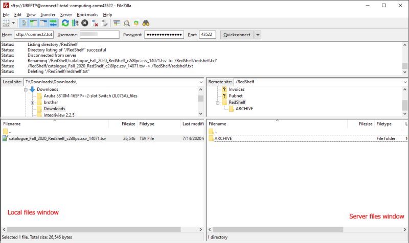
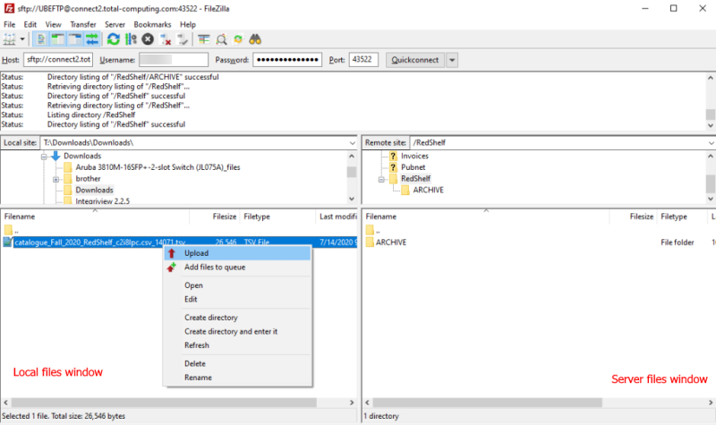
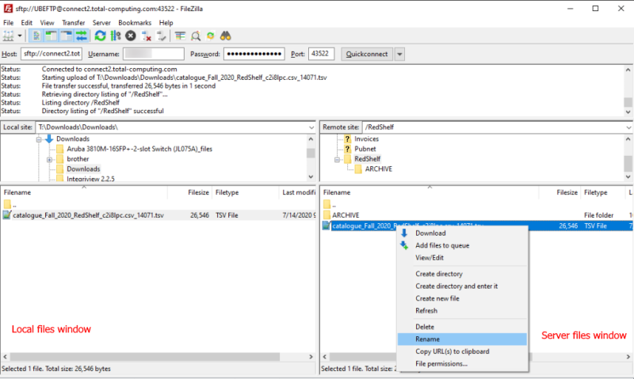
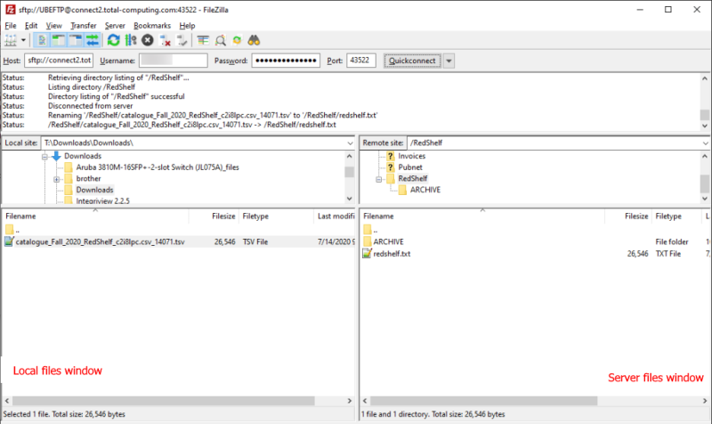

# Transfer and Import Redshelf Catalog

<PageHeader />

After adoption information has been [exported](../redshelf-adoption-export/README.md) and sent to Redshelf, they will send a catalog file back that contains the detailed pricing information for available titles. This file needs to be transferred to the hosting server and a process ran to import the data. This is very similar to the process of uploading and importing adoption information.

## Prerequisites

1. FileZilla (or another FTP program) is required to transfer files to the server
    - Instructions on setting up and using FileZilla can be found [here](../../system/file-transfer-changes-and-setup/README.md).
2. You must have access to the Redshelf email with the download link

### Quick Steps

1. Download the file from the email link sent from Redshelf
2. Upload the file to the Redshelf directory on the hosting server via FileZilla
3. Rename the file to redshelf.txt
4. Import the data in TX-27-1

### Upload The Catalog File

1. Download the catalog file from the link Redshelf sends via email
    - Redshelf will send an email with a download link similar to this:
        - 
    - Click on the link and download the file. Make note of where the file downloads to.
        - If you don't choose the file location then it typically defaults to your _Downloads_ folder
2. Open FileZille and connect to the hosting server
    - Navigate to the Redshelf directory in the server pane
    - Navigate to your Downloads directory on the local pane
    - 
3. Upload the catalog file to the server by right clicking the downloaded file and then Upload
    - 
4. Rename the file on the server to _redshelf.txt_ by right clicking and select Rename
    - 
5. The final result should look like this
    - 

### Import The Catalog Data

It's handy to know your ebook class code and your usage periods prior to these steps. Class codes can be found in TX-SU-1-6-22. Usage periods can be found in TX-SU-2-25,R

Note that _**ALL**_ _previous ebook prices will be cleared when you import_.

1. Navigate to TX-27-1 and enter your store number
    1. Vendor Code: R
    2. Ebook Class: (your class code)
    3. Access Periods: Should populate from TX-SU-2-25
        - You can manually change as needed
2. Run the procedure
3. Verify that the data is queued up to go to your registers
    1. Quickly navigate to POS-6-2 and there should be items in the _Records to be formatted by the Host_ field.

### Verify

- Spot check various titles in MF > ISBN > E for Ebook to verify that the data was imported.
- Ring up a title and verify the data is correct
  - Note that your registers must be up to date in POS-6-2 before the data is live

### More on Usage Periods

Usage periods tell the system what usage periods to import from the Redshelf catalog. Only using 3-4 usage periods is recommended due to limited tag space.

Common day count periods are 60, 90, 120, 180, 360, 365 ALL can be used for all data P is for Purchase or Lifetime

Examples:

- Commas are used to create a list of options
  - 90,120,P
  - Imports for 90 day, 120 day and Lifetime (Purchase)
- A forward slash is used as an OR option
  - 90,120/180, 360/365
  - Imports for 90 day, 120 when available or 180 as a fallback option, 360 days or 365 as a fallback option.

<PageFooter />
