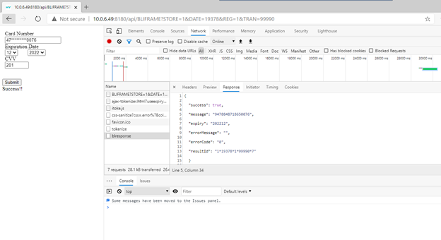

# TotaLink Integrators Reference Manual

<PageHeader />

## TotaLink Workflow (CC-XX and CC-XX-MANUAL Transactions)

A call to TotaLink passing the transaction types CC-XX or CC-XX-MANUAL will capture payment card data and initiate an authorization request to the TotaLink Application end point.

Your request initiates the following sequence:

- Your client application sends a request to the TotaLink Application to process the payment transaction.
- TotaLink sends a series of commands to the terminal, based on the options specified in your request. ([detailed below](#transaction-types))
- TotaLink in turn stores the transaction information from your request and makes available the transaction information to your application if needed for a later purpose.

### Example transaction flow 1

- Your Application, send a transaction request to TotaLink.
- TotaLink displays the transaction amount and prompts the user to confirm.
- The terminal prompts the user to swipe/insert/tap or manually enter the card data.
- The terminal prompts the user for a signature (if using a signature capture device).
- The data is collected by TotaLink and we process the request on your behalf, which in turn returns the authorization response details.
- The authorization response is then displayed for your customer at the device (for example, "Approved").

## TotaLink Workflow (TOKEN-XX and TOKEN-XX-MANUAL Transactions)

A call to TotaLink passing the transaction type TOKEN-XX and TOKEN-XX-MANUAL captures payment card data and returns a token to be used in a subsequent charge request to the TotaLink Application. TotaLink will not initiate an Authorization or capture funds at this point but merely Tokenize the transaction for later use.

Your request initiates the following sequence:

- Your client application sends a request to the TotaLink Application for payment information you will use to complete a transaction.
- TotaLink sends a series of commands to the terminal, based on the options specified in your request. ([detailed below](#types))
- TotaLink in turn stores the transaction information from your request and makes available the transaction information to your application for completion of the request.

### Example transaction flow 2

- The terminal displays the transaction amount and prompts the user to confirm.
- The terminal prompts the user to swipe/insert/tap or manually enter the card data.
- The terminal prompts the user for a signature (if using a signature capture device).
- TotaLink returns and stores the tokenized card number, signature, and any additional data you will need to reference transaction.
- Your Application can then request TotaLink to submit an authorization request using the token and any additional data to capture the funds from your initial transaction request.

## Transaction Types

TotaLink Transaction types are a way to manipulate transactions for the purpose or processing, storing, reversing, or voiding payment transactions.

### Types

* CC-AUTH
  * CC-AUTH-MANUAL
    * Requests manually-entered card data and initiates authorization.
  * CC-AUTH
    * Requests an MSR (magnetic stripe), EMV (chip), or NFC (contactless) payment card interaction and initiates an authorization.
* CC-TIP
   * Requests tip amount for use with CC-COMPLETE
     * Tip amount free form
     * If tip percent presets are to be used include AMOUNT<2>. With 3 multi-values, one for each preset.
* CC-COMPLETE
  *  finalize auth only and capture (tips) or increasing amount of the transaction. The capture service queues the transaction amount for settlement. Capture can occur within the authorization request or subsequently.
  *  If the amount to be captured is more than the authorized amount (such as a tip adjustment), ensure that the merchant is appropriately entitled with this capability.
* CC-SALE 
  *  The transaction is a charge transaction with settlement capture.
  *  CC-SALE-MANUAL
     *  Requests manually-entered card data and initiates a charge transaction.
  *  CC-SALE
     *  Requests an MSR (magnetic stripe), EMV (chip), or NFC (contactless) payment card interaction and initiates charge transaction 
* CC-RETURN
  *  You must pass the original `TOTAL.CC.RESULT` Id. TotaLink will verify the transaction state for Refund or Void.
    *  AMOUNT cannot exceed the original authorization amount. `CCV.ORIGINAL.REQ.ID`

* CC-CREDIT
  *  The transaction is treated as a refund without reference (forced credit). Note that the merchant account must be enabled to process forced credit transactions. (*Requires negative amount)
  *  CC-CREDIT-MANUAL
     *  Requests manually-entered card data and initiates credit transaction.
  *  CC-CREDIT
     *  Requests an MSR (magnetic stripe), EMV (chip), or NFC (contactless) payment card interaction and initiates credit transaction. 
 
* TOKEN-NEW 
  *  Tokenization with Authorization only. This request must be for zero amount. 
  *  Token-new-manual
     *  Manual entry
* TOKEN-SALE
  *  Authorizes or requests permission from the bank to transfer money from the cardholder to the merchant using a previously obtained token (TOKEN-NEW) You will need to send the token as the `CCV.ACCOUNT` and include the `CCV.EXP.DATE`
* TOKEN-RETURN 
  *  You must pass the `CCV.REQ.ID` from the original SALE in   `CCV.ORIGINAL.REQ.ID` field. Totalink will verify the transaction state for Refund or Void and process accordingly.
     *  AMOUNT cannot exceed the original authorization amount.
* TOKEN-CREDIT
  *  Merchants must be configured to process forced credit transactions. You will need to send the token as the` CCV.ACCOUNT` and include the `CCV.EXP.DATE`
* TOKEN-AVS
  *  Preforming Address Verification You will need to send the token as the` CCV.ACCOUNT` and include the `CCV.EXP.DATE` , `CCV.CUST.ADDRESS`
  
--End Transaction Types

## Variable Definitions and Equates
|          | Variable Definitions: (You may use different reference names but the rules and format stay the same)                                  |          |
| -------- | ------------------------------------------------------------------------------------------------------------------------------------- | -------- |
| STORE    | This is a unique assignment for your location(s) Merchant accounts are assigned buy store/Location                                    | REQUIRED |
| DATE     | This is the date of the request made to TotaLink                                                                                      | REQUIRED |
| REG      | This identifies the POS station, user, terminal or process requesting a transaction                                                   | REQUIRED |
| TRAN     | This is the sequential number for the REG requesting the transaction. You can also reference this with Inovice, ticker or order       | REQUIRED |
| AMOUNT   | Amount to be authorized with two implied decimals places (example: to specify "$10.00," use "1000")                                   | REQUIRED |
| VERIFIED | ** This is the only flag that indicates an accepted response** The vaules returned by `TL.TOTALINK` is "1" if the request is accepted | REQUIRED |
| CCV.REC  | Dimensioned arry (*see `TOTALINK.INC` `CCV.EQUATES` and `TOTAL.BP TOTALINK.TEST`*) blah                                               | REQUIRED |

### Adding code to your MultiValue program

- You must write the equivalent of this program. The lines in black should remain; you may replace the lines in red. Further explanation of variables is provided after.

```md
* Add this to the top portion of your program.
INCLUDE TOTAL.INC CCV.EQUATES   *(Equated Variable definitions examples are in the TOTALINK.TEST program)
*
* If this is a credit card charge and you have the amount then
* Insert this code immediately before calling our subroutine.
*

VERIFIED = 0
MAT CCV.REC = ''
****
*  ccv.record setup required for appropriate processing
*  See sample program for variable initialization for required processing.
****
CALL TL.TOTALINK(STORE, DATE, REG, TRANS, AMOUNT, VERIFIED, MAT CCV.REC)
!
IF VERIFIED THEN
* Do whatever you would like with the data in the CCV record.
* TL.TOTALINK has written everything we need into the files we use for settlement and reconciliation.
END ELSE
* Do your rejection to the customer routine here
* In non-eCommerce transactions the clerk/cashier will have seen and responded to an appropriate message.
END
*
* Get the next amount to be charged
RETURN; REPEAT; * This will be an appropriate statement to get the next charge or to quit
```

TotaLink has provided for you a testing program that includes the equates found in TOTAL.INC CCV.EQUATES.
For a listing of all equated variables you can find them in the TOTALINK.TEST program located in your TOTAL.BP file in the TOTALINK Account. 

--End Adding code to your MultiValue program

## TotaLink Test Program
All deployments of TotaLink come with a documentary test program called `TOTALINK.TEST` this program can be found in the `TOTAL.BP` programs file.

Using whichever editor you prefer you will be able to view examples of all of your variables, equates and the includes you will need reference in your native program.
```
* You must write the equivalent of this program.
* The lines in black should remain; you may replace the lines in red.
* Further explanation of variables is provided after.
*
* Add this to the top portion of your program.
   INCLUDE TOTAL.INC CCV.EQUATES
*
* If this is a credit card charge and you have the amount then
* Insert this code immediately before calling TL.TOTALINK.
*
   STORE  = ''          ;* store number
   DATE   = DATE()      ;* transaction date
   REG    = ''          ;* register number
   TRANS  = INT(TIME()) ;* unique transaction number (per store/date/reg)
   AMOUNT = 100         ;* one dollar
   TK.TOKEN  = ''
   TK.EXPIRY = ''
   TK.REQ.ID = ''
   SA.TOKEN  = ''
   SA.EXPIRY = ''
   SA.REQ.ID = ''
   CA.TOKEN  = ''
   CA.EXPIRY = ''
   CA.REQ.ID = ''
*
   IF STORE # '' THEN CRT '<>=':STORE
   CRT 'Store: ':; INPUT XSTORE
   IF XSTORE = '' AND STORE = '' THEN STOP
   IF XSTORE # '' THEN STORE = XSTORE
*
   CRT
   IF REG # '' THEN CRT '<>=':REG
   CRT 'Register: ':; INPUT XREG
   IF XREG = '' AND REG = '' THEN STOP
   IF XREG # '' THEN REG = XREG
*
   CRT
   CRT '<>=15'
   CRT 'Paging: ':;INPUT XPAGE
   IF XPAGE = '' THEN XPAGE = 15
   PROMPT ''
*
10 *
*
   ERR.MSG = ''
   CRT @(-1):
   CRT @(15,03):' ---==== TEST MENU ====---'
   CRT @(15,05):'  1 Tokenize a card  (manual or swipe)'
   CRT @(15,06):'  2 Token sale       (requires tokenized card)'
   CRT @(15,07):'  3 Token Refund     (requires token sale)'
   CRT @(15,08):'  4 Token Credit     (requires tokenized card)' ;* errors
   CRT @(15,09):'  5 Sale             (manual or swipe)'
   CRT @(15,10):'  6 Refund           (requires sale)'
   CRT @(15,11):'  7 Credit           (manual or swipe)'
   CRT @(15,12):'  8 Auth only        (manual or swipe)'
   CRT @(15,13):'  9 Auth Complete    (requires auth)'
   CRT @(15,14):' 10 Customer COF     (Card on File)'
   CRT @(20,16):'  Enter selection: ': ; INPUT DIO
   IF DIO MATCHES '1N0N' and DIO > 0 AND DIO < 11 THEN
      ON DIO GOSUB 100,200,300,400,500,600,700,800,900,1000
      GOTO 10
   END
   IF DIO = 'AVS' THEN
      GOSUB 2000
      GOTO 10
   END
   STOP
*~~~~~~~~~~~~~~~~~~~~~~~~~~~~~~~~~~~~~~~~~~~~~~~~~~~~~~~~~~~~~~~~~~~
*
100 * build out CCV.REC for token
*
   REQ.TYPE = 'TOKEN-NEW'
   CRT REQ.TYPE
*
   AMOUNT = 0 ;* amount must be zero for auth
*
   CRT '<M>=Manual Card Entry or <>=Card Swipe: ':; INPUT MANUAL
   MANUAL = OCONV(MANUAL,'MCU')
   BEGIN CASE
      CASE MANUAL = 'M' ; REQ.TYPE := '-MANUAL' ;* manual card
      CASE MANUAL = ''  ; NULL                  ;* swiped card
      CASE 1 ; GOTO 100
   END CASE
*
   MAT CCV.REC         = ''
   CCV.TENDER.CODE     = 'BL'
   CCV.SOURCE          = 'A'
   CCV.VAULT.FILE      = 'BOLT'
   CCV.VAULT.ACTION    = REQ.TYPE
   CCV.RETURN.MESSAGES = 'SILENT' ;* keep message for me to display
*
*** include for AVS response
*
   CCV.CUST.ADDRESS<1,1> = 'TEST CARD'   ;* mv1=Name,mv2=Address,mv3=Address2,mv4=City ST,mv5=Zip,mv6=State
   CCV.CUST.ADDRESS<1,2> = '123 WHO KNOWS'
   CCV.CUST.ADDRESS<1,3> = ''
   CCV.CUST.ADDRESS<1,4> = 'Santa Clara CA'
   CCV.CUST.ADDRESS<1,5> = '95050'
   CCV.CUST.ADDRESS<1,6> = 'CA'
*
   TRANS  = INT(TIME()) ;* unique transaction number (per store/date/reg)
   CALL TL.TOTALINK(STORE, DATE, REG, TRANS, AMOUNT, VERIFIED, MAT CCV.REC)
   GOSUB DISPLAY.RESULTS
*
   IF VERIFIED THEN
      TK.TOKEN  = CCV.TOKEN
      TK.EXPIRY = CCV.EXP.DATE
      TK.REQ.ID = ''
   END ELSE
      TK.TOKEN  = ''
      TK.EXPIRY = ''
      TK.REQ.ID = ''
   END
   RETURN
*
200 * TOKEN SALE
*
   REQ.TYPE = 'TOKEN-SALE'
   CRT REQ.TYPE
*
   BEGIN CASE
      CASE TK.TOKEN  = '' ; ERR.MSG = 'Must tokenize a card first.'
      CASE 1              ; ERR.MSG = ''
   END CASE
   IF ERR.MSG # '' THEN
      CRT ERR.MSG: ; INPUT GOON
      RETURN
   END
*
   CRT 'Amount: ':; INPUT AMOUNT
   BEGIN CASE
      CASE NOT(NUM(AMOUNT)) ; RETURN
      CASE AMOUNT = 0       ; RETURN
   END CASE
   IF INDEX(AMOUNT,'.',1) THEN AMOUNT = ICONV(AMOUNT,'MD2')
   AMOUNT = ABS(AMOUNT)
*
   CRT 'Include level 2/3 info: ':; INPUT LVL23
   IF OCONV(LVL23,'MCU') = 'Y' THEN LVL23 = 1 ELSE LVL23 = 0
*
   MAT CCV.REC          = ''
   CCV.TENDER.CODE      = 'BL'
   CCV.SOURCE           = 'P'
   CCV.VAULT.FILE       = 'BOLT'
   CCV.VAULT.ACTION     = REQ.TYPE
   CCV.RETURN.MESSAGES  = 'SILENT' ;* keep message for me to display
*
*** from token-new
   CCV.ACCOUNT      = TK.TOKEN
   CCV.EXP.DATE     = TK.EXPIRY
*
   IF LVL23 THEN
      GOSUB FILL.LEVEL.II
      GOSUB FILL.LEVEL.III
   END
*
   TRANS  = INT(TIME()) ;* unique transaction number (per store/date/reg)
   CALL TL.TOTALINK(STORE, DATE, REG, TRANS, AMOUNT, VERIFIED, MAT CCV.REC)
   GOSUB DISPLAY.RESULTS
   IF VERIFIED THEN
      TK.REQ.ID = CCV.REQ.ID
   END ELSE
      TK.REQ.ID = ''
   END
   RETURN
*
300 * token refund
*
   REQ.TYPE = 'TOKEN-RETURN'
   CRT REQ.TYPE
*
   BEGIN CASE
      CASE TK.TOKEN  = '' ; ERR.MSG = 'Must tokenize a card first.'
      CASE TK.REQ.ID = '' ; ERR.MSG = 'Must run token sale first.'
      CASE 1              ; ERR.MSG = ''
   END CASE
   IF ERR.MSG # '' THEN
      CRT ERR.MSG: ; INPUT GOON
      RETURN
   END
*
   CRT 'Amount: ':; INPUT AMOUNT
   BEGIN CASE
      CASE NOT(NUM(AMOUNT)) ; RETURN
      CASE AMOUNT = 0       ; RETURN
   END CASE
   IF INDEX(AMOUNT,'.',1) THEN AMOUNT = ICONV(AMOUNT,'MD2')
   AMOUNT = 0-ABS(AMOUNT)
*
   MAT CCV.REC         = ''
   CCV.TENDER.CODE     = 'BL'
   CCV.SOURCE          = 'P'
   CCV.VAULT.FILE      = 'BOLT'
   CCV.VAULT.ACTION    = REQ.TYPE
   CCV.RETURN.MESSAGES = 'SILENT' ;* keep message for me to display
*
*** from token-new
   CCV.ACCOUNT  = TK.TOKEN
   CCV.EXP.DATE = TK.EXPIRY
*
*** from token-sale
   CCV.ORIGINAL.REQ.ID = TK.REQ.ID
*
   TRANS  = INT(TIME()) ;* unique transaction number (per store/date/reg)
   CALL TL.TOTALINK(STORE, DATE, REG, TRANS, AMOUNT, VERIFIED, MAT CCV.REC)
   GOSUB DISPLAY.RESULTS
   RETURN
*
400 * token credit
*
   REQ.TYPE = 'TOKEN-CREDIT'
   CRT REQ.TYPE
*
   BEGIN CASE
      CASE TK.TOKEN  = '' ; ERR.MSG = 'Must tokenize a card first.'
      CASE 1              ; ERR.MSG = ''
   END CASE
   IF ERR.MSG # '' THEN
      CRT ERR.MSG: ; INPUT GOON
      RETURN
   END
*
   CRT 'Amount: ':; INPUT AMOUNT
   BEGIN CASE
      CASE NOT(NUM(AMOUNT)) ; RETURN
      CASE AMOUNT = 0       ; RETURN
   END CASE
   IF INDEX(AMOUNT,'.',1) THEN AMOUNT = ICONV(AMOUNT,'MD2')
   AMOUNT = 0-ABS(AMOUNT)
*
   MAT CCV.REC         = ''
   CCV.TENDER.CODE     = 'BL'
   CCV.SOURCE          = 'P'
   CCV.VAULT.FILE      = 'BOLT'
   CCV.VAULT.ACTION    = REQ.TYPE
   CCV.RETURN.MESSAGES = 'SILENT' ;* keep message for me to display
*
*** from token-new
   CCV.ACCOUNT  = TK.TOKEN
   CCV.EXP.DATE = TK.EXPIRY
*
   TRANS  = INT(TIME()) ;* unique transaction number (per store/date/reg)
   CALL TL.TOTALINK(STORE, DATE, REG, TRANS, AMOUNT, VERIFIED, MAT CCV.REC)
   GOSUB DISPLAY.RESULTS
   RETURN
*
500 * sale
*
   REQ.TYPE = 'CC-SALE'
   CRT REQ.TYPE
*
   CRT 'Amount: ':; INPUT AMOUNT
   BEGIN CASE
      CASE NOT(NUM(AMOUNT)) ; RETURN
      CASE AMOUNT = 0       ; RETURN
   END CASE
   IF INDEX(AMOUNT,'.',1) THEN AMOUNT = ICONV(AMOUNT,'MD2')
   AMOUNT = ABS(AMOUNT)
*
   CRT '<M>=Manual Card Entry or <>=Card Swipe: ':; INPUT MANUAL
   MANUAL = OCONV(MANUAL,'MCU')
   BEGIN CASE
      CASE MANUAL = 'M' ; REQ.TYPE = 'CC-SALE-MANUAL' ;* manual card
      CASE MANUAL = ''  ; REQ.TYPE = 'CC-SALE'        ;* swiped card
      CASE 1 ; GOTO 100
   END CASE
*
   CRT 'Include level 2/3 info: ':; INPUT LVL23
   IF OCONV(LVL23,'MCU') = 'Y' THEN LVL23 = 1 ELSE LVL23 = 0
*
   MAT CCV.REC         = ''
   CCV.TENDER.CODE     = 'BL'
   CCV.SOURCE          = 'P'
   CCV.VAULT.FILE      = 'BOLT'
   CCV.VAULT.ACTION    = REQ.TYPE
   CCV.RETURN.MESSAGES = 'SILENT' ;* keep message for me to display
*
   IF LVL23 THEN
      GOSUB FILL.LEVEL.II
      GOSUB FILL.LEVEL.III
   END
*
   TRANS  = INT(TIME()) ;* unique transaction number (per store/date/reg)
   CALL TL.TOTALINK(STORE, DATE, REG, TRANS, AMOUNT, VERIFIED, MAT CCV.REC)
   GOSUB DISPLAY.RESULTS
   IF VERIFIED THEN
      SA.TOKEN  = CCV.TOKEN
      SA.EXPIRY = CCV.EXP.DATE
      SA.REQ.ID = CCV.REQ.ID
   END ELSE
      SA.TOKEN  = ''
      SA.EXPIRY = ''
      SA.REQ.ID = ''
   END
   RETURN
*
600 * refund
*
   REQ.TYPE = 'CC-RETURN'
   CRT REQ.TYPE
*
   BEGIN CASE
      CASE SA.REQ.ID = '' ; ERR.MSG = 'Must process a sale first.'
      CASE 1              ; ERR.MSG = ''
   END CASE
   IF ERR.MSG # '' THEN
      CRT ERR.MSG: ; INPUT GOON
      RETURN
   END
*
   CRT 'Amount: ':; INPUT AMOUNT
   BEGIN CASE
      CASE NOT(NUM(AMOUNT)) ; RETURN
      CASE AMOUNT = 0       ; RETURN
   END CASE
   IF INDEX(AMOUNT,'.',1) THEN AMOUNT = ICONV(AMOUNT,'MD2')
   AMOUNT = -(ABS(AMOUNT))
*
   MAT CCV.REC         = ''
   CCV.TENDER.CODE     = 'BL'
   CCV.SOURCE          = 'P'
   CCV.VAULT.FILE      = 'BOLT'
   CCV.VAULT.ACTION    = REQ.TYPE
   CCV.RETURN.MESSAGES = 'SILENT' ;* keep message for me to display
*
*** from cc-sale
   CCV.ORIGINAL.REQ.ID = SA.REQ.ID
***
*
   TRANS  = INT(TIME()) ;* unique transaction number (per store/date/reg)
   CALL TL.TOTALINK(STORE, DATE, REG, TRANS, AMOUNT, VERIFIED, MAT CCV.REC)
   GOSUB DISPLAY.RESULTS
   RETURN
*
700 * credit
*
   REQ.TYPE = 'CC-CREDIT'
   CRT REQ.TYPE
*
   CRT 'Amount: ':; INPUT AMOUNT
   BEGIN CASE
      CASE NOT(NUM(AMOUNT)) ; RETURN
      CASE AMOUNT = 0       ; RETURN
   END CASE
   IF INDEX(AMOUNT,'.',1) THEN AMOUNT = ICONV(AMOUNT,'MD2')
   AMOUNT = -(ABS(AMOUNT))
*
   CRT '<M>=Manual Card Entry or <>=Card Swipe: ':; INPUT MANUAL
   MANUAL = OCONV(MANUAL,'MCU')
   BEGIN CASE
      CASE MANUAL = 'M' ; REQ.TYPE = 'CC-CREDIT-MANUAL' ;* manual card
      CASE MANUAL = ''  ; REQ.TYPE = 'CC-CREDIT'        ;* swiped card
      CASE 1 ; GOTO 100
   END CASE
*
   MAT CCV.REC         = ''
   CCV.TENDER.CODE     = 'BL'
   CCV.SOURCE          = 'P'
   CCV.VAULT.FILE      = 'BOLT'
   CCV.VAULT.ACTION    = REQ.TYPE
   CCV.RETURN.MESSAGES = 'SILENT' ;* keep message for me to display
*
   TRANS  = INT(TIME()) ;* unique transaction number (per store/date/reg)
   CALL TL.TOTALINK(STORE, DATE, REG, TRANS, AMOUNT, VERIFIED, MAT CCV.REC)
   GOSUB DISPLAY.RESULTS
   RETURN
*
800 * auth
*
   REQ.TYPE = 'CC-AUTH'
   CRT REQ.TYPE
*
   CRT 'Amount: ':; INPUT AMOUNT
   BEGIN CASE
      CASE NOT(NUM(AMOUNT)) ; RETURN
      CASE AMOUNT = 0       ; RETURN
   END CASE
   IF INDEX(AMOUNT,'.',1) THEN AMOUNT = ICONV(AMOUNT,'MD2')
   AMOUNT = ABS(AMOUNT)
*
   CRT '<M>=Manual Card Entry or <>=Card Swipe: ':; INPUT MANUAL
   MANUAL = OCONV(MANUAL,'MCU')
   BEGIN CASE
      CASE MANUAL = 'M' ; REQ.TYPE = 'CC-AUTH-MANUAL' ;* manual card
      CASE MANUAL = ''  ; REQ.TYPE = 'CC-AUTH'        ;* swiped card
      CASE 1 ; GOTO 100
   END CASE
*
   CRT 'Include level 2/3 info: ':; INPUT LVL23
   IF OCONV(LVL23,'MCU') = 'Y' THEN LVL23 = 1 ELSE LVL23 = 0
*
   MAT CCV.REC         = ''
   CCV.TENDER.CODE     = 'BL'
   CCV.SOURCE          = 'P'
   CCV.VAULT.ACTION    = REQ.TYPE
   CCV.VAULT.FILE      = 'BOLT'
   CCV.RETURN.MESSAGES = 'SILENT' ;* keep message for me to display
*
   IF LVL23 THEN
      GOSUB FILL.LEVEL.II
      GOSUB FILL.LEVEL.III
   END
*
   TRANS  = INT(TIME()) ;* unique transaction number (per store/date/reg)
   CALL TL.TOTALINK(STORE, DATE, REG, TRANS, AMOUNT, VERIFIED, MAT CCV.REC)
   GOSUB DISPLAY.RESULTS
   IF VERIFIED THEN
      CA.TOKEN  = CCV.TOKEN
      CA.EXPIRY = CCV.EXP.DATE
      CA.REQ.ID = CCV.REQ.ID
   END ELSE
      CA.TOKEN  = ''
      CA.EXPIRY = ''
      CA.REQ.ID = ''
   END
   RETURN
*
900 * auth complete
*
   REQ.TYPE = 'CC-COMPLETE'
   CRT REQ.TYPE
*
   BEGIN CASE
      CASE CA.REQ.ID = '' ; ERR.MSG = 'Must authorize a card first.'
      CASE 1              ; ERR.MSG = ''
   END CASE
   IF ERR.MSG # '' THEN
      CRT ERR.MSG: ; INPUT GOON
      RETURN
   END
*
   CRT 'Amount: ':; INPUT AMOUNT
   BEGIN CASE
      CASE NOT(NUM(AMOUNT)) ; RETURN
      CASE AMOUNT = 0       ; RETURN
   END CASE
   IF INDEX(AMOUNT,'.',1) THEN AMOUNT = ICONV(AMOUNT,'MD2')
   AMOUNT = ABS(AMOUNT)
*
   CRT 'Include level 2/3 info: ':; INPUT LVL23
   IF OCONV(LVL23,'MCU') = 'Y' THEN LVL23 = 1 ELSE LVL23 = 0
*
   MAT CCV.REC          = ''
   CCV.TENDER.CODE      = 'BL'
   CCV.SOURCE           = 'P'
   CCV.VAULT.FILE       = 'BOLT'
   CCV.VAULT.ACTION     = REQ.TYPE
   CCV.RETURN.MESSAGES  = 'SILENT' ;* keep message for me to display
*
   IF LVL23 THEN
      GOSUB FILL.LEVEL.II
      GOSUB FILL.LEVEL.III
   END
*
*** from cc-auth
   CCV.ACCOUNT  = CA.TOKEN
   CCV.EXP.DATE = CA.EXPIRY
*
*** from cc-auth
   CCV.ORIGINAL.REQ.ID = CA.REQ.ID
***
*
   TRANS  = INT(TIME()) ;* unique transaction number (per store/date/reg)
   CALL TL.TOTALINK(STORE, DATE, REG, TRANS, AMOUNT, VERIFIED, MAT CCV.REC)
   GOSUB DISPLAY.RESULTS

   RETURN
*~~~~~~~~~~~~~~~~~~~~~~~~~~~~~~~~~~~~~~~~~~~~~~~~~~~~~~~~~~~~~~~~~~~
*
1000 * customer charge/return
*
   OPEN 'TOTAL.CUST' TO CUST.FILE ELSE
      CRT 'Can not open TOTAL.CUST.'
      CRT '<RETURN>: ':; INPUT GOON
      RETURN
   END
*
   CRT 'Enter customer number: ':; INPUT CUST.NO
   READ CUST.REC FROM CUST.FILE, STORE:'*':CUST.NO ELSE
      CRT 'Can not read ':STORE:'*':CUST.NO:' from TOTAL.CUST.'
      CRT '<RETURN>: ':; INPUT GOON
      RETURN
   END
*
   IF CUST.REC<6> = '' THEN
      CRT 'No Card on File for customer ':STORE:'*':CUST.NO
      CRT '<RETURN>: ':; INPUT GOON
      RETURN
   END
*
   CRT CUST.REC<1>
   CRT '### Card............. exp'
   NUMCARDS = DCOUNT(CUST.REC<6>,@VM)
   FOR VSEQ = 1 TO NUMCARDS

      CRT VSEQ 'R#3':' ':CUST.REC<6,VSEQ> 'L#18':CUST.REC<7,VSEQ>
   NEXT VSEQ
*
   CRT 'Select card to use: ':; INPUT VSEQ
   IF NOT(VSEQ MATCH '1N0N') THEN RETURN
   IF VSEQ < 1 OR VSEQ > NUMCARDS THEN RETURN
   IF CUST.REC<6,VSEQ> = '' THEN RETURN
*
   TK.TOKEN  = CUST.REC<8,VSEQ>
   TK.EXPIRY = CUST.REC<7,VSEQ>
   TK.REQ.ID = ''
*
   CRT '<S>ale or <C>redit: ':; INPUT ANS
   ANS = OCONV(ANS,'MCU')
   BEGIN CASE
      CASE ANS = 'S' ; GOSUB 200
      CASE ANS = 'C' ; GOSUB 400
   END CASE
   RETURN
*~~~~~~~~~~~~~~~~~~~~~~~~~~~~~~~~~~~~~~~~~~~~~~~~~~~~~~~~~~~~~~~~~~~
*
1999 * future
*
   CRT 'Work in progress...': ; INPUT GOON
   RETURN
*~~~~~~~~~~~~~~~~~~~~~~~~~~~~~~~~~~~~~~~~~~~~~~~~~~~~~~~~~~~~~~~~~~~

*
2000 * build out CCV.REC for token-avs
*
   REQ.TYPE = 'TOKEN-AVS'
   CRT REQ.TYPE
*
   AMOUNT = 0 ;* amount must be zero for auth
*
   CRT 'Token: ':; INPUT TOKEN
   IF NOT(TOKEN MATCH '16N') THEN
      GOTO 2000
   END
*
   CRT 'Expiry:':; INPUT EXPIRY
   BEGIN CASE
      CASE EXPIRY MATCH '5N' OR EXPIRY MATCH '6N'  ;* (yyyymm)
         YR = EXPIRY[1,4] ; MO = EXPIRY[5,2] 'R%2' ;* (mmyy)
      CASE EXPIRY MATCH '4N'
         MO = EXPIRY[1,2] ; YR = EXPIRY[3,2]
      CASE 1
         GOTO 2000
   END CASE
   EXPIRY = MO:(YR 'R%2')
*
   CRT 'Include level 2/3 info: ':; INPUT LVL23
   IF OCONV(LVL23,'MCU') = 'Y' THEN LVL23 = 1 ELSE LVL23 = 0
*
   MAT CCV.REC          = ''
   CCV.TENDER.CODE      = 'BL'
   CCV.SOURCE           = 'A'
   CCV.VAULT.FILE       = 'BOLT'
   CCV.VAULT.ACTION     = REQ.TYPE
   CCV.RETURN.MESSAGES  = 'SILENT' ;* keep message for me to display
*
*** from input
   CCV.ACCOUNT      = TOKEN
   CCV.EXP.DATE     = EXPIRY
*
   IF LVL23 THEN
      GOSUB FILL.LEVEL.II
      GOSUB FILL.LEVEL.III
   END
*
   TRANS  = INT(TIME()) ;* unique transaction number (per store/date/reg)
   CALL TL.TOTALINK(STORE, DATE, REG, TRANS, AMOUNT, VERIFIED, MAT CCV.REC)
   GOSUB DISPLAY.RESULTS
*
   IF VERIFIED THEN
      TK.TOKEN  = CCV.ACCOUNT
      TK.EXPIRY = CCV.EXP.DATE
      TK.REQ.ID = ''
   END ELSE
      TK.TOKEN  = ''
      TK.EXPIRY = ''
      TK.REQ.ID = ''
   END
   RETURN
*~~~~~~~~~~~~~~~~~~~~~~~~~~~~~~~~~~~~~~~~~~~~~~~~~~~~~~~~~~~~~~~~~~~
*---------------------------
DISPLAY.RESULTS:
*---------------------------
*
*** display ccv record
   DISP.REC = ''
   DISP.REC<-1> ='CCV.REC -----------------------------------------------------'
   DISP.REC<-1> ='CCV.ACCOUNT             : ': CCV.REC(1)
   DISP.REC<-1> ='CCV.EXP.DATE            : ': CCV.REC(2)
   DISP.REC<-1> ='CCV.ACCOUNT.NAME        : ': CCV.REC(3)
   DISP.REC<-1> ='CCV.AUTH.CODE           : ': CCV.REC(4)
   DISP.REC<-1> ='CCV.AUTH.REFERENCE      : ': CCV.REC(5)
   DISP.REC<-1> ='CCV.TENDER.DESC         : ': CCV.REC(6)
   DISP.REC<-1> ='CCV.MSR.TYPE            : ': CCV.REC(7)
   DISP.REC<-1> ='CCV.CARD.TYPE           : ': CCV.REC(8)
   DISP.REC<-1> ='CCV.CARD.DESC           : ': CCV.REC(9)
   DISP.REC<-1> ='CCV.TENDER.CODE         : ': CCV.REC(10)
   DISP.REC<-1> ='CCV.SOURCE              : ': CCV.REC(11) ;* E = eCommerce, M = MailOrder, N = Card not Present, P or blank = POS,
*                                                             A = Card Authorization/Address Check, V = Void, R = Recurring
   DISP.REC<-1> ='CCV.HOLD.FLAG           : ': CCV.REC(12) ;* blank = normal, H = Hold, R = Release previous hold, FR = Force Release,
*                                                             RS = Resubmit Auth
   DISP.REC<-1> ='CCV.RETURN.MESSAGES     : ': CCV.REC(13)
   DISP.REC<-1> ='CCV.CUST.ADDRESS        : ': CCV.REC(14) ;* mv1=Name,mv2=Address,mv3=Address2,mv4=City ST,mv5=Zip,mv6=State
   DISP.REC<-1> ='CCV.CID                 : ': CCV.REC(15) ;* CVV2, CVC2, CID
   DISP.REC<-1> ='CCV.LEVEL.II            : ': CCV.REC(16) ;*
   DISP.REC<-1> ='CCV.LEVEL.III           : ': CCV.REC(17) ;* LEVEL III Y = CORPORATE CARD
   DISP.REC<-1> ='CCV.BOX.XY              : ': CCV.REC(18) ;* X,Y of upper left corner of box
   DISP.REC<-1> ='CCV.REQ.ID              : ': CCV.REC(19) ;* Key to CC audit files
   DISP.REC<-1> ='CCV.BATCH.NUMBER        : ': CCV.REC(20)
   DISP.REC<-1> ='CCV.GRATUITY.AMOUNT     : ': CCV.REC(21)
   DISP.REC<-1> ='CCV.PIN.PAD.TYPE        : ': CCV.REC(22) ;* Embedded MSR or not
   DISP.REC<-1> ='CCV.CUST.ID             : ': CCV.REC(23) ;* Your customer id
   DISP.REC<-1> ='CCV.PIN.BLOCK           : ': CCV.REC(24) ;* Pin Pad PIN encryption block
   DISP.REC<-1> ='CCV.CASHBACK            : ': CCV.REC(25) ;* A cashback amount for ATM cards
   DISP.REC<-1> ='CCV.PRIVATE.DEBIT       : ': CCV.REC(26) ;* Specify a private debit interface
   DISP.REC<-1> ='CCV.GUI                 : ': CCV.REC(27) ;* Only used with TCS
   DISP.REC<-1> ='CCV.CHECK.SERVICE       : ': CCV.REC(28) ;* 'TELECHECK'
   DISP.REC<-1> ='CCV.CHECK.ACCOUNT       : ': CCV.REC(29) ;* RAW MICR DATA OR VM DELIMITED CHECK DATA
   DISP.REC<-1> ='CCV.MISC                : ': CCV.REC(30) ;* MV1: CORPORATE, SAVINGS, PERSONAL. MV2: WEB, PPD,ARC
   DISP.REC<-1> ='CCV.AMOUNT              : ': CCV.REC(31) ;* Amount
   DISP.REC<-1> ='CCV.AMOUNT.AUTHORIZED   : ': CCV.REC(31) ;* Amount authorized
   DISP.REC<-1> ='CCV.POSTING.STATUS      : ': CCV.REC(32) ;* Hold/Pending, Settled
*
   DISP.REC<-1> ='CCV.GC.ACTION           : ': CCV.REC(33) ;* ISSUE, SALE, ADD, BI, DI
   DISP.REC<-1> ='CCV.GC.BALANCE          : ': CCV.REC(34) ;* Balance after this transaction
   DISP.REC<-1> ='CCV.GC.DETAILS          : ': CCV.REC(35) ;* Used for Inquiry
*
   DISP.REC<-1> ='CCV.ORIG.DEBIT.DATA     : ': CCV.REC(36) ;* Debit Refund/Void MV1: DATE, MV2: TIME
   DISP.REC<-1> ='CCV.USER.COMMENTS       : ': CCV.REC(37) ;* Record comments on CCR<45>
   DISP.REC<-1> ='CCV.COM.MODE            : ': CCV.REC(38) ;* A=Asynchronous
   DISP.REC<-1> ='CCV.VAULT.ACTION        : ': CCV.REC(39) ;* Add, Delete, RAetrieve account, RFetrieve full record, Charge card
   DISP.REC<-1> ='CCV.TOKEN               : ': CCV.REC(40) ;* token assigned TL
   DISP.REC<-1> ='CCV.VAULT.FILE          : ': CCV.REC(41) ;* toTAL.VAULT.VaultFile
   DISP.REC<-1> ='CCV.ENTRY.METHOD        : ': CCV.REC(42) ;*
   DISP.REC<-1> ='CCV.ENC.SEQUENCE        : ': CCV.REC(43) ;* Encryption sequence or Key value for encrypt/decrypt
   DISP.REC<-1> ='CCV.DEVICE.DATA.TYPE    : ': CCV.REC(44) ;* Tag name used in the Card Class of EL dependent on device
*                                                             used to retrieve and encrypt card data
   DISP.REC<-1> ='CCV.SUCCESS.MESSAGE     : ': CCV.REC(45) ;* Allows for success message to be defined for TL.CREDIT.CARD
   DISP.REC<-1> ='CCV.GET.PAPER.SIGNATURE : ': CCV.REC(46) ;* Y if the customer chose not to sign on the PIN pad
   DISP.REC<-1> ='CCV.ORIGINAL.REQ.ID     : ': CCV.REC(47) ;* Used for return match
   DISP.REC<-1> ='CCV.OPT.DATA            : ': CCV.REC(48) ;* Used to help COF operations to maintain REQ.OPT.DATA standards
*
* Dimensioned array items 49-57 are for Level 2 and Level 3 CardConnect processing
*
   DISP.REC<-1> ='CCV.PONUM               : ': CCV.REC(49);* Level 2 - Customer PO Number
   DISP.REC<-1> ='CCV.TAXAMT              : ': CCV.REC(50);* Level 2 - Tax amount (with or w/o decimals)
   DISP.REC<-1> ='CCV.FRTAMT              : ': CCV.REC(51);* Level 3 - total order freight amount (default 0)
   DISP.REC<-1> ='CCV.DUTYAMT             : ': CCV.REC(52);* Level 3 - total order duty amount (default 0)
   DISP.REC<-1> ='CCV.ORDERDATE           : ': CCV.REC(53);* Level 3 - YYYYMMDD default System Date
   DISP.REC<-1> ='CCV.SHIPTOZIP           : ': CCV.REC(54);* Level 3 - Destination zip code (5 or 9)
   DISP.REC<-1> ='CCV.SHIPFROMZIP         : ': CCV.REC(55);* Level 3 - Origination zip code (5 or 9)
   DISP.REC<-1> ='CCV.SHIPTOCOUNTRY       : ': CCV.REC(56);* Level 3 - Ship to country code (default US)
* LEVEL 3 ITEM DETAIL - MultiValued for each line item.
   DISP.REC<-1> ='CCV.LINE.NUM            : ': CCV.REC(57);* Level 3 Items(MV)- Line number (defaults to sequential)(opt)
   DISP.REC<-1> ='CCV.MATERIAL            : ': CCV.REC(58);* Level 3 Items(MV)- Material code or Commodity code (opt)
   DISP.REC<-1> ='CCV.LEVEL3.DESC         : ': CCV.REC(59);* Level 3 Items(MV)- Item description (req)
   DISP.REC<-1> ='CCV.UPC                 : ': CCV.REC(60);* Level 3 Items(MV)- UPC code - NOT all zeros (opt)
   DISP.REC<-1> ='CCV.QTY                 : ': CCV.REC(61);* Level 3 Items(MV)- Item quantity (req)
   DISP.REC<-1> ='CCV.UOM                 : ': CCV.REC(62);* Level 3 Items(MV)- Unit of measure (each, ton, lb, etc. 4 char max)
   DISP.REC<-1> ='CCV.UNIT.COST           : ': CCV.REC(63);* Level 3 Items(MV)- Item price (1.23 or 123 format)(opt)
   DISP.REC<-1> ='CCV.NET.AMT             : ': CCV.REC(64);* Level 3 Items(MV)- Net amount (unit.cost x quantity - does not incl tax or discount)(req)
   DISP.REC<-1> ='CCV.TAX.AMT             : ': CCV.REC(65);* Level 3 Items(MV)- Item tax amount (1.23 or 123 format)
*
* A word about CCV.TAX.AMT - The sum total of CCV.TAX.AMT for all items equals the total tax amount for the order.
* If CCV.TAX.EXEMPT = 'Y' then CCV.TAX.AMT must be zero or omitted.
* If CCV.TAX.EXEMPT = 'N' then CCV.TAX.AMT must be a positive, non-zero value
* The total of CCV.NET.AMT + CCV.TAX.AMT + CCV.DISC.AMT equals the order amount.
*
   DISP.REC<-1> ='CCV.TAX.EXEMPT          : ': CCV.REC(66);* Level 3 Items(MV)- Y=Tax Exempt, N=Taxable (defaults to N)
   DISP.REC<-1> ='CCV.DISC.AMT            : ': CCV.REC(67);* Level 3 Items(MV)- Discount amount (1.23 or 123 format)(opt)
   DISP.REC<-1> = ' '
*
***
   IF VERIFIED THEN
* Do whatever you would like with the data in the CCV record.
* TL.TOTALINK has written everything we need into the files we use for settlement and reconciliation.
      DISP.REC<-1> ='Transaction was successful'
   END ELSE
* Do your rejection to the customer routine here
* In non-eCommerce transactions the clerk/cashier will have seen and responded to an appropriate message
* unless the process was told to suppress message via CCV.RETURN.MESSAGES.
      DISP.REC<-1> ='Transaction FAILED!!!'
   END
*
   NUMAM = DCOUNT(DISP.REC,@AM)
   FOR ASEQ = 1 TO NUMAM
      CRT DISP.REC<ASEQ>
      IF NOT(MOD(ASEQ,XPAGE)) AND (ASEQ # NUMAM) THEN
         CRT '<>=Continue ':; INPUT GOON
      END
   NEXT ASEQ
   CRT '<>=Continue ':; INPUT GOON
   RETURN
!
*---------------------------
FILL.LEVEL.II:
*---------------------------
   CCV.PONUM         = 'PO1123'   ;* Level 2 - Customer PO Number
   CCV.TAXAMT        = '15'       ;* Level 2 - Tax amount (with or w/o decimals)
   RETURN
!
*---------------------------
FILL.LEVEL.III:
*---------------------------
   XDATE = OCONV(DATE(),'D4-')
   ORD.DATE = FIELD(XDATE,'-',3) 'R%4':FIELD(XDATE,'-',1) 'R%2':FIELD(XDATE,'-',2) 'R%2'
*
   CCV.FRTAMT        = ''          ;* Level 3 - total order freight amount (default 0)
   CCV.DUTYAMT       = ''          ;* Level 3 - total order duty amount (default 0)
   CCV.ORDERDATE     = ORD.DATE    ;* Level 3 - YYYYMMDD default System Date
   CCV.SHIPTOZIP     = '95050'     ;* Level 3 - Destination zip code (5 or 9)
   CCV.SHIPFROMZIP   = '84121'     ;* Level 3 - Origination zip code (5 or 9)
   CCV.SHIPTOCOUNTRY = ''          ;* Level 3 - Ship to country code (default US)
*
*** multivalued line item details - level 3 item detail
*
   CCV.LINE.NUM<1,1>      = '1'         ;* Level 3 Items(MV)- Line number (defaults to sequential)(opt)
   CCV.MATERIAL<1,1>      = 'FE'        ;* Level 3 Items(MV)- Material code or Commodity code (opt)
   CCV.LEVEL3.DESC<1,1>   = 'Test Iron' ;* Level 3 Items(MV)- Item description (req)
   CCV.UPC<1,1>           = ''          ;* Level 3 Items(MV)- UPC code - NOT all zeros (opt)
   CCV.QTY<1,1>           = '2'         ;* Level 3 Items(MV)- Item quantity (req)
   CCV.UOM<1,1>           = 'ton'       ;* Level 3 Items(MV)- Unit of measure (each, ton, lb, etc. 4 char max)
   CCV.UNIT.COST<1,1>     = '255'       ;* Level 3 Items(MV)- Item price (1.23 or 123 format)(opt)
   CCV.NET.AMT<1,1>       = '510'       ;* Level 3 Items(MV)- Net amount (unit.cost x quantity - does not incl tax or discount)(req)
   CCV.TAX.AMT<1,1>       = '10'        ;* Level 3 Items(MV)- Item tax amount (1.23 or 123 format)
   CCV.TAX.EXEMPT<1,1>    = ''          ;* Level 3 Items(MV)- Y=Tax Exempt, N=Taxable (defaults to N)
   CCV.DISC.AMT<1,1>      = ''          ;* Level 3 Items(MV)- Discount amount (1.23 or 123 format)(opt)
*
   CCV.LINE.NUM<1,2>      = '2'         ;* Level 3 Items(MV)- Line number (defaults to sequential)(opt)
   CCV.MATERIAL<1,2>      = 'FE'        ;* Level 3 Items(MV)- Material code or Commodity code (opt)
   CCV.LEVEL3.DESC<1,2>   = 'Iron Test' ;* Level 3 Items(MV)- Item description (req)
   CCV.UPC<1,2>           = ''          ;* Level 3 Items(MV)- UPC code - NOT all zeros (opt)
   CCV.QTY<1,2>           = '1'         ;* Level 3 Items(MV)- Item quantity (req)
   CCV.UOM<1,2>           = 'each'      ;* Level 3 Items(MV)- Unit of measure (each, ton, lb, etc. 4 char max)
   CCV.UNIT.COST<1,2>     = '255'       ;* Level 3 Items(MV)- Item price (1.23 or 123 format)(opt)
   CCV.NET.AMT<1,2>       = '255'       ;* Level 3 Items(MV)- Net amount (unit.cost x quantity - does not incl tax or discount)(req)
   CCV.TAX.AMT<1,2>       = '5'         ;* Level 3 Items(MV)- Item tax amount (1.23 or 123 format)
   CCV.TAX.EXEMPT<1,2>    = ''          ;* Level 3 Items(MV)- Y=Tax Exempt, N=Taxable (defaults to N)
   CCV.DISC.AMT<1,2>      = ''          ;* Level 3 Items(MV)- Discount amount (1.23 or 123 format)(opt)
   RETURN
*~~~~~~~~~~~~~~~~~~~~~~~~~~~~~~~~~~~~~~~~~~~~~~~~~~~~~~~~~~~~~~~~~~~~~~~~~~~~~~~~~~~~~~~~
*~~~~~~~~~~~~~~~~~~~~~~~~~~~~~~~~~~~~~~~~~~~~~~~~~~~~~~~~~~~~~~~~~~~~~~~~~~~~~~~~~~~~~~~~```

<PageFooter />

```

# MVToolkit Restful API

End point calls to MVToolkit are used to tokenize card numbers for later use. Primarily used to collect card information for Address verification, storage and order fulfillment. 

##  API Process flow

-  Your application calls the default end-point rest-api (BLIFRAME) to render a card input page to the user application.
   - You will need to pass variable data in your url string to generate a valid reponse ([example below](#example-urlstring)) 
     - STORE
     - DATE
     - REG (Terminal/user/location reference)
     - TRAN (Invoice or other specific reference)
  
-  User data is collected in the iframe for tokenization only, and submitted to the TotaLink Application for a Token Response.
-  Token Response codes are passed back to the browser in JSON format for retention and future use see ([detailed above](#types)) in Transaction Types
   
   - TOKEN-AVS
   - TOKEN-SALE
   - TOKEN-CREDIT
   - TOKEN-RETURN

   *note: all successful requests will generate a 'CCV.REQ.ID' using "resultId" passed back in the JSON Response below which also be retained and referenced at a later time.* 

Once a valid response is received you will return to the portion of the Integrators Guide [Adding code to your MultiValue program](#adding-code-to-your-multivalue-program)

### Example urlstring

```
http://userurl.com:port/api/BLIFRAME?STORE=1&DATE=19378&REG=1&TRAN=99990
```

*note: The call to the end-point renders a secure page despite calling the page from and insecure url*

### Example JSON Response

```
  {
  "success": true, (boolean response)
  "message": "9221045524555728", (token)
  "expiry": "20237", (expiration)
  "errorMessage": "", (error message)
  "errorCode": "0", (error code)
  "resultId": "1*19378*1*99990*2" (CCV.REQ.ID)
  }
```

*example*


