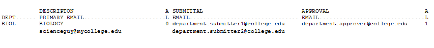

# Advanced Faculty Adoptions - Store Side

<PageHeader />

#  Overview

Faculty or department heads will login to the bookstore’s online faculty adoption website and submit the course requests or adoptions. These requests will be reviewed by the Department approvers and/or the Bookstore where the adoptions will be accepted/denied. Once they are accepted the TCS Textbook adoption system will be updated with the requests automatically. If they are denied the faculty will have the opportunity to modify the adoption and resubmit them for department/bookstore approval.

## Required/Optional Flags

### Adoption book flag- (TX SU-3-25)

**Adoption Book Flag**: Here you will put the code you want to use for the flag. Examples include

R – Required O – Optional

**Description**: Enter the description for the flag here. Examples include

Optional Required Recommended

**Required**: This flag says if the book is required or not. Examples are

Y - Yes N – No

**Include on web**: This allows you to show this flag on the Adoptions page. _Note: This flag does not affect adoption entry in the back office._

Blank – Display on Web Y – Display on Web N – Not Displayed on Web

### Store Setup

**Set Term and Store Notification emails – (POS 26.4.1)**

**Input your store number**.

Choose ‘FA’ for Faculty Adoptions from the bottom options (the options on the first screen are not changed for faculty adoptions).

**Ensure the Term is setup correctly for the active adoption term**. Input the terms that are available for the faculty to submit adoptions. If a term is no longer needed, choose the line of the term and press the space bar and then press enter to remove the term.

**Store Notification Email(s)**: Once the faculty/department has approved the adoption the bookstore will receive an email. Input the email address for the personnel to receive the notification emails where an adoption has been approved and is ready for the bookstore to process, enter one address per line.

**Number of History Links to Show**: This is how many terms to show the faculty when they are searching previous adoptions. If it's blank it will default to 12 terms.

### Faculty Setup

**Online Faculty Adoption Structure**

The store must determine how the faculty adoptions will be entered into the system. A couple of questions need to be answered:

1. Will the faculty/instructors be entering their own adoptions?
2. Will the departments be required to approve the adoptions once the faculty/instructors have submitted their requests?

If the instructors will be allowed to enter their own adoptions through the online adoption system, then all email addresses MUST be attached to the department/course/sections they are teaching. This can be done with a course import from the administration (TX 1.23.1) OR this can be done manually by the bookstore as they are entering in the department/course/section/instructor information (TX 1.1).

Each faculty/instructor staff member will need to have an account setup in the adoption system. If a file is being imported with the email addresses from an administrative import, follow the next steps, otherwise, the bookstore will need to manually input the email addresses as they are entering the adoptions (TX 1.1) and then run the Update Pref Customer from Adoptions process (TX.1.23.22).

### Import Adoption Headers – (TX 1.23.1)

You must have a file from your administration to proceed with this import. If not, please proceed to the next section. For more information on this import process, please contact the TCS Service Center.

**Enter the Adoption term you will be importing**. – The term will already have to exist in Term Maintenance (TX.SU.1.2.1).

**Enter the path of file to import** \* - The name of the file must be “Adpt-Imp.txt” or “course.asc” for the Budgetext format. Please ensure that the path exists and the file is named correctly for the import to be successful.

**Add Non-existing Departments and Courses** \* - Enter a ‘Y’ if you wish the program to automatically add Departments and Courses that are not currently on file, but are contained within the import file. If you enter ‘N’, then the program will warn you each time it finds a Department or Course that is not on file and will not add the adoption record.

Convert spaces in key fields to: Spaces are not allowed in the key fields of a store, term, department, course and/or section number. If your import file contains spaces enter the character you would like it converted to. If you leave it blank the spaces will be stripped out. Asterisks (\*) are not allowed.

**Create eCommerce records for faculty**\* - Enter a ‘Y’ so the system will automatically create the eCommerce records (Pref Customer record) so faculty can log into the faculty adoptions.

**Update Processing Type**\* - Options are ‘R’ Report only, ‘I’ Import only and ‘B’ Import and Report

Once you are satisfied with your entries you MUST choose ‘R’ Run Procedure. If you need assistance with this process please contact the TCS Service Center.

\*\*\* Important \*\*\*

If you are doing multiple imports throughout the term, after the first import, choose ‘R’ report ONLY to see any changes that need to be MANUALLY input in the adoption system.

If department personnel are required to approve the submitted adoptions by the faculty, then their emails MUST be setup in the department/classes section (TX SU 1.6.2) Screen 1.

(Screen 1)

If more than one person in the department is allowed to input adoptions then email address of the additional personnel must be entered in the next screen. Once the department personnel email address has been entered into the department maintenance (Screen 1) press enter until the options at the bottom of the screen are displayed. Press the ‘A’ for adoptions and the screen will change to allow for entry of ‘Submittal Emails’ for additional Update and Submit personnel. They will be allowed to update and submit the adoptions submitted by the faculty staff for this department.

If the adoption policies requires an ‘Approver’ that person’s email address must be entered into the ‘Approval Emails’ section. They will be allowed to update and approve the adoptions submitted by the faculty staff for this department.

#### Approval Level Required for Completion:

1. Will the faculty/instructors be entering their own adoptions?
2. Will the departments be required to approve the adoptions once the faculty/instructors have submitted their requests?

If you answered question 1 – YES – **and** question 2 – YES, then the approval level required for completion needs to be set to 1.

If you answered question 1 – YES – **and** question 2 – NO, then the approval level required for completion needs to be set to 0 (zero).

### Update Pref Customer from Adoptions process - (TX 1.23.22)

If the bookstore manually enters the faculty/instructors email addresses when building the adoptions (TX 1.1) then the preferred customer file must be created so the faculty can log into the online adoption website. Any department emails that are entered (previous section) will also be created by this process.

**Enter the Store number.**

**Enter the active term for the online adoption period.**

**Optional – Enter a department or course to filter the update.**

### Change Adoption Instructor Info – (TX-1-23-23)

If the bookstore should need to change an email address, Name or Phone number for an instructor (i.e. Instructor get married/divorced or just wants to use a different email than the schools) you can make the change here and then run the process and that will change for all courses the instructor is attached.

**Enter Old Email** **Enter New Email** if it has changed. **Enter New Name** if it has changed. **Enter New Phone #** if it has changed.

### Changing Customer/Faculty Account Type Flags – (POS 26.21)

Once a customer/faculty account has been created (steps above), they are automatically setup as an ‘F’ faculty member account status. This means they have the ability to input and/or approve adoptions. If you need to change their status at any time see the below steps.

POS 26.21 – Customer Maintenance

(Screen 2)

**Name or ID**: This will be the faculty/instructor’s email address.

**Account Type:** Options for the account type:

- F = Faculty, this allows the account details, order history and the faculty buttons to be available online.
- A = Administrator, this allows the account details, order history, faculty and administrator buttns to be available online. Should be reserved for bookstore staff only.
- C or blank = Customer, this allows ONLY the account details and order history buttons to be buttons to be available online. Not to be used for faculty/instructors, this is for student customers only.

If you are setup as an administrator you can also change the account type for a customer online. Once logged in go to the Admin panel section, find the customer and change the account type.

#### TX 1.23.3 – Instructor Email List - OPTIONAL

This report is for those department/course/sections where an instructor email has been assigned to the section. The report can be generated to show the bookstore all the instructor email addresses that will be notified when running the email process.

#### TX.1-23-4 – Department Email List – OPTIONAL

This report will show the Department email addresses entered in to the primary contact field and the mail addresses for those entered in the Submittal- and Approval fields.

### Notifying Faculty through Email – (TX 1.23.5)

When the bookstore is ready to open the Online Faculty Adoptions website the faculty/departments must be notified that the term is open.

TX 1.23.5 – Adoption Notification Email – (Screen 3) - This will send an email to either the instructor or departments (your choice). This notification is setup by the bookstore (subject/email body).

(Screen 3)

**Term**: Input the term for which the adoptions are active.

Notifications can be filtered to only be sent to a particular department or for a particular course. These are not required fields.

**Email Department**: If you ONLY want to send the email out to the department emails setup on the department/classes, enter a ‘Y’. This will NOT send out a notification to the faculty/instructors.

**Reply To Email**: Enter the email address that the faculty/instructors/departments should use to send inquiries back to the bookstore.

**Subject**: Enter the subject of the email.

**Email Body**: Enter the body of the email.

**Send Test Email**: Enter a ‘Y’ to ONLY send a test email to the email address entered in the ‘Reply to Address’.

 

#### Adoption Pending Approval – (TX-1-23-6) optional

This report will show all of the adoptions and the status of waiting for Department or Bookstore approval.

**Enter Store #**\- required.

**Enter Term** – required.

**Department** – this will filter and only show the department selected.

**Course** – this will only show those with the selected course number.

**Pending** – this will show only those with the status entered. Options are ‘D’ for Department, ‘S’ for Store, ‘B’ for Both.

#### Adoptions with NO Text Assigned – (TX-1-23-7) optional

This report will give you a list of the courses that have been submitted by with ‘NO TEXTBOOKS REQURED’ submitted by the Instructor/Department.

**STORE** – required

**TERM** – required

**Department** – this will filter and only show the department selected.

**Course** – this will only show those with the selected course number.

#### Faculty Adoptions (TX-1-23-21) optional

This report will show all of the adoptions that have been submitted by the faculty.

**Enter Store #**\- required.

**Enter Term** – required.

**Department** – this will filter and only show the department selected.

**Course** – this will only show those with the selected course number.

### Store Approval of Submitted Adoptions – (TX 1.23.24)

Once the faculty/department has submitted an approved adoption the bookstore will receive an email notification. This should be a trigger for the bookstore to know that adoptions are pending their approval.

**OPTIONAL**: Report TX 1.23.6 – Adoption Pending Approval

This report can be run to see how many adoptions are pending approvals by the bookstore and/or the departments (if necessary). It is recommended to display to the screen/terminal for review.

#### Adopt from Pending – (TX 1.23.24)

Once the bookstore receives a notification that adoptions are pending approval, they must review and make any required changes to the adoption before the adoption will be added to the specified course. This step will allow the bookstore to cycle through all pending bookstore approval adoptions to view and update them into the TCS system.

(Screen 4)

Input the store and term to update the pending adoptions. You also have the ability to filter your selection by Department or Course. Run the Procedure. The system will show how many adoptions are pending, press continue.

 (Screen 5)

The system will present the first approved adoption on the screen. If the faculty/instructor entered any comments, a window will display (Screen 5) with the comments. You have the option of Printing the comments, Canceling the acceptance or selecting OK to have the comments added to the “FacComments” field. These comments only for the bookstore personnel and will not display unless you add them to the “Web Comments” field or the “Shelf Tag Note” field.

(Screen 6)

Look for ANY ‘/’ slashes in the screen (Screen 6). These are the changes that were submitted by the faculty/instructor and will need to be updated by the bookstore. Update the record by removing the slashes and inputting the correct information in the field.

To help the bookstore with determining the quantity to cover (QTC), the ‘inq’ column is available so the bookstore can view historical information on this title. By putting a ‘Y’ in the ‘inq’ field, a screen will display with previous terms historical information and the bookstore can make a better determination on the quantity needed. The ‘EBB’ field is available for the bookstore to input estimated buyback figuresfor this title.

By clicking the ‘Save’ or pressing ‘ENTER’ the system will prompt with the fields that need to be updated and then exit the adoption screen. If you would like to proceed to the next pending record, press ‘N’ for next, this will save the currently displayed adoption and cycle the next pending adoption to the screen.

Be sure to SAVE the record or press ‘X’ to exit the record without saving your changes. By pressing ‘X’ or exit, the system will add the adoption back to the pending bookstore approval file for processing later.

Other options along the bottom of this screen allow the bookstore to navigate throughout the pending adoptions.

‘SP’ Skip to Previous – Allows the bookstore to bypass the currently displayed adoption and move to the previous adoption in the pending file.

‘SN’ Skip to Next – Allows the bookstore to skip to the next pending adoption and skip the currently displayed adoption.

<PageFooter />
