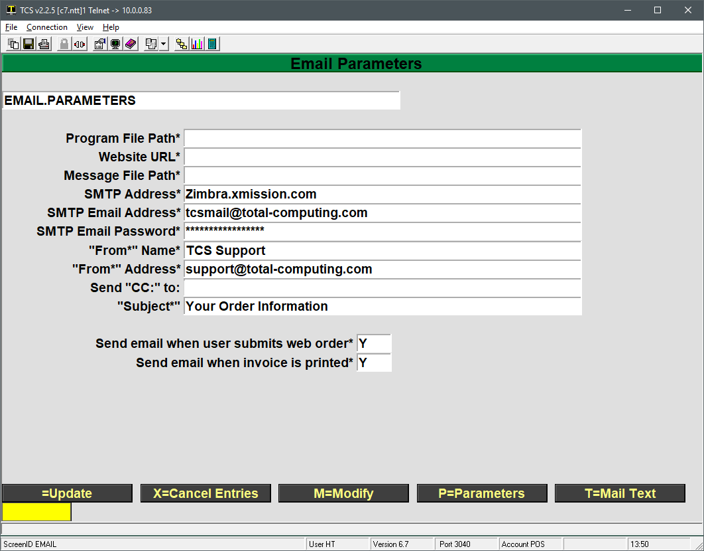
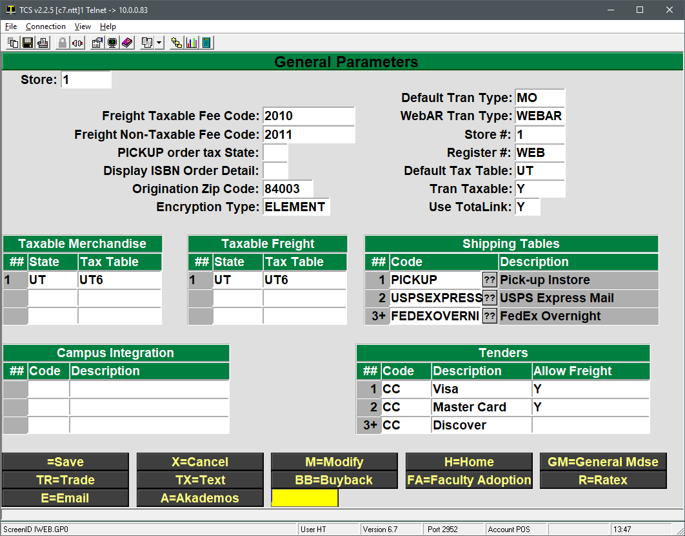
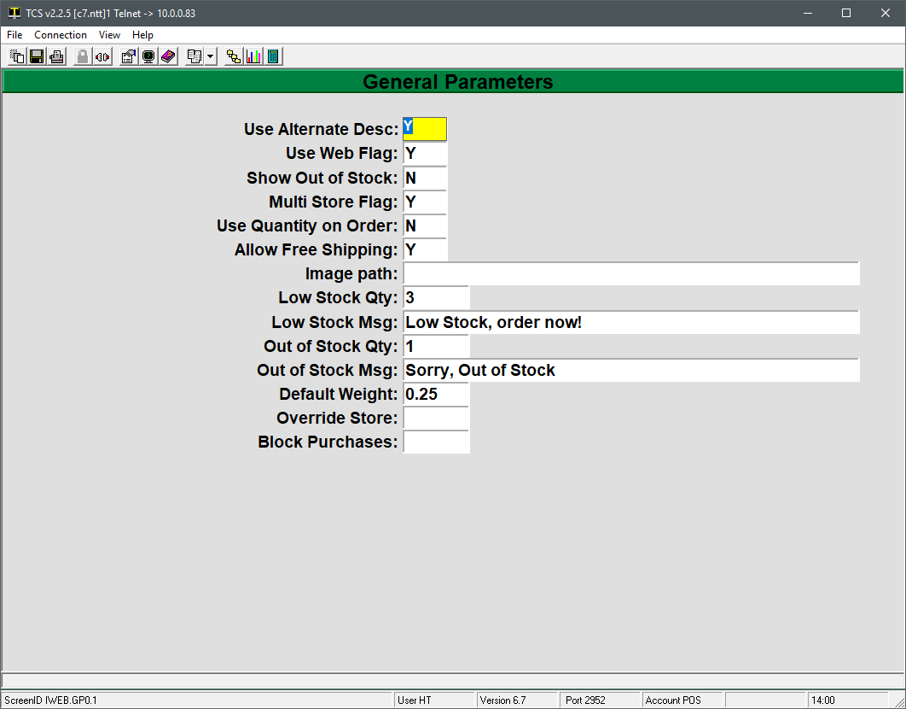
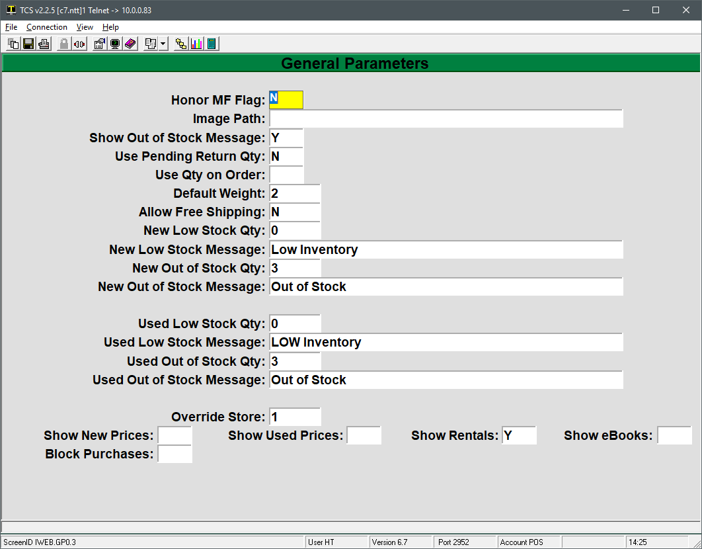
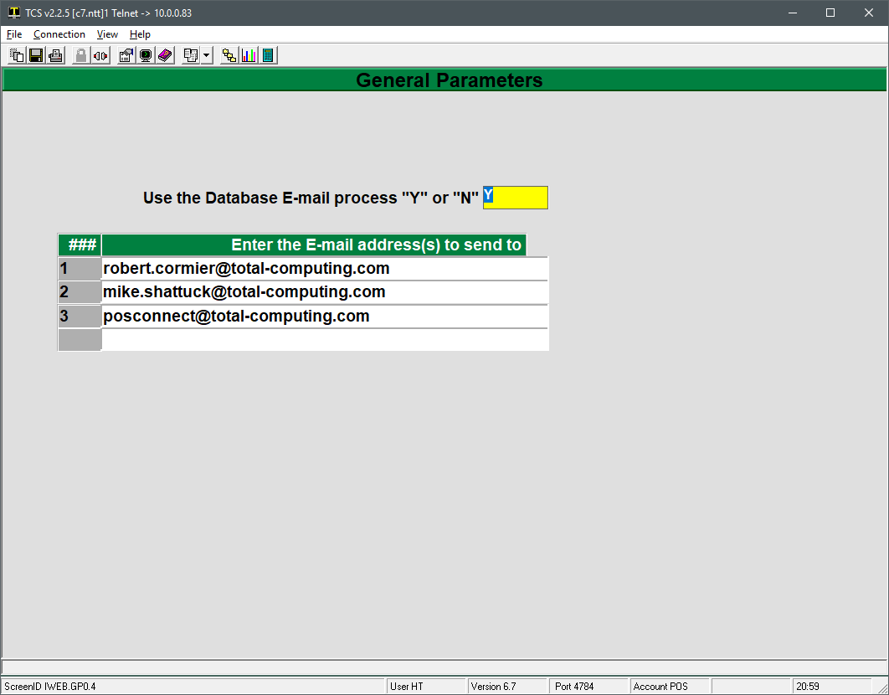
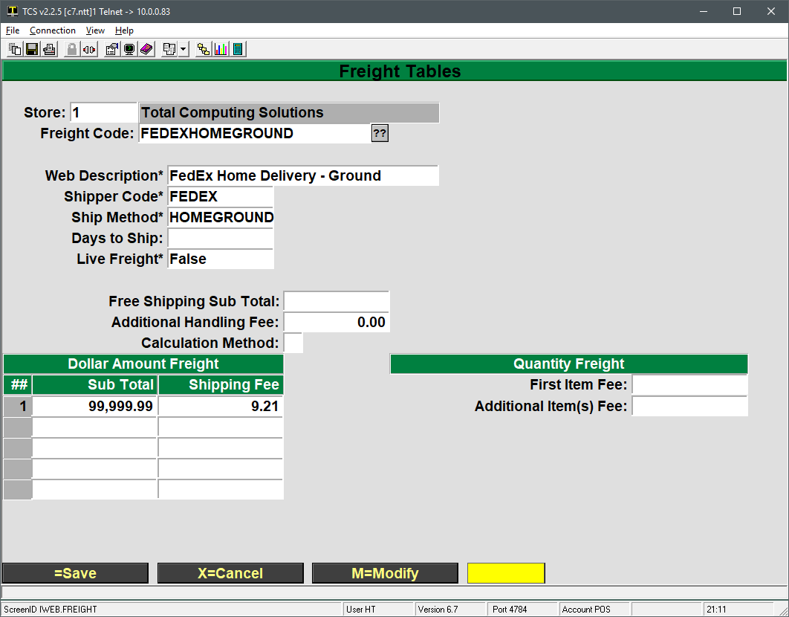

# Campus Webstore Parameters

<PageHeader />

The following steps cover setting up the Campus Webstore parameters, email parameters, shipping and other settings in order to use the web store.

## Email Parameters

The email parameters pertain to the email contents a customer receives when placing an order, which bookstore staff receive order notifications and what events trigger emails to be sent. These are found in POS-26-5.

The more technical fields will already be populated with the correct information (program file path, website url, SMTP settings, etc.). The only fields that a typical user needs to modify are listed below.

1. From Name: allows you to specify the name that appears on the email that customers receive. E.g. ABC Bookstore.
2. From Address: is where you would put an email address belonging to your organization. Typically whoever would interact with web customers and fulfill web orders.
3. Send CC to: allows you to specify multiple bookstore recipients who may wish to be notified when an order has been placed.
    1. Multiple email addresses must be separated with a ; without any spaces
        - A better mechanism for controlling notices can be found in POS-26-4-1, E=Email
4. Subject: specifies what subject will appear on the order confirmation email that a customer receives.
5. Send email when user submits web order: Enter either a Y or N. Typically a Y
6. Send email when invoice is printed: When an order is fulfilled a Y will have the system email the customer that the order has been processed.
7. The “T-Mail Text” button goes to a second screen where the body of the email text can be manipulated. There is some code and variables that will appear in the default text. Those codes and variables should remain in the screen but specific parts can be changed.
    1. For example the text may contain a line like “Your order #=CONFIRMATION has been processed. Expect it to ship within 24 hours.” Feel free to edit the regular verbiage or wording like the 24 hours but don’t remove the #=CONFIRMATION. This is a flag the system is looking for to inject the order confirmation number and could cause issues if removed.

## Campus Webstore Parameters

The general parameters contain the bulk of the web store settings and are located in POS-26-4-1. This is where fee codes, shipping options, transaction types, tenders and other settings are maintained.

This setup presents a bit of a chicken or the egg paradox. Many of the fields prompt for entries like fee codes that may not be setup yet. If you would prefer to set those up first then they can be maintained in POS-22-3.  Tax tables should already exist in POS-2-3-1. Shipping Tables (commonly referred to as Freight Tables) are covered in this document. Below are the points of interest for the different codes you will need.

- Taxable freight code
- Non-Taxable freight code (freight amount, not items, that is non-taxable)
- Sales tax rate for pickup orders
    - This should already exist for regular transactions. Reference POS-2-1 for the tax table currently in use for in store purchases.
- A shipping table for each shipping method you may use.

We’ll start with the first, main screen and then progress from there.

1. Freight Taxable Fee Code: specifies what fee code to use when freight amount is taxed
2. Freight Non-Taxable Fee Code: specifies what fee code to use when freight amount is non-taxable
3. Pickup Order Tax State: enter the two character state code where items are being picked up.
    1. For example, Utah would be UT, Arkansas is AK, etc.
4. Display ISBN Order Detail: enter a Y to display the ISBN in the order details.
5. Origination Zip Code: enter the zip code for the location shipping the order.
6. Encryption Type: will typically be ELEMENT
7. Default Tran Type: needs to be a web specific transaction type, typically MO
8. WebAR Tran Type: enter the transaction type used for AR tendered web orders, typically WEBAR.
9. Store #: should match the store entered at the top of the screen.
10. Register: must be set to WEB.
11. Default Tax Table: enter the default tax table to be used when processing web orders.
12. Tran Taxable: specify if web transactions should be taxable by default.
13. Use TotaLink: should be set to Y.
14. Taxable Merchandise table:
    1. Enter the two character state code for any possible destination states. Tax rate used is based off of the billing address.
15. Taxable Freight table:
    1. Enter the two character state code for any possible destination states. Tax rate used is based off of the billing address.
16. Shipping Tables table
    1. These codes are maintained in POS-26-4-2 and are options that customers can select when checking out on the website.
17. Campus Integration
    1. This is used for sites that integrate with a campus portal such as Black Board. Students can be directed from the campus portal to the website and automatically have their required books populated. This is not standard with the website but is available as a billable feature.
18. Tenders table:
    1. This is typically already set with a CC tender and a description for each credit card network.

The Buyback screen and Ratex screen are currently under development. The Akademos screen is a special use case and is setup by TCS personnel. The Faculty Adoption screen is covered in the faculty adoption process.

Below are instructions on how to utilize the GM, Text and Email parameter screens.

## GM Webstore Parameters

This screen is reached by going to POS-26-4-1, then enter GM at the bottom of the screen.

1. Use Alternate Desc: a Y will tell the system to use the Alternate Description from the GM, MF web screen for an item as the items description on the website. A N will have the system use the regular description from the GM, MF record.
2. Use Web Flag: a Y will only allow GM items specifically flagged to show on the website to appear on the site. A N will allow ALL GM records to appear on the site.
3. Show Out of Stock: a Y will allow items to be purchased even if their quantity on hand is below the Out of Stock Qty level. A N will prevent items from selling on the website if their QoH is below the Out of Stock Qty level.
4. Multi Store Flag: should be a Y if you are a multi store environment.
5. Use Quantity on Order: flags the system to include the quantity on order in the quantity on hand calculations.
6. Allow Free Shipping: set to Y if you want to allow free shipping for GM specific items.
7. Image Path: is under development and should be left blank.
8. Low Stock Qty: set the quantity on hand amount where the system will display a Low Inventory message for items on the website.
9. Low Stock Msg: specify the message to display when an item meets the Low Stock Qty threshold.
10. Out of Stock Qty: set the quantity on hand level for when an item should be considered out of stock to the website.
    1. This exists to prevent items that may be in a customer’s hands in the store from being sold by the website.
11. Out of Stock Msg: specify the message to display when an item meets the Out of Stock Qty threshold.
12. Default Weight: sets a default weight to be used for items that do not have a weight specified in their GM, MF web screen.
13. Override Store: can be used to specify which store’s inventory to pull quantity from in a multi store setup.
14. Block Purchases: will block the ability for all GM items to be purchased on the website. They will still be shown, but there will be no add to cart button.

## TX Webstore Parameters

This screen is reached by going to POS-26-4-1, then enter TX at the bottom of the screen.

1. Honor MF Flag: a Y will only allow TX items specifically flagged to show on the website to appear on the site. A N will allow ALL TX records to appear on the site. This is typically a N for textbook items.
2. Image Path: Under development and should not be used.
3. Show Out of Stock Message: enter a Y to display the out of stock message or a N to not show the message once New and Used out of stock threshold has been reached.
4. Use Pending Return Qty: tells the system to use pending return quantities in the quantity on hand calculations. Typically a N.
5. Default Weight: specify a default weight to be used when weight has not be specified in the TX, MF record.
6. Allow Free Shipping: can be used to deny or allow free shipping for TX items.
7. New Low Stock Qty: set the NEW quantity on hand amount where the system will display a Low Inventory message for items on the website.
8. New Low Stock Message: specify the message to display when an item meets the NEW Low Stock Qty threshold.
9. New Out of Stock Qty: set the NEW quantity on hand level for when an item should be considered out of stock to the website.
    1. This exists to prevent items that may be in a customer’s hands in the store from being sold by the website.
10. New Out of Stock Message: specify the message to display when an item meets the New Out of Stock Qty threshold.
11. Used Low Stock Qty: set the USED quantity on hand amount where the system will display a Low Inventory message for items on the website.
12. Used Low Stock Message: specify the message to display when an item meets the USED Low Stock Qty threshold.
13. Used Out of Stock Qty: set the USED quantity on hand level for when an item should be considered out of stock to the website.
    1. This exists to prevent items that may be in a customer’s hands in the store from being sold by the website.
14. Used Out of Stock Message: specify the message to display when an item meets the Used Out of Stock Qty threshold.
15. Override Store: can be used to specify which store’s inventory to pull quantity from in a multi store setup.
16. Show New Prices: left empty or Y will display New textbook prices on the site. N will now show prices.
17. Show Used Prices: left empty or Y will display Used textbook prices on the site. N will now show prices.
18. Show Rentals: a Y will display rental items for purchase. N will block rentals from showing.
19. Show eBooks: a Y will display eBook items for purchase. N will block eBooks from showing.
20. Block Purchases: will block the ability for all TX items to be purchased on the website. They will still be shown, but there will be no add to cart button.

## Email Webstore Parameters

These parameters can be found in POS-26-4-1 and then enter E for Email Parameters

This screen allows you to list the staff email address(s) to send email notifications when an order has been placed. Simply enter one email per line.

## Setting up Shipping Tables

Shipping tables, which are often times referred to as freight tables, are used to establish different price points to charge for freight based off of the total order amount. They can be found in POS-26-4-2 or by clicking the ?? button next to the Code field and then clicking on the Maint button at the bottom of the selection list found in POS-26-4-1.

1. Freight Code: is the code used to reference the freight table.
2. Web Description: is what the customer sees when selecting the shipping options when checking out.
3. Shipper Code: is a free form field for reference. Examples would be FedEx, UPS, USPS, etc.
4. Ship Method: is a free form field that should reference a shipping method supported by the shipping company. E.g. second day, over night, ground, etc.
5. Days to Ship: is a reference field where you can enter the average number of days in transit for this shipping method.
6. Live Freight: references a billable add on module to the website and is typically False
7. Free Shipping Subtotal: allows specifying a minimum order amount, that when met or surpassed, will trigger free shipping.
    1. For example, if 100.00 is entered any order over $100.00 will not be charged shipping.
8. Additional Handling Fee: enter an amount to be charged to every order as a handling fee.
9. Calculation Method: left blank
10. Dollar Amount Freight Table
    1. Any amount UP TO the amount entered will be charged the fee entered in the Shipping Fee Field
    2. In the screenshot shown every order will be charged 9.21 in shipping
    3. If multiple price points are desired then the lowest “cap” should be entered first with the next level cap being entered second and so on.
        1. Sub total of 100.00 with fee 9.00
        2. Sub total of 200.00 with fee 12.00
        3. Sub total of 500 with fee 15.00
        4. Sub Total of 99,999.99 with fee 20.00
        5. Would result in orders of $1 – 100 being charged $9 in shipping. Orders of $100.01 - $200.00 being charged $12 and $200.01 – $500.00 will be charged $15.00 with everything above that up to $99,999.99 being charged $20.00
11. Quantity Freight: charges specific fee amounts per item on the order.
    1. First Item Fee: specifies the fee amount to charge for the first item.
    2. Additional Item(s) Fee: the fee amount to charge for each additional item beyond the first item.

<PageFooter />
