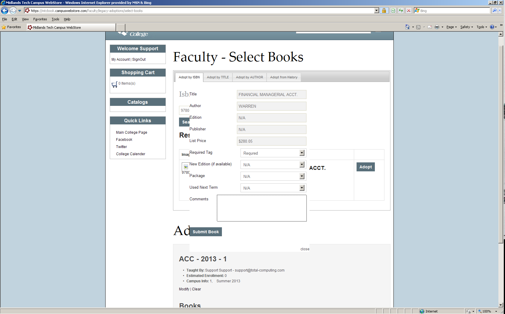

# Legacy Faculty Adoptions - Web Side

<PageHeader />

## Overview

This document will walk Faculty and/or Staff through the process of creating an Adoption request via the campus bookstore’s website. **Please keep in mind that this is a request. The bookstore staff will have to approve and enter the information that you request into their system for the course at the school.**

All of the connection information should have been sent to you prior to you attempting to create an Adoption request.

Once your request(s) have been submitted the store’s staff will be informed via e-mail.

If you have any questions please contact the campus store.

The website will timeout if left unattended. If a session times out with inactivity you will have to restart the process from the beginning.

1. You will need to connect to your Campus Store’s website and Sign In.

- You should have been provided a User name to sign into the website. The user you are assigned will have the permissions to make Faculty Adoption requests. If you have not been provided an account, or you are already a customer of the site without faculty permissions, contact the store so they can add your account to the Faculty group, enabling you to create Faculty Adoptions.

2. Type in the user name and password you were provided into the “Log On” fields.

- Your Password is case sensitive; please keep this in mind. Your User Name is not case sensitive

3. Create a Faculty Adoption Request.

- You will notice that there is an icon located on your landing page for Faculty. Select this icon to proceed on to the Faculty request

4. Select Enter an Adoption

- This will take you into the Adoption Form

5. Enter in your information and the instructor’s information

- If the person entering the Adoption Request Form is the Instructor select “I am the Instructor” for this course. This option will automatically fill in the fields from the above information.

6. Inputting Course information

- You must fill in all of the information on this section: Campus, Term, Department, Course, and Section. You can also enter the Estimated Enrollment and any comments you would like to add to the request.

7. Selecting the books for your section.

- There are several ways to search and add books to your section. You can use any of the options across the top of this form to view and select books.
- Note that the information you entered in the previous screen is displayed under the Adoption Progress.

8. Select the textbook you wish to adopt.

9. Update Adoption book information.

- Once you select a book for adoption you can update any information about the book and add comments to the requested book.

10. Adopt the book for the section

- Once you have selected all the books for your Adoption you will need to review the information about the request.

11. Reviewing the Adoptions Request information

- Verify that all of the information is correct.

12. Verifying your recommended book.

- Verify that all of the information regarding the book are correct.

13. Adoption Request complete

- Once you have submitted the request a Thank you message will appear and an e-mail verifying the information you submitted will be sent to the address listed in the Requests, step 5. An e-mail will also be sent to the bookstore.
- To submit another request select “My Account” to go back to the Faculty Adoption page.

<PageFooter />
